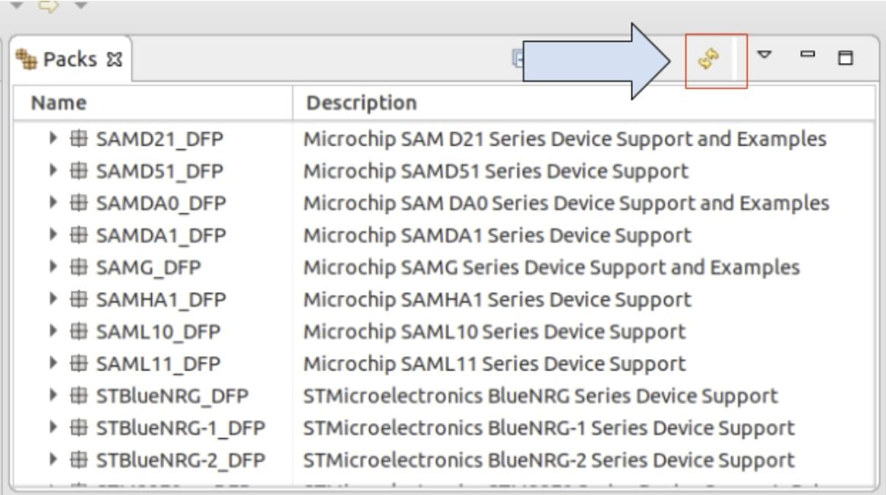
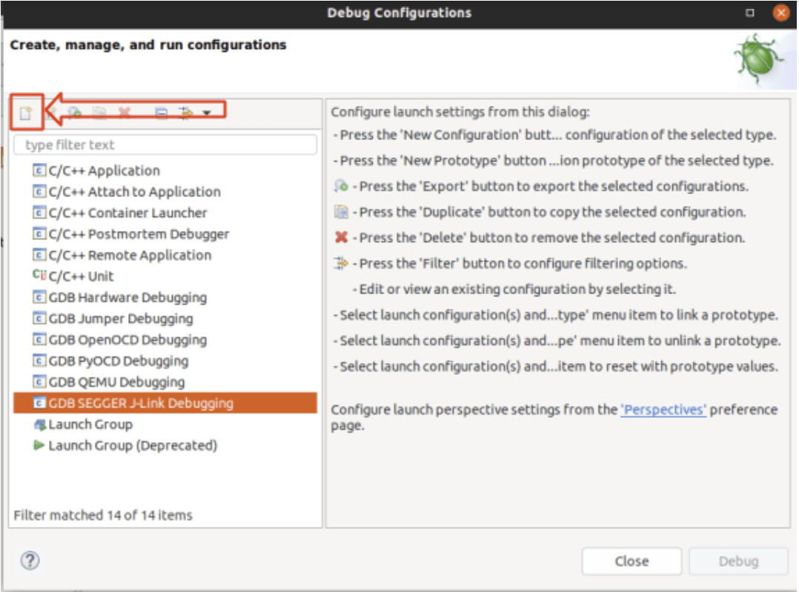

# Debugging with Eclipse and J-Link

This topic explains how to setup and use [MCU Eclipse](https://gnu-mcu-eclipse.github.io/) with a _Segger Jlink adapter_ to debug PX4 running on NuttX (e.g. Pixhawk series boards).

## 필요한 하드웨어

- [J-Link EDU Mini](https://www.segger.com/products/debug-probes/j-link/models/j-link-edu-mini/)
- Adapter to connect Segger JLink to Flight Controller [SWD Debug Port](../debug/swd_debug.md) (debug port).
- Micro USB 케이블

## 설치

### PX4

일반 지침에 따라 PX4를 설정합니다.

- [Setup the PX4 Developer Environment/Toolchain](../dev_setup/dev_env.md) for your platform (e.g. for Linux see: [Development Environment on Ubuntu LTS / Debian Linux](../dev_setup/dev_env_linux_ubuntu.md)).
- [Download PX4](../dev_setup/building_px4.md) and optionally build it on the command line.

### Eclipse

To install _Eclipse_:

1. Download [Eclipse CDT for C/C++ Developers](https://github.com/gnu-mcu-eclipse/org.eclipse.epp.packages/releases/) (MCU GitHub).
2. Eclipse 폴더의 압축을 풀고 적당한 폴더에 복사합니다(설치 스크립트를 실행할 필요가 없음).
3. Run _Eclipse_ and choose a location for your initial workbench.

### Segger Jlink 도구

To install the _Segger Jlink_ tools:

1. Download and run the [J-Link Software and Documentation Pack](https://www.segger.com/downloads/jlink/#J-LinkSoftwareAndDocumentationPack) for your OS (Windows and Linux packages available).
   - On Linux the tools are installed in **/usr/bin**.

For more information, see: [https://gnu-mcu-eclipse.github.io/debug/jlink/install/](https://gnu-mcu-eclipse.github.io/debug/jlink/install/).

## 첫 사용

1. Connect the _Segger JLink_ to the host computer and the [flight controller debug port](../debug/swd_debug.md) (via an adapter).

2. 비행 콘트롤러에 전원을 공급합니다.

3. Run _Eclipse_.

4. Add a source by choosing **File > Import > C/C++ > Existing Code as Makefile Project** and click **Next**.

5. Point it to the **PX4-Autopilot** folder and give it a name, then select _ARM Cross GCC_ in the _Toolchain for Indexer Settings_ and click **Finish**.
   가져오기는 시간이 걸리며, 완료될 때까지 기다립니다.

6. Set the MCU settings: right-click on the top-level project in the Project Explorer, select _Properties_ then under MCU choose _SEGGER J-Link Path_.
   아래 스크린샷과 같이 설정합니다.
   

7. 패키지를 업데이트합니다.

   - Click the small icon on the top right called _Open Perspective_ and open the _Packs_ perspective.
      

   - Click the **update all** button.

      :::tip
      This takes a VERY LONG TIME (10 minutes).
      누락된 패키지에 대한 오류를 무시하십시오.

:::

      

   - The STM32Fxx devices are found in the Keil folder, install by right-clicking and then selecting **install** on the according device for F4 and F7.

8. 대상에 대한 디버깅 설정을 진행하십시오:

   - Right click project and open the _Settings_ (menu: **C/C++ Build > Settings**)
   - Choose the _Devices_ Tab, _Devices_ section (Not _Boards_).
   - 디버그하려는 FMU 칩을 찾으십시오.

   

9. Select debug configurations with the small drop-down next to the bug symbol:
   

10. Then select _GDB SEGGER J-Link Debugging_ and then the **New config** button on the top left.
   

11. 빌드 구성을 설정합니다.

   - Give it a name and set the _C/C++ Application_ to the corresponding **.elf** file.
   - Choose _Disable Auto build_

      ::: info
      Remember that you must build the target from the command line before starting a debug session.

:::

   

12. The _Debugger_ and _Startup_ tabs shouldn’t need any modifications (just verify your settings with the screenshots below)

   
   

## SEGGER Task-aware debugging

Task-aware debugging (also known as [thread-aware debugging](https://www.segger.com/products/debug-probes/j-link/tools/j-link-gdb-server/thread-aware-debugging/)) allows you to show the context of all running threads/tasks instead of just the stack current task.
This is quite useful since PX4 tends to run many different tasks.

To enable this feature for use in Eclipse:

1. You first need to enable `CONFIG_DEBUG_TCBINFO` in the NuttX configuration for your build (to expose the TCB offsets).

   - Open a terminal in the root of your PX4-Autopilot source code

   - In the terminal, open `menuconfig` using the appropriate make target for the build.
      This will be something like:

      ```sh
      make px4_fmu-v5_default boardguiconfig
      ```

      (See [PX4 Menuconfig Setup](../hardware/porting_guide_config.md#px4-menuconfig-setup) for more information) on using the config tools).

   - Ensure that the _Enable TCBinfo struct for debug_ is selected as shown:
      

2. Compile the **jlink-nuttx.so** library in the terminal by running the following command in the terminal: `make jlink-nuttx`

3. Modify Eclipse to use this libary.
   In the _J-Link GDB Server Setup_ configuration, update **Other options** to include `-rtos /home/<PX4 path>/Tools/jlink-nuttx.so`, as shown in the image below.

   

4. When running the debugger you should see now multiple threads instead of just one:

   

## 문제 해결

### 패키지 관리자에 없는 대상 CPU

대상 CPU가 패키지 관리자에 표시되지 않으면, 레지스터 보기가 작동하도록 하려면 다음 단계가 필요할 수 있습니다.

:::tip
This should not generally happen (but anecdotally has been reported when connecting to an STM F7 controller).
:::

Adding missing SVD files for the _Peripheral View_:

1. Find out where MCU Eclipse stores its packages (**Preferences > C/C++ > MCU Packages**):

   

2. http://www.keil.com/dd2/Pack/ 에서 누락된 패키지를 다운로드하십시오

3. Open downloaded pack with a decompression tool, and extract the **.SVD** files from: **/CMSIS/SVD**.

4. Select desired **.SVD** file in: **Debug Options > GDB SEGGER JLink Debugging > SVD Path**

   
