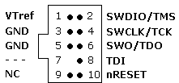

# JLink Debug Probe

The [J-Link debug probe][jlink] is a closed-source, commercial hardware probe which supports almost all ARM Cortex-M devices.
You need to install the [J-Link drivers][drivers] for this probe to work:

```sh
# Ubuntu
wget --post-data "accept_license_agreement=accepted" https://www.segger.com/downloads/jlink/JLink_Linux_x86_64.deb
sudo dpkg -i JLink_Linux_x86_64.deb
# macOS
brew install segger-jlink
```

설치가 완료되면, 다음을 사용하여 서버를 시작합니다.

```sh
JLinkGDBServer -if swd -device STM32F765II
```

그런 다음, 권장되는 JLink를 업데이트하고, 통신 중인 장치를 지정하라는 메시지가 표시될 수 있습니다.
특정 장치에 대한 자동조종장치의 문서를 확인하십시오.

Once that's done, the GDB server should be start listening on port `2331`, e.g. like so:

```sh
Checking target voltage...
Target voltage: 3.28 V
Listening on TCP/IP port 2331
Connecting to target...
Connected to target
Waiting for GDB connection...
```

이제 자동조종장치(별도의 터미널에서)에서 현재 플래시된 정확한 elf 파일로 GDB를 시작할 수 있습니다.

```sh
arm-none-eabi-gdb build/px4_fmu-v5_default/px4_fmu-v5_default.elf -ex "target extended-remote :2331"
```

이제 연결되어야 합니다.

To use an IDE instead, see the instructions for [Eclipse](../debug/eclipse_jlink.md) or [VSCode](../dev_setup/vscode.md#hardware-debugging).
See the [Embedded Debug Tools][emdbg] for more advanced debug options.

<a id="segger_jlink_edu_mini"></a>

### Segger JLink EDU Mini Debug Probe

The [Segger JLink EDU Mini](https://www.segger.com/products/debug-probes/j-link/models/j-link-edu-mini/) is an inexpensive and popular SWD debug probe.
The probe's connector pinout looks like the image below (connect to this using an ARM 10-pin mini connector like [FTSH-105-01-F-DV-K](https://www.digikey.com/products/en?keywords=SAM8796-ND)).



The pin mapping to connect the J-Link Edu Mini to [Pixhawk Debug Mini](swd_debug.md#pixhawk-debug-mini) is shown below.

|  핀 | 신호         | JLink |
| -: | :--------- | ----: |
|  1 | **VREF**   |     1 |
|  2 | 콘솔 TX      |       |
|  3 | 콘솔 RX      |       |
|  4 | **SWDIO**  |     2 |
|  5 | **SWDCLK** |     4 |
|  6 | **GND**    |  3, 5 |

Note that none of the JLink debug probes have a built in serial connection, so you need to connect the console separately.

<!-- Image of SWD cable and connector to debug port - proposed? -->

[jlink]: https://www.segger.com/products/debug-probes/j-link/
[drivers]: https://www.segger.com/downloads/jlink/
[emdbg]: https://pypi.org/project/emdbg/
