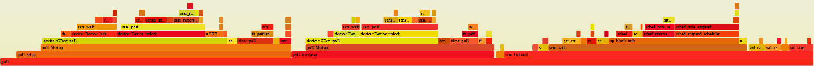

# 가난한 자의 샘플링 프로파일러

This section describes how you can use the [Poor Man's Sampling Profiler](https://github.com/PX4/PX4-Autopilot/blob/main/platforms/nuttx/Debug/poor-mans-profiler.sh) (PMSP) shell script to assess the performance of PX4.
This is an implementation of a known method originally invented by [Mark Callaghan and Domas Mituzas](https://poormansprofiler.org/).

## 접근

PMSP는 현재 스택 추적을 샘플링하기 위하여, 주기적으로 펌웨어 실행을 중단하여 작동하는 쉘 스크립트입니다.
샘플링된 스택 추적은 텍스트 파일에 추가됩니다.
Once sampling is finished (which normally takes about an hour or more), the collected stack traces are _folded_.
The result of _folding_ is another text file that contains the same stack traces, except that all similar stack traces (i.e. those that were obtained at the same point in the program) are joined together, and the number of their occurrences is recorded.
The folded stacks are then fed into the visualization script, for which purpose we employ [FlameGraph - an open source stack trace visualizer](http://www.brendangregg.com/flamegraphs.html).

## 기본 사용법

### 준비 사항

프로파일러는 GDB에서 임베디드 대상에서 PX4를 실행합니다.
따라서, 대상을 프로파일링하기 전에 프로파일링할 하드웨어가 있어야 하고, 해당 하드웨어에 펌웨어를 컴파일하고 업로드하여야 합니다.
You will then need a [debug probe](../debug/swd_debug.md#debug-probes) (such as the DroneCode Probe), to run the GDB server and interact with the board.

### 디버거 장치 결정

The `poor-mans-profiler.sh` automatically detects and uses the correct USB device if you use it with a [DroneCode Probe](../debug/probe_bmp.md#dronecode-probe).
If you use a different kind of probe you may need to pass in the specific _device_ on which the debugger is located.
You can use the bash command `ls -alh /dev/serial/by-id/` to enumerate the possible devices on Ubuntu.
예를 들어, 다음 장치는 USB를 통해 연결된 Pixhawk 4 및 DroneCode Probe로 열거됩니다.

```sh
user@ubuntu:~/PX4-Autopilot$ ls -alh /dev/serial/by-id/
total 0
drwxr-xr-x 2 root root 100 Apr 23 18:57 .
drwxr-xr-x 4 root root  80 Apr 23 18:48 ..
lrwxrwxrwx 1 root root  13 Apr 23 18:48 usb-3D_Robotics_PX4_FMU_v5.x_0-if00 -> ../../ttyACM0
lrwxrwxrwx 1 root root  13 Apr 23 18:57 usb-Black_Sphere_Technologies_Black_Magic_Probe_BFCCB401-if00 -> ../../ttyACM1
lrwxrwxrwx 1 root root  13 Apr 23 18:57 usb-Black_Sphere_Technologies_Black_Magic_Probe_BFCCB401-if02 -> ../../ttyACM2
```

In this case, the script would automatically pick up the device named `*Black_Magic_Probe*-if00`.
그러나, 다른 장치를 사용 중이면, 위의 목록에서 적절한 ID를 찾을 수 있습니다.

Then pass in the appropriate device using the `--gdbdev` argument like this:

```sh
./poor-mans-profiler.sh --elf=build/px4_fmu-v4_default/px4_fmu-v4_default.elf --nsamples=30000 --gdbdev=/dev/ttyACM2
```

### 실행

프로파일러의 기본 사용법은 빌드 시스템을 통하여 사용할 수 있습니다.
For example, the following command builds and profiles px4_fmu-v4pro target with 10000 samples (fetching _FlameGraph_ and adding it to the path as needed).

```sh
make px4_fmu-v4pro_default profile
```

For more control over the build process, including setting the number of samples, see the [Implementation](#implementation).

## 출력 내용 이해

예제 출력의 스크린샷이 아래에 제공됩니다(여기에서는 대화형이 아님에 유의).



플레임 그래프에서 수평 레벨은 스택 프레임을 나타내는 반면, 각 프레임의 너비는 샘플링된 횟수에 비례합니다.
결과적으로 함수가 샘플링되는 횟수는 실행 빈도에 시간을 곱한 값에 비례합니다.

## 가능한 이슈들

스크립트는 임시 솔루션으로 개발되었으므로 몇 가지 문제가 있습니다.
사용중에 다음 내용을 확인하십시오:

- GDB가 오작동하는 경우 스크립트가 이를 감지하지 못하고 계속 실행될 수 있습니다.
  이 경우, 명백하게 가용한 스택이 나타나지 않습니다.
  In order to avoid that, the user should periodically check the file `/tmp/pmpn-gdberr.log`, which contains the stderr output of the most recent invocation of GDB.
  앞으로 스크립트는 종료 코드를 통하여 문제를 나타내는 자동 모드에서 GDB를 호출하도록 수정되어야 합니다.

- 때때로 GDB는 스택 추적을 샘플링하는 동안 정지합니다.
  이 문제가 나타나면, 대상의 동작이 알 수 없는 이유로 종료됩니다.
  The solution is to manually abort the script and re-launch it again with the `--append` option.
  앞으로 모든 GDB 호출에 대해 시간 초과를 적용하도록 스크립트를 수정할 예정입니다.

- 다중 스레드 환경을 지원하지 않습니다.
  단일 코어 임베디드 대상은 항상 하나의 스레드에서 실행되기 때문에 영향을 미치지 않지만, 이 제한으로 인하여 프로파일러는 다른 많은 응용 프로그램과 호환되지 않습니다.
  향후에는 샘플당 여러 스택 추적을 지원하도록 스택 폴더를 수정하여야 합니다.

## 구현

The script is located at [/platforms/nuttx/Debug/poor-mans-profiler.sh](https://github.com/PX4/PX4-Autopilot/blob/main/platforms/nuttx/Debug/poor-mans-profiler.sh)
Once launched, it will perform the specified number of samples with the specified time interval.
Collected samples will be stored in a text file in the system temp directory (typically `/tmp`).
샘플링이 완료되면 스크립트는 자동으로 스택 폴더를 호출하며, 그 결과는 임시 디렉토리의 인접 파일에 저장됩니다.
If the stacks were folded successfully, the script will invoke the _FlameGraph_ script and store the result in an interactive SVG file.
모든 이미지 뷰어가 대화형 이미지를 지원하는 것은 아닙니다. 결과 SVG를 웹 브라우저에서 여는 것이 좋습니다.

The FlameGraph script must reside in the `PATH`, otherwise PMSP will refuse to launch.

PMSP는 GDB를 사용하여 스택 추적을 수집합니다.
Currently it uses `arm-none-eabi-gdb`, other toolchains may be added in the future.

메모리 위치를 기호에 매핑하려면, 스크립트가 현재 대상에서 실행 중인 실행 파일을 참조하여야 합니다.
This is done with the help of the option `--elf=<file>`, which expects a path (relative to the root of the repository) pointing to the location of the currently executing ELF.

사용 예:

```sh
./poor-mans-profiler.sh --elf=build/px4_fmu-v4_default/px4_fmu-v4_default.elf --nsamples=30000
```

스크립트를 실행할 때마다 이전 스택을 덮어씁니다.
Should you want to append to the old stacks rather than overwrite them, use the option `--append`:

```sh
./poor-mans-profiler.sh --elf=build/px4_fmu-v4_default/px4_fmu-v4_default.elf --nsamples=30000 --append
```

As one might suspect, `--append` with `--nsamples=0` will instruct the script to only regenerate the SVG without accessing the target at all.

어떻게 작동하는지 더 깊이 이해하려면 스크립트를 분석하십시오.
