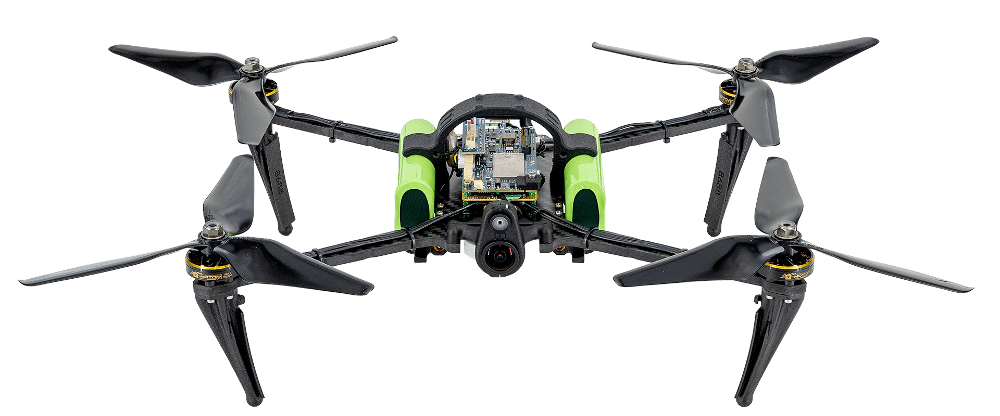
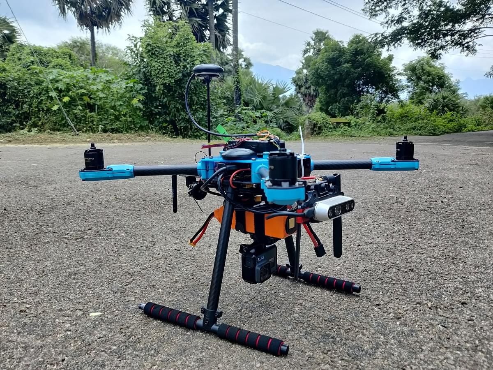

# PX4 Developer Kits

Official PX4 Developer Kits are the recommended way to get flying hardware for PX4 application development.

Kits that carry the _Official PX4 Developer Kit_ designation are certified by the PX4 maintainer team to meet the requirements of the [Developer Kit Program](../hardware/dev_kit_program.md):

- A flight controller that meets the latest Pixhawk standard, or matches its capabilities
- The latest stable PX4 release, pre-installed
- Pre-assembled, or assembly that requires no technical skill (no soldering)
- A guide, a focused tutorial, and a printed reference sheet included in the box
- Third-party build quality verification

This means you can take any of the kits below out of the box and be developing against a current, supported PX4 stack in hours, not weeks.

:::info
Manufacturers who want their kit certified should read the [Developer Kit Program](../hardware/dev_kit_program.md) documentation.
:::

## ModalAI Starling 2 Max

The [Starling 2 Max](https://www.modalai.com/products/starling-2-max) is an NDAA-compliant, ready-to-fly development drone built around the [VOXL 2](../flight_controller/modalai_voxl_2.md), which combines the flight controller and a powerful companion computer in a single package.

It is designed for computer-vision development (SLAM, GPS-denied navigation, long-range dead reckoning), carries a 500 g payload, and flies for up to 55 minutes.
The open source [VOXL SDK](https://gitlab.com/voxl-public/voxl-sdk) ships with pre-configured autonomy models, and the platform supports ROS 2 and MAVSDK workflows on the onboard computer.

- [PX4 documentation](../complete_vehicles_mc/modalai_starling.md)
- [Manufacturer documentation](https://docs.modalai.com/starling-2-max/)

## DroneBlocks DEXI 5

The [DEXI 5](https://droneblocks.io/program/dexi-5-px4-stem-drone-kit/) is an NDAA-compliant STEM and development drone kit built around an all-in-one PX4 flight controller with integrated optical flow (for GPS-denied indoor flight) and a Raspberry Pi companion computer with camera.

Assembly is modular, solder-free, and plug-and-play.
The kit ships with a full project-based curriculum covering Python (MAVSDK), ROS 2, OpenCV, and DroneBlocks visual programming, taking you from unboxing to autonomous code with no technical barrier.

- [PX4 documentation](../complete_vehicles_mc/droneblocks_dexi.md)
- [Manufacturer curriculum](https://learn.droneblocks.io/)

## Holybro X500 v2

The [PX4 Development Kit X500 v2](https://holybro.com/products/px4-development-kit-x500-v2) is a classic 500 mm carbon-fiber quadcopter kit with a Pixhawk 6C or 6X flight controller, M10 GPS, telemetry radio, and power module.

Motors and ESCs come pre-installed on the arms, so assembly is solder-free and takes about 30 minutes.
It lifts a 1.5 kg payload, which makes it a good base for adding your own companion computer and sensors.

- [PX4 build guide](../frames_multicopter/holybro_x500v2_pixhawk6c.md)
- [Manufacturer documentation](https://docs.holybro.com/drone-development-kit/px4-development-kit-x500v2)

## See Also

- [Complete Vehicles (MC)](../complete_vehicles_mc/index.md)
- [Kit Builds (MC)](../frames_multicopter/kits.md)
- [Developer Kit Program](../hardware/dev_kit_program.md) (for manufacturers)
