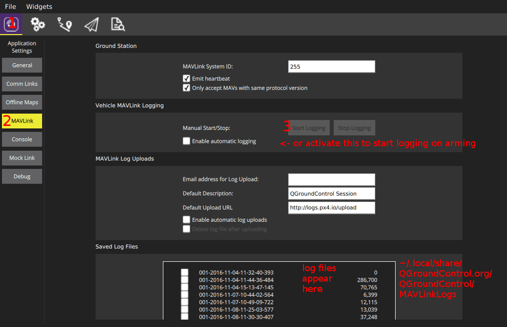

# 로깅

The [system logger](../modules/modules_system.md#logger) is able to log any ORB topic with all included fields.
Everything necessary is generated from the `.msg` file, so that only the topic name needs to be specified.
선택적 간격 매개변수는 특정 주제의 최대 로깅 속도를 지정합니다.
주제의 모든 기존 인스턴스가 기록됩니다.

The output log format is [ULog](../dev_log/ulog_file_format.md).

[Encrypted logging](../dev_log/log_encryption.md) is also supported.

## 사용법

기본적으로, 로깅은 시동을 걸었을 때 시작하며, 제동 후 중지합니다.
새 로그 파일은 시동을 걸 때마다 SD 카드에 생성됩니다.
To display the current state, use `logger status` on the console.
If you want to start logging immediately, use `logger on`.
이 명령은 시동을 걸었을 때, 시동 동작보다 우선합니다.
`logger off` undoes this.

If logging stops due to a write error, or reaching the [maximum file size](#file-size-limitations), PX4 will automatically restart logging in a new file.

For a list of all supported logger commands and parameters, use:

```
logger help
```

## 설정

The logging system is configured by default to collect sensible logs for [flight reporting](../getting_started/flight_reporting.md) with [Flight Review](http://logs.px4.io).

Logging may further be configured using the [SD Logging](../advanced_config/parameter_reference.md#sd-logging) parameters.
변경할 가능성이 높은 매개변수가 아래에 설명되어 있습니다.

| 매개변수                                                                                          | 설명                                                                                                                                                                                                                                                                                                                                                                                                                                                                                                                                                                                                                                  |
| --------------------------------------------------------------------------------------------- | ----------------------------------------------------------------------------------------------------------------------------------------------------------------------------------------------------------------------------------------------------------------------------------------------------------------------------------------------------------------------------------------------------------------------------------------------------------------------------------------------------------------------------------------------------------------------------------------------------------------------------------- |
| [SDLOG_MODE](../advanced_config/parameter_reference.md#SDLOG_MODE)       | Logging Mode. Defines when logging starts and stops.<br />- `-1`: Logging disabled.<br />- `0`: Log when armed until disarm (default).<br />- `1`: Log from boot until disarm.<br />- `2`: Log from boot until shutdown.<br />- `3`: Log based on the [AUX1 RC channel](../advanced_config/parameter_reference.md#RC_MAP_AUX1).<br />- `4`: Log from first armed until shutdown. |
| [SDLOG_PROFILE](../advanced_config/parameter_reference.md#SDLOG_PROFILE) | 로깅 프로파일. Use this to enable less common logging/analysis (e.g. for EKF2 replay, high rate logging for PID & filter tuning, thermal temperature calibration).                                                                                                                                                                                                                                                                                                                                                                 |
| [SDLOG_MISSION](../advanced_config/parameter_reference.md#SDLOG_MISSION) | Create very small additional "Mission Log".<br>This log can _not_ be used with [Flight Review](../log/flight_log_analysis.md#flight-review-online-tool), but is useful when you need a small log for geotagging or regulatory compliance.                                                                                                                                                                                                                                                                                                                                                           |

Useful settings for specific cases:

- Raw sensor data for comparison: [SDLOG_MODE=1](../advanced_config/parameter_reference.md#SDLOG_MODE) and [SDLOG_PROFILE=64](../advanced_config/parameter_reference.md#SDLOG_PROFILE).
- Disabling logging altogether: [SDLOG_MODE=`-1`](../advanced_config/parameter_reference.md#SDLOG_MODE)

### Logger module

_Developers_ can further configure what information is logged via the [logger](../modules/modules_system.md#logger) module.
This allows, for example, logging of your own uORB topics.

### 진단SD 카드 설정

Separately, the list of logged topics can also be customized with a file on the SD card.
Create a file `etc/logging/logger_topics.txt` on the card with a list of topics (For SITL, it's `build/px4_sitl_default/rootfs/fs/microsd/etc/logging/logger_topics.txt`):

```plain
<topic_name> <interval> <instance>
```

The `<interval>` is optional, and if specified, defines the minimum interval in ms between two logged messages of this topic.
지정하지 않으면, 주제가 최대 속도로 기록됩니다.

The `<instance>` is optional, and if specified, defines the instance to log.
지정하지 않으면, 토픽의 모든 인스턴스를 로깅합니다.
To specify `<instance>`, `<interval>` must be specified. 0 값을 설정하면 최대 기록율로 지정할 수 있습니다.

이 파일의 주제는 기본적으로 기록된 모든 주제를 대체합니다.

예 :

```plain
sensor_accel 0 0
sensor_accel 100 1
sensor_gyro 200
sensor_mag 200 1
```

이 구성은 최대 속도에서 sensor_accel 0, 10Hz에서 sensor_accel 1, 5Hz에서 모든 sensor_gyro 인스턴스 및 5Hz에서 sensor_mag 1을 기록합니다.

## 스크립트

There are several scripts to analyze and convert logging files in the [pyulog](https://github.com/PX4/pyulog) repository.

## File size limitations

The maximum file size depends on the file system and OS.
The size limit on NuttX is currently around 2GB.

## 손실

로깅 드롭아웃은 바람직하지 않으며, 드롭아웃의 양에 영향을 미치는 몇 가지 요소가 있습니다.

- 테스트한 대부분의 SD 카드는 분당 여러 번 일시 중지되었습니다.
  이는 기록 명령을 처리함에 있어 수 100ms 정도의 지연이 있음을 보여줍니다.
  이런 현상으로 인해 그동안 기록 버퍼가 차면 손실을 유발합니다.
  (아래와 같이) SD 카드에 따라 영향을 받습니다.
- SD 카드를 포맷하면, 손실을 어느정도 예방할 수 있습니다.
- 로그 버퍼 크기를 늘리면 도움이 됩니다.
- Decrease the logging rate of selected topics or remove unneeded topics from being logged (`info.py <file>` is useful for this).

## SD 카드

다음은 다양한 SD 카드에 대한 성능 테스트 결과입니다.
The **SanDisk Extreme U3 32GB** and **Samsung EVO Plus 32** are known to be reliable cards (do not exhibit write-time spikes, and thus virtually no dropouts).

The table below shows the **mean sequential write speed [KB/s]** / **maximum write time per block (average) [ms]** for F4- (Pixracer), F7-, and H7-based flight controllers.

| SD 카드                                                                            | F4            | 최대 기록 시간 / 블록 (평균) [ms] | H7        |
| -------------------------------------------------------------------------------- | ------------- | ---------------------------------------------------------------------------------------------- | --------- |
| SanDisk Extreme U3 32GB                                                          | 1500 / **15** | 1800/10                                                                                        | 2900/8    |
| Samsung EVO Plus 32GB                                                            | 348           | 40                                                                                             | 1900/9-60 |
| Sandisk Ultra Class 10 8GB                                                       | 212           | 60                                                                                             | 60        |
| Sandisk Class 4 8GB                                                              | 331           | 60                                                                                             | 60        |
| SanDisk Class 10 32 GB (High Endurance Video Monitoring Card) | 209           | 60                                                                                             | 60        |
| Lexar U1 (Class 10), 16GB High-Performance                    | 196           | 60                                                                                             | 60        |
| Sandisk Ultra PLUS Class 10 16GB                                                 | 334           | 60                                                                                             | 60        |
| Sandisk Pixtor Class 10 16GB                                                     | 332           | 60                                                                                             | 60        |
| Sandisk Extreme PLUS Class 10 32GB                                               | 332 / 150     | 60                                                                                             | 60        |

Logging bandwidth with the default topics is around 50 KB/s, which almost all SD cards satisfy in terms of their mean sequential write speed.

More important than the mean write speed is spikes (or generally high values) in the maximum write time per block (of 4 KB) or `fsync` times, as a long write time means a larger log buffer is needed to avoid dropouts.

PX4 uses bigger buffers on F7/H7 and read caching, which is enough to compensate for spikes in many poor cards.
That said, if your card has an `fsync` or write duration of several 100ms it is should not be preferred for use with PX4.
You can check the value by running [sd_bench](../modules/modules_command.md#sd-bench) should be run with more iterations (around 100 should do).

```sh
sd_bench -r 100
```

이것은 최소 버퍼 크기를 정의합니다. 이 최대값이 클수록 드롭아웃을 피하기 위하여 더 큰 로그 버퍼가 필요합니다.
PX4 uses bigger buffers on F7/H7 and read caching to make up for some of these issues.

:::info
If you have concerns about a particular card you can run the above test and report the results to https://github.com/PX4/PX4-Autopilot/issues/4634.
:::

## 로그 스트리밍

로깅을 수행하는 전통적인 완벽한 방법은 FMU에서 SD 카드를 사용하는 것입니다.
그러나, MAVLink를 통하여 동일한 로깅 데이터를 보내는 대체 로그 스트리밍이 있습니다.
이 방법은 예를 들어 FMU에 SD 카드 슬롯이 없는 경우(예: Intel® Aero Ready to Fly Drone) 또는 단순히 SD 카드를 처리할 필요가 없는 경우에 사용할 수 있습니다.
두 방법 모두 독립적으로 동시에 사용할 수 있습니다.

요구 사항은 최소 ~50KB/s 네트웍 속도입니다(예: WiFi 링크).
그리고, 한 클라이언트만 동시에 로그 스트리밍을 요청할 수 있습니다.
연결이 안정적일 필요는 없으며, 프로토콜은 드롭을 처리하도록 설계되었습니다.

ulog 스트리밍을 지원하는 다양한 클라이언트가 있습니다.

- `mavlink_ulog_streaming.py` script in PX4-Autopilot/Tools.
- QGroundControl:
  
- [MAVGCL](https://github.com/ecmnet/MAVGCL)

### 진단

- If log streaming does not start, make sure the `logger` is running (see above), and inspect the console output while starting.
- 그래도 작동하지 않으면, MAVLink 2를 사용하고 있는지 확인하십시오.
  Enforce it by setting `MAV_PROTO_VER` to 2.
- Log streaming uses a maximum of 70% of the configured MAVLink rate (`-r` parameter).
  더 큰 전송율이 요구되는 상황에서는, 메세지가 사라집니다.
  The currently used percentage can be inspected with `mavlink status` (1.8% is used in this example):

  ```sh
  instance #0:
          GCS heartbeat:  160955 us ago
          mavlink chan: #0
          type:           GENERIC LINK OR RADIO
          flow control:   OFF
          rates:
          tx: 95.781 kB/s
          txerr: 0.000 kB/s
          rx: 0.021 kB/s
          rate mult: 1.000
          ULog rate: 1.8% of max 70.0%
          accepting commands: YES
          MAVLink version: 2
          transport protocol: UDP (14556)
  ```

  Also make sure `txerr` stays at 0.
  만약 이 값이 올라간다면, NuttX 전송 버퍼가 너무 작거나, 물리 링크 대역폭이 포화 상태이거나, 하드웨어가 데이터를 처리하기에 너무 느린 상황을 의미합니다.

## See Also

- [Encrypted logging](../dev_log/log_encryption.md)