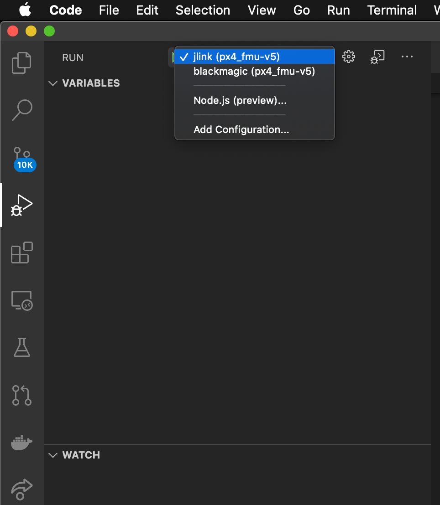

# 비주얼 스튜디오 코드 IDE(VSCode)

[Visual Studio Code](https://code.visualstudio.com/) is a powerful cross-platform source code editor/IDE that can be used for PX4 development on Ubuntu, Windows, and macOS.

PX4 개발에 VSCode를 사용하는 데에는 많은 이유가 있습니다.

- Getting setup _really_ only takes a few minutes.
- A rich extension ecosystem that enables a huge range of tools needed for PX4 development: C/C++ (with solid _cmake_ integration), _Python_, _Jinja2_, ROS messages, and even DroneCAN DSDL.
- 뛰어난 Github 통합 기능

IDE를 설정과 개발 방법에 대하여 설명합니다.

:::info
There are other powerful IDEs, but they typically take more effort to integrate with PX4.
With _VScode_, configuration is stored in the PX4/PX4-Autopilot tree ([PX4-Autopilot/.vscode](https://github.com/PX4/PX4-Autopilot/tree/main/.vscode)) so the setup process is as simple as adding the project folder.
:::

## 전제 조건

You must already have installed the command line [PX4 developer environment](../dev_setup/dev_env.md) for your platform and downloaded the _Firmware_ source code repo.

## Installation & Setup

1. [Download and install VSCode](https://code.visualstudio.com/) (you will be offered the correct version for your OS).

2. Open VSCode and add the PX4 source code:

   - Select _Open folder ..._ option on the welcome page (or using the menu: **File > Open Folder**):

      

   - A file selection dialog will appear.
      Select the **PX4-Autopilot** directory and then press **OK**.

   The project files and configuration will then load into _VSCode_.

3. Press **Install All** on the _This workspace has extension recommendations_ prompt (this will appear on the bottom right of the IDE).
   

   VSCode will open the _Extensions_ panel on the left hand side so you can watch the progress of installation.

   

4. 오른쪽 하단에 여러 알림/프롬프트가 나타날 수 있습니다.

   :::tip
   If the prompts disappear, click the little "alarm" icon on the right of the bottom blue bar.

:::

   - If prompted to install a new version of _cmake_:
      - Say **No** (the right version is installed with the [PX4 developer environment](../dev_setup/dev_env.md)).
   - If prompted to sign into _github.com_ and add your credentials:
      - 이것은 당신에게 달려 있습니다! Github와 IDE 간의 긴밀한 통합을 제공하여 워크플로를 단순화할 수 있습니다.
   - Other prompts are optional, and may be installed if they seem useful. <!-- perhaps add screenshot of these prompts -->

## PX4 빌드

빌드를 진행하려면:

1. Select your build target ("cmake build config"):

   - The current _cmake build target_ is shown on the blue _config_ bar at the bottom (if this is already your desired target, skip to next step).
      

      ::: info
      The cmake target you select affects the targets offered for when [building/debugging](#debugging) (i.e. for hardware debugging you must select a hardware target like `px4_fmu-v6`).

:::

   - Click the target on the config bar to display other options, and select the one you want (this will replace any selected target).

   - _Cmake_ will then configure your project (see notification in bottom right).
      

   - Wait until configuration completes.
      When this is done the notification will disappear and you'll be shown the build location:
      .

2. You can then kick off a build from the config bar (select either **Build** or **Debug**).
   

After building at least once you can now use [code completion](#code completion) and other _VSCode_ features.

## 디버깅

### SITL 디버깅

SITL에서 PX4를 디버깅하려면:

1. Select the debug icon on the sidebar (marked in red) to display the debug panel.
   

2. Then choose your debug target (e.g. _Debug SITL (Gazebo Iris)_) from the top bar debug dropdown (purple box).

   ::: info
   The debug targets that are offered (purple box) match your build target (yellow box on the bottom bar).
   예를 들어, SITL 대상을 디버그하려면 빌드 대상에 SITL이 포함되어야 합니다.

:::

3. 디버그 "재생" 화살표(상단 막대의 디버그 대상 옆 - 분홍색 상자)를 클릭하여 디버깅을 시작합니다.

디버깅하는 동안 중단점을 설정하고, 코드를 건너뛰고, 그렇지 않으면 정상적으로 개발할 수 있습니다.

### 하드웨어 디버깅

The instructions in [SWD Debug Port](../debug/swd_debug.md) explain how to connect to the SWD interface on common flight controllers (for example, using the Dronecode or Blackmagic probes).

After connecting to the SWD interface, hardware debugging in VSCode is then the same as for [SITL Debugging](#debugging_sitl) except that you select a debug target appropriate for your debugger type (and firmware) - e.g. `jlink (px4_fmu-v5)`.

:::tip
To see the `jlink` option you must have selected a [cmake target for building firmware](#building-px4).
:::

## 코드 완성

In order for the code completion to work (and other IntelliSense magic) you need an active configuration and to have [built the code](#building).

이 작업이 완료되면 다른 작업을 수행할 필요가 없습니다.
툴체인은 입력시 자동으로 기호를 제공합니다.

## 문제 해결

이 섹션에는 설정 및 빌드 오류에 대한 지침이 포함되어 있습니다.

### Ubuntu 18.04: "Visual Studio Code는 이 큰 작업 영역에서 파일 변경 사항을 감시할 수 없습니다."

이 오류는 시작시에 나타납니다.
On some systems, there is an upper-limit of 8192 file handles imposed on applications, which means that VSCode might not be able to detect file modifications in `/PX4-Autopilot`.

메모리 소비를 희생시키면서 오류를 방지하기 위해 이 제한을 늘릴 수 있습니다.
Follow the [instructions here](https://code.visualstudio.com/docs/setup/linux#_visual-studio-code-is-unable-to-watch-for-file-changes-in-this-large-workspace-error-enospc).
값 65536이면 충분합니다.
