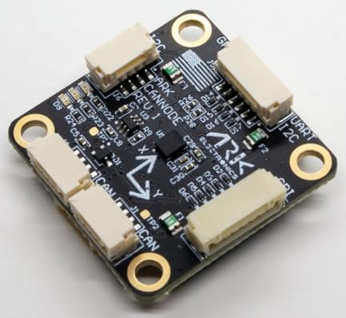

# ARK CANnode

[ARK CANnode](https://arkelectron.com/product/ark-cannode/) is an open source generic [DroneCAN](../dronecan/index.md) node that includes a 6 degree of freedom IMU.
Its main purpose is to enable the use of non-CAN sensors (I2C, SPI, UART) on the CAN bus.
It also has PWM outputs to expand a vehicle's control outputs in quantity and physical distance.

## 구매처

Order this module from:

- [ARK Electronics](https://arkelectron.com/product/ark-cannode/) (US)

## Hardware Specifications

- [Open Source Schematic and BOM](https://github.com/ARK-Electronics/ARK_CANNODE)
- 센서
  - Bosch BMI088 6-Axis IMU or Invensense ICM-42688-P 6-Axis IMU
- STM32F412CGU6 MCU
  - 1MB Flash
- Two Pixhawk Standard CAN Connectors
  - 4 Pin JST GH
- Pixhawk Standard I2C Connector
  - 4 Pin JST GH
- Pixhawk Standard UART/I2C Connector (Basic GPS Port)
  - 6 Pin JST GH
- Pixhawk Standard SPI Connector
  - 7 Pin JST GH
- PWM Connector
  - 10 Pin JST JST
  - 8 PWM Outputs
  - Matches Pixhawk 4 PWM Connector Pinout
- Pixhawk Standard Debug Connector
  - 6 Pin JST SH
- Small Form Factor
  - 3cm x 3cm x 1.3cm
- LED Indicators
- USA Built
- Power Requirements
  - 5V
  - Current dependent on connected peripherals

## 하드웨어 설정

### 배선

The ARK CANnode is connected to the CAN bus using a Pixhawk standard 4 pin JST GH cable.
For more information, refer to the [CAN Wiring](../can/index.md#wiring) instructions.

## Firmware Setup

ARK CANnode runs the [PX4 DroneCAN Firmware](px4_cannode_fw.md).
As such, it supports firmware update over the CAN bus and [dynamic node allocation](index.md#node-id-allocation).

ARK CANnode boards ship with recent firmware pre-installed, but if you want to build and flash the latest firmware yourself see [PX4 DroneCAN Firmware > Building the Firmware](px4_cannode_fw.md#building-the-firmware).

- Firmware target: `ark_cannode_default`
- Bootloader target: `ark_cannode_canbootloader`

## Flight Controller Configuration

### Enable DroneCAN

In order to use the ARK CANnode board, connect it to the Pixhawk CAN bus and enable the DroneCAN driver by setting parameter [UAVCAN_ENABLE](../advanced_config/parameter_reference.md#UAVCAN_ENABLE) to `2` for dynamic node allocation (or `3` if using [DroneCAN ESCs](../dronecan/escs.md)).

단계는 다음과 같습니다:

- In _QGroundControl_ set the parameter [UAVCAN_ENABLE](../advanced_config/parameter_reference.md#UAVCAN_ENABLE) to `2` or `3` and reboot (see [Finding/Updating Parameters](../advanced_config/parameters.md)).
- Connect ARK CANnode CAN to the Pixhawk CAN.

Once enabled, the module will be detected on boot.

DroneCAN configuration in PX4 is explained in more detail in [DroneCAN > Enabling DroneCAN](../dronecan/index.md#enabling-dronecan).

### Enable Sensors

You will need to enable the subscriber appropriate for each of the sensors that are connected to the ARK CANnode.

This is done using the the parameters named like `UAVCAN_SUB_*` in the parameter reference (such as [UAVCAN_SUB_ASPD](../advanced_config/parameter_reference.md#UAVCAN_SUB_ASPD), [UAVCAN_SUB_BARO](../advanced_config/parameter_reference.md#UAVCAN_SUB_BARO) etc.).

## Ark CANNode Configuration

On the ARK CANnode, you may need to configure the following parameters:

| 매개변수                                                                                                                 | 설명                                            |
| -------------------------------------------------------------------------------------------------------------------- | --------------------------------------------- |
| [CANNODE_TERM](../advanced_config/parameter_reference.md#CANNODE_TERM) | CAN built-in bus termination. |

## LED 신호의 의미

You will see both red and blue LEDs on the ARK CANnode when it is being flashed, and a solid blue LED if it is running properly.

If you see a solid red LED there is an error and you should check the following:

- Make sure the flight controller has an SD card installed.
- Make sure the ARK CANnode has `ark_cannode_canbootloader` installed prior to flashing `ark_cannode_default`.
- Remove binaries from the root and ufw directories of the SD card and try to build and flash again.

## See Also

- [ARK CANnode Documentation](https://arkelectron.gitbook.io/ark-documentation/sensors/ark-cannode) (ARK Docs)
