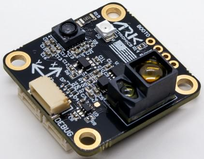

# ARK Flow

ARK Flow is an open source [DroneCAN](index.md) [optical flow](../sensor/optical_flow.md), [distance sensor](../sensor/rangefinders.md), and IMU module.

## 구매처

Order this module from:

- [ARK Electronics](https://arkelectron.com/product/ark-flow/) (US)

## Hardware Specifications

- [Open Source Schematic and BOM](https://github.com/ARK-Electronics/ARK_Flow)
- 센서
  - PixArt PAW3902 Optical Flow Sensor
    - Tracks under super low light condition of >9 lux
    - Wide working range from 80mm up to 30m
    - Up to 7.4 rad/s
  - 40mW IR LED built onto board for improved low light operation
  - Broadcom AFBR-S50LV85D Time-of-Flight Distance Sensor
    - Integrated 850 nm laser light source
    - Field-of-View (FoV) of 12.4° x 6.2° with 32 pixels
    - Typical distance range up to 30m
    - Operation of up to 200k Lux ambient light
    - Works well on all surface conditions
    - Transmitter beam of 2° x 2° to illuminate between 1 and 3 pixels
  - Bosch BMI088 6-Axis IMU or Invensense ICM-42688-P 6-Axis IMU
- STM32F412CEU6 MCU
- Two Pixhawk Standard CAN Connectors (4 Pin JST GH)
- Pixhawk Standard Debug Connector (6 Pin JST SH)
- Software-toggleable built in CAN termination resistor
- Small Form Factor
  - 3cm x 3cm x 1.4cm
- LED Indicators
- USA Built

## 하드웨어 설정

### 배선

The ARK Flow is connected to the CAN bus using a Pixhawk standard 4 pin JST GH cable.
For more information, refer to the [CAN Wiring](../can/index.md#wiring) instructions.

### 장착

The recommended mounting orientation is with the connectors on the board pointing towards **back of vehicle**, as shown in the following picture.

This corresponds to the default value (`0`) of the parameter [SENS_FLOW_ROT](../advanced_config/parameter_reference.md#SENS_FLOW_ROT).
Change the parameter appropriately if using a different orientation.

The sensor can be mounted anywhere on the frame, but you will need to specify the focal point position, relative to vehicle centre of gravity, during [PX4 configuration](#px4-configuration).

## Firmware Setup

ARK Flow runs the [PX4 DroneCAN Firmware](px4_cannode_fw.md).
As such, it supports firmware update over the CAN bus and [dynamic node allocation](index.md#node-id-allocation).

ARK Flow boards ship with recent firmware pre-installed, but if you want to build and flash the latest firmware yourself see [PX4 DroneCAN Firmware > Building the Firmware](px4_cannode_fw.md#building-the-firmware).

- Firmware target: `ark_can-flow_default`
- Bootloader target: `ark_can-flow_canbootloader`

## Flight Controller Setup

:::info
The Ark Flow will not boot if there is no SD card in the flight controller when powered on.
:::

### Enable DroneCAN

단계는 다음과 같습니다:

- In _QGroundControl_ set the parameter [UAVCAN_ENABLE](../advanced_config/parameter_reference.md#UAVCAN_ENABLE) to `2` for dynamic node allocation (or `3` if using [DroneCAN ESCs](../dronecan/escs.md)) and reboot (see [Finding/Updating Parameters](../advanced_config/parameters.md)).
- Connect ARK Flow CAN to the Pixhawk CAN.

Once enabled, the module will be detected on boot.
Flow data should arrive at 100Hz.
Distance sensor data should arrive at 40Hz

DroneCAN configuration in PX4 is explained in more detail in [DroneCAN > Enabling DroneCAN](../dronecan/index.md#enabling-dronecan).

### PX4 설정

First set the parameters to [Enable DroneCAN](#enable-dronecan) (as shown above).
Then set the EKF optical flow parameters to enable fusing optical flow measurements for velocity calculation, and define offsets if the sensor is not centred within the vehicle.

Set the following parameters in _QGroundControl_:

- Enable optical flow fusion by setting [EKF2_OF_CTRL](../advanced_config/parameter_reference.md#EKF2_OF_CTRL).
- To optionally disable GPS aiding, set [EKF2_GPS_CTRL](../advanced_config/parameter_reference.md#EKF2_GPS_CTRL) to `0`.
- Enable [UAVCAN_SUB_FLOW](../advanced_config/parameter_reference.md#UAVCAN_SUB_FLOW).
- Enable [UAVCAN_SUB_RNG](../advanced_config/parameter_reference.md#UAVCAN_SUB_RNG).
- Set [EKF2_RNG_A_HMAX](../advanced_config/parameter_reference.md#EKF2_RNG_A_HMAX) to `10`.
- Set [EKF2_RNG_QLTY_T](../advanced_config/parameter_reference.md#EKF2_RNG_QLTY_T) to `0.2`.
- Set [UAVCAN_RNG_MIN](../advanced_config/parameter_reference.md#UAVCAN_RNG_MIN) to `0.08`.
- Set [UAVCAN_RNG_MAX](../advanced_config/parameter_reference.md#UAVCAN_RNG_MAX) to `30`.
- Set [SENS_FLOW_MINHGT](../advanced_config/parameter_reference.md#SENS_FLOW_MINHGT) to `0.08`.
- Set [SENS_FLOW_MAXHGT](../advanced_config/parameter_reference.md#SENS_FLOW_MAXHGT) to `25`.
- Set [SENS_FLOW_MAXR](../advanced_config/parameter_reference.md#SENS_FLOW_MAXR) to `7.4` to match the PAW3902 maximum angular flow rate.
- The parameters [EKF2_OF_POS_X](../advanced_config/parameter_reference.md#EKF2_OF_POS_X), [EKF2_OF_POS_Y](../advanced_config/parameter_reference.md#EKF2_OF_POS_Y) and [EKF2_OF_POS_Z](../advanced_config/parameter_reference.md#EKF2_OF_POS_Z) can be set to account for the offset of the Ark Flow from the vehicle centre of gravity.

When optical flow is the only source of horizontal position/velocity, then lowering the gain for controller response to horizontal position error [MPC_XY_P](../advanced_config/parameter_reference.md#MPC_XY_P) (e.g. to 0.5) is recommended to reduce oscillations.

## Ark Flow Configuration

On the ARK Flow, you may need to configure the following parameters:

| 매개변수                                                                                                                 | 설명                                            |
| -------------------------------------------------------------------------------------------------------------------- | --------------------------------------------- |
| [CANNODE_TERM](../advanced_config/parameter_reference.md#CANNODE_TERM) | CAN built-in bus termination. |

## LED 신호의 의미

You will see both red and blue LEDs on the ARK Flow when it is being flashed, and a solid blue LED if it is running properly.

If you see a solid red LED there is an error and you should check the following:

- Make sure the flight controller has an SD card installed.
- Make sure the Ark Flow has `ark_can-flow_canbootloader` installed prior to flashing `ark_can-flow_default`.
- Remove binaries from the root and ufw directories of the SD card and try to build and flash again.

## 비디오

<lite-youtube videoid="SAbRe1fi7bU" params="list=PLUepQApgwSozmwhOo-dXnN33i2nBEl1c0" title="ARK Flow Indoor Position Hold x64"/>

<!-- ARK Flow with PX4 Optical Flow Position Hold: 20210605 -->

_PX4 holding position using the ARK Flow sensor for velocity estimation (in [Position Mode](../flight_modes_mc/position.md))._

## See Also

- [ARK Flow](https://arkelectron.gitbook.io/ark-documentation/sensors/ark-flow) (ARK Docs)
