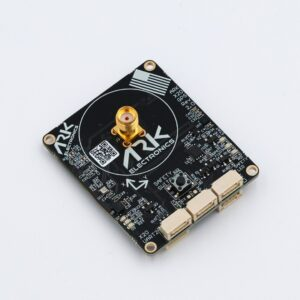

# ARK X20 RTK GPS

[ARK X20 RTK GPS](https://docs.arkelectron.com/gps/ark-x20-rtk-gps) is an open source [DroneCAN](index.md) [RTK GPS](../gps_compass/rtk_gps.md), [u-blox ZED-X20P all-band high precision GNSS module](https://www.u-blox.com/en/product/zed-x20p-module), magnetometer, barometer, IMU, buzzer, and safety switch module.

## 구매처

Order this module from:

- [ARK Electronics](https://arkelectron.com/product/ark-x20-rtk-gps/) (US)

## Hardware Specifications

- [Open Source Schematic and BOM](https://github.com/ARK-Electronics/ARK_RTK_GPS)
- 센서
  - Ublox ZED-X20P
    - All-band all constellation GNSS receiver
    - Best position accuracy and availability in different environments
    - RTK, PPP-RTK and PPP algorithms expanding the limits of performance
    - Highest quality GNSS raw data
    - u-blox end-to-end hardened security
    - 25Hz update rate
  - ST IIS2MDC Magnetometer
  - Bosch BMP390 Barometer
  - Invensense ICM-42688-P 6-Axis IMU
- STM32F412VGH6 MCU
- Safety Button
- 부저
- Two Pixhawk Standard CAN Connectors (4 Pin JST GH)
- X20 “UART 2” Connector
  - 4 Pin JST GH
  - TX, RX, PPS, GND
- I2C Expansion Connector
  - 4 Pin JST-GH
  - 5.0V, SCL, SDA, GND
- Pixhawk Standard Debug Connector (6 Pin JST SH)
- LED Indicators
  - Safety LED
  - GPS Fix
  - RTK Status
  - RGB system status
- USA Built
- Power Requirements
  - 5V
  - 144mA Average
  - 157mA Max

## 하드웨어 설정

### 배선

The ARK X20 RTK GPS is connected to the CAN bus using a Pixhawk standard 4 pin JST GH cable. For more information, refer to the [CAN Wiring](../can/index.md#wiring) instructions.

### 장착

The recommended mounting orientation is with the connectors on the board pointing towards the **back of vehicle**.

The sensor can be mounted anywhere on the frame, but you will need to specify its position, relative to vehicle centre of gravity, during [PX4 configuration](#px4-configuration).

## Firmware Setup

ARK X20 RTK GPS runs the [PX4 cannode firmware](px4_cannode_fw.md). As such, it supports firmware update over the CAN bus and [dynamic node allocation](index.md#node-id-allocation).

ARK X20 RTK GPS boards ship with recent firmware pre-installed, but if you want to build and flash the latest firmware yourself, refer to the [cannode firmware build instructions](px4_cannode_fw.md#building-the-firmware).

Firmware target: `ark_can-rtk-gps_default`
Bootloader target: `ark_can-rtk-gps_canbootloader`

## Flight Controller Setup

### Enabling DroneCAN

In order to use the ARK X20 RTK GPS, connect it to the Pixhawk CAN bus and enable the DroneCAN driver by setting parameter [UAVCAN_ENABLE](../advanced_config/parameter_reference.md#UAVCAN_ENABLE) to `2` for dynamic node allocation (or `3` if using [DroneCAN ESCs](../dronecan/escs.md)).

단계는 다음과 같습니다:

- In _QGroundControl_ set the parameter [UAVCAN_ENABLE](../advanced_config/parameter_reference.md#UAVCAN_ENABLE) to `2` or `3` and reboot (see [Finding/Updating Parameters](../advanced_config/parameters.md)).
- Connect ARK X20 RTK GPS CAN to the Pixhawk CAN.

Once enabled, the module will be detected on boot.
GPS data should arrive at 10Hz.

### PX4 설정

You need to set necessary [DroneCAN](index.md) parameters and define offsets if the sensor is not centred within the vehicle:

- Enable GPS yaw fusion by setting bit 3 of [EKF2_GPS_CTRL](../advanced_config/parameter_reference.md#EKF2_GPS_CTRL) to true.
- Enable GPS blending to ensure the heading is always published by setting [SENS_GPS_MASK](../advanced_config/parameter_reference.md#SENS_GPS_MASK) to 7 (all three bits checked).
- Enable [UAVCAN_SUB_GPS](../advanced_config/parameter_reference.md#UAVCAN_SUB_GPS), [UAVCAN_SUB_MAG](../advanced_config/parameter_reference.md#UAVCAN_SUB_MAG), and [UAVCAN_SUB_BARO](../advanced_config/parameter_reference.md#UAVCAN_SUB_BARO).
- The parameters [EKF2_GPS_POS_X](../advanced_config/parameter_reference.md#EKF2_GPS_POS_X), [EKF2_GPS_POS_Y](../advanced_config/parameter_reference.md#EKF2_GPS_POS_Y) and [EKF2_GPS_POS_Z](../advanced_config/parameter_reference.md#EKF2_GPS_POS_Z) can be set to account for the offset of the ARK X20 RTK GPS from the vehicles centre of gravity.

### ARK X20 RTK GPS Configuration

You may need to [configure the following parameters](../dronecan/index.md#qgc-cannode-parameter-configuration) on the ARK X20 RTK GPS itself:

| 매개변수                                                                                                                                               | 설명                                                                                                                                                                                                                          |
| -------------------------------------------------------------------------------------------------------------------------------------------------- | --------------------------------------------------------------------------------------------------------------------------------------------------------------------------------------------------------------------------- |
| [CANNODE_NODE_ID](../advanced_config/parameter_reference.md#CANNODE_NODE_ID) | CAN node ID (0 for dynamic allocation). If set to 0 (default), dynamic node allocation is used. Set to 1-127 to use a static node ID. |
| [CANNODE_TERM](../advanced_config/parameter_reference.md#CANNODE_TERM)                               | CAN built-in bus termination. Set to `1` if this is the last node on the CAN bus.                                                                                                           |

### Setting Up Rover and Fixed Base

Position of the rover is established using RTCM messages from the RTK base module (the base module is connected to QGC, which sends the RTCM information to PX4 via MAVLink).

PX4 DroneCAN parameters:

- [UAVCAN_PUB_RTCM](../advanced_config/parameter_reference.md#UAVCAN_PUB_RTCM):
  - Makes PX4 publish RTCM messages ([RTCMStream](https://dronecan.github.io/Specification/7._List_of_standard_data_types/#rtcmstream)) to the bus (which it gets from the RTK base module via QGC).

Rover module parameters (also [set using QGC](../dronecan/index.md#qgc-cannode-parameter-configuration)):

- [CANNODE_SUB_RTCM](../advanced_config/parameter_reference.md#CANNODE_SUB_RTCM) tells the rover that it should subscribe to [RTCMStream](https://dronecan.github.io/Specification/7._List_of_standard_data_types/#rtcmstream) RTCM messages on the bus (from the moving base).

:::info
Use [UAVCAN_PUB_MBD](../advanced_config/parameter_reference.md#UAVCAN_PUB_MBD) and [CANNODE_SUB_MBD](../advanced_config/parameter_reference.md#CANNODE_SUB_MBD) instead if you want to implement moving base (see below) at the same time.
:::

For more information see [Rover and Fixed Base](../dronecan/index.md#rover-and-fixed-base) in the DroneCAN guide.

## LED 신호의 의미

- The GPS status lights are located to the right of the connectors
  - Blinking green is GPS fix
  - Blinking blue is received corrections and RTK Float
  - Solid blue is RTK Fixed

- The CAN status lights are located top the left of the connectors
  - Slow blinking green is waiting for CAN connection
  - Fast blinking green is normal operation
  - Slow blinking green and blue is CAN enumeration
  - Fast blinking blue and red is firmware update in progress
  - Blinking red is error
    - If you see a red LED there is an error and you should check the following
      - Make sure the flight controller has an SD card installed
      - Make sure the ARK X20 RTK GPS has `ark_can-rtk-gps_canbootloader` installed prior to flashing `ark_can-rtk-gps_default`
      - Remove binaries from the root and ufw directories of the SD card and try to build and flash again

## See Also

- [ARK X20 RTK GPS Documentation](https://docs.arkelectron.com/gps/ark-x20-rtk-gps) (ARK Docs)
