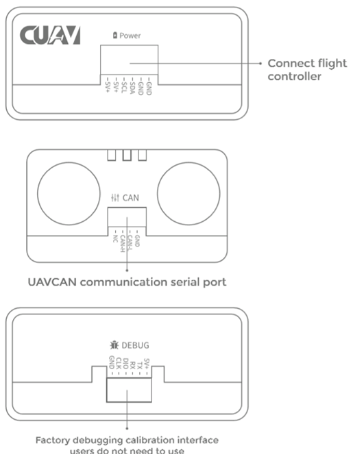

# CAUV CAN PMU

CAN PMU&reg; is a high-precision [DroneCAN](index.md) power module developed by CUAV&reg;.
It runs the CUAV ITT compensation algorithm, which enables drones to get the battery data more accurately.

It is recommended for use in large commercial vehicles, but might also be used for research vehicles.

## 구매처

- [CUAV store](https://store.cuav.net/index.php)
- [CUAV aliexpress ](https://www.aliexpress.com/item/4000369700535.html)

## Hardware Specifications

- **Processor:** STM32F412
- **Voltage input**: 6~62V\(2-15S\)
- **Max current:** 110A
- **Voltage accuracy:** ±0.05V
- **Current accuracy:** ±0.1A
- **Resolution:** 0.01A/V
- **Max output power:** 6000W/90S
- **Max stable power:** 5000W
- **Power port output:** 5.4V/5A
- **Operating temp:** -20~+100
- **Firmware upgrade:** Supported.
- **Calibration:** Not needed.
- **Interface Type:**
  - **IN/OUT:** XT90\(Cable）/Amass 8.0\(Module）
  - **Power port:** 5025850670
  - **CAN:** GHR-04V-S
- **Appearance:**
  - **Size:** 46.5mm \* 38.5mm \* 22.5mm
  - **Weight:** 76g

## 하드웨어 설정

### Package Contents

### 핀배열

## 배선

The connection steps are:

- Connect the flight control CAN1/2 and the module CAN interface.
- Connect the V5 series power cable to the V5 Flight Control Power2 (if other flight controllers are connect to the Power interface) and the module Power interface.

## Flight Controller Setup

Set the following parameters in _QGroundControl_ [Vehicle Setup > Parameters](../advanced_config/parameters.md) and then restart:

- [UAVCAN_ENABLE](../advanced_config/parameter_reference.md#UAVCAN_ENABLE): set to: _Sensors Automatic Config_

  

- [UAVCAN_SUB_BAT](../advanced_config/parameter_reference.md#UAVCAN_SUB_BAT): set to: _Raw data_

  

## 추가 정보

[CAN PMU Manual](http://manual.cuav.net/power-module/CAN-PMU.pdf)

[CAN PMU Power detection module > Enable CAN PMU > PX4 firmware](http://doc.cuav.net/power-module/can-pmu/en/) (CUAV docs)
