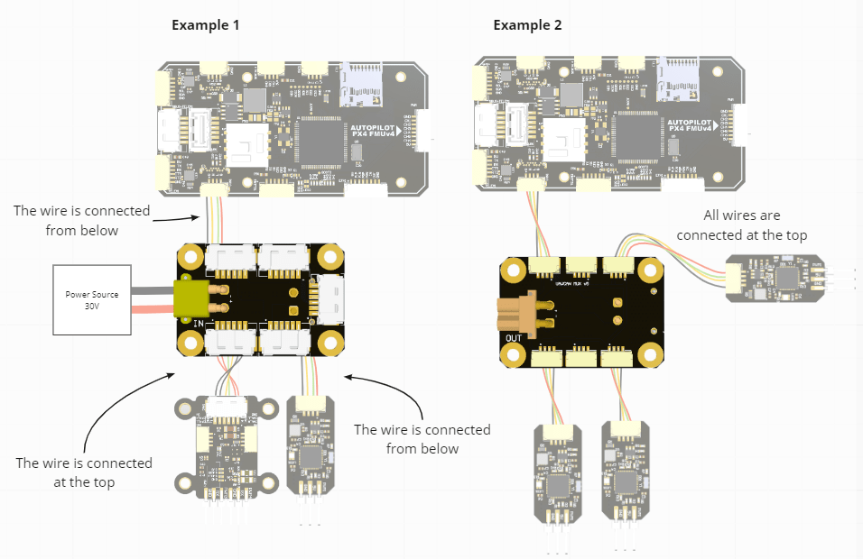
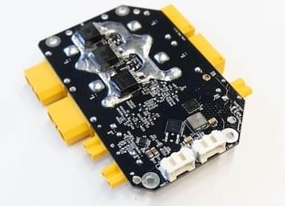

# RaccoonLab Power Connectors and Management Units

## CAN Power Connectors

CAN power connectors are designed for light unmanned aerial (UAV) and other vehicles for providing power over CAN using [CAN power cables](https://docs.raccoonlab.co/guide/pmu/wires/).

There are two types of devices:

1. `CAN-MUX` devices provide power from XT30 connector to CAN.
  There are 2 variation of this type of the device with different number of connectors.
2. `Power connector node` is designed to pass current (up to 60A) to power load and CAN, measure voltage and current on load.
  It behaves as Cyphal/DroneCAN node.

Please refer to the RaccoonLab docs [CAN Power Connectors](https://docs.raccoonlab.co/guide/pmu/power/) page.

**Connection example diagram**

Here are the examples:

- The first shows how to use both external high voltage power and 5V CAN power for different nodes with MUX.
  The [NODE](raccoonlab_nodes.md) (the large one in the left diagram) is connected to a high-voltage power source (here 30 V).
  In this case, the [uNODE](raccoonlab_nodes.md) (smaller one on the left schematic) is powered directly from the autopilot.
- The second example shows how to connect multiple [uNODEs](raccoonlab_nodes.md) that are powered by the autopilot (5V).
  If these nodes are powered from a separate DCDC, that DCDC should also be connected to one of these connectors.

## Power Management Unit

This board monitors the battery (voltage and current) and allows control over charging, source and load using he DroneCAN interface.
It might be useful for applications where you need to control the power of the drone including the board computer and charging process.

Please refer to the RaccoonLab docs [Power & Connectivity](https://docs.raccoonlab.co/guide/pmu/) page.

## 구매처

[RaccoonLab Store](https://raccoonlab.co/store)

[Cyphal store](https://cyphal.store/search?q=raccoonlab)
