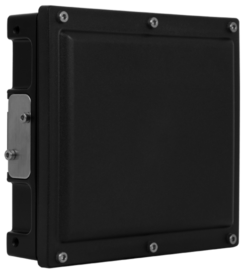
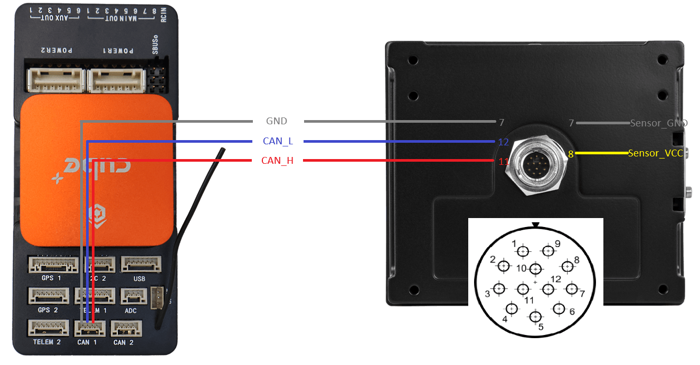
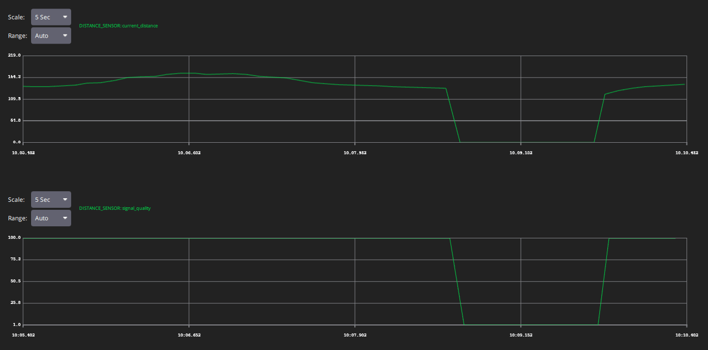

# Smartmicro Drone Altimeter (T132)

The Drone Altimeter by Smartmicro is radar based [distance sensor](../sensor/rangefinders.md) with a [DroneCAN](index.md) interface.

- Altitude up to 175 m possible
- Unbreakable, lightweight design (274 g, IP67)
- For small drones in GNSS-denied environments
- Plug-and-play integration with PX4 systems (DroneCAN compatible, 1 Mbit/s, 29-bit identifiers)
- Automatic dual mode operation (medium/long range mode)
- Highest accuracy, Altitude tracking
- High electromagnetic susceptibility robustness: difficult to jam
- Low observability (narrow beam, short dwell time)
- Operates in 76-77 GHz band approved for altimeter operation in Europe
- Made in Germany, specially designed for European drone manufactures
- ITAR free, not dual-use classified
- Mature hardware, in full production, available in high volume
- Update rate of 55 ms

## 구매처

Order this radar sensor from:

- [Smartmicro](https://www.smartmicro.com/airborne/drone-altimeter/)

SmartMicro do not provide a cable that connects to Pixhawk-standard CAN bus connectors out of the box.
You may however choose to purchase a "Plug and Play" cable, and replace its D-Sub-9 connector with the connector for your flight controller.

## Hardware Specifications

- Dimensions: 94.7 x 84.4 x 26.4 mm (plus connector)
- Weight: 274 g
- Connector: Hirose LF10 series
- Operating Temperature: -40…+85°C
- Shock/Vibration 100 grms/14 grms
- Voltage: DC 8 - 32 V.
- Power: 3.75 to 5 W.

## 하드웨어 설정

### Sensor Setup

For optimal performance, the antenna of the radar should be parallel to the surface of the earth during normal flight.
The antenna is located directly behind the black plastic radome, so the black plastic surface should always be facing down.

The word "TOP" on the sensor label and the accompanying arrow should either point in the direction of flight or directly opposite the direction of flight.
Please ensure, that the arrow never points perpendicular to the flight direction.

The sensor may be mounted behind flat plastics surfaces, e.g. inside the fuselage, if this surface is radar transparent.

### 배선

The sensor connector is a 12-pin male bayonet type connector (waterproof IP67, series LF10WBRB-12PD, manufacturer Hirose, Japan).

To operate, connect CAN and GND with the controller.

Provide a DC voltage between 8 and 32 V.
Power consumption is between 3.75 and 5 Watts.

The T132 has an internal CAN-Termination.

### Firmware Setup

The sensor is shipped with the firmware.
No setup is required.
Future firmware update is possible with proprietary Smartmicro software via CAN bus.

## PX4 설정

- In _QGroundControl_ set the parameter [UAVCAN_ENABLE](../advanced_config/parameter_reference.md#UAVCAN_ENABLE) to `2` for dynamic node allocation.
- Confirm that [UAVCAN_BITRATE](../advanced_config/parameter_reference.md#UAVCAN_BITRATE) is set to 1000000 (1 Mbit/s).
- Enable [UAVCAN_SUB_RNG](../advanced_config/parameter_reference.md#UAVCAN_SUB_RNG).
- Set [EKF2_RNG_A_HMAX](../advanced_config/parameter_reference.md#EKF2_RNG_A_HMAX) to `175`.
- Set [EKF2_RNG_QLTY_T](../advanced_config/parameter_reference.md#EKF2_RNG_QLTY_T) to `0.2`.
- Set [UAVCAN_RNG_MIN](../advanced_config/parameter_reference.md#UAVCAN_RNG_MIN) to `1`.
- Set [UAVCAN_RNG_MAX](../advanced_config/parameter_reference.md#UAVCAN_RNG_MAX) to `175`.
- Reboot (see [Finding/Updating Parameters](../advanced_config/parameters.md)).
- Connect Altimeter CAN to the Flight Controller CAN.

See also [Distance Sensor/Range Finder in _DroneCAN > Subscriptions and Publications_](../dronecan/#distance-sensor-range-finder).

Once enabled, the module will be detected on boot.
Distance sensor data arrives at 18.2 Hz.

## Sensor Operation

The measured altitude is perpendicular to the radome of the sensor.
When the vehicle rolls or pitches, the measured altitude is too high and must be compensated by roll and pitch angles.

If the sensor is unable to determine the current altitude (too high, too low or occluded radome) this is signaled as (DroneCAN) `reading_type=undefined`.

The screenshot of the MAVLink Inspector shows a situation where the radome is intentionally occluded.

