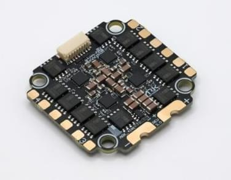
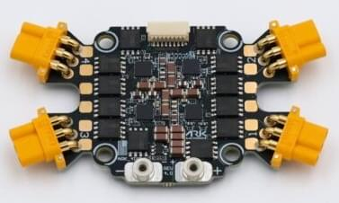

# ARK 4IN1 ESC (with/without Connectors)

4 in 1 Electronic Speed Controller (ESC) that is made in the USA, NDAA compliant, and DIU Blue Framework listed.

The ESC comes in variants without connectors that you can solder in place, and a variant that has built-in motor and battery connectors (no soldering required).

## 구매처

Order this module from:

- [4IN1 ESC (with connectors)](https://arkelectron.com/product/ark-4in1-esc/) (ARK Electronics - US)
- [ARK Electronics (without connectors)](https://arkelectron.com/product/ark-4in1-esc-cons/) (ARK Electronics US)

## Hardware Specifications

- Battery Voltage: 3-8s
  - 6V Minimum
  - 65V Absolute Maximum

- Current Rating: 50A Continuous, 75A Burst Per Motor

- [STM32F0](https://www.st.com/en/microcontrollers-microprocessors/stm32f0-series.html)

- [AM32 Firmware](https://github.com/am32-firmware/AM32/pull/27)

- Onboard Current Sensor, Serial Telemetry
  - 100V/A

- Input Protocols
  - DShot (300, 600)
  - Bi-directional DShot
  - KISS Serial Telemetry
  - PWM

- 8 Pin JST-SH Input/Output

- 10 Pin JST-SH Debug

- Motor & Battery Connectors (with-connector version)
  - MR30 Connector Limit Per Motor: 30A Continuous, 40A Burst
  - Four MR30 Motor Connectors

- Dimensions (with connectors)
  - Size: 77.00mm x 42.00mm x 9.43mm
  - Mounting Pattern: 30.5mm
  - Weight: 24g

- Dimensions (without connectors)
  - Size: 43.00mm x 40.50mm x 7.60mm
  - Mounting Pattern: 30.5mm
  - Weight: 14.5g

Other

- Made in the USA
- Open source AM32 firmware
- [DIU Blue Framework Listed](https://www.diu.mil/blue-uas/framework)

## See Also

- [ARK 4IN1 ESC CONS](https://docs.arkelectron.com/electronic-speed-controller/ark-4in1-esc) (ARK Docs)
