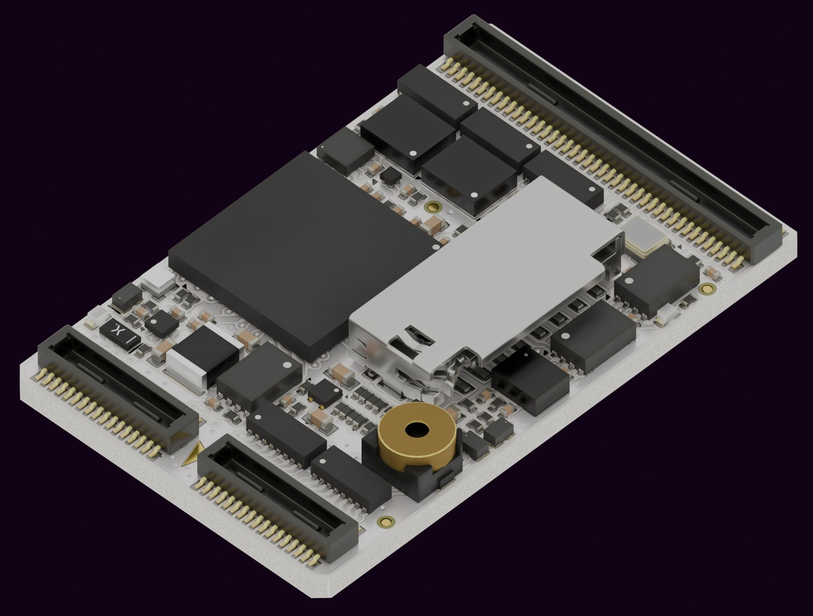
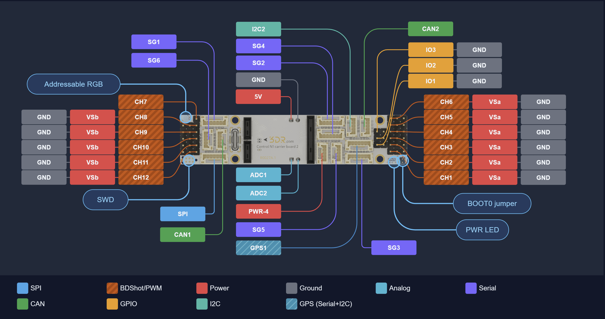

# 3DR Control N1 Flight Controller

<Badge type="tip" text="PX4 v1.18" />

:::warning
PX4 does not manufacture this (or any) autopilot.
Contact [3DR](https://www.3dr.com/) for hardware support or compliance issues.
:::

The _3DR Control N1_ is a compact, high-performance, low-profile and lightweight flight controller designed and assembled in USA.
It runs PX4 on the [NuttX](https://nuttx.apache.org/) OS.



:::info
This flight controller is [manufacturer supported](../flight_controller/autopilot_manufacturer_supported.md).
:::

:::tip
This flight controller requires a carrier board to work correctly.
Visit [3DR](https://3dr.wiki/autopilots/control-n1/) for available carrier boards and purchase information.
:::

## 주요 특징

- **Processor:** STMicro STM32H743 Arm Cortex-M7 up to 480 MHz, 1 MB RAM, 2 MB flash, 8 MB external flash
- **Sensors:**
  - 2x InvenSense IIM-42653 IMU (6-DoF)
  - Asahi Kasei AK09940A magnetometer
  - Infineon DPS368 barometer
- **Interfaces:**
  - 12x PWM motor outputs (DShot, bidirectional DShot, GPIO)
  - 7x serial ports (3x with hardware flow control)
  - 2x FD-CAN (up to 8 Mbps)
  - 2x I2C (up to 400 kHz)
  - 1x SPI (up to 40 MHz)
  - 4x GPIO (push-pull, direct from MCU)
  - 1x USB Full Speed (native STM32H7 port)
  - 1x SDIO/SDMMC interface
  - 1x addressable LED output (NeoPixel-compatible)
  - Serial Wire Debug (SWD)
- **Dimensions:** 28 × 17.6 × 3.7 mm
- **Weight:** 2.32 g
- **Input Voltage:** 4.8 – 6.0 V
- **Typical Current draw**: ~230 mA
- **Operating Temperature:** -20 to 75 °C
- **Storage Temperature:** -40 to 85 °C

## 펌웨어 빌드

:::tip
Most users will not need to build this firmware!
It is pre-built and automatically installed by _QGroundControl_ when appropriate hardware is connected (PX4 v1.18 and later).
:::

To [build PX4](../dev_setup/building_px4.md) for this target:

```sh
make 3dr_ctrl-n1_default
```

## 커넥터

The Control N1 uses three Hirose DF40-series board-to-board connectors:

| 커넥터  | Pins | Part Number                                                                                     | Signals                                                    |
| ---- | ---- | ----------------------------------------------------------------------------------------------- | ---------------------------------------------------------- |
| J100 | 30   | DF40HC(3.5)-30DS-0.4V(51) | USART1, USART2, USART3, UART4, SDMMC, USB, ALARM           |
| J200 | 30   | DF40HC(3.5)-30DS-0.4V(51) | USART6, FDCAN1, SPI, SWD, LED, BRD_EN |
| J300 | 80   | DF40HC(3.5)-80DS-0.4V(51) | UART7, UART8, FDCAN2, I2C, ADC, Motor outputs CH1–CH12     |

## 핀배열

This board is designed to be used with different carrier boards.

For the full pinout, visit the [3DR Control N1 Pinout Tool](https://docs.3dr.com/autopilots/control-n1/#pinout).

## 시리얼 포트 매핑

| 포트  | 커넥터  | Peripheral | Flow Control | Default Function |
| --- | ---- | ---------- | ------------ | ---------------- |
| SG1 | J100 | USART2     | Yes          | TELEM1           |
| SG2 | J100 | UART4      | Yes          | TELEM2           |
| SG3 | J300 | UART7      | Yes          | User             |
| SG4 | J100 | USART3     | No           | GPS2             |
| SG5 | J100 | USART1     | No           | User             |
| SG6 | J200 | USART6     | No           | RC               |
| SG7 | J300 | UART8      | No           | GPS1             |

## PWM 출력

The Control N1 has 12 PWM outputs, all routed through connector J300.
All outputs are FMU outputs with no separate IO coprocessor.

Each output supports PWM, OneShot, DShot, and bidirectional DShot.
GPIO mode is also available on all channels.

Outputs are grouped for DShot timing purposes.
All channels within a group must use the same protocol and rate.

| Group   | Channels |
| ------- | -------- |
| Group 1 | CH1–CH4  |
| Group 2 | CH5–CH8  |
| Group 3 | CH9–CH12 |

## RC Setup

Serial port SG6 (USART6, connector J200) is mapped to `RC` by default and supports any protocol compatible with PX4's COMMON_RC driver: ELRS, CRSF, DSM/DSMX, GHST, and SBUS.

Connect your RC receiver's serial output to the SG6 RX line on J200.
Select and assign your preferred protocol in QGroundControl during initial setup.

## Carrier Boards

The Control N1 is designed to be used with a carrier board.
The following carrier boards are available from 3DR:

| 보드                                                                                                   | 설명                                            |
| ---------------------------------------------------------------------------------------------------- | --------------------------------------------- |
| [CB1 Cuby](https://docs.3dr.com/autopilots/carrier-boards/r0026-cb1-cuby/)                           | Compact square form factor                    |
| [CB2 Longy](https://docs.3dr.com/autopilots/carrier-boards/r0027-cb2-longy/)                         | Thin form factor for space-constrained builds |
| [CB3 FPV](https://docs.3dr.com/autopilots/carrier-boards/r0033-cb3-fpv/)                             | Optimized for FPV platforms                   |
| [CB4 Wing](https://docs.3dr.com/autopilots/carrier-boards/r0036-cb4-wing/)                           | Fixed-wing and VTOL applications              |
| [CN1 Prototyping Board](https://docs.3dr.com/autopilots/carrier-boards/r0037-cn1-prototyping-board/) | Full signal access for development            |
| [CN1 to CZ OEM Adapter](https://docs.3dr.com/autopilots/carrier-boards/r0034-cn1-to-czoem-adapter/)  | Adapter for Control Zero OEM carrier boards   |

The image below shows the pinout of the CB2 Longy as a reference for connector layout and signal assignment.



## 디버그 포트

The [SWD debug port](../debug/swd_debug.md) signals (SWCLK, SWDIO) and BOOT0 are routed through connector **J200** on the Control N1 module.
The physical debug interface (connector type, pinout, and location) depends on the carrier board.

Depending on the carrier board, the debug connector may be a TC2030-compatible pad-of-nails (requires a [Tag-Connect TC2030](https://www.tag-connect.com/product/tc2030-ctx-nl-6-pin-no-legs-cable-with-10-pin-micro-connector-for-cortex-processors) cable) or a 14-pin ARM Cortex JTAG/SWD header (Samtec FTSH-107, 2×7, 1.27 mm pitch).
Note that some carrier boards may not expose a debug interface.
Refer to your carrier board's documentation for the exact connector location and pinout.

## 추가 정보

- [3DR Control N1 documentation](https://docs.3dr.com/autopilots/control-n1/)
