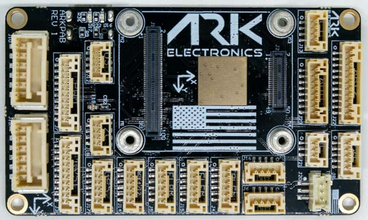
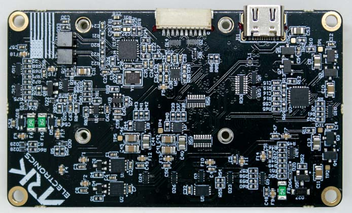

# ARK Pixhawk Autopilot Bus Carrier

:::warning
PX4 does not manufacture this (or any) autopilot.
Contact the [manufacturer](https://arkelectron.com/contact-us/) for hardware support or compliance issues.
:::

The [ARK Pixhawk Autopilot Bus (PAB) Carrier](https://arkelectron.gitbook.io/ark-documentation/flight-controllers/ark-pixhawk-autopilot-bus-carrier) is a USA-built flight controller carrier board, based on the [Pixhawk Autopilot Bus open source standard](https://github.com/pixhawk/Pixhawk-Standards).

The PAB form factor enables the ARK PAB Carrier to be used with any [PAB-compatible flight controller](../flight_controller/pixhawk_autopilot_bus.md), such as the [ARKV6X](../flight_controller/ark_v6x.md).

### Where To Buy

Order From [Ark Electronics](https://arkelectron.com/product/ark-pixhawk-autopilot-bus-carrier/) (US)

## 특징

- [Pixhawk Autopilot Bus (PAB) Form Factor](https://github.com/pixhawk/Pixhawk-Standards/blob/master/DS-010%20Pixhawk%20Autopilot%20Bus%20Standard.pdf?_ga=2.20605755.2081055420.1671562222-391294592.1671562222)
- USA Built

## 커넥터

- PAB Board to Board Interface
  - 100 Pin Hirose DF40
  - 40 Pin Hirose DF40
- Dual Digital Power Module Inputs
  - 5V Input
  - I2C Power Monitor
  - 6 Pin Molex CLIK-Mate
- Ethernet
  - 100Mbps
  - Built in Magnetics
  - 4 Pin JST-GH
- Full GPS Plus Safety Switch Port
  - 10 Pin JST-GH
- Basic GPS Port
  - 6 Pin JST-GH
- Dual CAN Ports
  - 4 Pin JST-GH
- Triple Telemetry Ports with Flow - Control
  - 6 Pin JST-GH
- Eight PWM Outputs
  - 10 Pin JST-GH
- UART/I2C Port
  - 6 Pin JST-GH
- I2C Port
  - 4 Pin JST-GH
- PPM RC Port
  - 3 Pin JST-GH
- DSM RC Port
  - 3 Pin JST-ZH
- SPI Port
  - 11 Pin JST-GH
- ADIO Port
  - 8 Pin JST-GH
- 디버그 포트
  - 10 Pin JST-SH

## 크기

- Without Flight Controller Module
  - 74.0mm x 43.5mm x 12.0mm
  - 22g

## 전원

- 5V input on `POWER1`, `POWER2`, `USB C`, and the `USB JST-GH` connector
  - Input is prioritized in the following order: POWER1 > POWER2 > USB
  - `USB C` and the `USB JST-GH` are in parallel
  - Overvoltage protection at 5.8V
  - Undervoltage protection at 3.9V
- `VDD_5V_HIPOWER` and `VDD_5V_PERIPH` can each provide a total of 1.5A across all the connectors

## LEDS

- There are two LEDs on the ARK PAB
  - `Red` is the ethernet power LED
  - `Green` is the ethernet activity LED

## 핀배열

## POWER1

| 핀                         | 신호                            | 전압                    |
| ------------------------- | ----------------------------- | --------------------- |
| 1(red) | `VBRICK1`                     | +5.0V |
| 2 (흑)  | `VBRICK1`                     | +5.0V |
| 3 (흑)  | I2C1_SCL | +3.3V |
| 4 (흑)  | I2C1_SDA | +3.3V |
| 5 (흑)  | `GND`                         | GND                   |
| 6 (흑)  | `GND`                         | GND                   |

## POWER2

| 핀                         | 신호                            | 전압                    |
| ------------------------- | ----------------------------- | --------------------- |
| 1(red) | `VBRICK2`                     | +5.0V |
| 2 (흑)  | `VBRICK2`                     | +5.0V |
| 3 (흑)  | I2C2_SCL | +3.3V |
| 4 (흑)  | I2C2_SDA | +3.3V |
| 5 (흑)  | `GND`                         | GND                   |
| 6 (흑)  | `GND`                         | GND                   |

## PWM

| 핀                           | 신호                                                                | 전압                    |
| --------------------------- | ----------------------------------------------------------------- | --------------------- |
| 1(red)   | VDD_SERVO (Not Connected) | +5.0V |
| 2 (흑)    | FMU_CH1                                      | +3.3V |
| 3 (흑)    | FMU_CH2                                      | +3.3V |
| 4 (흑)    | FMU_CH3                                      | +3.3V |
| 5 (흑)    | FMU_CH4                                      | +3.3V |
| 6 (흑)    | FMU_CH5                                      | +3.3V |
| 7 (흑)    | FMU_CH6                                      | +3.3V |
| 8 (blk)  | FMU_CH7                                      | +3.3V |
| 9 (blk)  | FMU_CH8                                      | +3.3V |
| 10 (blk) | `GND`                                                             | GND                   |

## GPS1

| 핀                           | 신호                                                                                    | 전압                    |
| --------------------------- | ------------------------------------------------------------------------------------- | --------------------- |
| 1(red)   | `VDD_5V_PERIPH`                                                                       | +5.0V |
| 2 (흑)    | USART1_TX_GPS1                              | +3.3V |
| 3 (흑)    | USART1_RX_GPS1                              | +3.3V |
| 4 (흑)    | I2C1_SCL                                                         | +3.3V |
| 5 (흑)    | I2C1_SDA                                                         | +3.3V |
| 6 (흑)    | nSAFETY_SWITCH_IN                           | +3.3V |
| 7 (흑)    | nSAFETY_SWITCH_LED_OUT | +3.3V |
| 8 (blk)  | `3V3_FMU`                                                                             | +3.3V |
| 9 (blk)  | BUZZER                                                                                | +5.0V |
| 10 (blk) | `GND`                                                                                 | GND                   |

## GPS2

| 핀                         | 신호                                                      | 전압                    |
| ------------------------- | ------------------------------------------------------- | --------------------- |
| 1(red) | `VDD_5V_HIPOWER`                                        | +5.0V |
| 2 (흑)  | UART8_TX_GPS2 | +3.3V |
| 3 (흑)  | UART8_RX_GPS2 | +3.3V |
| 4 (흑)  | I2C2_SCL                           | +3.3V |
| 5 (흑)  | I2C2_SDA                           | +3.3V |
| 6 (흑)  | `GND`                                                   | GND                   |

## TELEM1

| 핀                         | 신호                             | 전압                    |
| ------------------------- | ------------------------------ | --------------------- |
| 1(red) | `VDD_5V_HIPOWER`               | +5.0V |
| 2 (흑)  | UART7_TX  | +3.3V |
| 3 (흑)  | UART7_RX  | +3.3V |
| 4 (흑)  | UART7_CTS | +3.3V |
| 5 (흑)  | UART7_RTS | +3.3V |
| 6 (흑)  | `GND`                          | GND                   |

## TELEM2

| 핀                         | 신호                             | 전압                    |
| ------------------------- | ------------------------------ | --------------------- |
| 1(red) | `VDD_5V_PERIPH`                | +5.0V |
| 2 (흑)  | UART5_TX  | +3.3V |
| 3 (흑)  | UART5_RX  | +3.3V |
| 4 (흑)  | UART5_CTS | +3.3V |
| 5 (흑)  | UART5_RTS | +3.3V |
| 6 (흑)  | `GND`                          | GND                   |

## TELEM3

| 핀                         | 신호                              | 전압                    |
| ------------------------- | ------------------------------- | --------------------- |
| 1(red) | `VDD_5V_HIPOWER`                | +5.0V |
| 2 (흑)  | USART2_TX  | +3.3V |
| 3 (흑)  | USART2_RX  | +3.3V |
| 4 (흑)  | USART2_CTS | +3.3V |
| 5 (흑)  | USART2_RTS | +3.3V |
| 6 (흑)  | `GND`                           | GND                   |

## UART4/I2C3

| 핀                         | 신호                            | 전압                    |
| ------------------------- | ----------------------------- | --------------------- |
| 1(red) | `VDD_5V_PERIPH`               | +5.0V |
| 2 (흑)  | UART4_TX | +3.3V |
| 3 (흑)  | UART4_RX | +3.3V |
| 4 (흑)  | I2C3_SCL | +3.3V |
| 5 (흑)  | I2C3_SDA | +3.3V |
| 6 (흑)  | `GND`                         | GND                   |

## I2C3

| 핀                         | 신호                            | 전압                    |
| ------------------------- | ----------------------------- | --------------------- |
| 1(red) | `VDD_5V_PERIPH`               | +5.0V |
| 2 (흑)  | I2C3_SCL | +3.3V |
| 3 (흑)  | I2C3_SDA | +3.3V |
| 4 (흑)  | `GND`                         | GND                   |

## CAN1

| 핀                         | 신호                          | 전압                    |
| ------------------------- | --------------------------- | --------------------- |
| 1(red) | `VDD_5V_HIPOWER`            | +5.0V |
| 2 (흑)  | CAN1_H | +3.3V |
| 3 (흑)  | CAN1_L | +3.3V |
| 4 (흑)  | `GND`                       | GND                   |

## CAN2

| 핀                         | 신호                          | 전압                    |
| ------------------------- | --------------------------- | --------------------- |
| 1(red) | `VDD_5V_PERIPH`             | +5.0V |
| 2 (흑)  | CAN2_H | +3.3V |
| 3 (흑)  | CAN2_L | +3.3V |
| 4 (흑)  | `GND`                       | GND                   |

## USB

All signals in parallel with USB C connector

| 핀                         | 신호                         | 전압                    |
| ------------------------- | -------------------------- | --------------------- |
| 1(red) | `VBUS_IN`                  | +5.0V |
| 2 (흑)  | USB_N | +3.3V |
| 3 (흑)  | USB_P | +3.3V |
| 4 (흑)  | `GND`                      | GND                   |

## ETH

| 핀                         | 신호                                                 | 전압                              |
| ------------------------- | -------------------------------------------------- | ------------------------------- |
| 1(red) | ETH_RD_N | +50.0V Tolerant |
| 2 (흑)  | ETH_RD_P | +50.0V Tolerant |
| 3 (흑)  | ETH_TD_N | +50.0V Tolerant |
| 4 (흑)  | ETH_TD_P | +50.0V Tolerant |

## ADIO

| 핀                          | 신호                                                    | 전압                    |
| -------------------------- | ----------------------------------------------------- | --------------------- |
| 1(red)  | `VDD_5V_PERIPH`                                       | +5.0V |
| 2 (흑)   | FMU_CAP                          | +3.3V |
| 3 (흑)   | BOOTLOADER                                            | +3.3V |
| 4 (흑)   | FMU_RST_REQ | +3.3V |
| 5 (흑)   | nARMED                                                | +3.3V |
| 6 (흑)   | ADC1_3V3                         | +3.3V |
| 7 (흑)   | ADC1_6V6                         | +3.3V |
| 8 (blk) | `GND`                                                 | GND                   |

## RC/SBUS

| 핀                         | 신호                                                                               | 전압                    |
| ------------------------- | -------------------------------------------------------------------------------- | --------------------- |
| 1(red) | `VDD_5V_SBUS_RC`                                                                 | +5.0V |
| 2 (흑)  | USART6_RX_SBUS_IN | +3.3V |
| 3 (흑)  | USART6_TX                                                   | +3.3V |
| 4 (흑)  | `VDD_3V3_SPEKTRUM`                                                               | +3.3V |
| 5 (흑)  | `GND`                                                                            | GND                   |

## PPM

| 핀                         | 신호                                                                                     | 전압                    |
| ------------------------- | -------------------------------------------------------------------------------------- | --------------------- |
| 1(red) | `VDD_5V_PPM_RC`                                                                        | +5.0V |
| 2 (흑)  | DSM_INPUT/FMU_PPM_INPUT | +3.3V |
| 3 (흑)  | `GND`                                                                                  | GND                   |

## DSM

| 핀                         | 신호                                                                                     | 전압                    |
| ------------------------- | -------------------------------------------------------------------------------------- | --------------------- |
| 1(red) | `VDD_3V3_SPEKTRUM`                                                                     | +3.3V |
| 2 (흑)  | `GND`                                                                                  | GND                   |
| 3 (흑)  | DSM_INPUT/FMU_PPM_INPUT | +3.3V |

## SPI6

| 핀                           | 신호                               | 전압                    |
| --------------------------- | -------------------------------- | --------------------- |
| 1(red)   | `VDD_5V_PERIPH`                  | +5.0V |
| 2 (흑)    | SPI6_SCK    | +3.3V |
| 3 (흑)    | SPI6_MISO   | +3.3V |
| 4 (흑)    | SPI6_MOSI   | +3.3V |
| 5 (흑)    | SPI6_nCS1   | +3.3V |
| 6 (흑)    | SPI6_nCS2   | +3.3V |
| 7 (흑)    | SPIX_nSYNC  | +3.3V |
| 8 (blk)  | SPI6_DRDY1  | +3.3V |
| 9 (blk)  | SPI6_DRDY2  | +3.3V |
| 10 (blk) | SPI6_nRESET | +3.3V |
| 11 (blk) | `GND`                            | GND                   |

## 디버그 포트

The [PX4 System Console](../debug/system_console.md) and [SWD interface](../debug/swd_debug.md) run on the **FMU Debug** port.

The pinouts and connector comply with the [Pixhawk Debug Full](../debug/swd_debug.md#pixhawk-debug-full) interface defined in the [Pixhawk Connector Standard](https://github.com/pixhawk/Pixhawk-Standards/blob/master/DS-009%20Pixhawk%20Connector%20Standard.pdf) interface (JST SM10B connector).

| 핀                           | 신호                                  | 전압                    |
| --------------------------- | ----------------------------------- | --------------------- |
| 1(red)   | `Vtref`                             | +3.3V |
| 2 (흑)    | Console TX (OUT) | +3.3V |
| 3 (흑)    | Console RX (IN)  | +3.3V |
| 4 (흑)    | `SWDIO`                             | +3.3V |
| 5 (흑)    | `SWCLK`                             | +3.3V |
| 6 (흑)    | `SWO`                               | +3.3V |
| 7 (흑)    | NFC GPIO                            | +3.3V |
| 8 (blk)  | PH11                                | +3.3V |
| 9 (blk)  | nRST                                | +3.3V |
| 10 (blk) | `GND`                               | GND                   |

For information about using this port see:

- [SWD Debug Port](../debug/swd_debug.md)
- [PX4 System Console](../debug/system_console.md) (Note, the FMU console maps to USART3).

## See Also

- [ARK Pixhawk Autopilot Bus Carrier](https://arkelectron.gitbook.io/ark-documentation/flight-controllers/ark-pixhawk-autopilot-bus-carrier) (ARK Docs)
