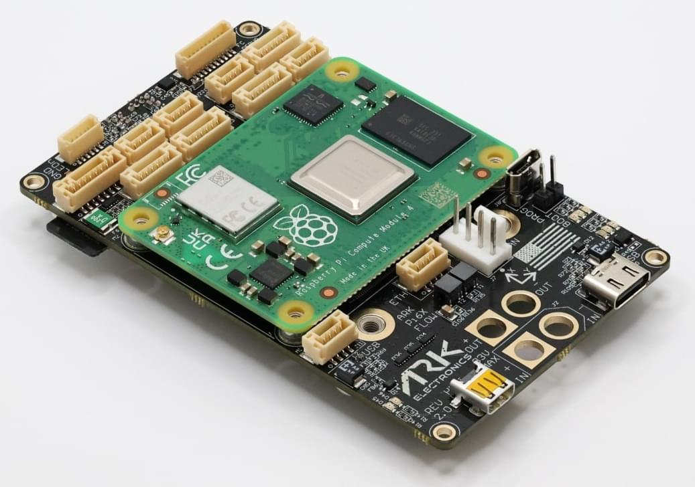
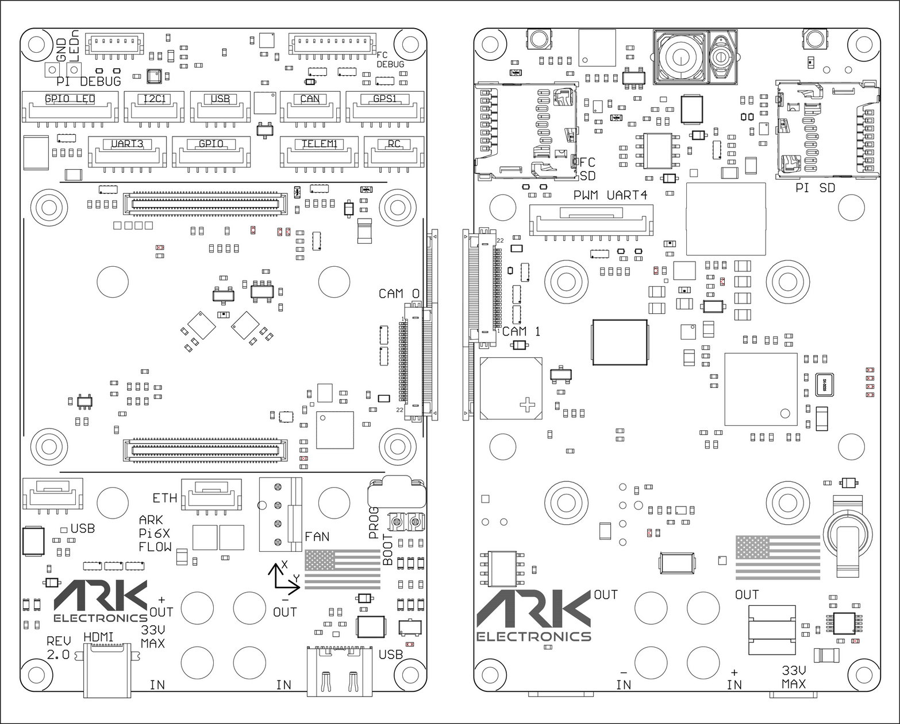

# ARK Pi6X Flow

The [ARK Pi6X Flow](https://arkelectron.gitbook.io/ark-documentation/flight-controllers/ark-pi6x-flow) integrates a Raspberry Pi Compute Module 4 (CM4) Carrier, [ARKV6X Flight Controller](../flight_controller/ark_v6x.md), [ARK Flow sensors](../dronecan/ark_flow.md) , [ARK PAB Power Module](../power_module/ark_pab_power_module.md), and a 4-in-1 ESC, all mounted onto one compact board.

## 구매처

Order this module from:

- [ARK Electronics](https://arkelectron.com/product/ark-pi6x-flow/) (US)

## Key Components

### Raspberry Pi Compute Module 4 Carrier

- Autopilot Firmware: PX4
- Features:
  - MicroSD slot (for CM4 Lite)
  - Micro HDMI
  - Ethernet
  - USB C Host
  - 2x USB JST GH
  - 2x MIPI CSI (22-pin FFC)
  - Programming micro USB
  - I2C, UART
  - LED Strip GPIO
  - General Purpose GPIO
  - Console
  - CPU Fan

### 오토파일럿

- Communication:
  - TELEM (UART)
  - RC Input (UART)
  - GPS (UART, I2C)
  - CAN
- Control and Monitoring:
  - 8 PWM Outputs
  - 부저
  - Debug (SWD, UART Console)
  - MicroSD slot for data storage

### 센서

- 2x ICM-42688-P Accelerometer/Gyroscope (includes Heater)
- PAW3902 Optical Flow Sensor
- AFBR-S50LV85D 30-Meter Distance Sensor
- ST IIS2MDC Magnetometer
- BMP390 Barometer
- INA226 Voltage/Current Monitor

### USA-Built and NDAA Compliant

## Power Requirements

- Battery Input: Up to 6s/25.2V (actual requirement depends on usage and peripherals)

## Dimensions & Weight

- Dimensions: 91.5mm x 56mm (without Pi CM4 and ESC)
- Weight:
  - 41g (without Pi CM4, Pi SD, and ESC)
  - 53g (bundle with Pi CM4 and Pi SD, without ESC)

## 추가 정보

- Included: Flight Controller MicroSD
- Bundle Option Includes:
  - Raspberry Pi Compute Module 4 with WiFi, 4GB RAM Lite – CM4104000
  - SanDisk 128GB High Endurance Video MicroSDXC with [ARK-OS](https://github.com/ARK-Electronics/ARK-OS) Pre-Installed

## Flashing Guide

[ARK Pi6X Flashing Guide](https://arkelectron.gitbook.io/ark-documentation/flight-controllers/ark-pi6x-flow/flashing-guide)

## 핀배열

### PWM UART4 - 11 Pin JST-GH

| Pin Number | Signal Name                                            | 전압                   |
| :--------- | :----------------------------------------------------- | :------------------- |
| 1          | FMU_CH1_EXT  | 3.3V |
| 2          | FMU_CH2_EXT  | 3.3V |
| 3          | FMU_CH3_EXT  | 3.3V |
| 4          | FMU_CH4_EXT  | 3.3V |
| 5          | FMU_CH5_EXT  | 3.3V |
| 6          | FMU_CH6_EXT  | 3.3V |
| 7          | FMU_CH7_EXT  | 3.3V |
| 8          | FMU_CH8_EXT  | 3.3V |
| 9          | UART4_TX_EXT | 3.3V |
| 10         | UART4_RX_EXT | 3.3V |
| 11         | GND                                                    | GND                  |

### RC - 4 Pin JST-GH

| Pin Number | Signal Name                                                                         | 전압                   |
| :--------- | :---------------------------------------------------------------------------------- | :------------------- |
| 1          | VDD_5V_SBUS_RC       | 5.0V |
| 2          | USART6_RX_IN_EXT     | 3.3V |
| 3          | USART6_TX_OUTPUT_EXT | 3.3V |
| 4          | GND                                                                                 | GND                  |

### CAN - 4 Pin JST-GH

| Pin Number | Signal Name                                              | 전압                   |
| :--------- | :------------------------------------------------------- | :------------------- |
| 1          | VDD_5V_HIPOWER | 5.0V |
| 2          | CAN1_P                              | 5.0V |
| 3          | CAN1_N                              | 5.0V |
| 4          | GND                                                      | GND                  |

### GPS - 6 Pin JST-GH

| Pin Number | Signal Name                                                                       | 전압                   |
| :--------- | :-------------------------------------------------------------------------------- | :------------------- |
| 1          | VDD_5V_HIPOWER                          | 5.0V |
| 2          | USART1_TX_GPS1_EXT | 3.3V |
| 3          | USART1_RX_GPS1_EXT | 3.3V |
| 4          | I2C1_SCL_GPS1_EXT  | 3.3V |
| 5          | I2C1_SDA_GPS1_EXT  | 3.3V |
| 6          | GND                                                                               | GND                  |

### Telem1 - 6 Pin JST-GH

| Pin Number | Signal Name                                                                         | 전압                   |
| :--------- | :---------------------------------------------------------------------------------- | :------------------- |
| 1          | VDD_5V_HIPOWER                            | 5.0V |
| 2          | UART7_TX_TELEM1_EXT  | 3.3V |
| 3          | UART7_RX_TELEM1_EXT  | 3.3V |
| 4          | UART7_CTS_TELEM1_EXT | 3.3V |
| 5          | UART7_RTS_TELEM1_EXT | 3.3V |
| 6          | GND                                                                                 | GND                  |

### Flight Controller Debug - 10 Pin JST-SH

| Pin Number | Signal Name                                                  | 전압                   |
| :--------- | :----------------------------------------------------------- | :------------------- |
| 1          | 3V3_FMU                                 | 3.3V |
| 2          | USART4_TX_DEBUG    | 3.3V |
| 3          | USART4_RX_DEBUG    | 3.3V |
| 4          | FMU_SWDIO                               | 3.3V |
| 5          | FMU_SWCLK                               | 3.3V |
| 6          | SPI6_SCK_EXTERNAL1 | 3.3V |
| 7          | NFC_GPIO                                | 3.3V |
| 8          | PD15                                                         | 3.3V |
| 9          | FMU_NRST                                | 3.3V |
| 10         | GND                                                          | GND                  |

### Pi I2C1 - 4 Pin JST-GH

| Pin Number | Signal Name                                            | 전압                   |
| :--------- | :----------------------------------------------------- | :------------------- |
| 1          | 5.0V                                   | 5.0V |
| 2          | I2C1_SCL_EXT | 3.3V |
| 3          | I2C1_SDA_EXT | 3.3V |
| 4          | GND                                                    | GND                  |

### Pi UART3 - 6 Pin JST-GH

| Pin Number | Signal Name                                             | 전압                   |
| :--------- | :------------------------------------------------------ | :------------------- |
| 1          | 5.0V                                    | 5.0V |
| 2          | UART3_TX_EXT  | 3.3V |
| 3          | UART3_RX_EXT  | 3.3V |
| 4          | UART3_CTS_EXT | 3.3V |
| 5          | UART3_RTS_EXT | 3.3V |
| 6          | GND                                                     | GND                  |

### Pi ETH - 4 Pin JST-GH

| Pin Number | Signal Name                                        | 전압                   |
| :--------- | :------------------------------------------------- | :------------------- |
| 1          | ETH_RD_N | 3.3V |
| 2          | ETH_RD_P | 3.3V |
| 3          | ETH_TD_N | 3.3V |
| 4          | ETH_TD_P | 3.3V |

### Pi LED Strip - 8 Pin JST-GH

| Pin Number | Signal Name                     | 전압                   |
| :--------- | :------------------------------ | :------------------- |
| 1          | 5.0V            | 5.0V |
| 2          | 5.0V            | 5.0V |
| 3          | GPIO12_EXT | 3.3V |
| 4          | GPIO16_EXT | 3.3V |
| 5          | GPIO17_EXT | 3.3V |
| 6          | GPIO20_EXT | 3.3V |
| 7          | GND                             | GND                  |
| 8          | GND                             | GND                  |

### Pi GPIO - 6 Pin JST-GH

| Pin Number | Signal Name                     | 전압                   |
| :--------- | :------------------------------ | :------------------- |
| 1          | 5.0V            | 5.0V |
| 2          | GPIO21_EXT | 3.3V |
| 3          | GPIO22_EXT | 3.3V |
| 4          | GPIO23_EXT | 3.3V |
| 5          | GPIO24_EXT | 3.3V |
| 6          | GND                             | GND                  |

### Pi Fan - 4 Pin JST-GH

| Pin Number | Signal Name                                            | 전압                   |
| :--------- | :----------------------------------------------------- | :------------------- |
| 1          | GND                                                    | GND                  |
| 2          | 5.0V                                   | 5.0V |
| 3          | FAN_TACH_CON | 5.0V |
| 4          | FAN_PWM_Q\*  | 5.0V |

### Pi Console - 6 Pin JST-SH

| Pin Number | Signal Name                                   | 전압                   |
| :--------- | :-------------------------------------------- | :------------------- |
| 1          | 3.3V_RPI | 3.3V |
| 2          | CONSOLE_TXD0             | 3.3V |
| 3          | CONSOLE_RXD0             | 3.3V |
| 4          | NC                                            | NC                   |
| 5          | NC                                            | NC                   |
| 6          | GND                                           | GND                  |

### Pi USB - 4 Pin JST-GH (VBUS2_FLT)

| Pin Number | Signal Name                                          | 전압                   |
| :--------- | :--------------------------------------------------- | :------------------- |
| 1          | VBUS2_FLT                       | 5.0V |
| 2          | USB2_EXT_N | 3.3V |
| 3          | USB2_EXT_P | 3.3V |
| 4          | GND                                                  | GND                  |

### Pi USB - 4 Pin JST-GH (VBUS4_FLT)

| Pin Number | Signal Name                                          | 전압                   |
| :--------- | :--------------------------------------------------- | :------------------- |
| 1          | VBUS4_FLT                       | 5.0V |
| 2          | USB4_EXT_N | 3.3V |
| 3          | USB4_EXT_P | 3.3V |
| 4          | GND                                                  | GND                  |

### CAM0 - 22 Pin

0.5mm FFC 0545482271

| Pin Number | Signal Name                                         | 전압                   |
| :--------- | :-------------------------------------------------- | :------------------- |
| 1          | GND                                                 | GND                  |
| 2          | CAM0_D0_N | 1.2V |
| 3          | CAM0_D0_P | 1.2V |
| 4          | GND                                                 | GND                  |
| 5          | CAM0_D1_N | 1.2V |
| 6          | CAM0_D1_P | 1.2V |
| 7          | GND                                                 | GND                  |
| 8          | CAM0_C_N  | 1.2V |
| 9          | CAM0_C_P  | 1.2V |
| 10         | GND                                                 | GND                  |
| 11         | NC                                                  | NC                   |
| 12         | NC                                                  | NC                   |
| 13         | GND                                                 | GND                  |
| 14         | NC                                                  | NC                   |
| 15         | NC                                                  | NC                   |
| 16         | GND                                                 | GND                  |
| 17         | CAM_GPIO                       | 3.3V |
| 18         | NC                                                  | NC                   |
| 19         | GND                                                 | GND                  |
| 20         | ID_SC                          | 3.3V |
| 21         | ID_SD                          | 3.3V |
| 22         | 3.3V_RPI       | 3.3V |

### CAM1 - 22 Pin 0.5mm FFC 0545482271

| Pin Number | Signal Name                                         | 전압                   |
| :--------- | :-------------------------------------------------- | :------------------- |
| 1          | GND                                                 | GND                  |
| 2          | CAM1_D0_N | 1.2V |
| 3          | CAM1_D0_P | 1.2V |
| 4          | GND                                                 | GND                  |
| 5          | CAM1_D1_N | 1.2V |
| 6          | CAM1_D1_P | 1.2V |
| 7          | GND                                                 | GND                  |
| 8          | CAM1_C_N  | 1.2V |
| 9          | CAM1_C_P  | 1.2V |
| 10         | GND                                                 | GND                  |
| 11         | CAM1_D2_N | 1.2V |
| 12         | CAM1_D2_P | 1.2V |
| 13         | GND                                                 | GND                  |
| 14         | CAM1_D3_N | 1.2V |
| 15         | CAM1_D3_P | 1.2V |
| 16         | GND                                                 | GND                  |
| 17         | CAM_GPIO                       | 3.3V |
| 18         | NC                                                  | NC                   |
| 19         | GND                                                 | GND                  |
| 20         | SCL0                                                | 3.3V |
| 21         | SDA0                                                | 3.3V |
| 22         | 3.3V_RPI       | 3.3V |

## See Also

- [ARK Pi6X Flow Documentation](https://arkelectron.gitbook.io/ark-documentation/flight-controllers/ark-pi6x-flow) (ARK Docs)
