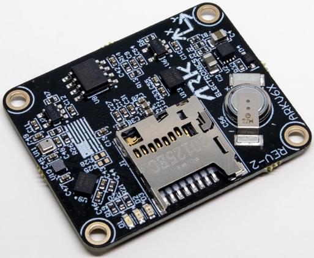

# ARK Electronics ARKV6X

:::warning
PX4 does not manufacture this (or any) autopilot.
Contact the [manufacturer](https://arkelectron.com/contact-us/) for hardware support or compliance issues.
:::

The USA-built [ARKV6X](\(https://arkelectron.gitbook.io/ark-documentation/flight-controllers/arkv6x\)) flight controller is based on the [FMUV6X and Pixhawk Autopilot Bus open source standards](https://github.com/pixhawk/Pixhawk-Standards).

With triple synced IMUs, data averaging, voting, and filtering is possible.
The Pixhawk Autopilot Bus (PAB) form factor enables the ARKV6X to be used on any [PAB-compatible carrier board](../flight_controller/pixhawk_autopilot_bus.md), such as the [ARK Pixhawk Autopilot Bus Carrier](../flight_controller/ark_pab.md).



:::info
This flight controller is [manufacturer supported](../flight_controller/autopilot_manufacturer_supported.md).
:::

## Where To Buy

Order From [Ark Electronics](https://arkelectron.com/product/arkv6x/) (US)

## 센서

- [Dual Invensense ICM-42688-P IMUs](https://invensense.tdk.com/products/motion-tracking/6-axis/icm-42688-p/)
- [Invensense IIM-42652 Industrial IMU](https://invensense.tdk.com/products/smartindustrial/iim-42652/)
- [Bosch BMP390 Barometer](https://www.bosch-sensortec.com/products/environmental-sensors/pressure-sensors/bmp390/)
- [Bosch BMM150 Magnetometer](https://www.bosch-sensortec.com/products/motion-sensors/magnetometers/bmm150/)

## Microprocessor

- [STM32H743IIK6 MCU](https://www.st.com/en/microcontrollers-microprocessors/stm32h743ii.html)
  - 480MHz
  - 2MB 플래시
  - 1MB Flash

## Other Features

- FRAM
- [Pixhawk Autopilot Bus (PAB) Form Factor](https://github.com/pixhawk/Pixhawk-Standards/blob/master/DS-010%20Pixhawk%20Autopilot%20Bus%20Standard.pdf)
- LED Indicators
- MicroSD Slot
- USA Built
- Designed with a 1W heater. Keeps sensors warm in extreme conditions

## Power Requirements

- 5V
- 500mA
  - 300ma for main system
  - 200ma for heater

## 추가 정보

- Weight: 5.0 g
- Dimensions: 3.6 x 2.9 x 0.5 cm

## 핀배열

For pinout of the ARKV6X see the [DS-10 Pixhawk Autopilot Bus Standard](https://github.com/pixhawk/Pixhawk-Standards/blob/master/DS-010%20Pixhawk%20Autopilot%20Bus%20Standard.pdf)

## 시리얼 포트 매핑

| UART   | 장치         | 포트                              |
| ------ | ---------- | ------------------------------- |
| USART1 | /dev/ttyS0 | GPS                             |
| USART2 | /dev/ttyS1 | TELEM3                          |
| USART3 | /dev/ttyS2 | 디버그 콘솔                          |
| UART4  | /dev/ttyS3 | UART4 & I2C |
| UART5  | /dev/ttyS4 | TELEM2                          |
| USART6 | /dev/ttyS5 | PX4IO/RC                        |
| UART7  | /dev/ttyS6 | TELEM1                          |
| UART8  | /dev/ttyS7 | GPS2                            |

## 펌웨어 빌드

```sh
make ark_fmu-v6x_default
```

## See Also

- [ARK Electronics ARKV6X](https://arkelectron.gitbook.io/ark-documentation/flight-controllers/arkv6x) (ARK Docs)
