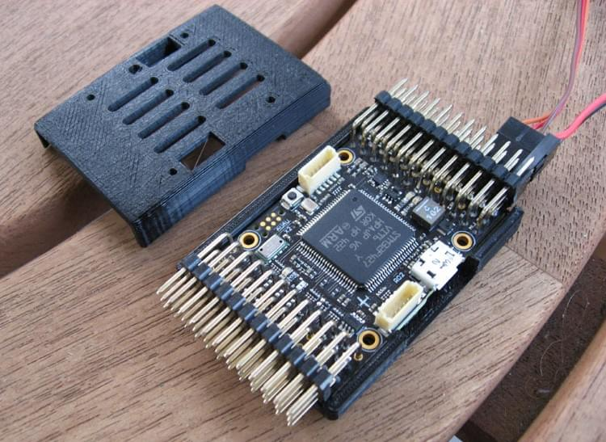
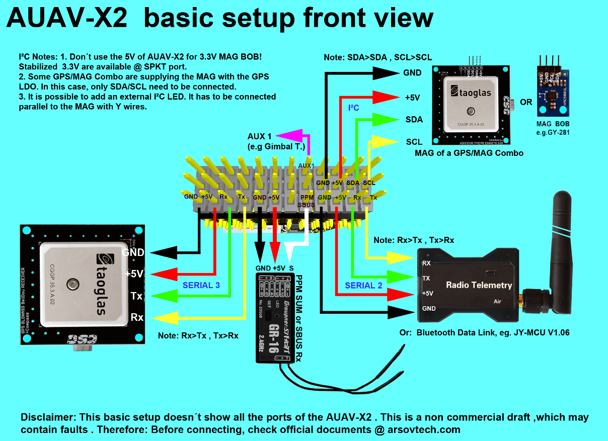
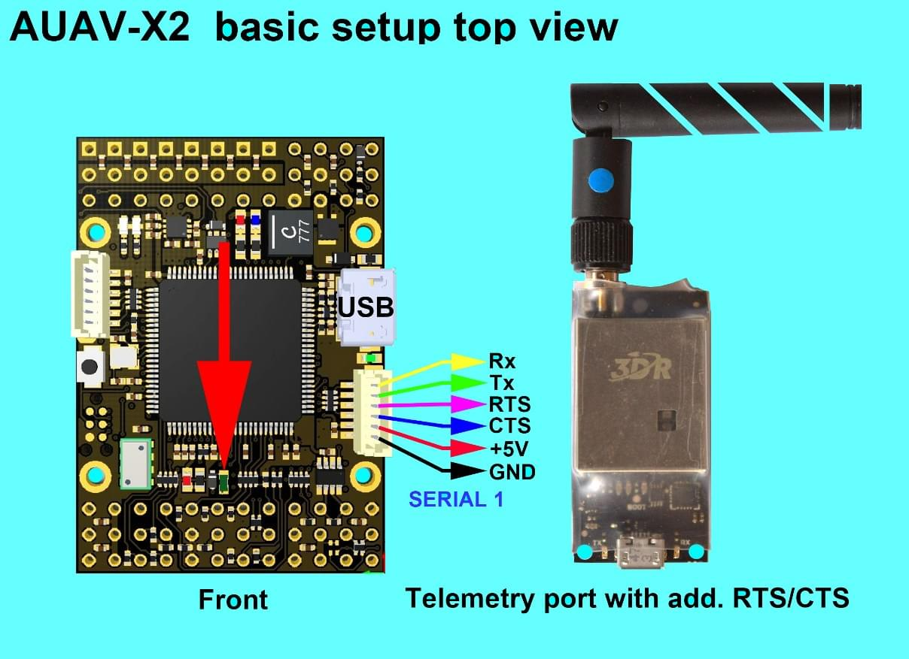
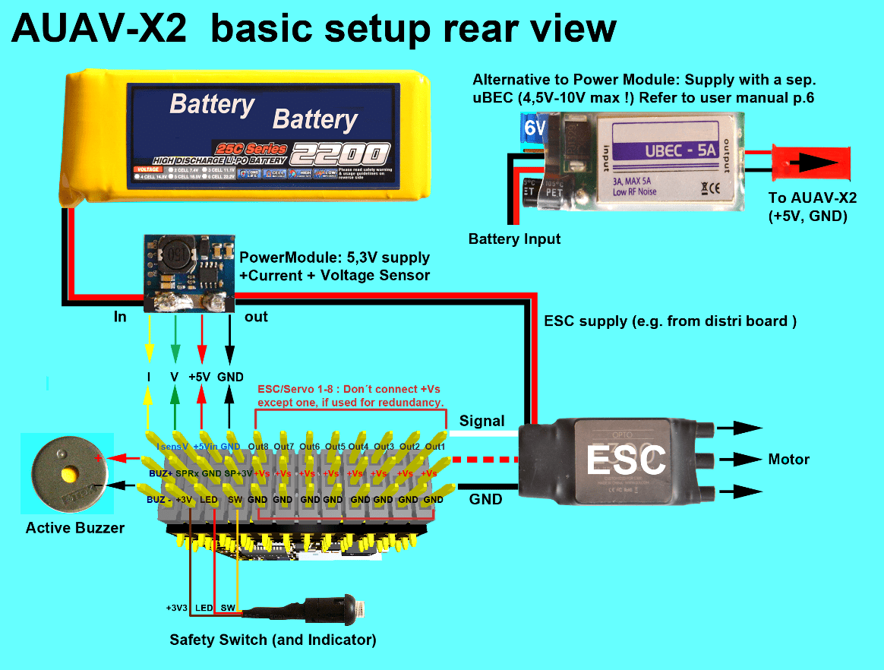
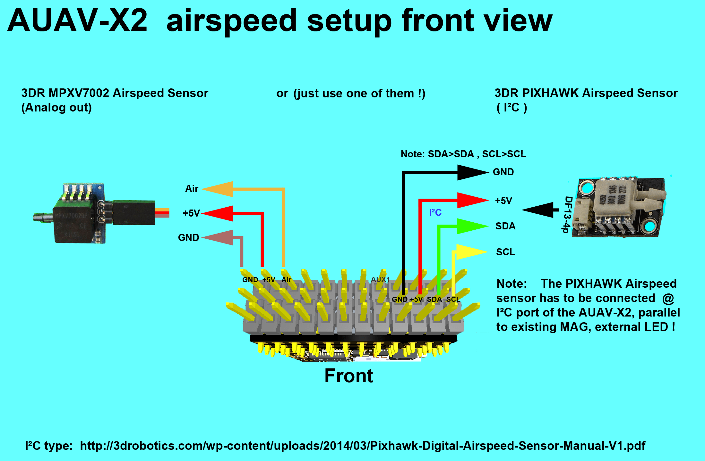

# AUAV-X2 자동조종장치 (단종됨)

<Badge type="info" text="Discontinued" />

:::warning
This flight controller has been [discontinued](../flight_controller/autopilot_experimental.md) and is no longer commercially available.
:::

:::warning
PX4 does not manufacture this (or any) autopilot.
Contact the [manufacturer](https://store.mrobotics.io/) for hardware support or compliance issues.
:::

The [AUAV&reg;](http://www.auav.com/) _AUAV-X2 autopilot_ is based on the [Pixhawk&reg;-project](https://pixhawk.org/) **FMUv2** open hardware design. It runs PX4 on the [NuttX](https://nuttx.apache.org/) OS.

## 요약

- Main System-on-Chip: [STM32F427](http://www.st.com/web/en/catalog/mmc/FM141/SC1169/SS1577/LN1789)
  - CPU : STM32F427VIT6 ARM 마이크로 컨트롤러 - 개정판 3
  - IO: STM32F100C8T6 ARM 마이크로 컨트롤러
- 센서:
  - 인벤센스 MPU9250 9DOF
  - 인벤센스 ICM-20608 6DOF
  - MEAS MS5611 기압계
- 크기/중량
  - 크기: 36mm x 50mm
  - 장착 위치: 직경 30.5mm x 30.5mm 3.2mm
  - 중량: 10.9g
- 역전압 보호 기능의 전원 OR-ing 회로도. 5V 전원 모듈이 필요합니다.

## 연결성

- 2.54mm 헤더 :
- GPS (USART4)
- i2c
- RC 입력
- PPM 입력
- Spektrum 입력
- RSSI 입력
- sBus 입력
- sBus 출력
- 전원 입력
- 부저 출력
- LED 출력
- Servo 출력 8개
- Aux 출력 6개
- USART7 (콘솔)
- USART8 (OSD)

## 구매처

No longer in production.
This has been superseded by the [mRo X2.1](mro_x2.1.md).
mRobotics is the distributor for the AUAV Products from August 2017.

## 주요 링크

- [User Manual](http://arsovtech.com/wp-content/uploads/2015/08/AUAV-X2-user-manual-EN.pdf)
- [DIY Drones Post](http://diydrones.com/profiles/blogs/introducing-the-auav-x2-1-flight-controller)

## 배선 가이드

## 회로도

The board is based on the [Pixhawk project](https://pixhawk.org/) **FMUv2** open hardware design.

- [FMUv2 + IOv2 schematic](https://raw.githubusercontent.com/PX4/Hardware/master/FMUv2/PX4FMUv2.4.5.pdf) -- Schematic and layout

:::info
As a CC-BY-SA 3.0 licensed Open Hardware design, all schematics and design files are [available](https://github.com/PX4/Hardware).
:::

## 시리얼 포트 매핑

| UART   | 장치         | 포트                                |
| ------ | ---------- | --------------------------------- |
| UART1  | /dev/ttyS0 | IO 디버그                            |
| USART2 | /dev/ttyS1 | TELEM1 (흐름 제어) |
| USART3 | /dev/ttyS2 | TELEM2 (흐름 제어) |
| UART4  |            |                                   |
| UART7  | 콘솔         |                                   |
| UART8  | SERIAL4    |                                   |
