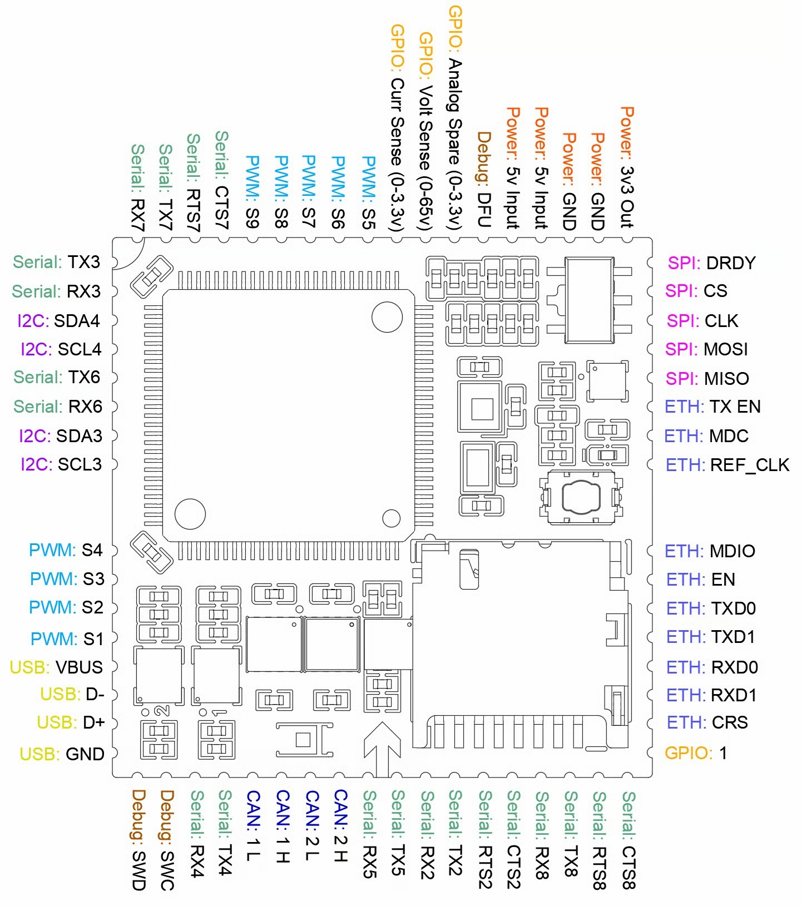

# CBUnmanned H753-SOM

<Badge type="tip" text="PX4 v1.18" />

:::warning
PX4 does not manufacture this (or any) autopilot. Contact the manufacturer for hardware support or compliance issues.
:::

The _CBUnmanned H753-SOM_ is a System-on-Module (SoM) flight controller built around the STM32H753 microcontroller.
It is intended to be mounted on a carrier board that breaks out the I/O and provides power, peripherals, and connectors for a specific vehicle integration.



:::info
This flight controller is [manufacturer supported](../flight_controller/autopilot_manufacturer_supported.md).
:::

## 주요 특징

- **MCU:** STM32H753 (32-bit Arm® Cortex®-M7, 480 MHz, 2 MB Flash, 1 MB RAM)
- **IMU:** Dual InvenSense ICM-42670-P (on SPI4)
- **Barometer:** ST LPS22HB (on I2C1)
- **Storage:** microSD card (SDMMC2)
- **Interfaces:**
  - 6x user UARTs (TEL1, TEL2, TEL3, GPS1, GPS2, RC) plus a debug console — flow control on TEL1/TEL2/TEL3
  - 2x CAN (UAVCAN)
  - 2x external I2C (one per GPS port for compass) and 1x internal I2C (barometer)
  - 1x external SPI (the dual IMUs are on a separate internal SPI bus)
  - 9x PWM outputs (DShot / Bi-Directional DShot supported)
  - USB
  - Ethernet optional
- **Power:** Powered from an external regulated 5 V supply (e.g. a BEC on the carrier board). Battery voltage (up to 65 V) and current are monitored via ADC; the voltage sense input is a separate pin behind a voltage divider and does not power the board.

:::info
CAN transceivers require a 5 V supply. USB-only power (≈4.5 V after the input diode) is **not** sufficient to operate the CAN bus.
:::

## 구매처

Check [CBUnmanned](https://www.cbunmanned.com/) for availability.

## 펌웨어 빌드

:::tip
Most users will not need to build this firmware.
It is pre-built and automatically installed by _QGroundControl_ when appropriate hardware is connected.
:::

To [build PX4](../dev_setup/building_px4.md) for this target from source:

```sh
make cbunmanned_h753-som_default
```

## 시리얼 포트 매핑

| UART   | 장치         | PX4 Default | Pins (TX / RX) | Flow Control (CTS / RTS) |
| ------ | ---------- | ----------- | --------------------------------- | ------------------------------------------- |
| USART2 | /dev/ttyS0 | TEL1        | PD5 / PA3                         | PA0 / PD4                                   |
| USART3 | /dev/ttyS1 | GPS1        | PD8 / PD9                         | —                                           |
| UART4  | /dev/ttyS2 | GPS2        | PC10 / PC11                       | —                                           |
| UART5  | /dev/ttyS3 | Console     | PC12 / PD2                        | —                                           |
| USART6 | /dev/ttyS4 | RC          | PC6 / PC7                         | —                                           |
| UART7  | /dev/ttyS5 | TEL2        | PE8 / PE7                         | PE10 / PE9                                  |
| UART8  | /dev/ttyS6 | TEL3        | PE1 / PE0                         | PD14 / PD15                                 |

## PWM 출력

The board provides 9 PWM outputs, all of which support [DShot](../peripherals/dshot.md) and [Bidirectional DShot](../peripherals/dshot.md#bidirectional-dshot-telemetry).

The outputs are split across 4 timer groups:

| 출력      | Timer  |
| ------- | ------ |
| 1, 2, 3 | Timer1 |
| 4, 5    | Timer2 |
| 6, 7, 8 | Timer3 |
| 9       | Timer4 |

All outputs within the same group must use the same protocol and update rate.

## 디버그 포트

The system console runs on UART5 (PC12 / PD2). USB CDC ACM is auto-started and provides MAVLink access.

<a id="bootloader"></a>

## 부트로더 업데이트

Boards that ship without the PX4 bootloader must have it flashed before PX4 firmware can be installed.
Download the [cbunmanned_h753-som_bootloader.bin](https://github.com/PX4/PX4-Autopilot/blob/main/boards/cbunmanned/h753-som/extras/cbunmanned_h753-som_bootloader.bin) bootloader binary and follow the [DFU Bootloader Update](../advanced_config/bootloader_update_from_betaflight.md#dfu-bootloader-update) instructions.

Once the PX4 bootloader is flashed, firmware can be installed normally via _QGroundControl_.
