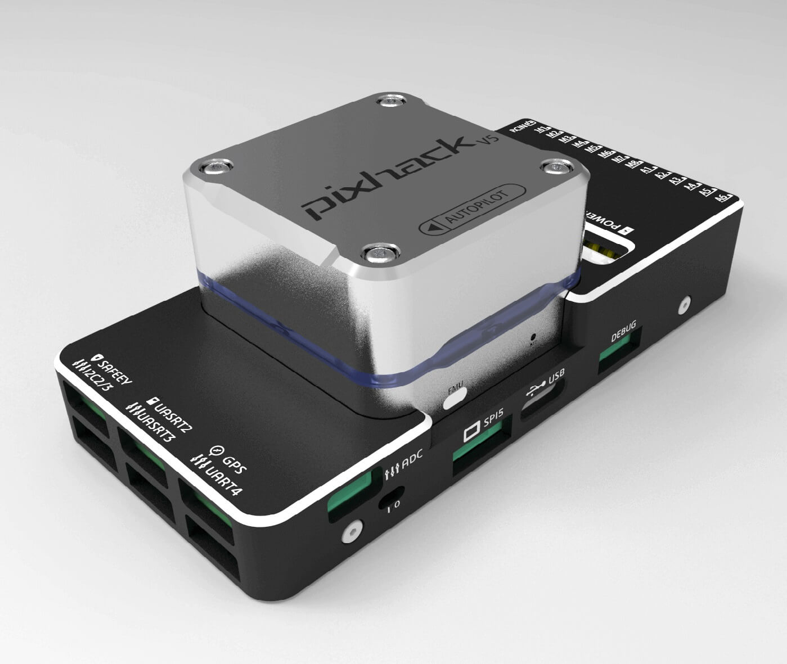

# CUAV v5 (단종)

<Badge type="info" text="Discontinued" />

:::warning
This flight controller has been [discontinued](../flight_controller/autopilot_experimental.md) and is no longer commercially available.
:::

:::warning
PX4 does not manufacture this (or any) autopilot.
Contact the [manufacturer](https://store.cuav.net/) for hardware support or compliance issues.
:::

_CUAV v5_<sup>&reg;</sup> (previously "Pixhack v5") is an advanced autopilot designed and made by CUAV<sup>&reg;</sup>.
The board is based on the [Pixhawk-project](https://pixhawk.org/) **FMUv5** open hardware design.
It runs PX4 on the [NuttX](https://nuttx.apache.org/) OS, and is fully compatible with PX4 firmware.
It is intended primarily for academic and commercial developers.



## 요약

- 메인 FMU 프로세서: STM32F765
  - 32 비트 Arm® Cortex®-M7, 216MHz, 2MB 메모리, 512KB RAM

- IO 프로세서: STM32F100
  - 32 비트 Arm® Cortex®-M3, 24MHz, 8KB SRAM

- 내장 센서 :

  - 가속도계/자이로스코프 : ICM-20689
  - 가속도계/자이로스코프 : BMI055
  - 자력계 : IST8310
  - 기압계: MS5611

- 인터페이스:
  - PWM 출력 8-14개(IO 6개, FMU 8개)
  - FMU의 전용 PWM/캡처 입력 3 개
  - CPPM 전용 RC 입력
  - PPM 및 S.Bus 전용 RC 입력
  - 아날로그/PWM RSSI 입력
  - PWM Servo 출력
  - 범용 시리얼 포트 5개
  - I2C 포트 4개
  - SPI 버스 4개
  - 2 CANBuses with serial ESC
  - 배터리 2 개의 전압 및 전류에 대한 아날로그 입력

- 전원시스템
  - 전원: 4.3~5.4V
  - USB 입력: 4.75~5.25V
  - 서보 레일 입력: 0~36V

- 중량과 크기
  - 중량: 90g
  - 크기: 44x84x12mm

- 기타 특성:
  - 작동 온도: -20 ~ 80°c (측정치)

## 구매처

Order from [CUAV](https://cuav.taobao.com/index.htm?spm=2013.1.w5002-16371268426.2.411f26d9E18eAz).

## 연결


:::warning
The RCIN interface is limited to powering the rc receiver and cannot be connected to any power/load.
:::

## 정격 전압

_CUAV v5_ can be triple-redundant on the power supply if three power sources are supplied. The three power rails are: **POWER1**, **POWER2** and **USB**.

:::info
The output power rails **FMU PWM OUT** and **I/O PWM OUT** (0V to 36V) do not power the flight controller board (and are not powered by it).
You must supply power to one of **POWER1**, **POWER2** or **USB** or the board will be unpowered.
:::

**Normal Operation Maximum Ratings**

이러한 조건에서 전원은 아래의 순서대로 시스템에 전원을 공급하여야합니다.

1. **POWER1** and **POWER2** inputs (4.3V to 5.4V)
2. **USB** input (4.75V to 5.25V)

## 펌웨어 빌드

:::tip
Most users will not need to build this firmware!
It is pre-built and automatically installed by _QGroundControl_ when appropriate hardware is connected.
:::

To [build PX4](../dev_setup/building_px4.md) for this target:

```
make px4_fmu-v5_default
```

## 디버그 포트

The [PX4 System Console](../debug/system_console.md) and [SWD interface](../debug/swd_debug.md) operate on the **FMU Debug** port.
Simply connect the FTDI cable to the Debug & F7 SWD connector.
To access the I/O Debug port, the user must remove the CUAV v5 shell.
Both ports have standard serial pins and can be connected to a standard FTDI cable (3.3V, but 5V tolerant).

The pinout is as shown.


| 핀 | CUAV v5 디버그                   |
| - | ----------------------------- |
| 1 | GND                           |
| 2 | FMU-SWCLK                     |
| 3 | FMU-SWDIO                     |
| 4 | UART7_RX |
| 5 | UART7_TX |
| 6 | VCC                           |

## 시리얼 포트 매핑

| UART   | 장치         | 포트                                                              |
| ------ | ---------- | --------------------------------------------------------------- |
| UART1  | /dev/ttyS0 | GPS                                                             |
| USART2 | /dev/ttyS1 | TELEM1 (흐름 제어)                               |
| USART3 | /dev/ttyS2 | TELEM2 (흐름 제어)                               |
| UART4  | /dev/ttyS3 | TELEM4                                                          |
| USART6 | /dev/ttyS4 | TX는 SBUS_RC 커넥터의 RC 입력입니다. |
| UART7  | /dev/ttyS5 | 디버그 콘솔                                                          |
| UART8  | /dev/ttyS6 | PX4IO                                                           |

<!-- Note: Got ports using https://github.com/PX4/PX4-user_guide/pull/672#issuecomment-598198434 -->

## 주변 장치

- [Digital Airspeed Sensor](https://item.taobao.com/item.htm?spm=a1z10.3-c-s.w4002-16371268452.37.6d9f48afsFgGZI&id=9512463037)
- [Telemetry Radio Modules](https://cuav.taobao.com/category-158480951.htm?spm=2013.1.w5002-16371268426.4.410b7a821qYbBq&search=y&catName=%CA%FD%B4%AB%B5%E7%CC%A8)
- [Rangefinders/Distance sensors](../sensor/rangefinders.md)

## 지원 플랫폼 및 기체

일반 RC 서보 또는 Futaba S-Bus 서보로 제어 가능한 모든 멀티콥터/비행기/로버 또는 보트.
The complete set of supported configurations can be seen in the [Airframes Reference](../airframes/airframe_reference.md).

## 추가 정보

- [FMUv5 reference design pinout](https://docs.google.com/spreadsheets/d/1-n0__BYDedQrc_2NHqBenG1DNepAgnHpSGglke-QQwY/edit#gid=912976165).
- [CUAV v5 docs](http://doc.cuav.net/flight-controller/v5-autopilot/en/v5.html)
- [CUAV Github](https://github.com/cuav)
