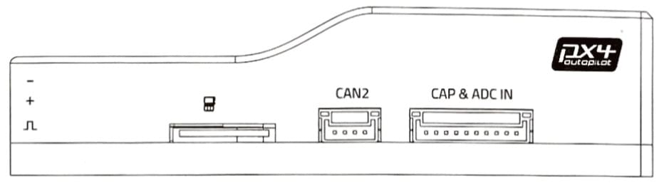
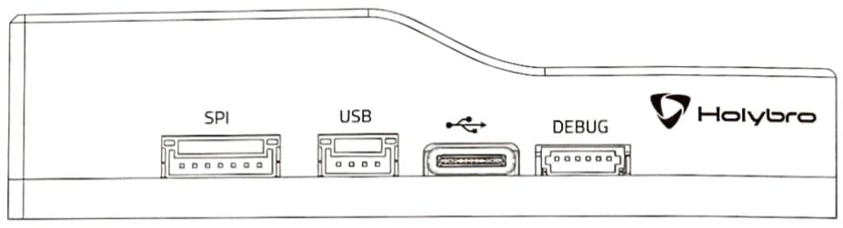
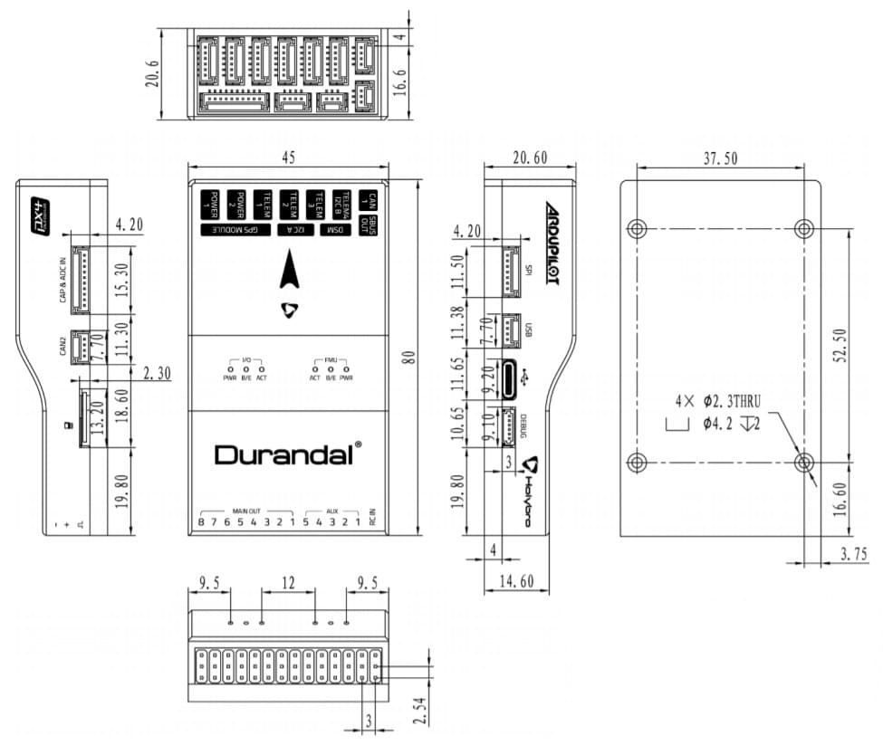

# Holybro Durandal

:::warning
PX4 does not manufacture this (or any) autopilot.
Contact the [manufacturer](https://holybro.com/) for hardware support or compliance issues.
:::

_Durandal_<sup>&reg;</sup> is the latest update to the successful family of Holybro flight controllers.
Holybro가 설계하고 개발하였습니다.


주요 기능은 다음과 같습니다.

- 센서 통합 온도 제어.
- 480MHz에서 실행되는 강력한 STM32H7 마이크로 컨트롤러.
  2MB의 플래시 메모리 및 1MB의 RAM.
- 온도 안정성이 높은 신규 센서.
- 내부 진동 차단 시스템.
- 듀얼 고성능, 저잡음 IMU 온보드는 까다로운 안정화 애플리케이션을 위해 설계되었습니다.

A summary of the key features, [assembly](../assembly/quick_start_durandal.md), and [purchase](#purchase) links can be found below.

:::info
This flight controller is [manufacturer supported](../flight_controller/autopilot_manufacturer_supported.md).
:::

## 요약

#### 기술 사양

- 메인 FMU 프로세서: STM32H743
  - 32 비트 Arm® Cortex® -M7, 480MHz, 2MB 메모리, 1MB RAM
- IO 프로세서: STM32F100
  - 32 비트 Arm® Cortex®-M3, 24MHz, 8KB SRAM
- 내장 센서 :
  - 가속도/자이로: ICM-20689
  - Accel/Gyro: BMI088 or ICM20602
  - 자력계: IST8310
  - 기압계: MS5611
- GPS: u-blox Neo-M8N GPS/GLONASS 수신기; 통합 자력계 IST8310

#### 인터페이스

- PWM 출력 8-13개(IO에서 8개, FMU에서 5개)
- FMU의 전용 PWM/캡처 입력 6 개
- Spektrum/DSM 전용 R/C 입력
- CPPM 및 S.Bus 전용 RC 입력
- 전용 S.Bus 서보 출력 및 아날로그/PWM RSSI 입력
- 범용 시리얼 포트 5개
  - 전체 흐름 제어 3개
  - 1.5A 전류 제한이 있는 1 개
- I2C 포트 3개
- SPI 버스 4개
  - 4 개의 칩 선택 및 6 개의 DRDY가 있는 내부 고속 SPI 센서 버스 1 개
  - XXX 전용 내부 저잡음 SPI 버스 1 개
  - 2 개의 칩 선택이 있는 기압계, DRDY 없음
  - FRAM 전용 내부 SPI 버스 1 개
  - 센서 모듈에 위치한 온도 제어 지원
  - 외부 SPI 버스 1개
- 듀얼 CAN을 위한 최대 2 개의 CAN 버스
  - 각 CANBus에는 개별 무음 제어 또는 ESC RX-MUX 제어가 있습니다.
- 배터리 2 개의 전압 및 전류에 대한 아날로그 입력
- 2개의 추가 아날로그 입력

#### 전기 데이터

- 전원 모듈 출력: 4.9~5.5V
- 최대 입력 전압: 6V
- 최대 전류 감지: 120A
- USB 전원 입력: 4.75~5.25V
- 서보 레일 입력: 0~36V

#### 기계식 부품

- 크기: 80x45x20.5mm
- 중량: 68.8g

#### 기타 특성

- 작동 온도 : ~ 40 ~ 85C
- 보관 온도 : -40 ~ 85C
- CE
- FCC
- RoHS 준수(무연)

For more information see: [Durandal Technical Data Sheet](https://cdn.shopify.com/s/files/1/0604/5905/7341/files/Durandal_technical_data_sheet_90f8875d-8035-4632-a936-a0d178062077.pdf).

<a id="purchase"></a>

## 구매처

Order from [Holybro](https://holybro.com/collections/autopilot-flight-controllers/products/durandal).

<a id="connections"></a>

## 연결

The locations of ports/connections are shown here (and below in the [pinouts section](#pinouts)).

### 상단


### 전면


### 후면


### 우측



### 좌측



## 크기

모든 치수는 밀리미터 단위입니다.



<!--
## Voltage Ratings

*Pixhawk 4* can be triple-redundant on the power supply if three power sources are supplied. The three power rails are: **POWER1**, **POWER2** and **USB**.

::: info
The output power rails **FMU PWM OUT** and **I/O PWM OUT** (0V to 36V) do not power the flight controller board (and are not powered by it).
You must supply power to one of **POWER1**, **POWER2** or **USB** or the board will be unpowered.
:::

**Normal Operation Maximum Ratings**

Under these conditions all power sources will be used in this order to power the system:
1. **POWER1** and **POWER2** inputs (4.9V to 5.5V)
1. **USB** input (4.75V to 5.25V)
-->

<!--
**Absolute Maximum Ratings**

Under these conditions the system will not draw any power (will not be operational), but will remain intact.
1. **POWER1** and **POWER2** inputs (operational range 4.1V to 5.7V, 0V to 10V undamaged)
1. **USB** input (operational range 4.1V to 5.7V, 0V to 6V undamaged)
1. Servo input: VDD_SERVO pin of **FMU PWM OUT** and **I/O PWM OUT** (0V to 42V undamaged)

-->

## 조립 및 설정

The [Durandal Wiring Quick Start](../assembly/quick_start_durandal.md) provides instructions on how to assemble required/important peripherals including GPS, Power Management Board etc.

## 펌웨어 빌드

:::tip
Most users will not need to build this firmware!
It is pre-built and automatically installed by _QGroundControl_ when appropriate hardware is connected.
:::

To [build PX4](../dev_setup/building_px4.md) for this target:

```
make holybro_durandal-v1_default
```

## 시리얼 포트 매핑

| UART   | 장치         | 포트          |
| ------ | ---------- | ----------- |
| USART1 | /dev/ttyS0 | GPS1        |
| USART2 | /dev/ttyS1 | TELEM1      |
| USART3 | /dev/ttyS2 | TELEM2      |
| UART4  | /dev/ttyS3 | TELEM4/GPS2 |
| USART6 | /dev/ttyS4 | TELEM3      |
| UART7  | /dev/ttyS5 | 디버그 콘솔      |
| UART8  | /dev/ttyS6 | PX4IO       |

<!-- Note: Got ports using https://github.com/PX4/PX4-user_guide/pull/672#issuecomment-598198434 -->

<a id="debug_port"></a>

## 디버그 포트

The [PX4 System Console](../debug/system_console.md) and [SWD interface](../debug/swd_debug.md) run on the _Debug Port_.

The pinouts and connector comply with the [Pixhawk Debug Mini](../debug/swd_debug.md#pixhawk-debug-mini) interface defined in the [Pixhawk Connector Standard](https://github.com/pixhawk/Pixhawk-Standards/blob/master/DS-009%20Pixhawk%20Connector%20Standard.pdf).

For wiring and debugging information see the above links.

:::info
No Debug port is exposed for the I/O board.
:::

## 주변 장치

- [Digital Airspeed Sensor](https://store-drotek.com/793-digital-differential-airspeed-sensor-kit-.html)
- [Telemetry Radio Modules](../telemetry/index.md)
- [Rangefinders/Distance sensors](../sensor/rangefinders.md)

## 지원 플랫폼 및 기체

일반 RC 서보 또는 Futaba S-Bus 서보로 제어 가능한 모든 멀티콥터/비행기/로버 또는 보트.

The complete set of supported configurations can be seen in the [Airframes Reference](../airframes/airframe_reference.md).

## 핀배열

_Durandal_ pinouts are listed below.
These can also be downloaded from [here](https://holybro.com/collections/autopilot-flight-controllers/products/Durandal-Pinouts).

### 상단 핀배열


### 전면 핀배열


#### SUBS 출력 포트

| 핀                         | 신호                                                         | 전압                    |
| ------------------------- | ---------------------------------------------------------- | --------------------- |
| 1(red) | -                                                          | -                     |
| 2 (황)  | SBUS_OUT/RSSI_IN | +3.3V |
| 3 (흑)  | GND                                                        | GND                   |

#### DSM RC 포트

| 핀                         | 신호                           | 전압                    |
| ------------------------- | ---------------------------- | --------------------- |
| 1(red) | VDD_3V3 | +3.3V |
| 2 (황)  | DSM_IN  | +3.3V |
| 3 (흑)  | GND                          | GND                   |

#### I2C A 포트

| 핀                         | 신호   | 전압                    |
| ------------------------- | ---- | --------------------- |
| 1(red) | VCC  | +5V                   |
| 2 (흑)  | SCL4 | +3.3V |
| 3 (흑)  | SDA4 | +3.3V |
| 4 (흑)  | GND  | GND                   |

#### CAN1 포트

| 핀                         | 신호    | 전압                    |
| ------------------------- | ----- | --------------------- |
| 1(red) | VCC   | +5V                   |
| 2 (흑)  | CAN H | +3.3V |
| 3 (흑)  | CAN L | +3.3V |
| 4 (흑)  | GND   | GND                   |

<a id="gps"></a>

#### GPS 포트

| 핀                         | 신호                                                          | 전압                    |
| ------------------------- | ----------------------------------------------------------- | --------------------- |
| 1(red) | VCC                                                         | +5V                   |
| 2 (흑)  | TX  (출력)                                 | +3.3V |
| 3 (흑)  | RX  (입력)                                 | +3.3V |
| 4 (흑)  | SCL1                                                        | +3.3V |
| 5 (흑)  | SDA1                                                        | +3.3V |
| 6 (흑)  | SAFETY_SWITCH                          | +3.3V |
| 7 (흑)  | SAFETY_SWITCH_LED | +3.3V |
| 8 (흑)  | VDD_3V3                                | +3.3V |
| 9 (흑)  | BUZZER                                                      | +5V                   |
| 10 (흑) | GND                                                         | GND                   |

<a id="telem4_i2cb"></a>

#### TELEM4 I2CB 포트

| 핀                         | 신호                          | 전압                    |
| ------------------------- | --------------------------- | --------------------- |
| 1(red) | VCC                         | +5V                   |
| 2 (흑)  | TX  (출력) | +3.3V |
| 3 (흑)  | RX  (입력) | -                     |
| 4 (흑)  | SCL2                        | -                     |
| 5 (흑)  | SDA2                        | +3.3V |
| 6 (흑)  | GND                         | GND                   |

<a id="telem1_2_3"></a>

#### TELEM3, TELEM2, TELEM1 포트

| 핀                         | 신호                          | 전압                    |
| ------------------------- | --------------------------- | --------------------- |
| 1(red) | VCC                         | +5V                   |
| 2 (흑)  | TX  (출력) | +3.3V |
| 3 (흑)  | RX  (입력) | +3.3V |
| 4 (흑)  | CTS (입력) | +3.3V |
| 5 (흑)  | RTS (출력) | +3.3V |
| 6 (흑)  | GND                         | GND                   |

<a id="power"></a>

#### POWER 포트

| 핀                         | 신호      | 전압                    |
| ------------------------- | ------- | --------------------- |
| 1(red) | VCC     | +5V                   |
| 2 (흑)  | VCC     | +5V                   |
| 3 (흑)  | CURRENT | +3.3V |
| 4 (흑)  | VOLTAGE | +3.3V |
| 5 (흑)  | GND     | GND                   |
| 6 (흑)  | GND     | GND                   |

### 후면 핀배열


#### MAIN 출력

| 핀 | 신호                          | 전압                    | +                              | -   |
| - | --------------------------- | --------------------- | ------------------------------ | --- |
| 1 | IO_CH1 | +3.3V | VDD_SERVO | GND |
| 2 | IO_CH2 | +3.3V | VDD_SERVO | GND |
| 3 | IO_CH3 | +3.3V | VDD_SERVO | GND |
| 4 | IO_CH4 | +3.3V | VDD_SERVO | GND |
| 5 | IO_CH5 | +3.3V | VDD_SERVO | GND |
| 6 | IO_CH6 | +3.3V | VDD_SERVO | GND |
| 7 | IO_CH7 | +3.3V | VDD_SERVO | GND |
| 8 | IO_CH8 | +3.3V | VDD_SERVO | GND |

#### AUX 출력

| 핀 | 신호                           | 전압                    | +                              | -   |
| - | ---------------------------- | --------------------- | ------------------------------ | --- |
| 1 | FMU_CH1 | +3.3V | VDD_SERVO | GND |
| 2 | FMU_CH2 | +3.3V | VDD_SERVO | GND |
| 3 | FMU_CH3 | +3.3V | VDD_SERVO | GND |
| 4 | FMU_CH4 | +3.3V | VDD_SERVO | GND |
| 5 | FMU_CH5 | +3.3V | VDD_SERVO | GND |

#### RC IN

| 핀 | 신호                                                       | 전압                    |
| - | -------------------------------------------------------- | --------------------- |
| S | SBUS_IN/PPM_IN | +3.3V |
| + | VCC                                                      | +5V                   |
| - | GND                                                      | GND                   |

### 우면 핀배열


#### CAN2 포트

| 핀                         | 신호    | 전압                    |
| ------------------------- | ----- | --------------------- |
| 1(red) | VCC   | +5V                   |
| 2 (흑)  | CAN H | +3.3V |
| 3 (흑)  | CAN L | +3.3V |
| 4 (흑)  | GND   | GND                   |

#### CAP & ADC IN port

| 핀                         | 신호                                                     | 전압                                       |
| ------------------------- | ------------------------------------------------------ | ---------------------------------------- |
| 1(red) | VCC                                                    | +5V                                      |
| 2 (흑)  | FMU_CAP6                          | +3.3V                    |
| 3 (흑)  | FMU_CAP5                          | +3.3V                    |
| 4 (흑)  | FMU_CAP4                          | +3.3V                    |
| 5 (흑)  | FMU_CAP3                          | +3.3V                    |
| 6 (흑)  | FMU_CAP2                          | +3.3V                    |
| 7 (흑)  | FMU_CAP1                          | +3.3V                    |
| 8 (흑)  | ADC1_SPARE_1 | +3.3V [++](#warn_sensor) |
| 9 (흑)  | ADC1_SPARE_2 | +6.6V [++](#warn_sensor) |
| 10 (흑) | GND                                                    | GND                                      |

<a id="warn_sensor"></a>

:::warning
\++ Sensors connected to pins 8, 9 must not send a signal exceeding the indicated voltage.
:::

### 좌면 핀배열


<a id="debug_port"></a>

#### 디버그 포트

| 핀                         | 신호    | 전압                    |
| ------------------------- | ----- | --------------------- |
| 1(red) | VT    | +3.3V |
| 2 (흑)  | TX    | +3.3V |
| 3 (흑)  | RX    | +3.3V |
| 4 (흑)  | SWDIO | +3.3V |
| 5 (흑)  | SWCLK | +3.3V |
| 6 (흑)  | GND   | GND                   |

#### SPI 포트

| 핀                         | 신호   | 전압                    |
| ------------------------- | ---- | --------------------- |
| 1(red) | VCC  | +5V                   |
| 2 (흑)  | SCK  | +3.3V |
| 3 (흑)  | MISO | +3.3V |
| 4 (흑)  | MOSI | +3.3V |
| 5 (흑)  | CS1  | +3.3V |
| 6 (흑)  | CS2  | +3.3V |
| 7 (흑)  | GND  | GND                   |

#### USB 포트

| 핀                         | 신호   | 전압                    |
| ------------------------- | ---- | --------------------- |
| 1(red) | VBUS | +5V                   |
| 2 (흑)  | DM   | +3.3V |
| 3 (흑)  | DP   | +3.3V |
| 4 (흑)  | GND  | GND                   |

## 추가 정보

- [Durandal Wiring QuickStart](../assembly/quick_start_durandal.md)
- [Durandal Technical Data Sheet](https://cdn.shopify.com/s/files/1/0604/5905/7341/files/Durandal_technical_data_sheet_90f8875d-8035-4632-a936-a0d178062077.pdf)
- [Durandal Pinouts](https://holybro.com/collections/autopilot-flight-controllers/products/Durandal-Pinouts) (Holybro)
