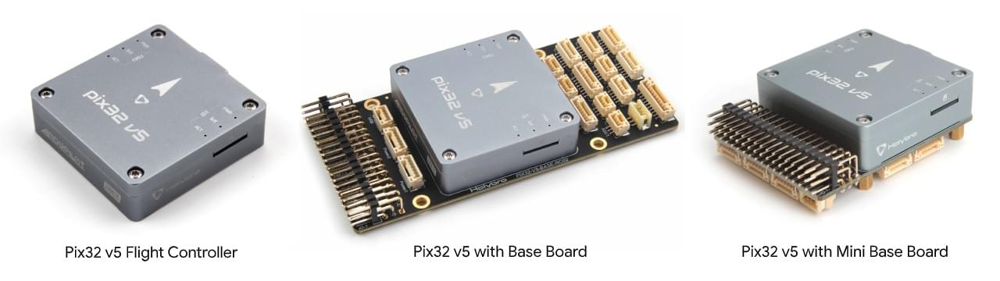
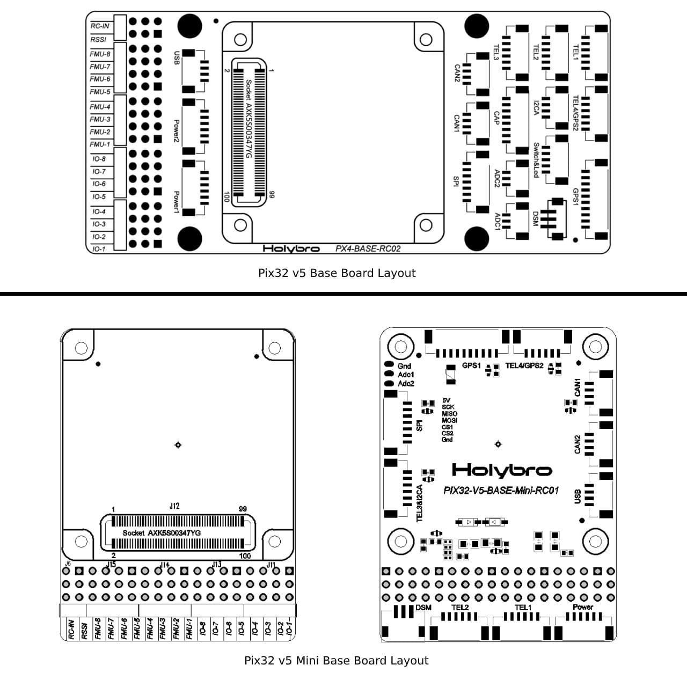
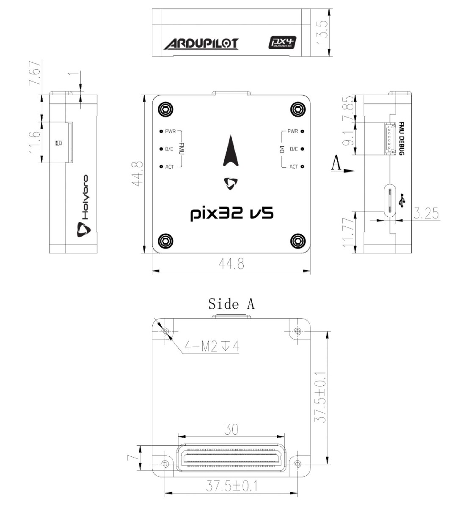
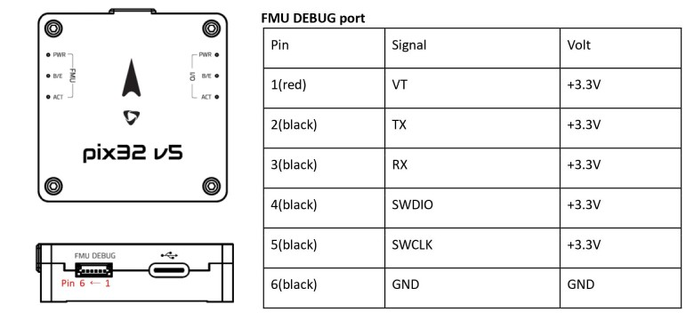

# Holybro Pix32 v5

:::warning
PX4 does not manufacture this (or any) autopilot.
Contact the [manufacturer](https://holybro.com/) for hardware support or compliance issues.
:::

[Pix32 v5](https://holybro.com/products/pix32-v5)<sup>&reg;</sup> is an advanced autopilot flight controller designed and made by Holybro<sup>&reg;</sup>.
PX4 펌웨어 실행에 최적화 되어 있으며, 연구와 상업용 개발자들에게 적합합니다.
It is based on the [Pixhawk-project](https://pixhawk.org/) **FMUv5** open hardware design and runs PX4 on the [NuttX](https://nuttx.apache.org/) OS.
Pixhawk4의 변형 버전으로 간주할 수 있습니다.

Pix32 v5는 고출력, 유연하고 사용자 정의 가능한 비행제어 시스템을 위하여 설계되었습니다.
별도의 비행 컨트롤러와 캐리어 보드로 구성되며 100핀 커넥터로 연결됩니다.
이 디자인은 사용자가 Holybro에서 만든베이스 보드를 선택하거나 사용자가 정의할 수 있습니다.



:::info
This flight controller is [manufacturer supported](../flight_controller/autopilot_manufacturer_supported.md).
:::

## 요약

- 메인 FMU 프로세서: STM32F765
  - 32 비트 Arm® Cortex®-M7, 216MHz, 2MB 메모리, 512KB RAM
- IO 프로세서: STM32F100
  - 32 비트 Arm® Cortex®-M3, 24MHz, 8KB SRAM
- 내장 센서 :
  - 가속도/자이로: ICM-20689
  - Accel/Gyro: BMI055 or ICM20602
  - 자력계 : IST8310
  - 기압계: MS5611
- GPS: u-blox Neo-M8N GPS/GLONASS 수신기; 통합 자력계 IST8310
- 인터페이스:
  - PWM 출력 8-16개(IO에서 8개, FMU에서 8개)
  - FMU의 전용 PWM/캡처 입력 3 개
  - CPPM 전용 RC 입력
  - 아날로그/PWM RSSI 입력이있는 Spektrum/DSM 및 S.Bus 전용 RC 입력
  - Dedicated S.Bus servo output
  - 범용 시리얼 포트 5개
    - 전체 흐름 제어 2개
    - 1.5A 전류 제한이 있는 1 개
  - I2C 포트 3개
  - SPI 버스 4개
    - 4 개의 칩 선택 및 6 개의 DRDY가 있는 내부 고속 SPI 센서 버스 1 개
    - XXX 전용 내부 저잡음 SPI 버스 1 개
    - 2 개의 칩 선택이 있는 기압계, DRDY 없음
    - FRAM 전용 내부 SPI 버스 1 개
    - 센서 모듈에 위치한 전용 SPI 교정 EEPROM 지원
    - 외부 SPI 버스 1개
  - 직렬 ESC를 사용하는 듀얼 CAN에 최대 2 개의 CAN 버스
    - 각 CANBus에는 개별 무음 제어 또는 ESC RX-MUX 제어가 있습니다.
    - 배터리 2 개의 전압 및 전류에 대한 아날로그 입력
    - 2개의 추가 아날로그 입력
- 전기 시스템 :
  - 전원 모듈 출력: 4.9~5.5V
  - 최대 입력 전압: 6V
  - 최대 전류 감지: 120A
  - USB 전원 입력: 4.75~5.25V
  - 서보 레일 입력: 0~36V
- 중량과 크기
  - 크기: 45x45x13.5mm
  - 중량: 33.9g
- Environmental Data, Quality & Reliability:
  - 작동 온도: -40 ~ 85°c
  - 보관 온도. -40~85℃
  - CE
  - FCC
  - RoHS 준수(무연)

Additional information can be found in the [Pix32 V5 Technical Data Sheet](https://cdn.shopify.com/s/files/1/0604/5905/7341/files/Holybro_PIX32-V5_technical_data_sheet_v1.1.pdf).

## 구매처

Order from [Holybro website](https://holybro.com/products/pix32-v5).

## 조립 및 설정

The [Pix32 v5 Wiring Quick Start](../assembly/quick_start_holybro_pix32_v5.md) provides instructions on how to assemble required/important peripherals including GPS, Power Management Board etc.

## 베이스 보드 레이아웃



## 핀배열

[_pix32 v5_ and mini baseboard](https://cdn.shopify.com/s/files/1/0604/5905/7341/files/Holybro_Pix32-V5-Base-Mini-Pinouts.pdf)

## 크기



## 정격 전압

_Pix32 v5_ can be triple-redundant on the power supply if three power sources are supplied.
The three power rails are: **POWER1**, **POWER2** and **USB**.

:::info
The output power rails **FMU PWM OUT** and **I/O PWM OUT** (0V to 36V) do not power the flight controller board (and are not powered by it).
You must supply power to one of **POWER1**, **POWER2** or **USB** or the board will be unpowered.
:::

**Normal Operation Maximum Ratings**

이러한 조건에서 전원은 아래의 순서대로 시스템에 전원을 공급하여야합니다.

1. **POWER1** and **POWER2** inputs (4.9V to 5.5V)
2. **USB** input (4.75V to 5.25V)

**Absolute Maximum Ratings**

아래의 조건에서 시스템은 전원을 사용하지 않지만(작동하지 않음), 그대로 유지됩니다.

1. **POWER1** and **POWER2** inputs (operational range 4.1V to 5.7V, 0V to 10V undamaged)
2. **USB** input (operational range 4.1V to 5.7V, 0V to 6V undamaged)
3. Servo input: VDD_SERVO pin of **FMU PWM OUT** and **I/O PWM OUT** (0V to 42V undamaged)

## 펌웨어 빌드

:::tip
Most users will not need to build this firmware!
It is pre-built and automatically installed by _QGroundControl_ when appropriate hardware is connected.
:::

To [build PX4](../dev_setup/building_px4.md) for this target:

```
make holybro_pix32v5_default
```

## 디버그 포트

The system's [serial console](../debug/system_console.md) and SWD interface runs on the **FMU Debug** port

<!--while the I/O console and SWD interface can be accessed via **I/O Debug** port.-->



The pinout uses the standard [Pixhawk Debug Mini](../debug/swd_debug.md#pixhawk-debug-mini) interface defined in the [Pixhawk Connector Standard](https://github.com/pixhawk/Pixhawk-Standards/blob/master/DS-009%20Pixhawk%20Connector%20Standard.pdf).

## 주변 장치

- [Digital Airspeed Sensor](../sensor/airspeed.md)
- [Telemetry Radio Modules](../telemetry/index.md)
- [Rangefinders/Distance sensors](../sensor/rangefinders.md)

## 지원 플랫폼 및 기체

일반 RC 서보 또는 Futaba S-Bus 서보로 제어 가능한 모든 멀티콥터/비행기/로버 또는 보트.
The complete set of supported configurations can be seen in the [Airframes Reference](../airframes/airframe_reference.md).

## 추가 정보

- [Pix32 v5 Technical Data Sheet](https://cdn.shopify.com/s/files/1/0604/5905/7341/files/Holybro_PIX32-V5_technical_data_sheet_v1.1.pdf)
- [Pix32 v5 Pinouts](https://cdn.shopify.com/s/files/1/0604/5905/7341/files/Holybro_Pix32-V5-Base-Mini-Pinouts.pdf)
- [Pix32 v5 Base Board Schematic Diagram](https://cdn.shopify.com/s/files/1/0604/5905/7341/files/Holybro_PIX32-V5-BASE-Schematic_diagram.pdf)
- [Pix32 v5 Mini Base Board Schematic Diagram](https://cdn.shopify.com/s/files/1/0604/5905/7341/files/Holybro_PIX32-V5-Base-Mini-Board_Schematic_diagram.pdf)
- [FMUv5 reference design pinout](https://docs.google.com/spreadsheets/d/1-n0__BYDedQrc_2NHqBenG1DNepAgnHpSGglke-QQwY/edit#gid=912976165).
