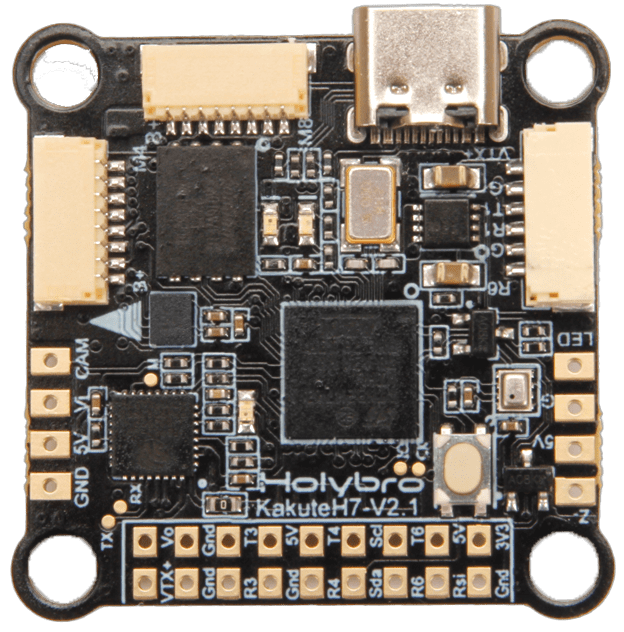
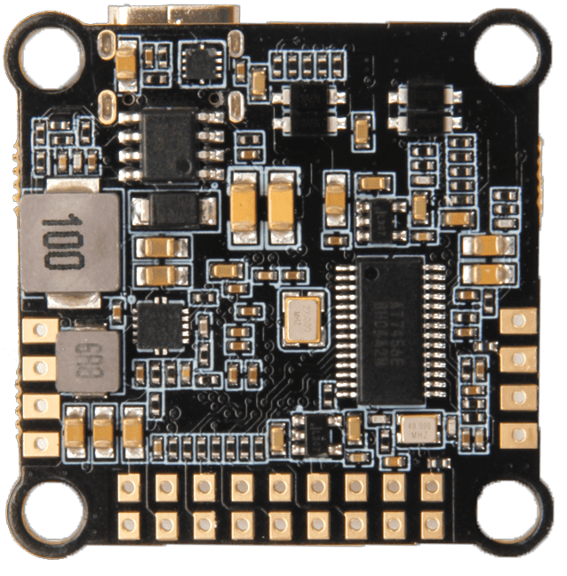

# Holybro Kakute H7 V2

:::warning
PX4 does not manufacture this (or any) autopilot.
Contact the [manufacturer](https://holybro.com/) for hardware support or compliance issues.
:::

The [Holybro Kakute H7 V2](https://holybro.com/collections/autopilot-flight-controllers/products/kakute-h7-v2) flight controller is full of features including integrated Bluetooth, HD camera plug, dual plug-and-play 4in1 ESC ports, 9V VTX ON/OFF Pit Switch, barometer, OSD, 6x UARTs, 128MB Flash for Logging (not supported with PX4 yet), 5V and 9V BEC, and bigger soldering pad with easy layout and much more.

The Kakute H7v2 builds upon the best features of its predecessor, the [Kakute F7](../flight_controller/kakutef7.md), and the [Kakute H7](../flight_controller/kakuteh7.md).

The board also has an on-board barometer, LED & buzzer pad, and I2C pad (SDA & SCL) for external GPS/magnetometers.

 

:::info
This flight controller is [manufacturer supported](../flight_controller/autopilot_manufacturer_supported.md).
:::

## 주요 특징

- MCU: STM32H743 32-bit processor running at 480 MHz
- IMU: BMI270
- Barometer: BMP280
- OSD: AT7456E
- Onboard Bluetooth chip: Disabled with PX4
- VTX On/Off Pit Switch: Not used with PX4
- 6x UARTs (1,2,3,4,6,7; UART2 is used for Bluetooth telemetry)
- 9x PWM Outputs (8 Motor Outputs, 1 LED)
- 2x JST-SH1.0_8pin port (For Single or 4in1 ESCs, x8/Octocopter plug & play compatible)
- 1x JST-GH1.5_6pin port (For HD System like Caddx Vista & Air Unit)
- Battery input voltage: 2S-8S
- BEC 5V 2A Cont.
- BEC 9V 1.5A Cont.
- Mounting: 30.5 x 30.5mm/Φ4mm hole with Φ3mm Grommets
- Dimensions: 35x35mm
- Weight: 8g

## 구매처

The board can be bought from one of the following shops (for example):

- [Holybro](https://holybro.com/products/kakute-h7-v2)

:::tip
The _Kakute H7v2_ is designed to work with the _Tekko32_ 4-in-1 ESC and they can be bought in combination.
:::

## 커넥터 및 핀

| 핀        | 기능                                                                                | 기본값          |
| -------- | --------------------------------------------------------------------------------- | ------------ |
| B+       | Battery positive voltage (2S-8S)                               |              |
| VTX+     | 9V Output                                                                         |              |
| SDA, SCL | I2C 연결(주변장치용)                                                  |              |
| 5V       | 5V 출력 (최대 2A)                                                  |              |
| 3V3      | 3.3V output (0.25A max)        |              |
| VI       | FPV 카메라의 비디오 입력                                                                   |              |
| VO       | 비디오 송신기로 비디오 출력                                                                   |              |
| CAM      | To camera OSD control                                                             |              |
| G 또는 GND | 접지                                                                                |              |
| RSI      | 수신기에서 아날로그 RSSI(0-3.3V) 입력                     |              |
| R1, T1   | UART1 RX 및 TX                                                                     | TELEM1       |
| R3, T3   | UART3 RX 및 TX                                                                     | NuttX 디버그 콘솔 |
| R4, T4   | UART4 RX 및 TX                                                                     | GPS1         |
| R6, T6   | UART6 RX and TX (R6 also located in the GH plug)               | RC 포트        |
| R7       | UART7 RX (RX is located in the plugs for use with 4-in-1 ESCs) | DShot 텔레메트리  |
| LED      | WS2182 주소 지정이 가능한 LED 신호 와이어(테스트되지 않음)                         |              |
| Z-       | 피에조 부저 네거티브 레그(부저 포지티브 레그를 5V 패드에 연결)                          |              |
| M1에서 M4  | 모터 신호 출력 (4-in-1 ESC에서 사용하기 위해 플러그에 위치)                        |              |
| M5 to M8 | 모터 신호 출력 (4-in-1 ESC에서 사용하기 위해 플러그에 위치)                        |              |
| Boot     | 부트로더 버튼                                                                           |              |

<a id="bootloader"></a>

## 부트로더 업데이트

The board comes pre-installed with [Betaflight](https://github.com/betaflight/betaflight/wiki).
Before the PX4 firmware can be installed, the _PX4 bootloader_ must be flashed.
Download the [holybro_kakuteh7v2_bootloader.hex](https://github.com/PX4/PX4-user_guide/raw/main/assets/flight_controller/kakuteh7v2/holybro_kakuteh7v2_bootloader.hex) bootloader binary and read [this page](../advanced_config/bootloader_update_from_betaflight.md) for flashing instructions.

## 펌웨어 빌드

To [build PX4](../dev_setup/building_px4.md) for this target:

```
make holybro_kakuteh7v2_default
```

## 펌웨어 설치

:::info
KakuteH7v2 is supported with PX4 master & PX4 v1.14 or newer. If you are loading the pre-built firmware via QGroundcontrol, you must use QGC Daily or QGC version newer than 4.1.7.
Prior to that release you will need to manually build and install the firmware.
:::

Firmware can be manually installed in any of the normal ways:

- Build and upload the source:

  ```
  make holybro_kakuteh7v2_default upload
  ```

- [Load the firmware](../config/firmware.md) using _QGroundControl_.
  미리 빌드된 펌웨어나 사용자 지정 펌웨어를 사용할 수 있습니다.

:::info
KakuteH7v2 is supported with PX4 main and v1.14 or newer.
:::

## PX4 설정

In addition to the [basic configuration](../config/index.md), the following parameters are important:

| 매개변수                                                                                                           | 설정                                                                                         |
| -------------------------------------------------------------------------------------------------------------- | ------------------------------------------------------------------------------------------ |
| [SYS_HAS_MAG](../advanced_config/parameter_reference.md#SYS_HAS_MAG) | 보드에 내부 자력계가 없기 때문에 비활성화하여야 합니다. 외부 자력계를 연결하여 활성화 할 수 있습니다. |

## 시리얼 포트 매핑

| UART   | 장치         | 포트                                  |
| ------ | ---------- | ----------------------------------- |
| USART1 | /dev/ttyS0 | TELEM1                              |
| USART3 | /dev/ttyS2 | 디버그 콘솔                              |
| UART4  | /dev/ttyS3 | GPS1                                |
| USART6 | /dev/ttyS4 | RC SBUS                             |
| UART7  | /dev/ttyS5 | ESC 텔레메트리(DShot) |

## 디버그 포트

### 시스템 콘솔

UART3 RX and TX are configured for use as the [System Console](../debug/system_console.md).

### SWD

The [SWD interface](../debug/swd_debug.md) (JTAG) pins are:

- `SWCLK`: Test Point 2 (Pin 72 on the CPU)
- `SWDIO`: Test Point 3 (Pin 76 on CPU)
- `GND`: As marked on board
- `VDD_3V3`: As marked on board
