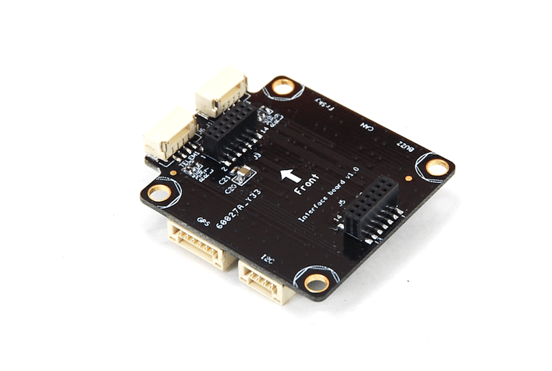

# MindRacer 하드웨어

:::warning
PX4 does not manufacture this (or any) autopilot.
하드웨어 지원과 호환 문제는 [제조사](http://mindpx.net)에 문의하십시오.
:::

The AirMind<sup>&reg;</sup> [MindRacer](http://mindpx.net) series is a fully stackable flight _platform_ for miniature UAVs.
The platform currently has two RTF vehicles: [MindRacer 210](../complete_vehicles_mc/mindracer210.md) and [NanoMind 110](../complete_vehicles_mc/nanomind110.md).


:::info
This flight controller is [manufacturer supported](../flight_controller/autopilot_manufacturer_supported.md).
:::

## 요약

MindRacer는 소형 UAV를 위한 비행 플랫폼입니다.
Based on [MindPX](../flight_controller/mindpx.md), _MindRacer_ further scales down in formfactor while focused on providing modularity.
MindRacer is a _platform_ rather than a flight controller.

MindRacer는 SEP(납땜 제거 포트) 및 WEP(배선 제거 프로토콜) 개념을 구현합니다.
SEP 및 WEP 이전에는, 납땜과 배선은 UAV 제조와 튜닝 과정의 어려움과 비효율성을 야기하였습니다.

:::info
The main hardware documentation is [here](http://mindpx.net/assets/accessories/mindracer_spec_v1.2.pdf).
:::

- 초소형 크기: 무게 ~ 6g
- 고성능 STM32F427 168MHz 부동 소수점 프로세서, 초고속 스로틀 응답
- OneShot ESC 지원
- PPM/SBUS/DSM 라디오 수신기와 D.Port/S.Port/Wifi 원격 텔레메트리를 지원합니다.
- 온보드 비행 데이터 기록 장치
- IMU 격리 지원
- DroneCode<sup>&reg;</sup> 표준 준수 커넥터

|          항목         |                                                     설명                                                    |
| :-----------------: | :-------------------------------------------------------------------------------------------------------: |
|     비행 컨트롤러/프로세서    |                                                  F427VIT6                                                 |
|          중량         |                                                    약 6g                                                   |
|          크기         |                                                  35x35mm                                                  |
|        PWM 출력       |                                                    최대 6                                                   |
|        관성 센서        |                                                   10DOF                                                   |
|        IMU 격리       |                                                 예 / 선택 사항                                                 |
|       라디오 수신기       |                                S.BUS/PPM/DSM/DSM2/DSMX/SUMD                               |
|        텔레메트리        | FrSky<sup>&reg;</sup> D.Port, S.Port, Wifi, 3DR radio |
| 비행 데이터 기록 온보드 TF 카드 |                                                     예                                                     |
|    OneShot ESC 지원   |                                                     예                                                     |
|        확장 슬롯        |                                       2x7(pin)x2                                       |
|      온보드 실시간 시계     |                                                     예                                                     |
|         커넥터         |                                 JST GH(DroneCode 표준 준수)                                |

## 빠른 시작

### 핀배열 지도


### 빌드 방법

:::tip
Most users will not need to build this firmware!
It is pre-built and automatically installed by _QGroundControl_ when appropriate hardware is connected.
:::

To [build PX4](../dev_setup/building_px4.md) for this target:

```
make airmind_mindpx-v2_default
```

### 보조 컴퓨터 PC 연결

MindRacer에는 Adapt IO 보드가 부착되어 있습니다.



MindRacer에는 UART-USB 변환기가 내장되어 있습니다.
보조 컴퓨터를 연결하려면 인터페이스 보드에 MindRacer를 적재후, 보조 컴퓨터를 인터페이스 보드의 USB 포트에 연결합니다.

그리고, 최대 BAUD 속도는 px4 제품군과 동일하며 최대 921600입니다.

### 사용자 가이드

:::info
The user guide is [here](http://mindpx.net/assets/accessories/mindracer_user_guide_v1.2.pdf)
:::

## 구매처

MindRacer is available at [AirMind Store](http://drupal.xitronet.com/?q=catalog).
Amazon<sup>&reg;</sup> 또는 eBay<sup>&reg;</sup>에서도 MindRacer를 구매할 수 있습니다.

## 지원

자세한 내용은 http://www.mindpx.org를 참고하십시오.
Or you can send email to [support@mindpx.net](mailto::support@mindpx.net) for any inquiries or help.
