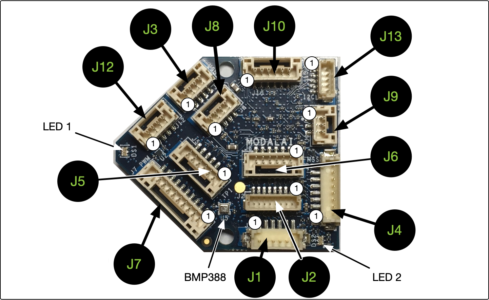

# ModalAI Flight Core v1

<Badge type="tip" text="PX4 v1.11" />

:::warning
PX4 does not manufacture this (or any) autopilot.
Contact the [manufacturer](https://forum.modalai.com/) for hardware support or compliance issues.
:::

The ModalAI [Flight Core v1](https://modalai.com/flight-core) ([Datasheet](https://docs.modalai.com/flight-core-datasheet)) is a flight controller for PX4, made in the USA.
The Flight Core can be paired with ModalAI [VOXL](https://modalai.com/voxl) ([Datasheet](https://docs.modalai.com/voxl-datasheet/)) for obstacle avoidance and GPS-denied navigation, or used independently as a standalone flight controller.


Flight Core is identical to the PX4 Flight Controller portion of [VOXL Flight](https://www.modalai.com/voxl-flight) ([Datasheet](https://docs.modalai.com/voxl-flight-datasheet/)) which integrates the VOXL Companion Computer and Flight Core into a single PCB.

:::info
This flight controller is [manufacturer supported](../flight_controller/autopilot_manufacturer_supported.md).
:::

## 사양

| 기능         | 세부 정보                                                            |
| :--------- | :--------------------------------------------------------------- |
| 중량         | 6 g                                                              |
| MCU        | 216MHz, 32-bit ARM M7 [STM32F765II][stm32f765ii]                 |
| 메모리        | 256Kb FRAM                                                       |
|            | 2Mbit Flash                                                      |
|            | 512Kbit SRAM                                                     |
| 펌웨어        | [PX4][px4]                                                       |
| 관성계        | [ICM-20602][icm-20602] (SPI1)                                    |
|            | ICM-42688 (SPI2)                              |
|            | [BMI088][bmi088] (SPI6)                                          |
| 기압계        | [BMP388][bmp388] (I2C4)                                          |
| 보안 요소      | [A71CH][a71ch] (I2C4)                                            |
| microSD 카드 | [Information on supported cards](../dev_log/logging.md#sd-cards) |
| 입력         | GPS/자력계                                                          |
|            | Spektrum                                                         |
|            | 텔레메트리                                                            |
|            | CAN 버스                                                           |
|            | PPM                                                              |
| 출력         | LED 6 개 (2xRGB)                               |
|            | PWM 채널 8개                                                        |
| 추가 인터페이스   | 시리얼포트 3개                                                         |
|            | I2C                                                              |
|            | GPIO                                                             |

:::info
More detailed hardware documentation can be found [here](https://docs.modalai.com/flight-core-datasheet/).
:::

<!-- reference links for table above (improve layout) -->

[stm32f765ii]: https://www.st.com/en/microcontrollers-microprocessors/stm32f765ii.html
[bmp388]: https://www.bosch-sensortec.com/products/environmental-sensors/pressure-sensors/bmp388/
[icm-20602]: https://www.invensense.com/products/motion-tracking/6-axis/icm-20602/
[bmi088]: https://www.bosch-sensortec.com/bst/products/all_products/bmi088_1
[px4]: https://github.com/PX4/PX4-Autopilot/tree/main/boards/modalai/fc-v1
[a71ch]: https://www.nxp.com/products/security-and-authentication/authentication/plug-and-trust-the-fast-easy-way-to-deploy-secure-iot-connections:A71CH

## 크기


## PX4 Firmware Compatibility

_Flight Core v1_ is fully compatible with the official PX4 Firmware from PX4 v1.11.

ModalAI maintains a [branched PX4 version](https://github.com/modalai/px4-firmware/tree/modalai-1.11) for PX4 v1.11.
This includes UART ESC support and improvements in VIO and VOA that are planned to be upstreamed.

More information about the firmware can be found [here](https://docs.modalai.com/flight-core-firmware/).

## QGroundControl 지원

아래 다이어그램은 PX4 v1.11(및 <a href="https://github.com/modalai/px4-firmware/tree/modalai-1.10">ModalAI가 유지하는 PX4 v1.10 브랜치</a>)부터 <code>ROTATION_NONE</code> 권장 방향을 나타냅니다.

## 구매처

- [Flight Core Complete Kit](https://modalai.com/flight-core)
- [Flight Core integrated with VOXL Companion Computer on a single PCB](https://modalai.com/flight-core)
- [Flight Core integrated with VOXL Companion Computer and Obstacle Avoidance Cameras (VOXL Flight Deck)](https://modalai.com/flight-deck) ([Datasheet](https://docs.modalai.com/voxl-flight-deck-platform-datasheet/))
- [Flight Core assembled with VOXL and cameras](https://shop.modalai.com/products/voxl-flight-deck-r1)

## 빠른 시작

### 방향

The diagram below shows the recommended orientation, which corresponds to `ROTATION_NONE` starting with PX4 v1.11.


### 커넥터

Detailed information about the pinouts can be found [here](https://docs.modalai.com/flight-core-datasheet-connectors).



| 커넥터 | 요약                                                        |
| --- | --------------------------------------------------------- |
| J1  | VOXL 통신 인터페이스 커넥터 (TELEM2)             |
| J2  | 프로그래밍 및 디버그 커넥터                                           |
| J3  | USB 커넥터                                                   |
| J4  | UART2, UART ESC (TELEM3)               |
| J5  | 텔레메트리 커넥터 (TELEM1)                     |
| J6  | VOXL - 전원 관리 입력/확장                                        |
| J7  | 8 채널 PWM 출력 커넥터                                           |
| J8  | CAN 버스 커넥터                                                |
| J9  | PPM RC 입력                                                 |
| J10 | External GPS & Magnetometer Connector |
| J12 | RC 입력, Spektrum/SBus/UART 커넥터                             |
| J13 | I2C 디스플레이(예비 센서 커넥터)/안전 버튼 입력          |


### 사용자 가이드

The full user guide is available [here](https://docs.modalai.com/flight-core-manual/).

### 빌드 방법

To [build PX4](../dev_setup/building_px4.md) for this target:

```
make modalai_fc-v1
```

## 시리얼 포트 매핑

| UART   | 장치         | 포트                                         |
| ------ | ---------- | ------------------------------------------ |
| USART1 | /dev/ttyS0 | GPS1 (J10)              |
| USART2 | /dev/ttyS1 | TELEM3 (J4)             |
| USART3 | /dev/ttyS2 | 디버깅 콘솔(J2)              |
| UART4  | /dev/ttyS3 | 확장 UART (J6)            |
| UART5  | /dev/ttyS4 | TELEM2, 기본 VOXL 통신 (J1) |
| USART6 | /dev/ttyS5 | RC (J12)                |
| UART7  | /dev/ttyS6 | TELEM1 (J5)             |
| UART8  | /dev/ttyS7 | 해당없음                                       |

<!-- Note: Got ports using https://github.com/PX4/PX4-user_guide/pull/672#issuecomment-598198434 -->

## 지원

Please visit the [ModalAI Forum](https://forum.modalai.com/category/10/flight-core) for more information.
