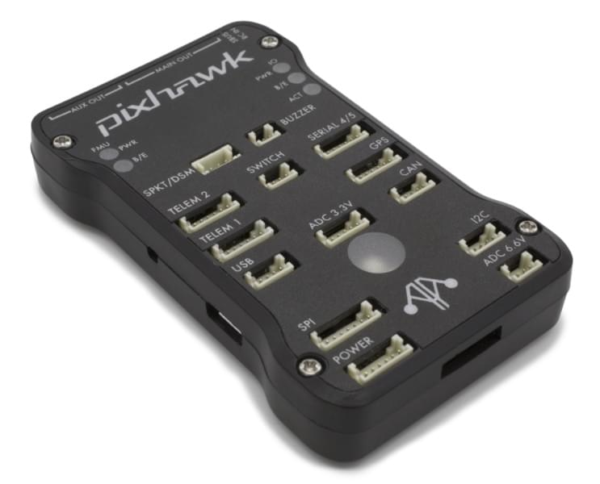
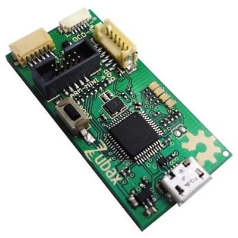
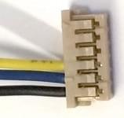
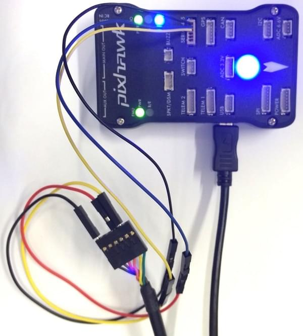
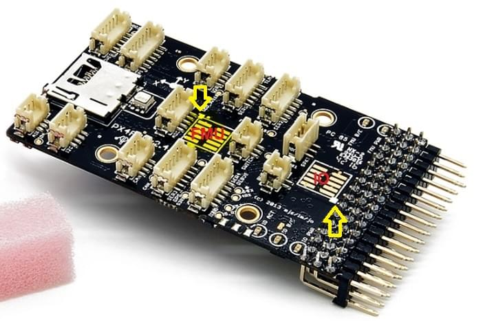
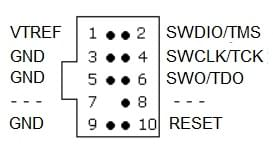

# mRo Pixhawk 비행 컨트롤러 (Pixhawk 1)

:::warning
PX4 does not manufacture this (or any) autopilot.
Contact the [manufacturer](https://store.mrobotics.io/) for hardware support or compliance issues.
:::

The _mRo Pixhawk<sup>&reg;</sup>_ is a hardware compatible version of the original [Pixhawk 1](../flight_controller/pixhawk.md). It runs PX4 on the [NuttX](https://nuttx.apache.org/) OS.

:::tip
The controller can be used as a drop-in replacement for the 3DR<sup>&reg;</sup> [Pixhawk 1](../flight_controller/pixhawk.md).
The main difference is that it is based on the [Pixhawk-project](https://pixhawk.org/) **FMUv3** open hardware design, which corrects a bug that limited the original Pixhawk 1 to 1MB of flash.
:::



Assembly/setup instructions for use with PX4 are provided here: [Pixhawk Wiring Quickstart](../assembly/quick_start_pixhawk.md)

:::tip
This autopilot is [supported](../flight_controller/autopilot_pixhawk_standard.md) by the PX4 maintenance and test teams.
:::

## 주요 특징

- 마이크로 프로세서:
  - FPU가있는 32 비트 STM32F427 코어 텍스<sup>&reg;</sup> M4 코어
  - 168 MHz / 256 KB RAM / 2 MB 플래시
  - 32 비트 STM32F100 failsafe 코프로세서
  - 24 MHz/8 KB RAM/64 KB 플래시

- 센서:
  - ST Micro L3GD20 3축 16비트 자이로스코프
  - ST Micro LSM303D 3축 14비트 가속도계/자력계
  - Invensense<sup>&reg;</sup> MPU 6000 3축 가속도계/자이로스코프
  - MEAS MS5611 기압계

- 인터페이스:
  - UART (직렬 포트) 5개, 1 개의 고전력 지원, 2x (HW 흐름 제어 포함)
  - CAN 2 개
  - 최대 DX8의 Spektrum DSM/DSM2/DSM-X® Satellite 호환 입력(DX9 이상은 지원되지 않음)
  - Futaba<sup>&reg;</sup> S.BUS 호환 입력 및 출력
  - PPM 합계 신호
  - RSSI(PWM 또는 전압) 입력
  - I2C
  - SPI
  - 3.3 및 6.6V ADC 입력
  - 외부 microUSB 포트

- 전원시스템
  - 자동 복구 기능의 이상적인 다이오드 컨트롤러
  - 서보 레일 고전력 (7V) 및 고전류 준비
  - 모든 주변 장치 출력 과전류 보호, 모든 입력 ESD 보호

- 중량과 크기
  - 무게 : 38g (1.31oz)
  - 너비 : 50mm (1.96 ")
  - 두께 : 15.5mm (.613 ")
  - 길이 : 81.5mm (3.21")

## 구매처

- [Bare Bones](https://store.mrobotics.io/Genuine-PixHawk-1-Barebones-p/mro-pixhawk1-bb-mr.htm) - Just the board (useful as a 3DR Pixhawk replacement)
- [mRo Pixhawk 2.4.6 Essential Kit!](https://store.mrobotics.io/Genuine-PixHawk-Flight-Controller-p/mro-pixhawk1-minkit-mr.htm) - Everything except for telemetry radios
- [mRo Pixhawk 2.4.6 Cool Kit! (Limited edition)](https://store.mrobotics.io/product-p/mro-pixhawk1-fullkit-mr.htm) - Everything you need including telemetry radios

## 펌웨어 빌드

:::tip
Most users will not need to build this firmware!
It is pre-built and automatically installed by _QGroundControl_ when appropriate hardware is connected.
:::

To [build PX4](../dev_setup/building_px4.md) for this target:

```sh
make px4_fmu-v3_default
```

## 디버그 포트

### 콘솔 포트

The [PX4 System Console](../debug/system_console.md) runs on the port labeled [SERIAL4/5](#serial-4-5-port).

:::tip
A convenient way to connect to the console is to use a [Zubax BugFace BF1](https://github.com/Zubax/bugface_bf1), as it comes with connectors that can be used with several different Pixhawk devices.
Simply connect the 6-pos DF13 1:1 cable on the [Zubax BugFace BF1](https://github.com/Zubax/bugface_bf1) to the Pixhawk `SERIAL4/5` port.


:::

The pinout is standard serial pinout, designed to connect to a [3.3V FTDI](https://www.digikey.com/en/products/detail/TTL-232R-3V3/768-1015-ND/1836393) cable (5V tolerant).

| 3DR Pixhawk 1 |                            | FTDI |                                 |
| ------------- | -------------------------- | ---- | ------------------------------- |
| 1             | +5V (적) |      | N/C                             |
| 2             | S4 Tx                      |      | N/C                             |
| 3             | S4 Rx                      |      | N/C                             |
| 4             | S5 Tx                      | 5    | FTDI RX (황)  |
| 5             | S5 Rx                      | 4    | FTDI TX (적황) |
| 6             | GND                        | 1    | FTDI GND (흑) |

The wiring for an FTDI cable to a 6-pos DF13 1:1 connector is shown in the figure below.



The complete wiring is shown below.



:::info
For information on how to _use_ the console see: [System Console](../debug/system_console.md).
:::

### SWD 포트

The [SWD](../debug/swd_debug.md) (JTAG) ports are hidden under the cover (which must be removed for hardware debugging).
There are separate ports for FMU and IO, as highlighted below.



The ports are ARM 10-pin JTAG connectors, which you will probably have to solder.
The pinout for the ports is shown below (the square markers in the corners above indicates pin 1).



:::info
All Pixhawk FMUv2 boards have a similar SWD port.
:::

## 핀배열

#### TELEM1, TELEM2 포트

| 핀                         | 신호                          | 전압                    |
| ------------------------- | --------------------------- | --------------------- |
| 1(red) | VCC                         | +5V                   |
| 2 (흑)  | TX (출력)  | +3.3V |
| 3 (흑)  | RX (입력)  | +3.3V |
| 4 (흑)  | CTS (입력) | +3.3V |
| 5 (흑)  | RTS (출력) | +3.3V |
| 6 (흑)  | GND                         | GND                   |

#### GPS 포트

| 핀                         | 신호                         | 전압                    |
| ------------------------- | -------------------------- | --------------------- |
| 1(red) | VCC                        | +5V                   |
| 2 (흑)  | TX (출력) | +3.3V |
| 3 (흑)  | RX (입력) | +3.3V |
| 4 (흑)  | CAN2 TX                    | +3.3V |
| 5 (흑)  | CAN2 RX                    | +3.3V |
| 6 (흑)  | GND                        | GND                   |

#### SERIAL 4/5 port

Due to space constraints two ports are on one connector.

| 핀                         | 신호                         | 전압                    |
| ------------------------- | -------------------------- | --------------------- |
| 1(red) | VCC                        | +5V                   |
| 2 (흑)  | TX (#4) | +3.3V |
| 3 (흑)  | RX (#4) | +3.3V |
| 4 (흑)  | TX (#5) | +3.3V |
| 5 (흑)  | RX (#5) | +3.3V |
| 6 (흑)  | GND                        | GND                   |

#### ADC 6.6V

| 핀                         | 신호     | 전압                       |
| ------------------------- | ------ | ------------------------ |
| 1(red) | VCC    | +5V                      |
| 2 (흑)  | ADC 입력 | 최대 +6.6V |
| 3 (흑)  | GND    | GND                      |

#### ADC 3.3V

| 핀                         | 신호     | 전압                       |
| ------------------------- | ------ | ------------------------ |
| 1(red) | VCC    | +5V                      |
| 2 (흑)  | ADC 입력 | 최대 +3.3V |
| 3 (흑)  | GND    | GND                      |
| 4 (흑)  | ADC 입력 | 최대 +3.3V |
| 5 (흑)  | GND    | GND                      |

#### I2C

| 핀                         | 신호  | 전압                                           |
| ------------------------- | --- | -------------------------------------------- |
| 1(red) | VCC | +5V                                          |
| 2 (흑)  | SCL | +3.3 (풀업) |
| 3 (흑)  | SDA | +3.3 (풀업) |
| 4 (흑)  | GND | GND                                          |

#### CAN

| 핀                         | 신호                         | 전압   |
| ------------------------- | -------------------------- | ---- |
| 1(red) | VCC                        | +5V  |
| 2 (흑)  | CAN_H | +12V |
| 3 (흑)  | CAN_L | +12V |
| 4 (흑)  | GND                        | GND  |

#### SPI

| 핀                         | 신호                                                     | 전압                   |
| ------------------------- | ------------------------------------------------------ | -------------------- |
| 1(red) | VCC                                                    | +5V                  |
| 2 (흑)  | SPI_EXT_SCK  | +3.3 |
| 3 (흑)  | SPI_EXT_MISO | +3.3 |
| 4 (흑)  | SPI_EXT_MOSI | +3.3 |
| 5 (흑)  | !SPI_EXT_NSS | +3.3 |
| 6 (흑)  | !GPIO_EXT                         | +3.3 |
| 7 (흑)  | GND                                                    | GND                  |

#### 전원

| 핀                         | 신호      | 전압                    |
| ------------------------- | ------- | --------------------- |
| 1(red) | VCC     | +5V                   |
| 2 (흑)  | VCC     | +5V                   |
| 3 (흑)  | CURRENT | +3.3V |
| 4 (흑)  | VOLTAGE | +3.3V |
| 5 (흑)  | GND     | GND                   |
| 6 (흑)  | GND     | GND                   |

#### 스위치

| 핀                         | 신호                                                       | 전압                    |
| ------------------------- | -------------------------------------------------------- | --------------------- |
| 1(red) | VCC                                                      | +3.3V |
| 2 (흑)  | !IO_LED_SAFETY | GND                   |
| 3 (흑)  | SAFETY                                                   | GND                   |

## 시리얼 포트 매핑

| UART   | 장치         | 포트                                |
| ------ | ---------- | --------------------------------- |
| UART1  | /dev/ttyS0 | IO 디버그                            |
| USART2 | /dev/ttyS1 | TELEM1 (흐름 제어) |
| USART3 | /dev/ttyS2 | TELEM2 (흐름 제어) |
| UART4  |            |                                   |
| UART7  | 콘솔         |                                   |
| UART8  | SERIAL4    |                                   |

<!-- Note: Got ports using https://github.com/PX4/PX4-user_guide/pull/672#issuecomment-598198434 -->

## 시리얼 포트 매핑

| UART   | 장치         | 포트                                |
| ------ | ---------- | --------------------------------- |
| UART1  | /dev/ttyS0 | IO 디버그                            |
| USART2 | /dev/ttyS1 | TELEM1 (흐름 제어) |
| USART3 | /dev/ttyS2 | TELEM2 (흐름 제어) |
| UART4  |            |                                   |
| UART7  | 콘솔         |                                   |
| UART8  | SERIAL4    |                                   |

<!-- Note: Got ports using https://github.com/PX4/PX4-user_guide/pull/672#issuecomment-598198434 -->

## 회로도

The board is based on the [Pixhawk-project](https://pixhawk.org/) **FMUv3** open hardware design.

- [FMUv3 schematic](https://github.com/pixhawk/Hardware/raw/master/FMUv3_REV_D/Schematic%20Print/Schematic%20Prints.PDF) -- Schematic and layout

:::info
As a CC-BY-SA 3.0 licensed Open Hardware design, all schematics and design files are [available](https://github.com/pixhawk/Hardware).
:::
