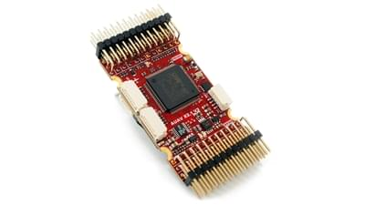

# mRo-X2.1 자동조종장치

:::warning
PX4 does not manufacture this (or any) autopilot.
Contact the [manufacturer](https://store.mrobotics.io/) for hardware support or compliance issues.
:::

The [mRo-X2.1 autopilot](http://www.mRobotics.io/) is based on the [Pixhawk<sup>&reg;</sup>-project](https://pixhawk.org/) **FMUv2** open hardware design.
It runs PX4 on the [NuttX](https://nuttx.apache.org/) OS.



:::info
This flight controller is [manufacturer supported](../flight_controller/autopilot_manufacturer_supported.md).
:::

## 요약

- Main System-on-Chip: [STM32F427](http://www.st.com/web/en/catalog/mmc/FM141/SC1169/SS1577/LN1789)
  - CPU : STM32F427VIT6 ARM<sup>&reg;</sup> 마이크로 컨트롤러 - 개정판 3
  - IO: STM32F100C8T6 ARM<sup>&reg;</sup> 마이크로 컨트롤러
- 센서:
  - Invensense<sup>&reg;</sup> MPU9250 9DOF
  - Invensense ICM-20602 6DOF
  - MEAS MS5611 기압계
- 크기/중량
  - Size: 36mm x 50mm
    (Can be ordered with vertical, horizontal or no headers installed)
  - 장착 위치: 직경 30.5mm x 30.5mm 3.2mm
  - 중량: 10.9g

아래 다이어그램은 Pixhawk 1과 비교한 것입니다. mRo는 거의 동일한 하드웨어와 연결 기능을 제공하지만, 설치 공간이 훨씬 작습니다. 주요 차이점은 업데이트된 센서와 Rev 3 FMU입니다.


## 연결성

- 2.54mm 헤더 :
- I2C가 장착 된 GPS(UART4)
- CAN 버스
- RC 입력
- PPM 입력
- Spektrum 입력
- RSSI 입력
- sBus 입력
- sBus 출력
- 전원 입력
- 부저 출력
- LED 출력
- Servo 출력 8개
- Aux 출력 6개
- 오프 보드 microUSB 커넥터
- Kill Pin output _(Currently not supported by firmware)_
- 항속 센서
- USART2 (Telem 1)
- USART3 (Telem 2)
- UART7 (콘솔)
- UART8 (OSD)

## PX4 부트로더 문제

기본적으로 mRo X2.1은 PX4가 아닌 ArduPilot<sup>&reg;</sup> 용으로 미리 설정되어 제공될 수 있습니다. This
can be seen during firmware update when the board is recognized as FMUv2 instead of X2.1.

In this case you must update the BootLoader using [BL_Update_X21.zip](https://github.com/PX4/PX4-user_guide/raw/main/assets/hardware/BL_Update_X21.zip).
이 캘리브레이션을 수행하지 않으면 나침반 방향이 잘못되어
보조 IMU는 감지되지 않을 수 있습니다.

업데이트 단계는 다음과 같습니다.

1. Download and extract [BL_Update_X21.zip](https://github.com/PX4/PX4-user_guide/raw/main/assets/hardware/BL_Update_X21.zip).
2. Find the folder _BL_Update_X21_. This contains a **bin** file and a subfolder named **/etc** containing an **rc.txt** file
3. 이 파일을 마이크로 SD 카드의 루트 디렉토리에 복사하여 mRO x2.1에 삽입하십시오.
4. Mro x2.1의 전원을 켜십시오. 부팅시까지 기다렸다가 한 번 재부팅하십시오.

## 구매처

This product can be ordered at the [mRobotics<sup>&reg;</sup> Store](https://store.mrobotics.io/mRo-X2-1-Rev-2-p/m10021a.htm).

## 배선 가이드


## 펌웨어 빌드

:::tip
Most users will not need to build this firmware!
It is pre-built and automatically installed by _QGroundControl_ when appropriate hardware is connected.
:::

To [build PX4](../dev_setup/building_px4.md) for this target:

```
make mro_x21_default
```

## 회로도

The board is documented on the mRo hardware repo: [x21_V2_schematic.pdf](https://github.com/mRoboticsIO/Hardware/blob/master/X2.1/Docs/x21_V2_schematic.pdf).

## 시리얼 포트 매핑

| UART   | 장치         | 포트         |
| ------ | ---------- | ---------- |
| USART1 | /dev/ttyS0 | IO 디버그     |
| USART2 | /dev/ttyS1 | SERIAL1    |
| USART3 | /dev/ttyS2 | TELEM2     |
| UART4  | /dev/ttyS3 | GPS/I2C    |
| USART6 | /dev/ttyS4 | PX4IO      |
| UART7  | /dev/ttyS5 | SERIAL5 콘솔 |
| UART8  | /dev/ttyS6 | SERIAL4    |

<!-- Note: Got ports using https://github.com/PX4/PX4-user_guide/pull/672#issuecomment-598198434 -->
