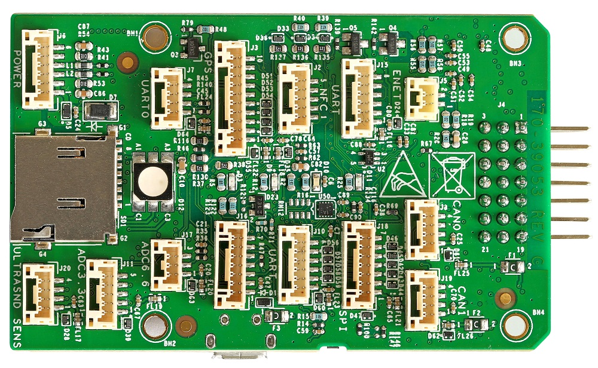
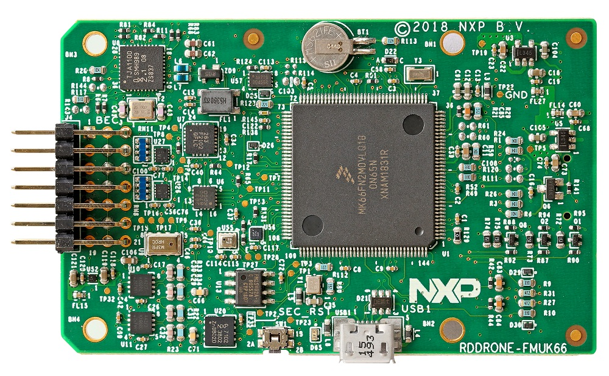
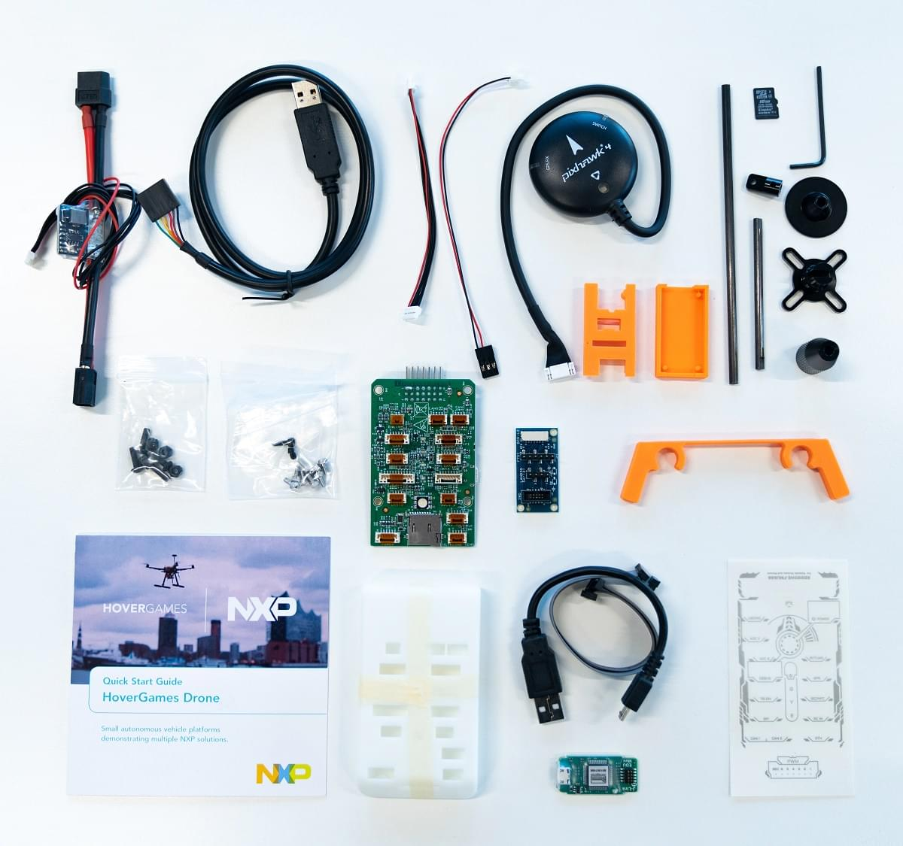
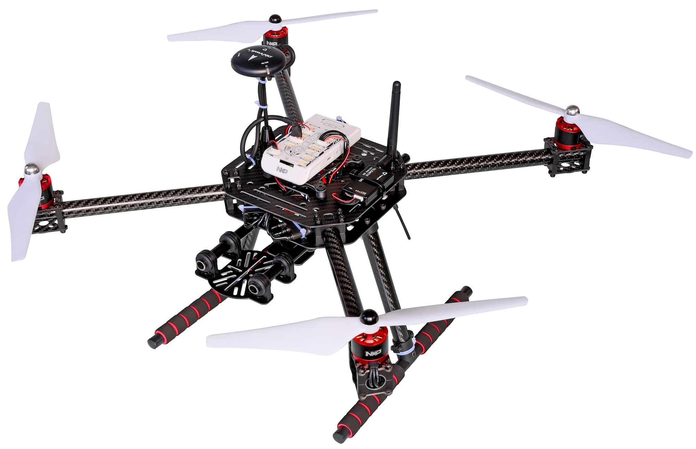

# NXP RDDRONE-FMUK66 FMU (Discontinued)

<Badge type="info" text="Discontinued" />

:::warning
This flight controller has been [discontinued](../flight_controller/autopilot_experimental.md) and is no longer commercially available.
:::

:::warning
PX4 does not manufacture this (or any) autopilot.
Contact the [manufacturer](https://www.nxp.com/) for hardware support or compliance issues.
:::

RDDRONE-FMUK66 FMU는 2  자동차 이더넷 100BASET1 및 보안 요소 A71CH (RevC) 또는 SE050 (RevD)을 추가하여 Pixhawk FMUv4 사양을 준수하는 NXP Semiconductor 구성 요소를 사용하는 참조 설계입니다.
NXP는 이 설계를 복제, 변경 또는 재활용 할 수 있도록 회로도, 거버, BOM 및 소스 파일을 제공합니다.

This is the official FMU for use with [HoverGames](https://www.hovergames.com/).





NXP FMU와 포함된 주변 장치는 FCC/CE/RoHs/REACH 지침을 준수합니다.

:::info
이 비행 컨트롤러는 [제조업체에서 지원](../flight_controller/autopilot_manufacturer_supported.md)합니다.
:::

## 요약

- **Main FMU Processor:**
  - 180MHz Cortex-M4F MCU, 2MB 플래시, 256KB SRAM, 듀얼 USB (FS + HS), 이더넷, 144-LQFP에서 실행되는 Kinetis K66 MK66FN2MOVLQ18 마이크로 컨트롤러.
- **On-board sensors:**
  - 가속/자이로: BMI088/ICM42688 (RevD) ...
  - 가속/자력계: FXOS8700CQ
  - 자이로: FXAS21002CQ
  - 자력계: BMM150
  - 기압계: ML3115A2
  - Barometer: BMP280
- **GPS:**
  - u-blox Neo-M8N GPS/GLONASS 수신기; 통합 자력계 IST8310

This FMU is provided only as a kit, and includes [Segger Jlink EDU mini debugger](https://www.segger.com/products/debug-probes/j-link/models/j-link-edu-mini/), DCD-LZ debugger adapter, USB-TTL-3V3 console cable, HolyBro GPS module, battery power module, SDCard and case, screws and stickers.
Telemetry radios ([HGD-TELEM433](https://www.nxp.com/part/HGD-TELEM433) and [HGD-TELEM915](https://www.nxp.com/part/HGD-TELEM915)) must be purchased separately to match ISM band frequencies used in your country.



A "Lite" version RDDRONE-FMUK66L is also available which does not include the power module, GPS, Jlink or USB-TTL-3V3 console cable or SDCard.[Scroll down to see FMUK66L in the buy section of the FMUK66 buy page](https://www.nxp.com/design/designs/px4-robotic-drone-fmu-rddrone-fmuk66:RDDRONE-FMUK66#buy)

Additional information can be found in the [Technical Data Sheet](https://www.nxp.com/design/designs/px4-robotic-drone-fmu-rddrone-fmuk66:RDDRONE-FMUK66). <!-- www.nxp.com/rddrone-fmuk66 -->

## 구매처

**RDDRONE-FMUK66** reference design kit may be purchased direct from NXP or from any of NXP's authorised worldwide network of [electronics distributors](https://www.nxp.com/support/sample-and-buy/distributor-network:DISTRIBUTORS).

- [Purchase Link](https://www.nxp.com/design/designs/px4-robotic-drone-fmu-rddrone-fmuk66:RDDRONE-FMUK66#buy) (www.nxp.com)
- 원격 측정 라디오는 주파수 대역에 따라 별도로 구매하여야 합니다.
  - [HGD-TELEM433](https://www.nxp.com/part/HGD-TELEM433)
  - [HGD-TELEM915](https://www.nxp.com/part/HGD-TELEM915)

:::info
_RDDRONE-FMUK66_ FMU is also included in the complete HoverGames drone kit: [KIT-HGDRONEK66](https://www.nxp.com/applications/solutions/industrial/aerospace-and-mobile-robotics/uavs-drones-and-rovers/nxp-hovergames-drone-kit-including-rddrone-fmuk66-and-peripherals:KIT-HGDRONEK66#buy)
:::

<!--
## Connectors

[Connector Diagram]

## Pinouts

[Pinouts listing or link]

## Dimensions

[Dimensions]

-->

## 조립 및 설정

https://nxp.gitbook.io/hovergames

## 펌웨어 빌드

:::tip
Most users will not need to build this firmware!
It is pre-built and automatically installed by _QGroundControl_ when appropriate hardware is connected.
:::

To [build PX4](../dev_setup/building_px4.md) for this target:

```
make nxp_fmuk66-v3_default
```

## 디버그 포트

The [PX4 System Console](../debug/system_console.md) and the [SWD interface](../debug/swd_debug.md) run on the [DCD-LZ FMU Debug](https://nxp.gitbook.io/hovergames/rddrone-fmuk66/connectors/debug-interface-dcd-lz) port.

NXP's DCD-LZ is a 7 pin JST-GH connector and adds the nRST/MCU_RESET pin to the [Pixhawk 6-Pin standard debug port](https://github.com/pixhawk/Pixhawk-Standards/blob/master/DS-009%20Pixhawk%20Connector%20Standard.pdf).

DCD-LZ 브레이크아웃 어댑터를 사용하면 표준 10핀 JTAG/SWD 인터페이스(예 : Segger Jlink 사용) 및 표준 5핀 FTDI USB-TTL-3V3 유형 케이블을 사용할 수 있습니다.

<!--

## Peripherals

* [List of anything people should use with this hardware]

-->

## 지원 플랫폼 및 기체

일반 RC 서보 또는 Futaba S-Bus 서보로 제어 가능한 모든 멀티콥터/비행기/로버 또는 보트.
The complete set of supported configurations can be seen in the [Airframes Reference](../airframes/airframe_reference.md).



:::tip
The NXP [HoverGames Drone Kit](https://www.nxp.com/kit-hgdronek66) (shown above) is a complete drone development kit that includes everything needed to build a quadcopter.
3S/4S LiPo 배터리만 추가로 구매하시면 됩니다.
:::

## 추가 정보

- [HoverGames online documentation](https://nxp.gitbook.io/hovergames) PX4 user and programming guide, specific assembly, construction, debugging, programming instructions.

- 3DModels supporting HoverGames and RDDRONE-FMUK66 can be found on _Thingiverse_ at these search links: fmuk66, hovergames.


