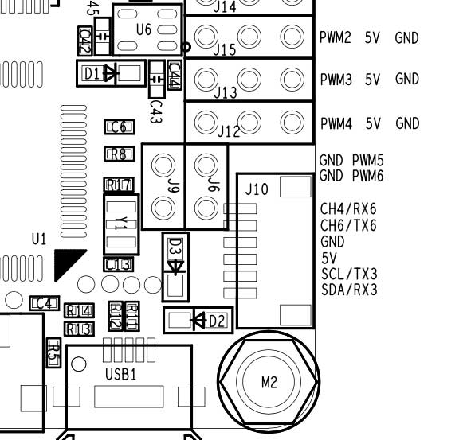

# Omnibus F4 SD

:::warning
This flight controller has been [discontinued](../flight_controller/autopilot_experimental.md) and is no longer commercially available.
:::

:::warning
PX4 does not manufacture this (or any) autopilot.
지원 또는 규정준수 문제는 제조업체에 문의하십시오.
:::

The _Omnibus F4 SD_ is a controller board designed for racers.
일반적인 레이서 보드와 달리 SD 카드와 고속 CPU 등이 추가되었습니다.


These are the main differences compared to a [Pixracer](../flight_controller/pixracer.md):

- 저렴한 가격
- 더 적은 IO 포트(예 : GPS 또는 Flow 센서를 연결은 가능함)
- Requires external pull up resistor on the I2C bus for external GPS, see [I2C](#i2c) below.
- Less RAM (192 KB vs. 256 KB) and FLASH (1 MB vs. 2 MB)
- Same board dimensions as a _Pixracer_, but slightly smaller form factor (because it has less connectors)
- 통합 OSD(아직 소프트웨어에서 구현되지 않음)

:::tip
All the usual PX4 features can still be used for your racer!
:::

:::info
This flight controller is [manufacturer supported](../flight_controller/autopilot_manufacturer_supported.md).
:::

## 주요 특징

- Main System-on-Chip: [STM32F405RGT6](https://www.st.com/en/microcontrollers/stm32f405rg.html)
  - CPU : 단정밀도 FPU의 168MHz ARM Cortex M4
  - RAM : 192KB SRAM
  - FLASH: 1 MB
- 표준 레이서 폼 팩터 : 36x36mm, 표준 30.5mm 구멍 패턴
- MPU6000 가속/자이로
- BMP280 기압계(모든 보드에 마운트된 것은 아님)
- microSD (로깅)
- Futaba S.BUS 및 S.BUS2/Spektrum DSM2 및 DSMX/Graupner SUMD/PPM 입력/Yuneec ST24
- OneShot PWM 출력(설정 가능)
- 내장 전류 센서
- 내장 OSD 칩(SPI를 통한 AB7456)

## 구매처

보드는 몇 가지 변형된 형태(예 : 기압계 포함 또는 제외)로 여러 공급 업체에서 생산합니다.

:::tip
PX4 is compatible with boards that support the Betaflight OMNIBUSF4SD target (if _OMNIBUSF4SD_ is present on the product page the board should work with PX4).
:::

:::tip
Any Omnibus F4 labeled derivative (e.g. clone) should work as well. 그러나, 이러한 보드의 배전은 품질이 다양합니다.
:::

아래의 보드들은 테스트되고 작동하는 것입니다.

- [Hobbywing XRotor Flight Controller F4](https://www.hobbywing.com/en/products/info.html?id=164)

  ::: info
  This board fits on top of the [Hobbywing XRotor Micro 40A 4in1 ESC](https://www.hobbywing.com/en/products/info.html?id=116) without soldering. 이 ESC 보드는 또한 Omnibus 보드에 전원을 제공합니다.

:::

  구매처:

  - [Hobbywing XRotor F4 Flight Controller w/OSD](https://www.getfpv.com/hobbywing-xrotor-f4-flight-controller-w-osd.html) (getfpv)

- 오리지널 Airbot Omnibus F4 SD

  구매처:

  - [Airbot (CN manufacturer)](https://store.myairbot.com/omnibusf4prov3.html)
  - [Ready To Fly Quads (US reseller)](https://quadsrtf.com/product/flip-32-f4-omnibus-rev-2/)

액세서리에는 아래의 내용물이 포함됩니다.

- [ESP8266 WiFi Module](../telemetry/esp8266_wifi_module.md) for MAVLink telemetry.
  다음 핀을 연결하여야합니다: GND, RX, TX, VCC 및 CH-PD (CH-PD ~ 3.3V). 전송 속도는 921600입니다.

## 커넥터

이 설계를 기반으로 한 다른 공급 업체의 보드는 레이아웃이 상당히 다를 수 있습니다.
다양한 버전의 레이아웃/실크스크린이 아래와 같습니다.

### 에어 봇 옴니버스 F4 SD

아래는 상단과 하단을 모두 보여주는 Airbot Omnibus F4 SD (V1)의 실크 스크린입니다.


### Hobbywing XRotor 비행 콘트롤러 F4

아래는 Hobbywing XRotor 비행 콘트롤러 F4의 실크스크린입니다.


## 핀배열

### 무선 조종

RC는 다음 포트중 하나에 연결됩니다.

- UART1
- SBUS/PPM 포트(인버터를 통해 내부적으로 UART1로 이동)

:::info
Some Omnibus F4 boards have a jumper connecting either or both the MCU SBUS and PPM to a single pin header. 사용하기 전에 점퍼 또는 솔더 브리지를 적절한 MCU 핀으로 설정하십시오.
:::

### UART

- UART6: GPS 포트

  - TX: MCU 핀 PC6

  - RX: MCU 핀 PC7

  - Airbot Omnibus F4 SD 핀아웃은 포트 J10(TX6 / RX6)에 있습니다.

  

- UART4

  - TX: MCU 핀 PA0
  - RX: MCU 핀 PA1
  - 초당 전송속도: 57600
  - This can be configured as the `TELEM 2` port.
  - 에어 봇 옴니버스 F4 SD 핀배열:
    - TX: RSSI 핀
    - RX: PWM 출력 5

  

  

### I2C

다음을 통해 사용 가능한 I2C 포트가 하나 있습니다.

- SCL: MCU 핀 PB10 (TX3로 표시 될 수 있음)
- SDA: MCU 핀 PB11 (RX3로 표시 될 수 있음)

:::info
You will need external pullups on both signals (clock and data).
예를 들어, 2.2k 풀업을 사용하여 외부 매거진을 연결할 수 있습니다.
:::

- Airbot Omnibus F4 SD Pinout is on Port J10 (SCL [clock] / SCA [data]): 

다음은 구현의 예입니다. 저는 Spektrum 플러그를 사용하여 DSM 포트에서 3.3v를 얻었으며 2.2k 저항을 통해 각 라인에 3.3v+ 만 연결하였습니다.


## 시리얼 포트 매핑

| UART   | 장치         | 포트       |
| ------ | ---------- | -------- |
| USART1 | /dev/ttyS0 | SerialRX |
| USART4 | /dev/ttyS1 | TELEM1   |
| USART6 | /dev/ttyS2 | GPS      |

<!-- Note: Got ports using https://github.com/PX4/PX4-user_guide/pull/672#issuecomment-598198434 -->

## RC 텔레메트리

The Omnibus supports telemetry to the RC Transmitter using [FrSky Telemetry](../peripherals/frsky_telemetry.md) or [CRSF Crossfire Telemetry](#crsf_telemetry).

<a id="crsf_telemetry"></a>

### CRSF Crossfire 텔레메트리

[TBS CRSF Telemetry](../telemetry/crsf_telemetry.md) may be used to send telemetry data from the flight controller (the vehicle's attitude, battery, flight mode and GPS data) to an RC transmitter such as a Taranis.

Benefits over [FrSky telemetry](../peripherals/frsky_telemetry.md) include:

- RC와 텔레메트리에는 단일 UART 만 필요합니다.
- CRSF 프로토콜은 응답시간 느린 장치에 최적화되어 있습니다.
- 150Hz RC 업데이트 속도.
- 신호는 반전되지 않으므로 외부 인버터 로직이 필요하지 않습니다.

:::info
If you use CRSF Telemetry you will need to build custom PX4 firmware.
By contrast, FrSky telemetry can use prebuilt firmware.
:::

For Omnibus we recommend the [TBS Crossfire Nano RX](http://team-blacksheep.com/products/prod:crossfire_nano_rx), since it is specifically designed for small Quads.

On the handheld controller (e.g. Taranis) you will also need a [Transmitter Module](http://team-blacksheep.com/shop/cat:rc_transmitters#product_listing).
이것은 RC 콘트롤러의 뒷면에 장착할 수 있습니다.

:::info
The referenced links above contains the documentation for the TX/RX modules.
:::

#### 설정

다음과 같이 Nano RX와 Omnibus 핀을 연결합니다.

| Omnibus UART1 | Nano RX |
| ------------- | ------- |
| TX            | Ch2     |
| RX            | Ch1     |

다음으로 TX/RX 모듈을 업데이트하여 CRSF 프로토콜을 사용하고 텔레메트리를 설정합니다.
Instructions for this are provided in the [TBS Crossfire Manual](https://www.team-blacksheep.com/tbs-crossfire-manual.pdf) (search for 'Setting up radio for CRSF').

#### PX4 CRSF Configuration

You will need to build custom firmware to use CRSF.
For more information see [CRSF Telemetry](../telemetry/crsf_telemetry.md#px4-configuration).

## 회로도

The schematics are provided by [Airbot](https://myairbot.com/): [OmnibusF4-Pro-Sch.pdf](http://bit.ly/obf4pro).

<a id="bootloader"></a>

## 부트로더 업데이트

The board comes pre-installed with [Betaflight](https://github.com/betaflight/betaflight/wiki).
Before PX4 firmware can be installed, the _PX4 bootloader_ must be flashed.
Download the [omnibusf4sd_bl.hex](https://github.com/PX4/PX4-user_guide/raw/main/assets/flight_controller/omnibus_f4_sd/omnibusf4sd_bl_d52b70cb39.hex) bootloader binary and read [this page](../advanced_config/bootloader_update_from_betaflight.md) for flashing instructions.

## 펌웨어 빌드

To [build PX4](../dev_setup/building_px4.md) for this target:

```
make omnibus_f4sd_default
```

## 펌웨어 설치

미리 빌드된 펌웨어나 사용자 지정 펌웨어를 사용할 수 있습니다.

:::warning
If you use [CRSF Telemetry](../telemetry/crsf_telemetry.md#px4-configuration) in your radio system, as describe above, then you must use custom firmware.
:::

펌웨어는 일반적인 방법으로 설치할 수 있습니다.

- 소스 빌드 및 업로드

  ```
  make omnibus_f4sd_default upload
  ```

- [Load the firmware](../config/firmware.md) using _QGroundControl_.

## 설정

In addition to the [basic configuration](../config/index.md), the following parameters are important:

| 매개변수                                                                                                             | 설정                                                                                         |
| ---------------------------------------------------------------------------------------------------------------- | ------------------------------------------------------------------------------------------ |
| [SYS_HAS_MAG](../advanced_config/parameter_reference.md#SYS_HAS_MAG)   | 보드에 내부 자력계가 없기 때문에 비활성화하여야 합니다. 외부 자력계를 연결하여 활성화 할 수 있습니다. |
| [SYS_HAS_BARO](../advanced_config/parameter_reference.md#SYS_HAS_BARO) | 보드에 기압계가 없는 경우에는 비활성화 하십시오.                                                |

## 추가 정보

[This page](https://blog.dronetrest.com/omnibus-f4-flight-controller-guide/) provides a good overview with pinouts and setup instructions.
