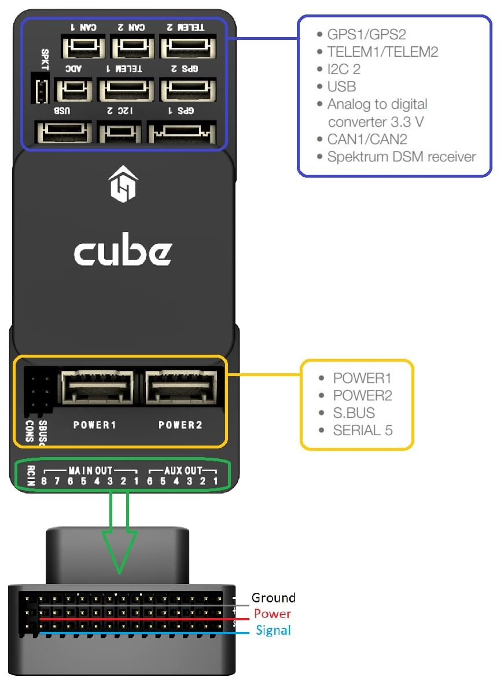
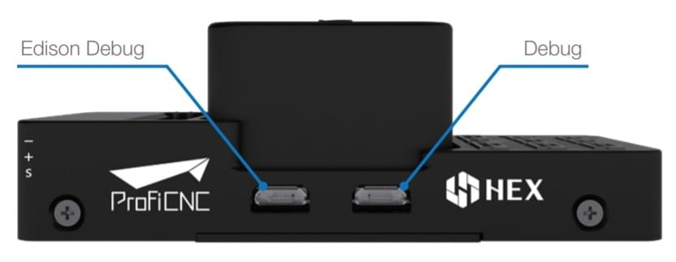
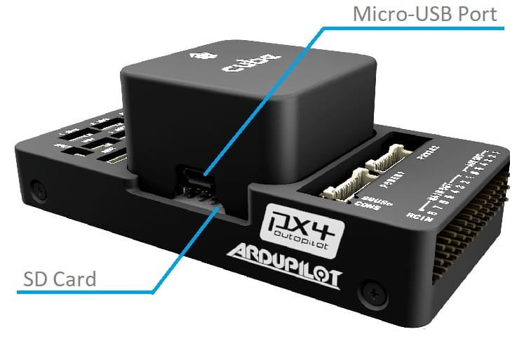

# Hex Cube Black 비행 컨트롤러

:::warning
PX4 does not manufacture this (or any) autopilot.
Contact the [manufacturer](https://cubepilot.org/#/home) for hardware support or compliance issues.
:::

:::tip
The [Cube Orange](cubepilot_cube_orange.md) is the successor to this product.
We recommend however to consider products built on industry standards, such as the [Pixhawk Standards](autopilot_pixhawk_standard.md).
이 비행 컨트롤러는 표준을 따르지 않으며, 특허받은 커넥터를 사용합니다.
:::

The [Hex Cube Black](http://www.proficnc.com/61-system-kits2) flight controller (previously known as Pixhawk 2.1) is a flexible autopilot intended primarily for manufacturers of commercial systems.
It is based on the [Pixhawk-project](https://pixhawk.org/) **FMUv3** open hardware design and runs PX4 on the [NuttX](https://nuttx.apache.org/) OS.


배선을 줄이고 신뢰성을 높이며 조립을 쉽게하기 위해 도메인별 캐리어 보드와 함께 사용하도록 설계되었습니다.
For example, a carrier board for a commercial inspection vehicle might include connections for a companion computer,
while a carrier board for a racer could includes ESCs form the frame of the vehicle.

Cube에는 2 개의 IMU에 진동 차단이 포함되어 있으며, 세 번째 고정 IMU는 참조 백업용으로 사용됩니다.

:::info
The manufacturer [Cube Docs](https://docs.cubepilot.org/user-guides/autopilot/the-cube-module-overview) contain detailed information, including an overview of the [Differences between Cube Colours](https://docs.cubepilot.org/user-guides/autopilot/the-cube-module-overview#differences-between-cube-colours).
:::

:::tip
This autopilot is [supported](../flight_controller/autopilot_pixhawk_standard.md) by the PX4 maintenance and test teams.
:::

## 주요 특징

- 32bit STM32F427 [Cortex-M4F](http://en.wikipedia.org/wiki/ARM_Cortex-M#Cortex-M4)<sup>&reg;</sup> core with FPU
- 168 MHz / 252 MIPS
- 256 KB RAM
- 2MB 플래시 \(완전 액세스 가능\)
- 32 비트 STM32F103 failsafe 코 프로세서
- 14 개 PWM/서보 출력(페일세이프 및 수동 오버라이드 포함 8 개, 보조, 고전력 호환 6 개)
- 추가 주변 장치(UART, I2C, CAN) 다양한 연결 옵션
- 전용 프로세서와 독립형 전원 공급 장치(고정익 적용)로 비행중 복구 기능과 수동 오버라이드 통합 백업 시스템
- Backup system integrates mixing, providing consistent autopilot and manual override mixing modes (fixed-wing use)
- 중복 전원공급장치 및 자동 장애 조치
- 외부 안전 스위치
- 다색 LED 주시각 표시기
- 고전력 멀티톤 피에조 오디오 표시기
- 장기간 고속 로깅용 microSD 카드

<a id="stores"></a>

## 구매처

[Cube Black](http://www.proficnc.com/61-system-kits) (ProfiCNC)

## 조립

[Cube Wiring Quickstart](../assembly/quick_start_cube.md)

## 사양

### 프로세서

- 32bit STM32F427 [Cortex M4](http://en.wikipedia.org/wiki/ARM_Cortex-M#Cortex-M4) core with FPU
- 168 MHz / 252 MIPS
- 256 KB RAM
- 2MB 플래시 (완전 액세스 가능)
- 32 비트 STM32F103 failsafe 코 프로세서

### 센서

- TBA

### 인터페이스

- UART (직렬 포트) 5개, 1 개의 고전력 지원, 2x (HW 흐름 제어 포함)
- CAN 2개(하나는 내부 3.3V 트랜시버, 하나는 확장 커넥터에 있음)
- Spektrum DSM/DSM2/DSM-X® Satellite 호환 입력
- Futaba S.BUS® 호환 입력 및 출력
- PPM 합계 신호 입력
- RSSI(PWM 또는 전압) 입력
- I2C
- SPI
- 3.3v ADC 입력
- 내부 microUSB 포트 및 외부 microUSB 포트 확장

### 전력 시스템 및 보호

- 자동 복구 기능의 이상적인 다이오드 컨트롤러
- Servo rail high-power (max. 10V) and high-current (10A+) ready
- 모든 주변 장치 출력 과전류 보호, 모든 입력 ESD 보호

### 정격 전압

Pixhawk 는 3 개의 전원이 공급되는 경우에는 전원 공급 장치의 3중 중복이 가능합니다. 세 개의 레일은 전원 모듈 입력, 서보 레일 입력과 USB 입력입니다.

#### 정상 작동 최대 정격 전압

이러한 조건에서 전원은 아래의 순서대로 시스템에 전원을 공급하여야합니다.

- 전원 모듈 입력 (4.8V ~ 5.4V)
- Servo rail input (4.8V to 5.4V) **UP TO 10V FOR MANUAL OVERRIDE, BUT AUTOPILOT PART WILL BE UNPOWERED ABOVE 5.7V IF POWER MODULE INPUT IS NOT PRESENT**
- USB 전원 입력 (4.8V ~ 5.4V)

#### 절대 최대 정격 전압

아래의 조건에서 시스템은 전원을 사용하지 않지만(작동하지 않음), 그대로 유지됩니다.

- 전원 모듈 입력(4.1V ~ 5.7V, 0V ~ 20V 손상되지 않음)
- 서보 레일 입력(4.1V ~ 5.7V, 0V ~ 20V)
- USB 전원 입력(4.1V ~ 5.7V, 0V ~ 6V)

## 핀배열과 회로도

Board schematics and other documentation can be found here: [The Cube Project](https://github.com/proficnc/The-Cube).

## 포트

### 위쪽(GPS, TELEM 등)



<a id="serial_ports"></a>

### 시리얼 포트 매핑

| UART   | 장치         | 포트                                |
| ------ | ---------- | --------------------------------- |
| USART1 | /dev/ttyS0 | <!-- IO debug? -->                |
| USART2 | /dev/ttyS1 | TELEM1 (흐름 제어) |
| USART3 | /dev/ttyS2 | TELEM2 (흐름 제어) |
| UART4  | /dev/ttyS3 | GPS1                              |
| USART6 | /dev/ttyS4 | PX4IO                             |
| UART7  | /dev/ttyS5 | 콘솔                                |
| UART8  | /dev/ttyS6 | <!-- unknown -->                  |

<!-- Note: Got ports using https://github.com/PX4/PX4-user_guide/pull/672#issuecomment-598198434 -->

<!-- This originally said " **TEL4:** /dev/ttyS6 (ttyS4 UART):  **Note** `TEL4` is labeled as `GPS2` on Cube." -->

### 디버그 포트



### USB/SDCard 포트



## 펌웨어 빌드

:::tip
Most users will not need to build this firmware!
It is pre-built and automatically installed by _QGroundControl_ when appropriate hardware is connected.
:::

To [build PX4](../dev_setup/building_px4.md) for this target:

```
make px4_fmu-v3_default
```

## 문제점

Cube Black의 CAN1과 CAN2의 실크 스크린이 뒤집힙니다 (CAN1은 CAN2이고 그 반대의 경우도 마찬가지임).

## 추가 정보 및 문서

- [Cube Wiring Quickstart](../assembly/quick_start_cube.md)
- Cube 문서 (제조사) :
  - [Cube Module Overview](https://docs.cubepilot.org/user-guides/autopilot/the-cube-module-overview)
  - [Cube User Manual](https://docs.cubepilot.org/user-guides/autopilot/the-cube-user-manual)
  - [Mini Carrier Board](https://docs.cubepilot.org/user-guides/carrier-boards/mini-carrier-board)
