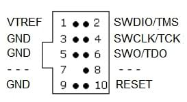

# 3DR Pixhawk 1 비행 콘트롤러 (단종됨)

:::warning
This flight controller has been [discontinued](../flight_controller/autopilot_experimental.md) and is no longer commercially available.
You can use the [mRo Pixhawk](../flight_controller/mro_pixhawk.md) as a drop-in replacement.
:::

:::warning
PX4 does not manufacture this (or any) autopilot.
지원 또는 규정준수 문제는 제조업체에 문의하십시오.
:::

The _3DR Pixhawk<sup>&reg;</sup> 1_ autopilot is a popular general purpose flight controller based on the [Pixhawk-project](https://pixhawk.org/) **FMUv2** open hardware design (it combines the functionality of the PX4FMU + PX4IO).
It runs PX4 on the [NuttX](https://nuttx.apache.org/) OS.


Assembly/setup instructions for use with PX4 are provided here: [Pixhawk Wiring Quickstart](../assembly/quick_start_pixhawk.md)

## 주요 특징

- Main System-on-Chip: [STM32F427](http://www.st.com/web/en/catalog/mmc/FM141/SC1169/SS1577/LN1789)
  - CPU : 단정밀도 FPU의 180MHz ARM<sup>&reg;</sup> Cortexex<sup>&reg;</sup>  M4
  - RAM : 256KB SRAM (L1)
- 페일세이프 시스템 온칩 : STM32F100
  - CPU: 24 MHz ARM Cortex M3
  - RAM : 8KB SRAM
- Wifi: ESP8266 외장형
- GPS: u-blox<sup>&reg;</sup> 7/8 (Hobbyking<sup>&reg;</sup>) / u-blox 6 (3D Robotics)
- Optical flow: [PX4 Flow unit](../sensor/px4flow.md)
- 중복 전원공급장치 및 자동 장애 조치
- 외부 안전 스위치
- 다색 LED 주시각 표시기
- 고전력 멀티톤 피에조 오디오 표시기
- 장기간 고속 로깅용 microSD 카드

연결성

- I2C 1개
- CAN 1개 (2개는 옵션)
- ADC 1개
- UART 4개 (흐름 제어 2개 포함)
- 콘솔 1개
- 수동 오버라이드 기능이 있는 PWM 8개
- 6개 PWM / GPIO / PWM 입력
- S.BUS / PPM / Spektrum 입력
- S.BUS 출력

# 구매처

원래 3DR&reg;에서 제조하였습니다.
이 보드는 PX4&reg;의 최초 표준 마이크로 콘트롤러 플랫폼이었습니다. While the board is no longer manufactured by 3DR, you can use the [mRo Pixhawk](../flight_controller/mro_pixhawk.md) as a drop-in replacement.

mRo Pixhawk 주문:

- [Bare Bones](https://store.mrobotics.io/Genuine-PixHawk-1-Barebones-p/mro-pixhawk1-bb-mr.htm) - Just the board (useful as a 3DR Pixhawk replacement)
- [mRo Pixhawk 2.4.6 Essential Kit](https://store.mrobotics.io/Genuine-PixHawk-Flight-Controller-p/mro-pixhawk1-minkit-mr.htm) - includes everything except for telemetry radios
- [mRo Pixhawk 2.4.6 Cool Kit! (Limited edition)](https://store.mrobotics.io/product-p/mro-pixhawk1-fullkit-mr.htm) - includes everything you need including telemetry radios

## 사양

### 프로세서

- 32bit STM32F427 [Cortex-M4F](http://en.wikipedia.org/wiki/ARM_Cortex-M#Cortex-M4) core with FPU
- 168 MHz
- 256 KB RAM
- 2 MB Flash
- 32 비트 STM32F103 failsafe 코 프로세서

### 센서

- ST Micro L3GD20H  3축 16비트 자이로스코프
- ST 마이크로 LSM303D 14 비트 가속도계/자력계
- Invensense MPU 6000 3축 가속도계/자이로스코프
- MEAS MS5611 기압계

### 인터페이스

- UART (직렬 포트) 5개, 1 개의 고전력 지원, 2x (HW 흐름 제어 포함)
- CAN 2개(하나는 내부 3.3V 트랜시버, 하나는 확장 커넥터에 있음)
- Spektrum DSM/DSM2/DSM-X® Satellite 호환 입력
- Futaba S.BUS® 호환 입력 및 출력
- PPM 합계 신호 입력
- RSSI(PWM 또는 전압) 입력
- I2C
- SPI
- 3.3 및 6.6V ADC 입력
- 내부 microUSB 포트 및 외부 microUSB 포트 확장

<lite-youtube videoid="gCCC5A-Bvv4" title="PX4 Pixhawk (3DR) Multicolor Led in action"/>

### 전력 시스템 및 보호

- 자동 복구 기능의 이상적인 다이오드 컨트롤러
- Servo rail high-power (max. 10V) and high-current (10A+) ready
- 모든 주변 장치 출력 과전류 보호, 모든 입력 ESD 보호

## 정격 전압

Pixhawk 는 3 개의 전원이 공급되는 경우에는 전원 공급 장치의 3중 중복이 가능합니다. 세 개의 레일은 전원 모듈 입력, 서보 레일 입력과 USB 입력입니다.

### 정상 작동 최대 정격 전압

이러한 조건에서 전원은 아래의 순서대로 시스템에 전원을 공급하여야합니다.

- 전원 모듈 입력 (4.8V ~ 5.4V)
- Servo rail input (4.8V to 5.4V) **UP TO 10V FOR MANUAL OVERRIDE, BUT AUTOPILOT PART WILL BE UNPOWERED ABOVE 5.7V IF POWER MODULE INPUT IS NOT PRESENT**
- USB 전원 입력 (4.8V ~ 5.4V)

### 절대 최대 정격 전압

아래의 조건에서 시스템은 전원을 사용하지 않지만(작동하지 않음), 그대로 유지됩니다.

- 전원 모듈 입력(4.1V ~ 5.7V, 0V ~ 20V 손상되지 않음)
- 서보 레일 입력(4.1V ~ 5.7V, 0V ~ 20V)
- USB 전원 입력(4.1V ~ 5.7V, 0V ~ 6V)

## 회로도

[FMUv2 + IOv2 schematic](https://raw.githubusercontent.com/PX4/Hardware/master/FMUv2/PX4FMUv2.4.5.pdf) -- Schematic and layout

:::info
As a CC-BY-SA 3.0 licensed Open Hardware design, all schematics and design files are [available](https://github.com/PX4/Hardware).
:::

## 연결

Pixhawk ports are shown below.
These use Hirose DF13 connectors (predating the JST-GH connectors defined in the Pixhawk connector standard).

:::warning
Many 3DR Pixhawk clones use Molex picoblade connectors instead of DF13 connectors.
They have rectangular instead of square pins, and cannot be assumed to be compatible.
:::


:::tip
The `RC IN` port is for RC receivers only and provides sufficient power for that purpose.
**NEVER** connect any servos, power supplies or batteries to it or to the receiver connected to it.
:::

## 핀배열

#### TELEM1, TELEM2 포트

| 핀                         | 신호                          | 전압                    |
| ------------------------- | --------------------------- | --------------------- |
| 1(red) | VCC                         | +5V                   |
| 2 (흑)  | TX (출력)  | +3.3V |
| 3 (흑)  | RX (입력)  | +3.3V |
| 4 (흑)  | CTS (입력) | +3.3V |
| 5 (흑)  | RTS (출력) | +3.3V |
| 6 (흑)  | GND                         | GND                   |

#### GPS 포트

| 핀                         | 신호                         | 전압                    |
| ------------------------- | -------------------------- | --------------------- |
| 1(red) | VCC                        | +5V                   |
| 2 (흑)  | TX (출력) | +3.3V |
| 3 (흑)  | RX (입력) | +3.3V |
| 4 (흑)  | CAN2 TX                    | +3.3V |
| 5 (흑)  | CAN2 RX                    | +3.3V |
| 6 (흑)  | GND                        | GND                   |

#### SERIAL 4/5 포트

공간 제약으로 인하여 두 개의 포트가 하나의 커넥터에 있습니다.

| 핀                         | 신호                         | 전압                    |
| ------------------------- | -------------------------- | --------------------- |
| 1(red) | VCC                        | +5V                   |
| 2 (흑)  | TX (#4) | +3.3V |
| 3 (흑)  | RX (#4) | +3.3V |
| 4 (흑)  | TX (#5) | +3.3V |
| 5 (흑)  | RX (#5) | +3.3V |
| 6 (흑)  | GND                        | GND                   |

#### ADC 6.6V

| 핀                         | 신호     | 전압                       |
| ------------------------- | ------ | ------------------------ |
| 1(red) | VCC    | +5V                      |
| 2 (흑)  | ADC 입력 | 최대 +6.6V |
| 3 (흑)  | GND    | GND                      |

#### ADC 3.3V

| 핀                         | 신호     | 전압                       |
| ------------------------- | ------ | ------------------------ |
| 1(red) | VCC    | +5V                      |
| 2 (흑)  | ADC 입력 | 최대 +3.3V |
| 3 (흑)  | GND    | GND                      |
| 4 (흑)  | ADC 입력 | 최대 +3.3V |
| 5 (흑)  | GND    | GND                      |

#### I2C

| 핀                         | 신호  | 전압                                           |
| ------------------------- | --- | -------------------------------------------- |
| 1(red) | VCC | +5V                                          |
| 2 (흑)  | SCL | +3.3 (풀업) |
| 3 (흑)  | SDA | +3.3 (풀업) |
| 4 (흑)  | GND | GND                                          |

#### CAN

| 핀                         | 신호                         | 전압   |
| ------------------------- | -------------------------- | ---- |
| 1(red) | VCC                        | +5V  |
| 2 (흑)  | CAN_H | +12V |
| 3 (흑)  | CAN_L | +12V |
| 4 (흑)  | GND                        | GND  |

#### SPI

| 핀                         | 신호                                                     | 전압                   |
| ------------------------- | ------------------------------------------------------ | -------------------- |
| 1(red) | VCC                                                    | +5V                  |
| 2 (흑)  | SPI_EXT_SCK  | +3.3 |
| 3 (흑)  | SPI_EXT_MISO | +3.3 |
| 4 (흑)  | SPI_EXT_MOSI | +3.3 |
| 5 (흑)  | !SPI_EXT_NSS | +3.3 |
| 6 (흑)  | !GPIO_EXT                         | +3.3 |
| 7 (흑)  | GND                                                    | GND                  |

#### 전원

| 핀                         | 신호      | 전압                    |
| ------------------------- | ------- | --------------------- |
| 1(red) | VCC     | +5V                   |
| 2 (흑)  | VCC     | +5V                   |
| 3 (흑)  | CURRENT | +3.3V |
| 4 (흑)  | VOLTAGE | +3.3V |
| 5 (흑)  | GND     | GND                   |
| 6 (흑)  | GND     | GND                   |

#### 스위치

| 핀                         | 신호                                                       | 전압                    |
| ------------------------- | -------------------------------------------------------- | --------------------- |
| 1(red) | VCC                                                      | +3.3V |
| 2 (흑)  | !IO_LED_SAFETY | GND                   |
| 3 (흑)  | SAFETY                                                   | GND                   |

## 시리얼 포트 매핑

| UART   | 장치         | 포트                                |
| ------ | ---------- | --------------------------------- |
| UART1  | /dev/ttyS0 | IO 디버그                            |
| USART2 | /dev/ttyS1 | TELEM1 (흐름 제어) |
| USART3 | /dev/ttyS2 | TELEM2 (흐름 제어) |
| UART4  |            |                                   |
| UART7  | 콘솔         |                                   |
| UART8  | SERIAL4    |                                   |

<!-- Note: Got ports using https://github.com/PX4/PX4-user_guide/pull/672#issuecomment-598198434 -->

## 디버그 포트

### 콘솔 포트

The [PX4 System Console](../debug/system_console.md) runs on the port labeled [SERIAL4/5](#serial-4-5-port).

:::tip
A convenient way to connect to the console is to use a [Dronecode probe](https://kb.zubax.com/display/MAINKB/Dronecode+Probe+documentation), as it comes with connectors that can be used with several different Pixhawk devices.
Simply connect the 6-pos DF13 1:1 cable on the [Dronecode probe](https://kb.zubax.com/display/MAINKB/Dronecode+Probe+documentation) to the Pixhawk `SERIAL4/5` port.


:::

The pinout is standard serial pinout, designed to connect to a [3.3V FTDI](https://www.digikey.com/en/products/detail/TTL-232R-3V3/768-1015-ND/1836393) cable (5V tolerant).

| 3DR Pixhawk 1 |                            | FTDI |                                 |
| ------------- | -------------------------- | ---- | ------------------------------- |
| 1             | +5V (적) |      | N/C                             |
| 2             | S4 Tx                      |      | N/C                             |
| 3             | S4 Rx                      |      | N/C                             |
| 4             | S5 Tx                      | 5    | FTDI RX (황)  |
| 5             | S5 Rx                      | 4    | FTDI TX (적황) |
| 6             | GND                        | 1    | FTDI GND (흑) |

6 핀 DF13 1 : 1 커넥터에 대한 FTDI 케이블의 배선은 아래 그림과 같습니다.


전체 배선은 아래와 같습니다.


:::info
For information on how to _use_ the console see: [System Console](../debug/system_console.md).
:::

### SWD 포트

The [SWD](../debug/swd_debug.md) (JTAG) ports are hidden under the cover (which must be removed for hardware debugging).
아래에 강조 표시된 것처럼 FMU와 IO를 위한 별도의 포트가 존재합니다.


포트는 ARM 10핀 JTAG 커넥터이므로 납땜이 필요합니다.
포트의 핀배열은 아래와 같습니다(위 모서리의 사각형 마커는 핀 1을 나타냄).



:::info
All Pixhawk FMUv2 boards have a similar SWD port.
:::

## 펌웨어 빌드

:::tip
Most users will not need to build this firmware!
It is pre-built and automatically installed by _QGroundControl_ when appropriate hardware is connected.
:::

To [build PX4](../dev_setup/building_px4.md) for this target:

```
make px4_fmu-v2_default
```

## 부품 / 하우징

- **ARM MINI JTAG (J6)**: 1.27 mm 10pos header (SHROUDED), for Black Magic Probe: FCI 20021521-00010D4LF ([Distrelec](https://www.distrelec.ch/en/minitek-127-straight-male-pcb-header-surface-mount-rows-10-contacts-27mm-pitch-amphenol-fci-20021521-00010d4lf/p/14352308), [Digi-Key](https://www.digikey.com/en/products/detail/20021521-00010T1LF/609-4054-ND/2414951),) or Samtec FTSH-105-01-F-DV-K (untested) or Harwin M50-3600542 ([Digikey](https://www.digikey.com/en/products/detail/harwin-inc/M50-3600542/2264370) or [Mouser](http://ch.mouser.com/ProductDetail/Harwin/M50-3600542/?qs=%2fha2pyFadujTt%2fIEz8xdzrYzHAVUnbxh8Ki%252bwWYPNeEa09PYvTkIOQ%3d%3d))
  - JTAG Adapter Option #1: [BlackMagic Probe](https://1bitsquared.com/products/black-magic-probe). 케이블 없이 제공될 수 있습니다 (제조업체에 확인).
    If so, you will need the **Samtec FFSD-05-D-06.00-01-N** cable ([Samtec sample service](https://www.samtec.com/products/ffsd-05-d-06.00-01-n) or Digi-Key Link: SAM8218-ND) or Tag Connect Ribbon and a Mini-USB cable.
  - JTAG Adapter Option #2: [Digi-Key Link: ST-LINK/V2](https://www.digikey.com/product-detail/en/stmicroelectronics/ST-LINK-V2/497-10484-ND) / [ST USER MANUAL](http://www.st.com/internet/com/TECHNICAL_RESOURCES/TECHNICAL_LITERATURE/USER_MANUAL/DM00026748.pdf), needs an ARM Mini JTAG to 20pos adapter: [Digi-Key Link: 726-1193-ND](https://www.digikey.com/en/products/detail/texas-instruments/MDL-ADA2/1986451)
  - JTAG Adapter Option #3: [SparkFun Link: Olimex ARM-TINY](http://www.sparkfun.com/products/8278) or any other OpenOCD-compatible ARM Cortex JTAG adapter, needs an ARM Mini JTAG to 20pos adapter: [Digi-Key Link: 726-1193-ND](https://www.digikey.com/en/products/detail/texas-instruments/MDL-ADA2/1986451)
- **USARTs**: Hirose DF13 6 pos ([Digi-Key Link: DF13A-6P-1.25H(20)](https://www.digikey.com/products/en?keywords=H3371-ND))
  - Mates: Hirose DF13 6 pos housing ([Digi-Key Link: Hirose DF13-6S-1.25C](https://www.digikey.com/products/en?keywords=H2182-ND))
- **I2C and CAN**: Hirose DF13 4 pos ([Digi-Key Link: DF13A-4P-1.25H(20)](https://www.digikey.com/en/products/detail/hirose-electric-co-ltd/DF13A-4P-1-25H-20/530666) - discontinued)

## 지원 플랫폼 및 기체

일반 RC 서보 또는 Futaba S-Bus 서보로 제어 가능한 모든 멀티콥터/비행기/로버 또는 보트.
