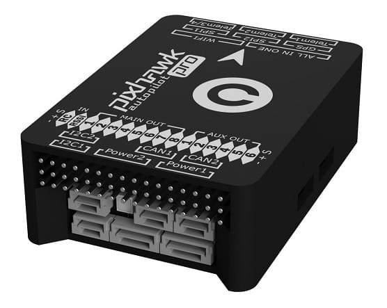
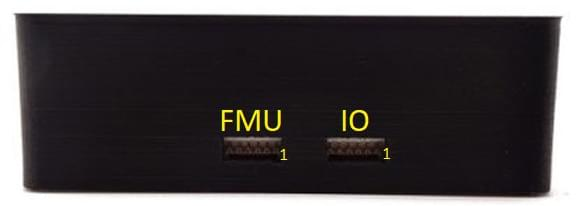

# Pixhawk 3 Pro (Discontinued)

:::warning
PX4 does not manufacture this (or any) autopilot.
Contact the [manufacturer](https://store-drotek.com/) for hardware support or compliance issues.
:::

Pixhawk<sup>&reg;</sup> 3 Pro는 일부 업그레이드와 기능이 추가된 FMUv4 하드웨어 설계 (Pixracer)를 기반으로합니다.
The board was designed by [Drotek<sup>&reg;</sup>](https://drotek.com) and PX4.



:::info
The main hardware documentation is here: https://drotek.gitbook.io/pixhawk-3-pro/hardware
:::

:::tip
This autopilot is [supported](../flight_controller/autopilot_pixhawk_standard.md) by the PX4 maintenance and test teams.
:::

## 요약

- Microcontroller: **STM32F469**; Flash size is **2MiB**, RAM size is **384KiB**
- **ICM-20608-G** gyro / accelerometer
- **MPU-9250** gyro / accelerometer / magnetometer
- **LIS3MDL** compass
- 2개의 SPI 버스를 통해 연결된 센서(고속 버스 1개와 저잡음 버스 1개)
- 2개의 I2C 버스
- CAN 버스 2 개
- 2 개의 전원 모듈에서 전압 / 배터리 판독
- FrSky<sup>&reg;</sup> 인버터
- 메인 8 개 + AUX PWM 출력 6개(개별 IO 칩, PX4IO)
- microSD (로깅)
- S.BUS / Spektrum / SUMD / PPM 입력
- JST GH 사용자 친화적 커넥터 : Pixracer와 동일한 커넥터와 핀배열

## 구매처

From [Drotek store](https://store.drotek.com/) (EU) :

- [Pixhawk 3 Pro (Pack)](https://store.drotek.com/autopilots/844-pixhawk-3-pro-pack.html)
- [Pixhawk 3 Pro](https://store.drotek.com/autopilots/821-pixhawk-pro-autopilot-8944595120557.html)

From [readymaderc](https://www.readymaderc.com) (USA) :

- [Pixhawk 3 Pro](https://www.readymaderc.com/products/details/pixhawk-3-pro-flight-controller)

## 펌웨어 빌드

:::tip
Most users will not need to build this firmware!
It is pre-built and automatically installed by _QGroundControl_ when appropriate hardware is connected.
:::

To [build PX4](../dev_setup/building_px4.md) for this target:

```
make px4_fmu-v4pro_default
```

## 디버그 포트

보드에는 아래와 같은 FMU와 IO 디버그 포트가 있습니다.



The pinouts and connector comply with the [Pixhawk Debug Mini](../debug/swd_debug.md#pixhawk-debug-mini) interface defined in the [Pixhawk Connector Standard](https://github.com/pixhawk/Pixhawk-Standards/blob/master/DS-009%20Pixhawk%20Connector%20Standard.pdf) (JST SM06B connector).

| 핀                         | 신호                                 | 전압                    |
| ------------------------- | ---------------------------------- | --------------------- |
| 1(red) | VCC TARGET SHIFT                   | +3.3V |
| 2 (흑)  | CONSOLE TX (출력) | +3.3V |
| 3 (흑)  | CONSOLE RX (입력) | +3.3V |
| 4 (흑)  | SWDIO                              | +3.3V |
| 5 (흑)  | SWCLK                              | +3.3V |
| 6 (흑)  | GND                                | GND                   |

이 포트의 배선과 사용 정보는 다음을 참조하십시오.

- [SWD Debug Port](../debug/swd_debug.md)
- [PX4 System Console](../debug/system_console.md#pixhawk_debug_port) (Note, the FMU console maps to UART7).

## 시리얼 포트 매핑

| UART   | 장치         | 포트                                |
| ------ | ---------- | --------------------------------- |
| UART1  | /dev/ttyS0 | 와이파이                              |
| USART2 | /dev/ttyS1 | TELEM1 (흐름 제어) |
| USART3 | /dev/ttyS2 | TELEM2 (흐름 제어) |
| UART4  |            |                                   |
| UART7  | 콘솔         |                                   |
| UART8  | SERIAL4    |                                   |

<!-- Note: Got ports using https://github.com/PX4/PX4-user_guide/pull/672#issuecomment-598198434 -->
