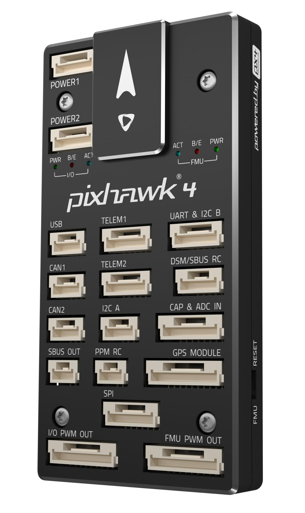
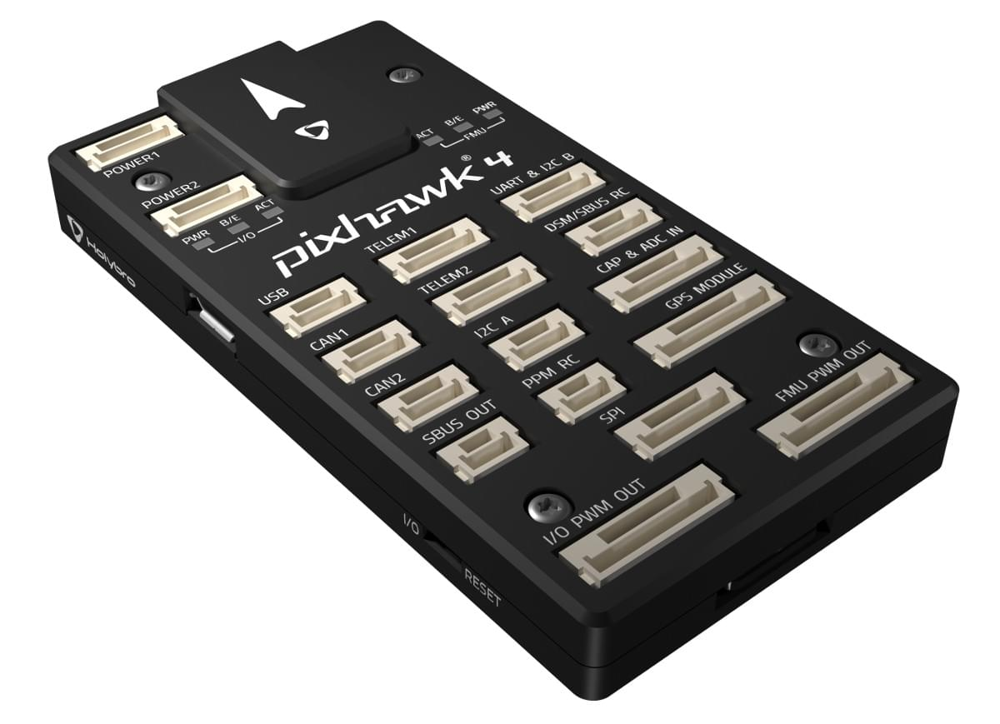
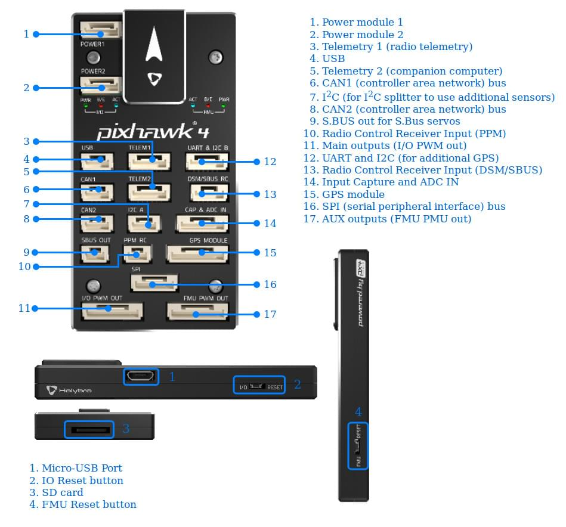
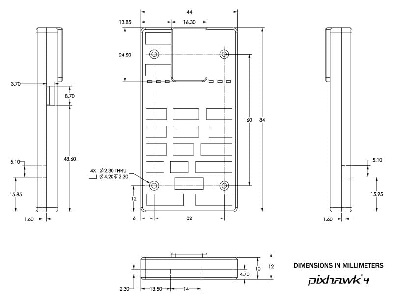
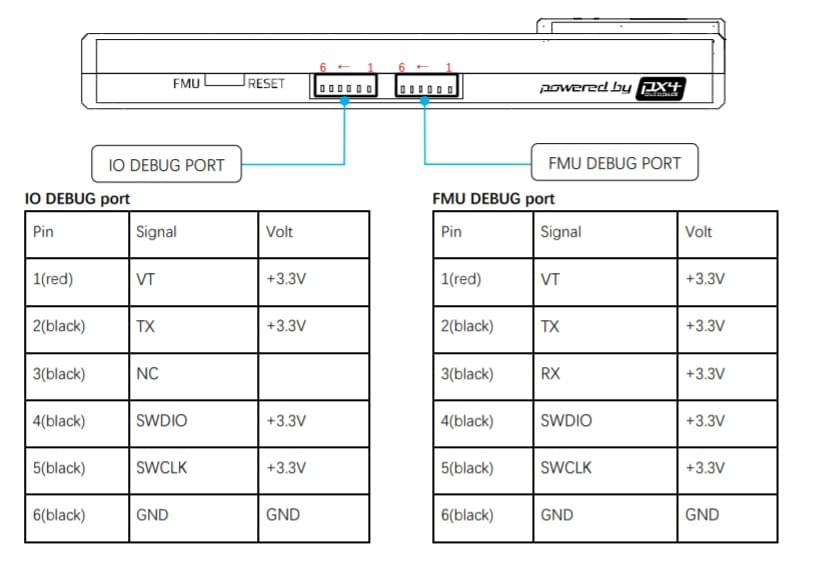

# Holybro Pixhawk 4

:::warning
PX4 does not manufacture this (or any) autopilot.
Contact the [manufacturer](https://holybro.com/) for hardware support or compliance issues.
:::

_Pixhawk 4_<sup>&reg;</sup> is an advanced autopilot designed and made in collaboration with Holybro<sup>&reg;</sup> and the PX4 team.
PX4 v1.7 이상의 버전 실행에 최적화되어 있으며, 학계와 업계 개발자에게 적합합니다.

It is based on the [Pixhawk-project](https://pixhawk.org/) **FMUv5** open hardware design and runs PX4 on the [NuttX](https://nuttx.apache.org/) OS.

 

:::tip
This autopilot is [supported](../flight_controller/autopilot_pixhawk_standard.md) by the PX4 maintenance and test teams.
:::

## 요약

- 메인 FMU 프로세서: STM32F765
  - 32 비트 Arm® Cortex®-M7, 216MHz, 2MB 메모리, 512KB RAM
- IO 프로세서: STM32F100
  - 32 비트 Arm® Cortex®-M3, 24MHz, 8KB SRAM
- 내장 센서 :
  - 가속도/자이로: ICM-20689
  - Accel/Gyro: BMI055 or ICM20602
  - 자력계 : IST8310
  - 기압계: MS5611
- GPS: u-blox Neo-M8N GPS/GLONASS 수신기; 통합 자력계 IST8310
- 인터페이스:
  - PWM 출력 8-16개(IO에서 8개, FMU에서 8개)
  - FMU의 전용 PWM/캡처 입력 3 개
  - CPPM 전용 RC 입력
  - 아날로그/PWM RSSI 입력이있는 Spektrum/DSM 및 S.Bus 전용 RC 입력
  - Dedicated S.Bus servo output
  - 범용 시리얼 포트 5개
  - I2C 포트 3개
  - SPI 버스 4개
  - 직렬 ESC를 사용하는 듀얼 CAN에 최대 2 개의 CAN 버스
  - 배터리 2 개의 전압 및 전류에 대한 아날로그 입력
- 전원시스템
  - 전원 모듈 출력: 4.9~5.5V
  - USB 전원 입력: 4.75~5.25V
  - 서보 레일 입력: 0~36V
- 중량과 크기
  - 무게: 15.8g
  - 크기: 44x84x12mm
- 기타 특성:
  - 작동 온도: -40 ~ 85°c

Additional information can be found in the [Pixhawk 4 Technical Data Sheet](https://github.com/PX4/PX4-user_guide/raw/main/assets/flight_controller/pixhawk4/pixhawk4_technical_data_sheet.pdf).

## 구매처

Order from [Holybro](https://holybro.com/products/pixhawk-4).

## 커넥터



:::warning
The **DSM/SBUS RC** and **PPM RC** ports are for RC receivers only.
이 포트들에는 전원이 공급됩니다. 서보를 전원공급장치나 배터리(또는 연결된 수신기)에 절대 연결하지 마십시오.
:::

## 핀배열

Download _Pixhawk 4_ pinouts from [here](https://cdn.shopify.com/s/files/1/0604/5905/7341/files/Pixhawk4-Pinouts.pdf).

:::info
Connector pin assignments are left to right (i.e. Pin 1 is the left-most pin).
The exception is the [debug port(s)](#debug_port) (pin 1 is the right-most, as shown below).
:::

## 시리얼 포트 매핑

| UART   | 장치         | 포트                                |
| ------ | ---------- | --------------------------------- |
| UART1  | /dev/ttyS0 | GPS                               |
| USART2 | /dev/ttyS1 | TELEM1 (흐름 제어) |
| USART3 | /dev/ttyS2 | TELEM2 (흐름 제어) |
| UART4  | /dev/ttyS3 | TELEM4                            |
| USART6 | /dev/ttyS4 | RC SBUS                           |
| UART7  | /dev/ttyS5 | 디버그 콘솔                            |
| UART8  | /dev/ttyS6 | PX4IO                             |

## 크기



## 정격 전압

_Pixhawk 4_ can be triple-redundant on the power supply if three power sources are supplied. The three power rails are: **POWER1**, **POWER2** and **USB**.

:::info
The output power rails **FMU PWM OUT** and **I/O PWM OUT** (0V to 36V) do not power the flight controller board (and are not powered by it).
You must supply power to one of **POWER1**, **POWER2** or **USB** or the board will be unpowered.
:::

**Normal Operation Maximum Ratings**

이러한 조건에서 전원은 아래의 순서대로 시스템에 전원을 공급하여야합니다.

1. **POWER1** and **POWER2** inputs (4.9V to 5.5V)
2. **USB** input (4.75V to 5.25V)

**Absolute Maximum Ratings**

아래의 조건에서 시스템은 전원을 사용하지 않지만(작동하지 않음), 그대로 유지됩니다.

1. **POWER1** and **POWER2** inputs (operational range 4.1V to 5.7V, 0V to 10V undamaged)
2. **USB** input (operational range 4.1V to 5.7V, 0V to 6V undamaged)
3. Servo input: VDD_SERVO pin of **FMU PWM OUT** and **I/O PWM OUT** (0V to 42V undamaged)

## 조립 및 설정

The [Pixhawk 4 Wiring Quick Start](../assembly/quick_start_pixhawk4.md) provides instructions on how to assemble required/important peripherals including GPS, Power Management Board etc.

## 펌웨어 빌드

:::tip
Most users will not need to build this firmware!
It is pre-built and automatically installed by _QGroundControl_ when appropriate hardware is connected.
:::

To [build PX4](../dev_setup/building_px4.md) for this target:

```
make px4_fmu-v5_default
```

<a id="debug_port"></a>

## 디버그 포트

The [PX4 System Console](../debug/system_console.md) and [SWD interface](../debug/swd_debug.md) run on the **FMU Debug** port, while the I/O console and SWD interface can be accessed via **I/O Debug** port.
In order to access these ports, the user must remove the _Pixhawk 4_ casing.



The pinout uses the standard [Pixhawk debug connector pinout](https://github.com/pixhawk/Pixhawk-Standards/blob/master/DS-009%20Pixhawk%20Connector%20Standard.pdf).
배선 정보는 다음을 참조하십시오.

- [System Console > Pixhawk Debug Port](../debug/system_console.md#pixhawk_debug_port)

## 주변 장치

- [Digital Airspeed Sensor](https://store-drotek.com/793-digital-differential-airspeed-sensor-kit-.html)
- [Telemetry Radio Modules](../telemetry/index.md)
- [Rangefinders/Distance sensors](../sensor/rangefinders.md)

## 지원 플랫폼 및 기체

일반 RC 서보 또는 Futaba S-Bus 서보로 제어 가능한 모든 멀티콥터/비행기/로버 또는 보트.
The complete set of supported configurations can be seen in the [Airframes Reference](../airframes/airframe_reference.md).

## 추가 정보

- [Pixhawk 4 Technical Data Sheet](https://github.com/PX4/PX4-user_guide/raw/main/assets/flight_controller/pixhawk4/pixhawk4_technical_data_sheet.pdf)
- [FMUv5 reference design pinout](https://docs.google.com/spreadsheets/d/1-n0__BYDedQrc_2NHqBenG1DNepAgnHpSGglke-QQwY/edit#gid=912976165).
- [Pixhawk 4 Wiring QuickStart](../assembly/quick_start_pixhawk4.md)
- [Pixhawk 4 Pinouts](https://cdn.shopify.com/s/files/1/0604/5905/7341/files/Pixhawk4-Pinouts.pdf) (Holybro)
- [Pixhawk 4 Quick Start Guide](https://cdn.shopify.com/s/files/1/0604/5905/7341/files/Pixhawk4-quickstartguide.pdf) (Holybro)
