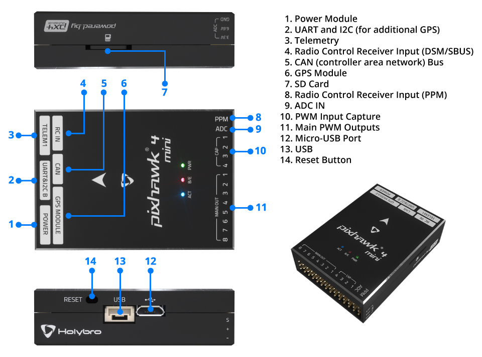
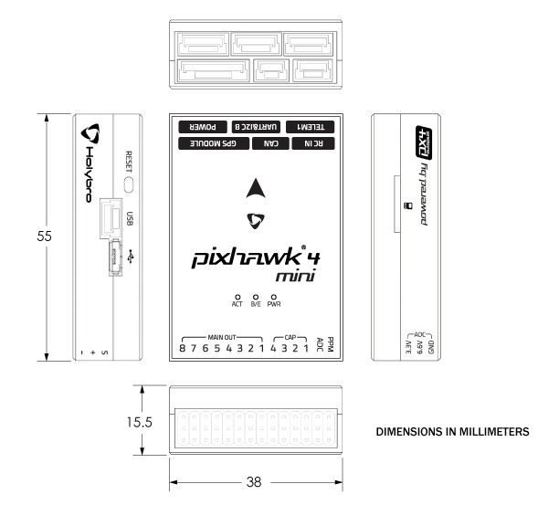
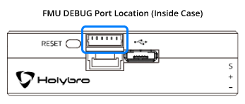

# Holybro Pixhawk 4 Mini (Discontinued)

:::warning
PX4 does not manufacture this (or any) autopilot.
Contact the [manufacturer](https://holybro.com/) for hardware support or compliance issues.
:::

The _Pixhawk<sup>&reg;</sup> 4 Mini_ autopilot is designed for engineers and hobbyists who are looking to tap into the power of _Pixhawk 4_ but are working with smaller drones.
_Pixhawk 4 Mini_ takes the FMU processor and memory resources from the _Pixhawk 4_ while eliminating interfaces that are normally unused.
This allows the _Pixhawk 4 Mini_ to be small enough to fit in a 250mm racer drone.

_Pixhawk 4 Mini_ was designed and developed in collaboration with Holybro<sup>&reg;</sup> and Auterion<sup>&reg;</sup>.
It is based on the [Pixhawk](https://pixhawk.org/) **FMUv5** design standard and is optimized to run PX4 flight control software.


:::tip
This autopilot is [supported](../flight_controller/autopilot_pixhawk_standard.md) by the PX4 maintenance and test teams.
:::

## 요약

- 메인 FMU 프로세서: STM32F765
  - 32 비트 Arm® Cortex®-M7, 216MHz, 2MB 메모리, 512KB RAM
- 내장 센서 :
  - 가속도/자이로: ICM-20689
  - Accel/Gyro: BMI055 or ICM20602
  - 자력계 : IST8310
  - 기압계: MS5611
- GPS: u-blox Neo-M8N GPS/GLONASS 수신기; 통합 자력계 IST8310
- 인터페이스:
  - 8 PWM 출력
  - FMU의 전용 PWM / 캡처 입력 4 개
  - CPPM 전용 RC 입력
  - 아날로그/PWM RSSI 입력이있는 Spektrum/DSM 및 S.Bus 전용 RC 입력
  - 범용 시리얼 포트 3개
  - I2C 포트 2개
  - SPI 버스 3개
  - CAN ESC용 CANBus 1개
  - 배터리 전압/전류에 대한 아날로그 입력
  - 2개의 추가 아날로그 입력
- 전원시스템
  - 파워 브릭 입력 : 4.75 ~ 5.5V
  - USB 전원 입력: 4.75~5.25V
  - 서보 레일 입력: 0~24V
  - 최대 전류 감지: 120A
- 중량과 크기
  - 중량: 37.2g
  - 크기: 38x55x15.5mm
- 기타 특성:
  - 작동 온도: -40 ~ 85°c

Additional information can be found in the [_Pixhawk 4 Mini_ Technical Data Sheet](https://github.com/PX4/PX4-user_guide/raw/main/assets/flight_controller/pixhawk4mini/pixhawk4mini_technical_data_sheet.pdf).

## 구매처

Order from [Holybro](https://holybro.com/collections/autopilot-flight-controllers/products/pixhawk4-mini).

## 인터페이스



:::warning
The **RC IN** and **PPM** ports are for RC receivers only. 이 포트들에는 전원이 공급됩니다. 서보를 전원공급장치나 배터리(또는 연결된 수신기)에 절대 연결하지 마십시오.
:::

## 핀배열

Download _Pixhawk 4 Mini_ pinouts from [here](https://github.com/PX4/PX4-user_guide/raw/main/assets/flight_controller/pixhawk4mini/pixhawk4mini_pinouts.pdf).

## 크기



## 정격 전압

_Pixhawk 4 Mini_ can have power supply redundancy — if two power sources are supplied. The power rails are: **POWER** and **USB**.

:::info
The output power rail of **MAIN OUT** does not power the flight controller board (and is not powered by it).
You must [supply power](../assembly/quick_start_pixhawk4_mini.md#power) to one of **POWER** or **USB** or the board will be unpowered.
:::

**Normal Operation Maximum Ratings**

이러한 조건에서 전원은 아래의 순서대로 시스템에 전원을 공급하여야합니다.

1. **POWER** (4.75V to 5.5V)
2. **USB** input (4.75V to 5.25V)

**Absolute Maximum Ratings**

이러한 조건에서 시스템은 그대로 유지됩니다.

1. **POWER** input (0V to 6V undamaged)
2. **USB** input (0V to 6V undamaged)
3. Servo input: VDD_SERVO pin of **MAIN OUT** (0V to 24V undamaged)

## 조립 및 설정

The [_Pixhawk 4 Mini_ Wiring Quick Start](../assembly/quick_start_pixhawk4_mini.md) provides instructions on how to assemble required/important peripherals including GPS, Power Management Board, etc.

## 펌웨어 빌드

:::tip
Most users will not need to build this firmware!
It is pre-built and automatically installed by _QGroundControl_ when appropriate hardware is connected.
:::

To [build PX4](../dev_setup/building_px4.md) for this target:

```
make px4_fmu-v5_default
```

## 디버그 포트

The [PX4 System Console](../debug/system_console.md) and [SWD interface](../debug/swd_debug.md) run on the **FMU Debug** port.
In order to access these ports, the user must remove the _Pixhawk 4 Mini_ casing.



The port has a standard serial pinout and can be connected to a standard FTDI cable (3.3V, but it's 5V tolerant) or a [Dronecode probe](https://kb.zubax.com/display/MAINKB/Dronecode+Probe+documentation). The pinout uses the standard [Pixhawk debug connector](https://github.com/pixhawk/Pixhawk-Standards/blob/master/DS-009%20Pixhawk%20Connector%20Standard.pdf) pinout. Please refer to the [wiring](../debug/system_console.md) page for details of how to wire up this port.

## 시리얼 포트 매핑

|  UART  |     장치     | QGC Parameter Description |            Port Label on FC           |
| :----: | :--------: | :-----------------------: | :-----------------------------------: |
|  UART1 | /dev/ttyS0 |            GPS1           |               GPS Module              |
| USART2 | /dev/ttyS1 |           TELEM1          |                 TELEM1                |
| USART3 | /dev/ttyS2 |           TELEM2          |                  해당없음                 |
|  UART4 | /dev/ttyS3 |       TELEM/SERIAL4       |               UART/l2C B              |
| USART6 | /dev/ttyS4 |            해당없음           |                 RC IN                 |
|  UART7 | /dev/ttyS5 |            해당없음           |                 Debug                 |
|  UART8 | /dev/ttyS6 |            해당없음           | 연결되지 않음 (PX4IO 없음) |

## 주변 장치

- [Digital Airspeed Sensor](https://holybro.com/products/digital-air-speed-sensor)
- [Telemetry Radio Modules](../telemetry/index.md)
- [Rangefinders/Distance sensors](../sensor/rangefinders.md)

## 지원 플랫폼

Motors and servos are connected to the **MAIN OUT** ports in the order specified for your vehicle in the [Airframe Reference](../airframes/airframe_reference.md).
이 참고사항은 모든 지원되는 기체 프레임의 출력 포트의 모터/서보 연결 리스트입니다. 프레임이 참고사항에 기재되어 있지 않다면, 올바른 유형의 "일반" 프레임을 사용하십시오.

:::warning
_Pixhawk 4 Mini_ does not have AUX ports.
이 보드는 8 개 이상의 포트가 필요하거나, 모터 또는 제어 표면에 AUX 포트를 사용하는 프레임에 사용할 수 없습니다.
비필수 주변 장치에 AUX를 사용하는 기체에 사용할 수 있습니다(예 : "RC AUX1 채널의 피드 스루").
:::

## 추가 정보

- [_Pixhawk 4 Mini_ Technical Data Sheet](https://github.com/PX4/PX4-user_guide/raw/main/assets/flight_controller/pixhawk4mini/pixhawk4mini_technical_data_sheet.pdf)
- [FMUv5 reference design pinout](https://docs.google.com/spreadsheets/d/1-n0__BYDedQrc_2NHqBenG1DNepAgnHpSGglke-QQwY/edit#gid=912976165).
