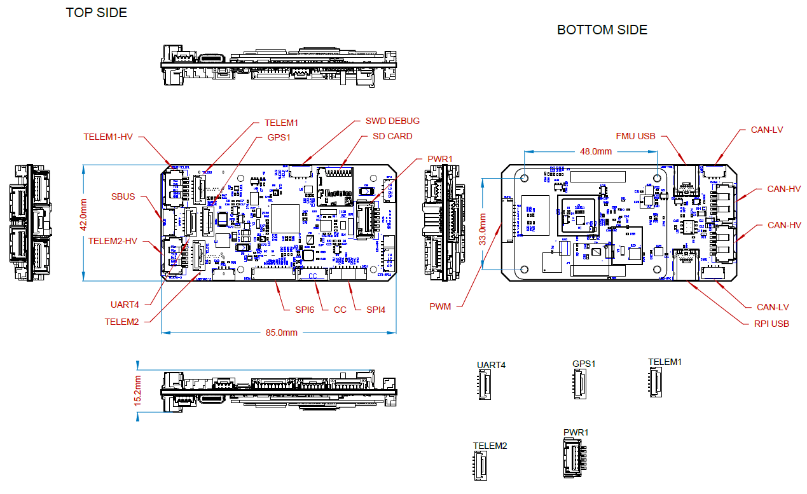

# RaccoonLab FMUv6X Autopilot

:::warning
PX4 does not manufacture this (or any) autopilot.
Contact the [manufacturer](https://raccoonlab.co) for hardware support or compliance issues.
:::

The [RaccoonLab FMUv6X](https://docs.raccoonlab.co/guide/autopilot/RCLv6X.html) flight controller is based on the following Pixhawk​® standards: [Pixhawk Autopilot FMUv6X Standard](https://github.com/pixhawk/Pixhawk-Standards/blob/master/DS-012%20Pixhawk%20Autopilot%20v6X%20Standard.pdf), [Autopilot Bus Standard](https://github.com/pixhawk/Pixhawk-Standards/blob/master/DS-010%20Pixhawk%20Autopilot%20Bus%20Standard.pdf), and [Connector Standard](https://github.com/pixhawk/Pixhawk-Standards/blob/master/DS-009%20Pixhawk%20Connector%20Standard.pdf).

Equipped with a high-performance H7 Processor, modular design, triple redundancy, temperature-controlled IMU board, and isolated sensor domains, it delivers exceptional performance, reliability, and flexibility.
At RaccoonLab, we focus on DroneCAN and Cyphal-based onboard control system buses.
Our autopilot is part of a larger DroneCAN and Cyphal ecosystem, making it an ideal choice for next-generation intelligent vehicles.


RaccoonLab offers versatile HATs for both Raspberry Pi and NVIDIA Jetson Xavier NX, enhancing connectivity and functionality.
The [Jetson Xavier NX HAT](https://docs.raccoonlab.co/guide/nx_hat/) is designed to integrate the CAN bus with the Jetson Xavier NX, enabling access to Cyphal and DroneCAN protocols.
The [Raspberry Pi CM4 HAT](https://docs.raccoonlab.co/guide/rpi_hat/) provides robust features, including CAN bus connectivity, an LTE modem, internal voltage measurement, SWD debugging for other MCUs, and UART communication with PX4 over MAVLINK.
These HATs expand the capabilities of devices, making them ideal for advanced robotics and UAV applications.

:::tip
This autopilot is [supported](../flight_controller/autopilot_pixhawk_standard.md) by the PX4 maintenance and test teams.
:::

## Key Design Points

- High performance STM32H753 Processor
- Modular flight controller: separated IMU, FMU, and Base system connected by a 100-pin & a 50-pin Pixhawk Autopilot Bus connector.
- Redundancy: 3x IMU sensors & 2x Barometer sensors on separate buses
- Triple redundancy domains: Completely isolated sensor domains with separate buses and separate power control
- Newly designed vibration isolation system to filter out high frequency vibration and reduce noise to ensure accurate readings
- Ethernet interface for high-speed mission computer integration

## Processors & Sensors

- FMU Processor: STM32H753
  - 32 Bit Arm Cortex-M7, 480MHz, 2MB flash memory, 1MB RAM
- IO 프로세서: STM32F100
  - 32 Bit Arm Cortex-M3, 24MHz, 8KB SRAM
- 내장 센서 :
  - Accel/Gyro: ICM-20649 or BMI088
  - Accel/Gyro: ICM-42688-P
  - Accel/Gyro: ICM-42670-P
  - Mag: BMM150
  - Barometer: 2x BMP388

## Electrical data

- Voltage Ratings:
  - Max input voltage: 36V
  - USB Power Input: 4.75\~5.25V
  - Servo Rail Input: 0\~36V
- Current Ratings:
  - `TELEM1` output current limiter: 1.5A
  - All other port combined output current limiter: 1.5A

## Mechanical data

- 크기
  - Flight Controller Module: 38.8 x 31.8 x 14.6mm
  - Standard Baseboard: 52.4 x 103.4 x 16.7mm
  - Mini Baseboard: 43.4 x 72.8 x 14.2 mm
- 중량
  - Flight Controller Module: 23g
  - Standard Baseboard: 51g
  - Mini Baseboard: 26.5g

3D model can be downloaded on [GrabCAD](https://grabcad.com/library/raccoonlab-autopilot-1).



## 인터페이스

- 16- PWM servo outputs
- R/C input for Spektrum / DSM
- Dedicated R/C input for PPM and S.Bus input
- Dedicated analog / PWM RSSI input and S.Bus output
- 범용 시리얼 포트 4개
  - 전체 흐름 제어 3개
  - 1 with separate 1.5A current limit (`TELEM1`)
  - 1 with I2C and additional GPIO line for external NFC reader
- 2 GPS ports
  - 1 full GPS plus Safety Switch Port
  - 1 basic GPS port
- 1 I2C port
- 1 Ethernet port
  - Transformerless Applications
  - 100Mbps
- 1 SPI bus
  - 2 chip select lines
  - 2 data-ready lines
  - 1 SPI SYNC line
  - 1 SPI reset line
- 2 CAN Buses for CAN peripheral
  - CAN Bus has individual silent controls or ESC RX-MUX control
- 2 Power input ports with SMBus
  - 1 AD & IO port
  - 2개의 추가 아날로그 입력
  - 1 PWM/Capture input
  - 2 Dedicated debug and GPIO lines

## 시리얼 포트 매핑

| UART   | 장치         | 포트                              |
| ------ | ---------- | ------------------------------- |
| USART1 | /dev/ttyS0 | GPS                             |
| USART2 | /dev/ttyS1 | TELEM3                          |
| USART3 | /dev/ttyS2 | 디버그 콘솔                          |
| UART4  | /dev/ttyS3 | UART4 & I2C |
| UART5  | /dev/ttyS4 | TELEM2                          |
| USART6 | /dev/ttyS5 | PX4IO/RC                        |
| UART7  | /dev/ttyS6 | TELEM1                          |
| UART8  | /dev/ttyS7 | GPS2                            |

## 정격 전압

_RaccoonLab FMUv6X_ can be triple-redundant on the power supply if three power sources are supplied.
The three power rails are: **POWER1**, **POWER2** and **USB**.
The **POWER1** & **POWER2** ports on the RaccoonLab FMUv6X uses the 6 circuit [2.00mm Pitch CLIK-Mate Wire-to-Board PCB Receptacle](https://www.molex.com/molex/products/part-detail/pcb_receptacles/5024430670).

**Normal Operation Maximum Ratings**

이러한 조건에서 전원은 아래의 순서대로 시스템에 전원을 공급하여야합니다.

1. **POWER1** and **POWER2** inputs (4.9V to 5.5V)
2. **USB** input (4.75V to 5.25V)

:::tip
The manufacturer [RaccoonLab Docs](https://docs.raccoonlab.co/guide/autopilot/RCLv6X.html) are the canonical reference for the RaccoonLab FMUv6X Autopilot.
가장 정확한 최신 정보를 포함하고 있습니다.
:::

## 구매처

[RaccoonLab Store](https://raccoonlab.co/store)

[Cyphal store](https://cyphal.store)

## 펌웨어 빌드

:::tip
Most users will not need to build this firmware!
It is pre-built and automatically installed by _QGroundControl_ when appropriate hardware is connected.
:::

To [build PX4](../dev_setup/building_px4.md) for this target:

```sh
make px4_fmu-v6x_default
```

## 지원 플랫폼 및 기체

일반 RC 서보 또는 Futaba S-Bus 서보로 제어 가능한 모든 멀티콥터/비행기/로버 또는 보트.
The complete set of supported configurations can be seen in the [Airframes Reference](../airframes/airframe_reference.md).

## 추가 정보

- [Pixhawk Autopilot FMUv6X Standard](https://github.com/pixhawk/Pixhawk-Standards/blob/master/DS-012%20Pixhawk%20Autopilot%20v6X%20Standard.pdf)
- [Pixhawk Autopilot Bus Standard](https://github.com/pixhawk/Pixhawk-Standards/blob/master/DS-010%20Pixhawk%20Autopilot%20Bus%20Standard.pdf)
- [Pixhawk Connector Standard](https://github.com/pixhawk/Pixhawk-Standards/blob/master/DS-009%20Pixhawk%20Connector%20Standard.pdf)
- [RaccoonLab docs](https://docs.raccoonlab.co/)
