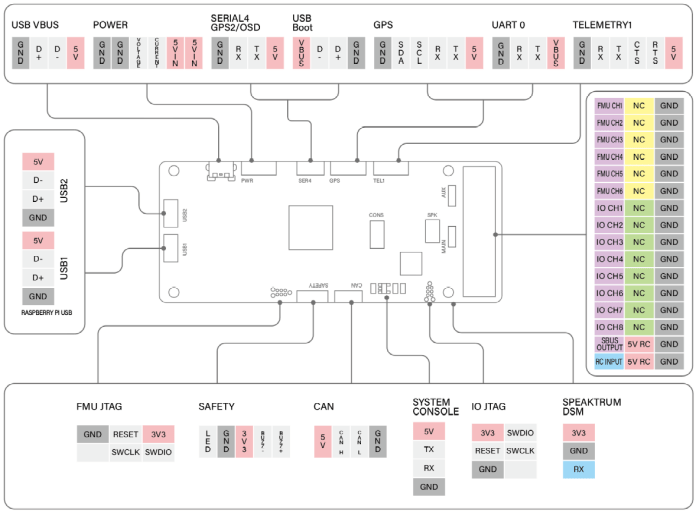

# ThePeach FCC-R1

:::warning
PX4 does not manufacture this (or any) autopilot.
Contact the [manufacturer](https://thepeach.kr/) for hardware support or compliance issues.
:::

**ThePeach FCC-R1** is an advanced autopilot designed and made in **ThePeach**.

It is based on the **Pixhawk-project FMUv3** open hardware design and runs **PX4** on **Nuttx OS**.


## 사양

- Main 프로세서: STM32F427VIT6

  - 32bit ARM Cortex-M4, 168 MHz 256 KB RAM 2 MB Flash memory

- IO 프로세서: STM32F100C8T6

  - ARM Cortex-M3, 32bit ARM Cortex-M3, 24 MHz, 8KB SRAM

- 내장 센서 :

  - 가속도/자이로: ICM-20602
  - 가속도/자이로스코프/지자기: MPU-9250
  - 기압계: MS5611

- 인터페이스

  - 8+6개의 PWM 출력 (IO 8개, FMU 6개)
  - Spektrum DSM / DSM2 / DSM-X Satellite 입력 호환
  - Futaba S.BUS 입출력 호환
  - PPM 합계 신호 입력
  - 아날로그/PWM RSSI 입력
  - PWM Servo 출력
  - 안전 스위치/LED
  - UART 포트 4개: TELEM1, TELEM2(라즈베리파이 CM3+), GPS, SERIAL4
  - I2C 포트 2개
  - CAN 버스 1개
  - 배터리 하나의 전압 / 전류에 대한 아날로그 입력

- 라즈베리파이 CM3+의 인터페이스

  - VBUS
  - DDR2 커넥터: 라즈베리파이 CM3+
  - UART 포트 1개
  - USB 포트 2개
  - 라즈베리파이 카메라

- 기계적 특성
  - 치수: 49.2 x 101 x 18.2mm
  - 중량: 100g

## 커넥터



## 시리얼 포트 매핑

| UART   | 장치         | 포트                                      |
| ------ | ---------- | --------------------------------------- |
| USART1 | /dev/ttyS0 | IO 프로세서 디버그                             |
| USART2 | /dev/ttyS1 | TELEM1 (흐름 제어)       |
| USART3 | /dev/ttyS2 | TELEM2 (라즈베리파이 cm3+) |
| UART4  | /dev/ttyS3 | GPS1                                    |
| USART6 | /dev/ttyS4 | PX4IO                                   |
| UART7  | /dev/ttyS5 | 디버그 콘솔                                  |
| UART8  | /dev/ttyS6 | TELEM4                                  |

## 정격 전압

**ThePeach FCC-R1** can be double-redundant on the power supply if two power sources are supplied. The two power rails are: **POWER** and **USB**.

참고:

1. The output power rails **FMU PWM OUT** and **I/O PWM OUT** do not power the flight controller board (and are not powered by it). You must supply power to one of **POWER** or **USB** or the board will be unpowered.
2. The USB do not power the **Raspberry Pi CM3+**. You must supply power to **POWER** or the Raspberry Pi CM3+ will be unpowered.

**Normal Operation Maximum Ratings**

이러한 조건에서 전원은 아래의 순서대로 시스템에 전원을 공급하여야 합니다.

1. POWER 입력 (5V ~ 5.5V)
2. USB 입력(4.75V ~ 5.25V)

**Absolute Maximum Ratings**

이러한 조건에서 모든 전원은 비행 컨트롤러에 영구적인 손상을 입힙니다.

1. POWER 입력 (5.5V 초과)

2. USB 입력 (5.5V 초과)

## 펌웨어 빌드

이 비행 컨트롤러용 PX4를 빌드하려면:

```jsx
make thepeach_r1_default
```

## 구매처

Order from [ThePeach](http://thepeach.shop/)
