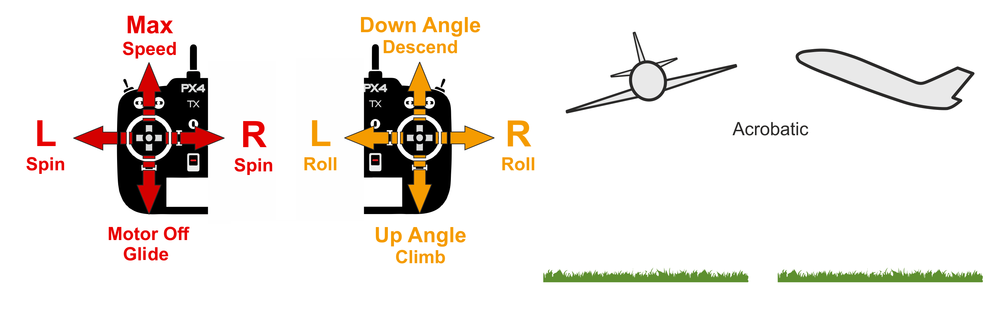

# Acro Mode (Fixed-Wing)

&nbsp;&nbsp;

_Acro mode_ is the manual mode for performing acrobatic maneuvers e.g. rolls, flips, stalls and acrobatic figures.

The roll, pitch and yaw sticks control the rate of angular rotation around the respective axes and throttle is passed directly to control allocation.
When sticks are centered the vehicle will stop rotating, but remain in its current orientation (on its side, inverted, or whatever) and moving according to its current momentum.

## Technical Description

Manual mode for performing acrobatic maneuvers e.g. rolls, flips, stalls and acrobatic figures.

Roll-pitch-yaw stick inputs are translated to angular rate commands that are stabilized by autopilot.
Throttle is passed directly to control allocation.

## 매개변수

| 매개변수                                                                                                                                                                 | 설명                                                                                                                                                                                                                                  |
| -------------------------------------------------------------------------------------------------------------------------------------------------------------------- | ----------------------------------------------------------------------------------------------------------------------------------------------------------------------------------------------------------------------------------- |
| [FW_ACRO_X_MAX](../advanced_config/parameter_reference.md#FW_ACRO_X_MAX)    | Acro body x max rate (the body x rate the controller is trying to achieve if the user applies full roll stick input in acro mode). Default: 90 degrees.          |
| [FW_ACRO_Y_MAX](../advanced_config/parameter_reference.md#FW_ACRO_Y_MAX)    | Acro body y max rate (the body y rate the controller is trying to achieve if the user applies full pitch stick input in acro mode). Default: 90 degrees.         |
| [FW_ACRO_Z_MAX](../advanced_config/parameter_reference.md#FW_ACRO_Z_MAX)    | Acro body z max rate (the body z rate the controller is trying to achieve if the user applies full yaw stick input in acro mode). Default: 45 degrees.           |
| [FW_ACRO_YAW_EN](../advanced_config/parameter_reference.md#FW_ACRO_YAW_EN) | Enable yaw rate controller (if disabled the pilot commands directly the yaw actuator). `0`: Disabled (Default), `1`: Enabled. |
