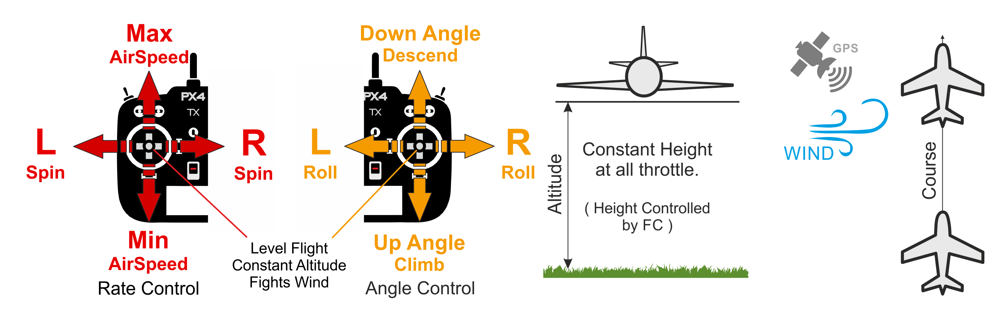

# Position Mode (Fixed-Wing)

&nbsp;&nbsp;

_Position mode_ is the easiest and safest manual mode.
It is supported on vehicles that have a position estimate (e.g. GPS).
It makes it easier for pilots to control vehicle altitude, and in particular to reach and maintain a fixed altitude.
The mode will hold the vehicle's course against wind.
Airspeed is actively controlled if an airspeed sensor is installed.

The vehicle performs a [coordinated turn](https://en.wikipedia.org/wiki/Coordinated_flight) if the roll sticks are non-zero, while the pitch stick controls the rate of ascent/descent.
The throttle determines airspeed — at 50% throttle the aircraft will hold its current altitude with a preset cruise speed.

When all sticks are released/centered (no roll, pitch, yaw, and ~50% throttle) the aircraft will return to straight, level flight, and keep its current altitude and flight path irrespective of wind.
This makes it easy to recover from any problems when flying.
Roll and pitch are angle-controlled (so it is impossible to roll over or loop the vehicle).

The yaw stick can be used to increase/reduce the yaw rate of the vehicle in turns.
If left at center the controller does the turn coordination by itself, meaning that it will apply the necessary yaw rate for the current roll angle to perform a smooth turn.
The diagram below shows the mode behaviour visually (for a [mode 2 transmitter](../getting_started/rc_transmitter_receiver.md#transmitter_modes)).

## Technical Description

Position mode is like [Stabilized mode](../flight_modes_fw/altitude.md) but with course stabilization.
Airspeed is also stabilized if an airspeed sensor is present.

- Centered Roll/Pitch/Yaw inputs (inside deadband):
  - Autopilot levels vehicle and maintains altitude, airspeed and course over ground.
- Outside center:
  - Pitch stick controls altitude.
  - Throttle stick controls the airspeed of the aircraft if an airspeed sensor is connected. Without an airspeed sensor the vehicle will fly level at trim throttle ([FW_THR_TRIM](../advanced_config/parameter_reference.md#FW_THR_TRIM)), increasing or decreasing throttle as needed to climb or descend.
  - Roll stick controls roll angle. Autopilot will maintain [coordinated flight](https://en.wikipedia.org/wiki/Coordinated_flight).
  - Yaw stick adds an additional yaw rate setpoint (added to the one calculated by the autopilot to maintain coordinated flight).
    Can be used to manually change the side slip of the vehicle.
- Manual control input is required (such as RC control, joystick).
- An altitude measurement source is required (usually barometer or GPS)

## 매개변수

The mode is affected by the following parameters:

| 매개변수                                                                                                                                                                                            | 설명                                                                                                                   |
| ----------------------------------------------------------------------------------------------------------------------------------------------------------------------------------------------- | -------------------------------------------------------------------------------------------------------------------- |
| [FW_AIRSPD_MIN](../advanced_config/parameter_reference.md#FW_AIRSPD_MIN)                                                    | Min airspeed. Default: 10 m/s.                                       |
| [FW_AIRSPD_MAX](../advanced_config/parameter_reference.md#FW_AIRSPD_MAX)                                                    | Max airspeed. Default: 20 m/s.                                       |
| [FW_AIRSPD_TRIM](../advanced_config/parameter_reference.md#FW_AIRSPD_TRIM)                                                 | Cruise speed. Default: 15 m/s.                                       |
| [FW_MAN_P_MAX](../advanced_config/parameter_reference.md#FW_MAN_P_MAX)                                  | Max pitch setpoint in attitude stabilized mode. Default: 45 degrees. |
| [FW_MAN_R_MAX](../advanced_config/parameter_reference.md#FW_MAN_R_MAX)                                  | Max roll setpoint in attitude stabilized mode. Default: 45 degrees.  |
| [FW_T_CLMB_R_SP](../advanced_config/parameter_reference.md#FW_T_CLMB_R_SP)       | Max climb rate setpoint. 기본값: 3 m/s.                                 |
| [FW_T_SINK_R_SP](../advanced_config/parameter_reference.md#FW_T_SINK_R_SP)       | Max sink rate setpoint. Default: 2 m/s.                              |
| [FW_PN_R_SLEW_MAX](../advanced_config/parameter_reference.md#FW_PN_R_SLEW_MAX) | Roll setpoint slew rate limit. Default: 90 °/s.                      |
