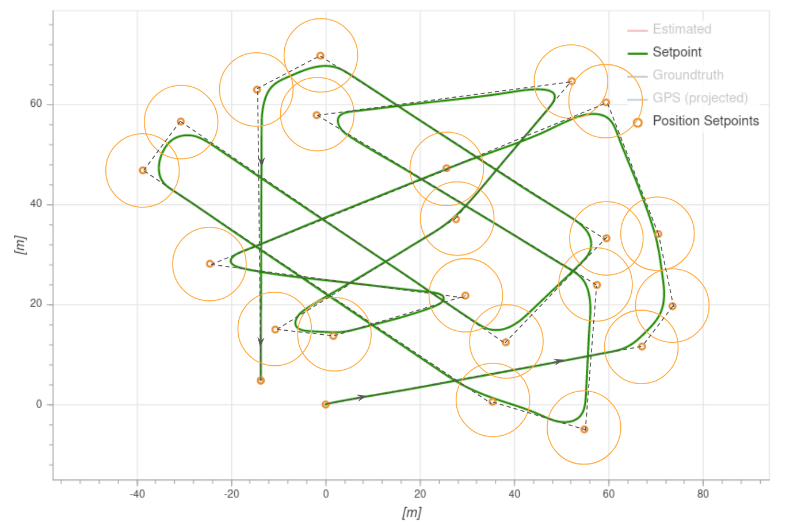

# Mission Mode (Multicopter)

_Mission mode_ causes the vehicle to execute a predefined autonomous [mission](../flying/missions.md) (flight plan) that has been uploaded to the flight controller.
The mission is typically created and uploaded with a Ground Control Station (GCS) application like [QGroundControl](https://docs.qgroundcontrol.com/master/en/) (QGC).

::: info

- This mode requires a global 3d position estimate (from GPS or inferred from a [local position](../ros/external_position_estimation.md#enabling-auto-modes-with-a-local-position)).
- The vehicle must be armed before this mode can be engaged.
- This mode is automatic - no user intervention is _required_ to control the vehicle.
- RC 제어 스위치는 기체의 비행 모드를 변경할 수 있습니다.
- RC stick movement will [by default](#COM_RC_OVERRIDE) change the vehicle to [Position mode](../flight_modes_mc/position.md) unless handling a critical battery failsafe.
  This is true for multicopters and VTOL in MC mode.

:::

## 설명

Missions are usually created in a ground control station (e.g. [QGroundControl](https://docs.qgroundcontrol.com/master/en/qgc-user-guide/plan_view/plan_view.html)) and uploaded prior to launch.
They may also be created by a MAVLink API such as [MAVSDK](../robotics/mavsdk.md), and/or uploaded in flight.

Individual [mission commands](#mission-commands) are handled in a way that is appropriate to multicopter flight characteristics (for example loiter is implemented as _hover_ ).

:::info
Missions are uploaded onto a SD card that needs to be inserted **before** booting up the autopilot.
:::

At high level all vehicle types behave in the same way when MISSION mode is engaged:

1. If no mission is stored, or if PX4 has finished executing all mission commands, or if the [mission is not feasible](#mission-feasibility-checks):

  - If flying the vehicle will hold.
  - If landed the vehicle will "wait".

2. If a mission is stored and PX4 is flying it will execute the [mission/flight plan](../flying/missions.md) from the current step.
  - A `TAKEOFF` item is treated as a normal waypoint.

3. If a mission is stored and PX4 is landed:
  - PX4 will execute the [mission/flight plan](../flying/missions.md).
  - If the mission does not have a `TAKEOFF` item then PX4 will fly the vehicle to the minimum altitude before executing the remainder of the flight plan from the current step.

4. If no mission is stored, or if PX4 has finished executing all mission commands:
  - If flying the vehicle will hold.
  - If landed the vehicle will "wait".

5. You can manually change the current mission command by selecting it in _QGroundControl_.

  ::: info
  If you have a _Jump to item_ command in the mission, moving to another item will **not** reset the loop counter.
  One implication is that if you change the current mission command to 1 this will not "fully restart" the mission.

:::

6. The mission will only reset when the vehicle is disarmed or when a new mission is uploaded.

  :::tip
  To automatically disarm the vehicle after it lands, in _QGroundControl_ go to [Vehicle Setup > Safety](https://docs.qgroundcontrol.com/master/en/qgc-user-guide/setup_view/safety.html), navigate to _Land Mode Settings_ and check the box labeled _Disarm after_.
  Enter the time to wait after landing before disarming the vehicle.

:::

Missions can be paused by switching out of mission mode to any other mode (such as [Hold mode](../flight_modes_mc/hold.md) or [Position mode](../flight_modes_mc/position.md)), and resumed by switching back to mission mode.
If the vehicle was not capturing images when it was paused, on resuming it will head from its _current position_ towards the same waypoint as it as was heading towards originally.
If the vehicle was capturing images (has camera trigger items) it will instead head from its current position towards the last waypoint it traveled through (before pausing), and then retrace its path at the same speed and with the same camera triggering behaviour.
This ensures that in survey/camera missions the planned path is captured.
A mission can be uploaded while the vehicle is paused, in which which case the current active mission item is set to 1.

:::info
When a mission is paused while the camera on the vehicle was triggering, PX4 sets the current active mission item to the previous waypoint, so that when the mission is restarted the vehicle will retrace its last mission leg.
In addition, PX4 stores the last applied mission items for speed setting and camera triggering (from the already covered mission plan), and re-applies those settings on resuming the mission.
:::

:::warning
Ensure that the throttle stick is non-zero before switching to any RC mode (otherwise the vehicle will crash).
We recommend you centre the control sticks before switching to any other mode.
:::

For more information about mission planning, see:

- [Mission Planning](../flying/missions.md)
- [Plan View](https://docs.qgroundcontrol.com/master/en/qgc-user-guide/plan_view/plan_view.html) (_QGroundControl_ User Guide)

## Mission Feasibility Checks

PX4 runs some basic sanity checks to determine if a mission is feasible when it is uploaded and before executing a mission.
If any of the checks fail, the user is notified and it is not possible to start the mission (the vehicle will switch to [Hold mode](../flight_modes_mc/hold.md) instead of Mission mode).

A subset of the most important checks are listed below:

- Any mission item conflicts with a plan or safety geofence
- Missing takeoff and/or land item when these are configured as a requirement ([MIS_TKO_LAND_REQ](#MIS_TKO_LAND_REQ))

Additionally there is a check if the first waypoint is too far from the Home position ([MIS_DIST_1WP](#MIS_DIST_1WP)).
The user is notified should the check fail, but it has no effect on the validity of a mission plan, meaning that the mission can still be started even if the distance is too high.

## QGroundControl 지원

_QGroundControl_ provides additional GCS-level mission handling support (in addition to that provided by the flight controller).

더 자세한 정보는 다음을 참고하십시오.

- [Remove mission after vehicle lands](https://docs.qgroundcontrol.com/master/en/qgc-user-guide/releases/stable_v3.2_long.html#remove-mission-after-vehicle-lands)
- [Resume mission after Return mode](https://docs.qgroundcontrol.com/master/en/qgc-user-guide/releases/stable_v3.2_long.html#resume-mission)

## Mission Parameters

Mission behaviour is affected by a number of parameters, most of which are documented in [Parameter Reference > Mission](../advanced_config/parameter_reference.md#mission).
A very small subset are listed below.

General parameters:

| 매개변수                                                                                                                                                                    | 설명                                                                                                                                                                                                                                                                    |
| ----------------------------------------------------------------------------------------------------------------------------------------------------------------------- | --------------------------------------------------------------------------------------------------------------------------------------------------------------------------------------------------------------------------------------------------------------------- |
| [NAV_RCL_ACT](../advanced_config/parameter_reference.md#NAV_RCL_ACT)                                  | RC loss failsafe mode (what the vehicle will do if it looses RC connection) - e.g. enter hold mode, return mode, terminate etc.                                                                    |
| [COM_RC_OVERRIDE](../advanced_config/parameter_reference.md#COM_RC_OVERRIDE)                      | Controls whether stick movement on a multicopter (or VTOL in MC mode) gives control back to the pilot in [Position mode](../flight_modes_mc/position.md). 자동 모드와 오프보드 모드에 대해 별도로 활성화할 수 있으며, 기본적으로 자동 모드에서 활성화됩니다. |
| [COM_RC_STICK_OV](../advanced_config/parameter_reference.md#COM_RC_STICK_OV) | The amount of stick movement that causes a transition to [Position mode](../flight_modes_mc/position.md) (if [COM_RC_OVERRIDE](#COM_RC_OVERRIDE) is enabled).                            |

Parameters related to [mission feasibility checks](#mission-feasibility-checks):

| 매개변수                                                                                                                                                                       | 설명                                                                                                                                                                |
| -------------------------------------------------------------------------------------------------------------------------------------------------------------------------- | ----------------------------------------------------------------------------------------------------------------------------------------------------------------- |
| [MIS_DIST_1WP](../advanced_config/parameter_reference.md#MIS_DIST_1WP)                                  | There is a warning message if the distance of the first waypoint to Home is more than this value. Disabled if value is 0 or less. |
| [FW_LND_ANG](../advanced_config/parameter_reference.md#FW_LND_ANG)                                        | Maximum landing slope angle.                                                                                                                      |
| [MIS_TKO_LAND_REQ](../advanced_config/parameter_reference.md#MIS_TKO_LAND_REQ) | Sets whether mission _requires_ takeoff and/or landing items. No requirement by default for multicopter.                          |

## Mission Commands {#mission_commands}

PX4 "accepts" the following MAVLink mission commands in Mission mode (with some _caveats_, given after the list).
Unless otherwise noted, the implementation is as defined in the MAVLink specification.

Mission Items:

- [MAV_CMD_NAV_WAYPOINT](https://mavlink.io/en/messages/common.html#MAV_CMD_NAV_WAYPOINT)
  - _Param3_ (flythrough) is ignored. Flythrough is always enabled if _param 1_ (time_inside) > 0.
- [MAV_CMD_NAV_LOITER_UNLIM](https://mavlink.io/en/messages/common.html#MAV_CMD_NAV_LOITER_UNLIM)
- [MAV_CMD_NAV_LOITER_TIME](https://mavlink.io/en/messages/common.html#MAV_CMD_NAV_LOITER_TIME)
- [MAV_CMD_NAV_LAND](https://mavlink.io/en/messages/common.html#MAV_CMD_NAV_LAND)
- [MAV_CMD_NAV_TAKEOFF](https://mavlink.io/en/messages/common.html#MAV_CMD_NAV_TAKEOFF)
- [MAV_CMD_NAV_LOITER_TO_ALT](https://mavlink.io/en/messages/common.html#MAV_CMD_NAV_LOITER_TO_ALT)
- [MAV_CMD_DO_JUMP](https://mavlink.io/en/messages/common.html#MAV_CMD_DO_JUMP)
- [MAV_CMD_NAV_ROI](https://mavlink.io/en/messages/common.html#MAV_CMD_NAV_ROI)
- [MAV_CMD_DO_SET_ROI](https://mavlink.io/en/messages/common.html#MAV_CMD_DO_SET_ROI)
- [MAV_CMD_DO_SET_ROI_LOCATION](https://mavlink.io/en/messages/common.html#MAV_CMD_DO_SET_ROI_LOCATION)
- [MAV_CMD_DO_SET_ROI_WPNEXT_OFFSET](https://mavlink.io/en/messages/common.html#MAV_CMD_DO_SET_ROI_WPNEXT_OFFSET)
- [MAV_CMD_DO_SET_ROI_NONE](https://mavlink.io/en/messages/common.html#MAV_CMD_DO_SET_ROI_NONE)
- [MAV_CMD_DO_CHANGE_SPEED](https://mavlink.io/en/messages/common.html#MAV_CMD_DO_CHANGE_SPEED)
- [MAV_CMD_DO_SET_HOME](https://mavlink.io/en/messages/common.html#MAV_CMD_DO_SET_HOME)
- [MAV_CMD_DO_SET_SERVO](https://mavlink.io/en/messages/common.html#MAV_CMD_DO_SET_SERVO)
- [MAV_CMD_DO_LAND_START](https://mavlink.io/en/messages/common.html#MAV_CMD_DO_LAND_START)
- [MAV_CMD_DO_TRIGGER_CONTROL](https://mavlink.io/en/messages/common.html#MAV_CMD_DO_TRIGGER_CONTROL)
- [MAV_CMD_DO_DIGICAM_CONTROL](https://mavlink.io/en/messages/common.html#MAV_CMD_DO_DIGICAM_CONTROL)
- [MAV_CMD_DO_MOUNT_CONFIGURE](https://mavlink.io/en/messages/common.html#MAV_CMD_DO_MOUNT_CONFIGURE)
- [MAV_CMD_DO_MOUNT_CONTROL](https://mavlink.io/en/messages/common.html#MAV_CMD_DO_MOUNT_CONTROL)
- [MAV_CMD_IMAGE_START_CAPTURE](https://mavlink.io/en/messages/common.html#MAV_CMD_IMAGE_START_CAPTURE)
- [MAV_CMD_IMAGE_STOP_CAPTURE](https://mavlink.io/en/messages/common.html#MAV_CMD_IMAGE_STOP_CAPTURE)
- [MAV_CMD_VIDEO_START_CAPTURE](https://mavlink.io/en/messages/common.html#MAV_CMD_VIDEO_START_CAPTURE)
- [MAV_CMD_VIDEO_STOP_CAPTURE](https://mavlink.io/en/messages/common.html#MAV_CMD_VIDEO_STOP_CAPTURE)
- [MAV_CMD_DO_SET_CAM_TRIGG_DIST](https://mavlink.io/en/messages/common.html#MAV_CMD_DO_SET_CAM_TRIGG_DIST)
- [MAV_CMD_DO_SET_CAM_TRIGG_INTERVAL](https://mavlink.io/en/messages/common.html#MAV_CMD_DO_SET_CAM_TRIGG_INTERVAL)
- [MAV_CMD_SET_CAMERA_MODE](https://mavlink.io/en/messages/common.html#MAV_CMD_SET_CAMERA_MODE)
- [MAV_CMD_NAV_DELAY](https://mavlink.io/en/messages/common.html#MAV_CMD_NAV_DELAY)
- [MAV_CMD_NAV_RETURN_TO_LAUNCH](https://mavlink.io/en/messages/common.html#MAV_CMD_NAV_RETURN_TO_LAUNCH)
- [MAV_CMD_DO_CONTROL_VIDEO](https://mavlink.io/en/messages/common.html#MAV_CMD_DO_CONTROL_VIDEO)
- [MAV_CMD_DO_GIMBAL_MANAGER_PITCHYAW](https://mavlink.io/en/messages/common.html#MAV_CMD_DO_GIMBAL_MANAGER_PITCHYAW)
- [MAV_CMD_DO_GIMBAL_MANAGER_CONFIGURE](https://mavlink.io/en/messages/common.html#MAV_CMD_DO_GIMBAL_MANAGER_CONFIGURE)
- [MAV_CMD_OBLIQUE_SURVEY](https://mavlink.io/en/messages/common.html#MAV_CMD_OBLIQUE_SURVEY)
- [MAV_CMD_SET_CAMERA_ZOOM](https://mavlink.io/en/messages/common.html#MAV_CMD_SET_CAMERA_ZOOM)
- [MAV_CMD_SET_CAMERA_FOCUS](https://mavlink.io/en/messages/common.html#MAV_CMD_SET_CAMERA_FOCUS)
- [MAV_CMD_NAV_VTOL_TAKEOFF](https://mavlink.io/en/messages/common.html#MAV_CMD_NAV_VTOL_TAKEOFF)
  - `MAV_CMD_NAV_VTOL_TAKEOFF.param2` (transition heading) is ignored.
    Instead the heading to the next waypoint is used for the transition heading. <!-- at LEAST until PX4 v1.13: https://github.com/PX4/PX4-Autopilot/issues/12660 -->

GeoFence Definitions

- [MAV_CMD_NAV_FENCE_RETURN_POINT](https://mavlink.io/en/messages/common.html#MAV_CMD_NAV_FENCE_RETURN_POINT)
- [MAV_CMD_NAV_FENCE_POLYGON_VERTEX_INCLUSION](https://mavlink.io/en/messages/common.html#MAV_CMD_NAV_FENCE_POLYGON_VERTEX_INCLUSION)
- [MAV_CMD_NAV_FENCE_POLYGON_VERTEX_EXCLUSION](https://mavlink.io/en/messages/common.html#MAV_CMD_NAV_FENCE_POLYGON_VERTEX_EXCLUSION)
- [MAV_CMD_NAV_FENCE_CIRCLE_INCLUSION](https://mavlink.io/en/messages/common.html#MAV_CMD_NAV_FENCE_CIRCLE_INCLUSION)
- [MAV_CMD_NAV_FENCE_CIRCLE_EXCLUSION](https://mavlink.io/en/messages/common.html#MAV_CMD_NAV_FENCE_CIRCLE_EXCLUSION)

Rally Points

- [MAV_CMD_NAV_RALLY_POINT](https://mavlink.io/en/messages/common.html#MAV_CMD_NAV_RALLY_POINT)

:::info
Please add an issue report or PR if you find a missing/incorrect message.

- PX4 parses the above messages, but they are not necessary _acted_ on. For example, some messages are vehicle-type specific.
- PX4 does not support local frames for mission commands (e.g. [MAV_FRAME_LOCAL_NED](https://mavlink.io/en/messages/common.html#MAV_FRAME_LOCAL_NED)).
- Not all messages/commands are exposed via _QGroundControl_.
- The list may become out of date as messages are added.
  You can check the current set by inspecting the code.
  Support is `MavlinkMissionManager::parse_mavlink_mission_item` in [/src/modules/mavlink/mavlink_mission.cpp](https://github.com/PX4/PX4-Autopilot/blob/main/src/modules/mavlink/mavlink_mission.cpp).

:::

## Mission Command Timeouts

Some mission commands/items can take time to complete, such as a gripper opening and closing, a winch extending or retracting, or a gimbal moving to point at a region of interest.

Where provided PX4 may use sensor feedback from the hardware to determine when the action has completed and then move to the next mission item.
If not provided, or if the feedback is lost, a mission command timeout can be used to ensure that these kinds of actions will progress to the next mission item rather than blocking progression.

The timeout is set using the [MIS_COMMAND_TOUT](../advanced_config/parameter_reference.md#MIS_COMMAND_TOUT) parameter.
This should be set to be a small amount greater than the time required for the longest long-running action in the mission to complete.

## Rounded turns: Inter-Waypoint Trajectory

PX4 expects to follow a straight line from the previous waypoint to the current target (it does not plan any other kind of path between waypoints - if you need one you can simulate this by adding additional waypoints).

MC vehicles will change the _speed_ when approaching or leaving a waypoint based on the [jerk-limited](../config_mc/mc_jerk_limited_type_trajectory.md#auto-mode) tuning.
The vehicle will follow a smooth rounded curve towards the next waypoint (if one is defined) defined by the acceptance radius ([NAV_ACC_RAD](../advanced_config/parameter_reference.md#NAV_ACC_RAD)).
The diagram below shows the sorts of paths that you might expect.

Vehicles switch to the next waypoint as soon as they enter the acceptance radius ([NAV_ACC_RAD](../advanced_config/parameter_reference.md#NAV_ACC_RAD)).

## Mission Takeoff

Plan a multicopter mission takeoff by adding a `TAKEOFF` mission item to the map (this corresponds to the [MAV_CMD_NAV_TAKEOFF](https://mavlink.io/en/messages/common.html#MAV_CMD_NAV_TAKEOFF) MAVLink command).

During mission execution this will cause the vehicle to ascend vertically to the minimum takeoff altitude defined in the [MIS_TAKEOFF_ALT](../advanced_config/parameter_reference.md#MIS_TAKEOFF_ALT) parameter, then head towards the 3D position defined in the mission item.

If a mission with no takeoff mission item is started, the vehicle will ascend to the minimum takeoff altitude and then proceed to the first `Waypoint` mission item.

If the vehicle is already flying when the mission is started, a takeoff mission item is treated as a normal waypoint.

## See Also

- [Missions](../flying/missions.md)
  - [Package Delivery Mission](../flying/package_delivery_mission.md)
- [Mission Mode (FW)](../flight_modes_fw/mission.md)
