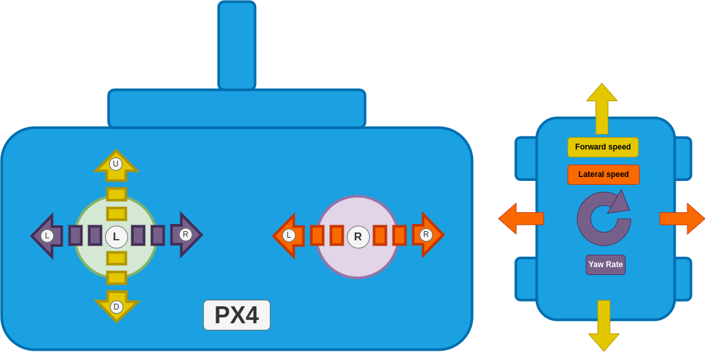

# Drive Modes (Mecanum Rover)

Flight modes (or more accurately "Drive modes" for ground vehicles) provide autopilot support to make it easier to manually drive the vehicle or to execute autonomous missions.

This section outlines all supported drive modes for mecanum rovers.

For information on mapping RC control switches to specific modes see: [Basic Configuration > Flight Modes](../config/flight_mode.md).

:::warning
Selecting any other mode than those listed below will either stop the rover or can lead to undefined behaviour.
:::

## Manual Modes

Manual modes require stick inputs from the user to drive the vehicle.

The sticks provide the same "high level" control effects over direction and rate of movement in all manual modes:

- `Left stick up/down`: Drive the rover forwards/backwards (controlling speed)
- `Left stick left/right`: Yaw the rover to the left/right (controlling yaw rate).
- `Right stick left/right`: Drive the rover left/right (controlling speed).

The manual modes provide progressively increasing levels of autopilot support for maintaining a course, speed, and rate of turn, compensating for external factors such as slopes or uneven terrain.

| Mode                           | 특징                                                                                                                                                                                                                       |
| ------------------------------ | ------------------------------------------------------------------------------------------------------------------------------------------------------------------------------------------------------------------------ |
| [Manual](#manual-mode)         | No autopilot support. User is responsible for keeping the rover on the desired course and maintaining speed and rate of turn.                                                            |
| [Acro](#acro-mode)             | + Maintains yaw rate (This makes it slightly better at holding a straight line in uneven terrain).  + Allows maximum yaw rate to be limited.                       |
| [Stabilized](#stabilized-mode) | + Maintains yaw (This makes it significantly better at holding a straight line) .                                                                                                     |
| [Position](#position-mode)     | + Best mode for holding a straight line. + Maintains speed against disturbances, e.g. when driving up a hill + Allows maximum speed to be limited. |

:::details
Overview mode mapping to control effect

| Mode                           | Longitudinal/Lateral speed                                                                  | Yaw rate                                                                                                                                                                                                                                                                | Required measurements                                                                 |
| ------------------------------ | ------------------------------------------------------------------------------------------- | ----------------------------------------------------------------------------------------------------------------------------------------------------------------------------------------------------------------------------------------------------------------------- | ------------------------------------------------------------------------------------- |
| [Manual](#manual-mode)         | Directly map stick input to motor commands.                                 | Directly map stick input to motor commands.                                                                                                                                                                                                             | None.                                                                 |
| [Acro](#acro-mode)             | Directly map stick input to motor commands.                                 | Stick input creates a yaw rate setpoint for the control system to regulate.                                                                                                                                                                             | Yaw rate.                                                             |
| [Stabilized](#stabilized-mode) | Directly map stick input to motor commands.                                 | Stick input creates a yaw rate setpoint for the control system to regulate. If this setpoint is zero (stick is centered) the control system will maintain the current yaw (heading) of the rover. | Yaw rate and yaw.                                                     |
| [Position](#position-mode)     | Stick input creates a velocity setpoint for the control system to regulate. | Stick input creates a yaw rate setpoint for the control system to regulate. If this setpoint is zero (stick is centered) the control system will keep the rover driving in a straight line.                          | Yaw rate, yaw, velocity and global position (GPS). |

:::

### 수동 모드

In this mode the stick inputs are directly mapped to motor commands.
The rover does not attempt to maintain a specific orientation or compensate for external factors like slopes or uneven terrain!
The user is responsible for making the necessary adjustments to the stick inputs to keep the rover on the desired course.

| Stick                  | Effect                                              |
| ---------------------- | --------------------------------------------------- |
| Left stick up/down     | Drive the rover forwards/backwards. |
| Left stick left/right  | Yaw the rover to the left/right.    |
| Right stick left/right | Drive the rover left/right.         |

For the configuration/tuning of this mode see [Manual mode](../config_rover/mecanum.md#manual-mode).

### Acro Mode

:::info
This mode requires a yaw rate measurement.
:::

The vehicle regulates its yaw rate (Left stick left/right) to a setpoint, and a maximum yaw rate can also be specified.
Heading and speed are not controlled.

Compared to [Manual mode](#manual-mode) this introduces the following new features:

- The yaw rate control ensures that the rover turns at the requested rate even on different surfaces and due to other external forces (such as wind).
- Slightly better at driving in a straight line because if the input is zero PX4 will attempt to maintain a zero yaw rate.
  This is resistant to minor disturbances.
- Upper limit for the yaw rate can be used to tune how aggressive the rover turns.

| Stick                  | Effect                                                                                                                                                                                                              |
| ---------------------- | ------------------------------------------------------------------------------------------------------------------------------------------------------------------------------------------------------------------- |
| Left stick up/down     | Drive the rover forwards/backwards.                                                                                                                                                                 |
| Left stick left/right  | Create a yaw rate setpoint for the control system to regulate. If this input is zero the control system will attempt to maintain a zero yaw rate (minimal disturbance rejection) |
| Right stick left/right | Drive the rover left/right.                                                                                                                                                                         |

For the configuration/tuning of this mode see [Acro mode](../config_rover/mecanum.md#acro-mode).

### Stabilized Mode

:::info
This mode requires a yaw rate and yaw estimate.
:::

The vehicle regulates its yaw rate to a setpoint, and a maximum yaw rate can also be specified.
The vehicle regulates its yaw to a setpoint when the yaw rate setpoint is zero, maintaining the heading.
Speed is not controlled.

Compared to [Acro mode](#acro-mode), this mode is much better at driving in a straight line as it can more effectively reject disturbances.

| Stick                  | Effect                                                                                                                                                                 |
| ---------------------- | ---------------------------------------------------------------------------------------------------------------------------------------------------------------------- |
| Left stick up/down     | Drive the rover forwards/backwards.                                                                                                                    |
| Left stick left/right  | Create a yaw rate setpoint for the control system to regulate. If this input is zero the control system will maintain the current yaw. |
| Right stick left/right | Drive the rover left/right.                                                                                                                            |

For the configuration/tuning of this mode see [Stabilized mode](../config_rover/mecanum.md#stabilized-mode).

### Position Mode

:::info
This mode requires a yaw rate, yaw, speed and global position estimate.
:::

This is the mode with the most autopilot support.

The vehicle regulates its yaw rate to a setpoint, and a maximum yaw rate can also be specified.
The path is maintained when the yaw rate setpoint is zero using global position (the controller constructs a line in the direction of the velocity input (forward + lateral speed) that the rover will then follow by tracking the global position).
Speed is regulated to a setpoint, and a maximum value can be set.

Compared to [Stabilized Mode](#stabilized-mode) this introduces the following features:

- Upper limit for the speed (see [Position Mode](../config_rover/mecanum.md#position-mode)) to tune how fast the rover is allowed to drive.
- The speed control ensures that the rover drives the requested speed even under disturbances (i.e. driving up a hill, against wind, with a heavier payload etc.).
- The course control leads to the best straight line driving behaviour, as the vehicle will follow the intended path of the vehicle and return to it if forced off-track
  This is much better than stabilized mode, which can be forced off the intended track by disturbances.

| Stick                  | Effect                                                                                                                                                                         |
| ---------------------- | ------------------------------------------------------------------------------------------------------------------------------------------------------------------------------ |
| Left stick up/down     | Create a forward speed setpoint for the control system to regulate.                                                                                            |
| Left stick left/right  | Create a yaw rate setpoint for the control system to regulate. If this input is zero the control system will maintain the course of the rover. |
| Right stick left/right | Create a lateral speed setpoint for the control system to regulate.                                                                                            |

For the configuration/tuning of this mode see [Position mode](../config_rover/mecanum.md#position-mode).

## Auto Modes

In auto modes the autopilot takes over control of the vehicle to run missions, return to launch, or perform other autonomous navigation tasks.
For the configuration/tuning of these modes see [Auto Modes](../config_rover/mecanum.md#auto-modes).

### Mission Mode

_Mission mode_ is an automatic mode in which the vehicle executes a predefined autonomous [mission plan](../flying/missions.md) that has been uploaded to the flight controller.
The mission is typically created and uploaded with a Ground Control Station (GCS) application, such as [QGroundControl](https://docs.qgroundcontrol.com/master/en/).

#### Mission commands

The following commands can be used in missions at time of writing (`main`/planned for `PX4 v1.16+`):

| QGC mission item                      | 통신                                                                                                                             | 설명                                                                                               |
| ------------------------------------- | ------------------------------------------------------------------------------------------------------------------------------ | ------------------------------------------------------------------------------------------------ |
| Mission start                         | [MAV_CMD_MISSION_START](MAV_CMD_MISSION_START)                  | Starts the mission.                                                              |
| Waypoint                              | [MAV_CMD_NAV_WAYPOINT](MAV_CMD_NAV_WAYPOINT)                    | Navigate to waypoint.                                                            |
| Return to launch                      | [MAV\_CMD\_NAV\_RETURN\_TO\_LAUNCH][MAV_CMD_NAV_RETURN_TO_LAUNCH]                                                              | Return to the launch location.                                                   |
| Delay until                           | [MAV_CMD_NAV_DELAY](MAV_CMD_NAV_DELAY)                          | The rover will stop for a specified amount of time.                              |
| Change speed                          | [MAV\_CMD\_DO\_CHANGE\_SPEED][MAV_CMD_DO_CHANGE_SPEED]                                                                         | Change the speed setpoint                                                                        |
| Set launch location                   | [MAV_CMD_DO_SET_HOME](MAV_CMD_DO_SET_HOME) | Changes launch location to specified coordinates.                                |
| Jump to item (all) | [MAV\_CMD\_DO\_JUMP][MAV_CMD_DO_JUMP] (and other jump commands)                                                                | Jump to specified mission item.                                                  |
| Loiter (all)       | [MAV\_CMD\_NAV\_LOITER\_TIME][MAV_CMD_NAV_LOITER_TIME] (and other loiter commands)                                             | Stop the rover for given time. Other commands stop indefinitely. |

[MAV_CMD_MISSION_START]: https://mavlink.io/en/messages/common.html#MAV_CMD_MISSION_START
[MAV_CMD_NAV_WAYPOINT]: https://mavlink.io/en/messages/common.html#MAV_CMD_NAV_WAYPOINT
[MAV_CMD_NAV_RETURN_TO_LAUNCH]: https://mavlink.io/en/messages/common.html#MAV_CMD_NAV_RETURN_TO_LAUNCH
[MAV_CMD_NAV_DELAY]: https://mavlink.io/en/messages/common.html#MAV_CMD_NAV_DELAY
[MAV_CMD_DO_CHANGE_SPEED]: https://mavlink.io/en/messages/common.html#MAV_CMD_DO_CHANGE_SPEED
[MAV_CMD_DO_SET_HOME]: https://mavlink.io/en/messages/common.html#MAV_CMD_DO_SET_HOME
[MAV_CMD_NAV_LOITER_TIME]: https://mavlink.io/en/messages/common.html#MAV_CMD_NAV_LOITER_TIME
[MAV_CMD_DO_JUMP]: https://mavlink.io/en/messages/common.html#MAV_CMD_DO_JUMP

### Return Mode

This mode uses the [pure pursuit guidance logic](../config_rover/mecanum.md#pure-pursuit-guidance-logic) with the launch position as goal.
Return mode can be activated through the respective [mission command](#mission-commands) or through the ground station UI.
