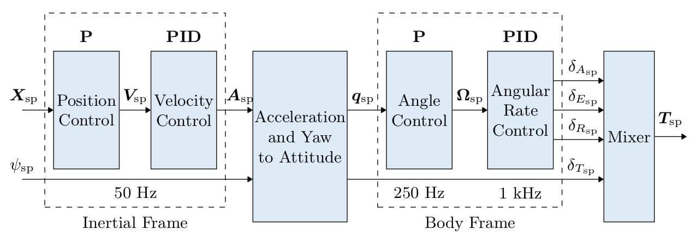
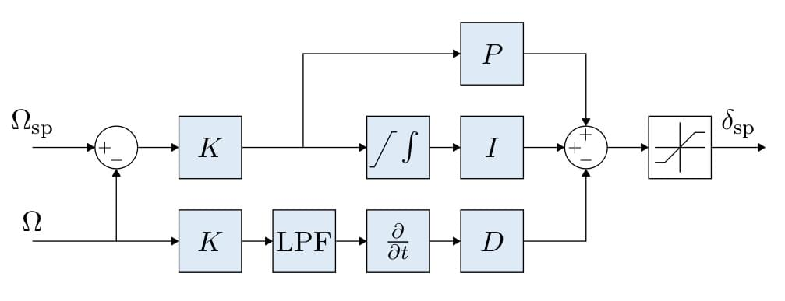
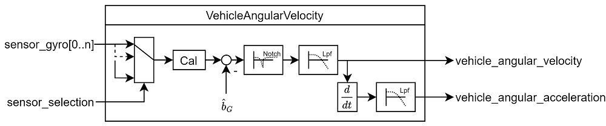
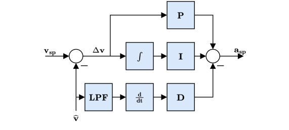
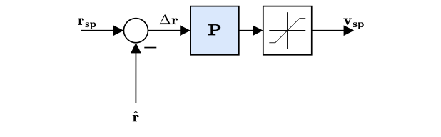
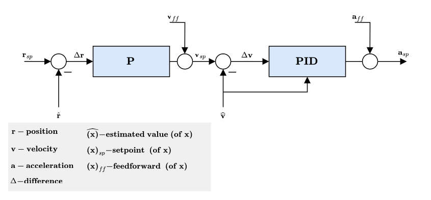
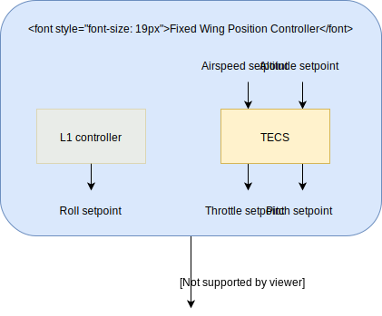
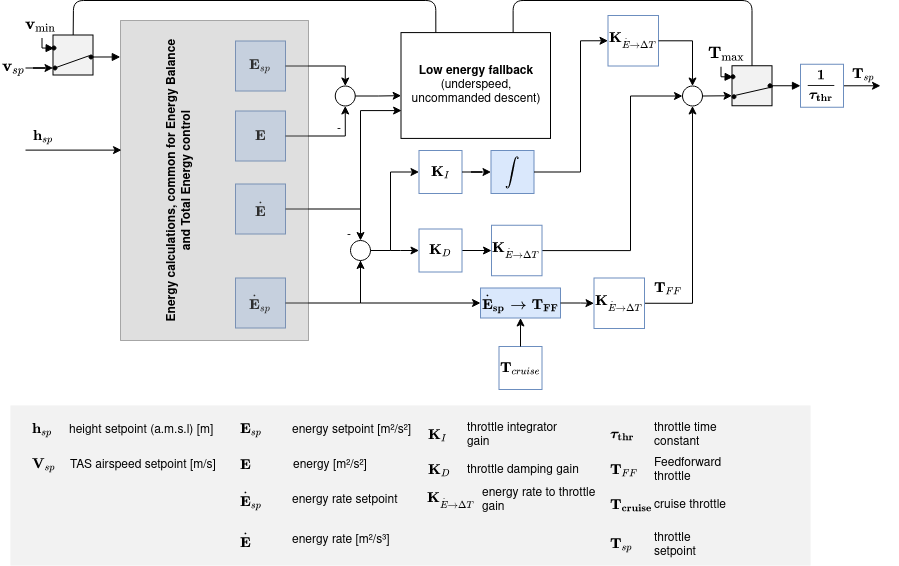
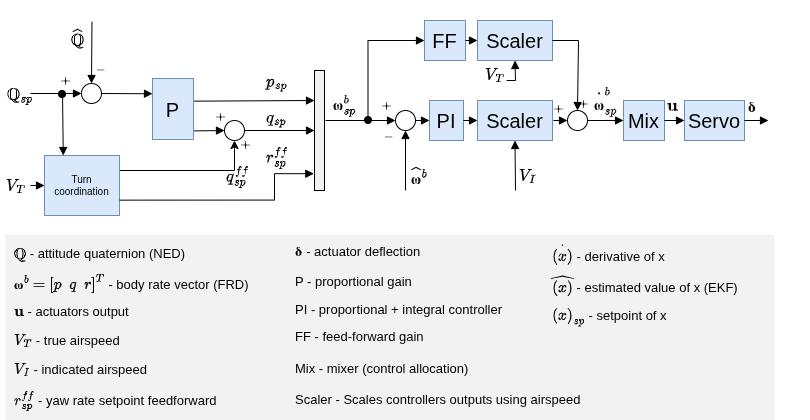

# 콘트롤러 다이어그램

이 섹션에는 PX4 컨트롤러에 대한 주요 다이어그램들이 있습니다.

The diagrams use the standard [PX4 notation](../contribute/notation.md) (and each have an annotated legend).

<!--    The diagrams were created with LaTeX / TikZ.
        The code can be found in assets/diagrams/mc_control_arch_tikz.tex.
        The easiest way to generate the diagrams and edit them is to copy the code and paste it an Overleaf (www.overleaf.com/) document to see the output.
-->

## 멀티콥터 제어 아키텍처

- 이것은 표준 계단식 제어 아키텍처입니다.
- 컨트롤러는 P 및 PID 컨트롤러를 혼합한 것입니다.
- Estimates come from [EKF2](../advanced_config/tuning_the_ecl_ekf.md).
- 모드에 따라 외부(위치) 루프는 바이패스됩니다(외부 루프 뒤에 멀티플렉서로 표시됨).
  위치 루프는 위치를 유지하거나, 축에서 요청한 속도가 null인 경우에만 사용됩니다.

### Multicopter 각속도 컨트롤러

- K-PID 컨트롤러. See [Rate Controller](../config_mc/pid_tuning_guide_multicopter.md#rate-controller) for more information.
- 통합 권한은 종료를 방지를 위하여 제한됩니다.
- The outputs are limited (in the control allocation module), usually at -1 and 1.
- 저역 통과 필터(LPF)는 파생 경로에 사용되어 노이즈를 줄입니다(자이로 드라이버는 컨트롤러에 필터링된 파생물을 제공함).

  ::: info
  The IMU pipeline is:
  gyro data > apply calibration parameters > remove estimated bias > notch filter (`IMU_GYRO_NF0_BW` and `IMU_GYRO_NF0_FRQ`) > low-pass filter (`IMU_GYRO_CUTOFF`) > vehicle_angular_velocity (_filtered angular rate used by the P and I controllers_) > derivative -> low-pass filter (`IMU_DGYRO_CUTOFF`) > vehicle_angular_acceleration (_filtered angular acceleration used by the D controller_)

  

:::

  <!-- source for image is https://github.com/PX4/PX4-Autopilot/blob/850d0bc588af79186286652af4c8293daafd2c4c/src/lib/mixer/MultirotorMixer/MultirotorMixer.cpp#L323-L326 -->

### 멀티콥터 자세 컨트롤러

- The attitude controller makes use of [quaternions](https://en.wikipedia.org/wiki/Quaternion).
- The controller is implemented from this [article](https://www.research-collection.ethz.ch/bitstream/handle/20.500.11850/154099/eth-7387-01.pdf).
- 이 컨트롤러를 조정시 고려할 유일한 매개변수는 P 게인입니다.
- rate 명령은 포화됩니다.

### Multicopter Acceleration to Thrust and Attitude Setpoint Conversion

- The acceleration setpoints generated by the velocity controller will be converted to thrust and attitude setpoints.
- Converted acceleration setpoints will be saturated and prioritized in vertical and horizontal thrust.
- Thrust saturation is done after computing the corresponding thrust:
  1. Compute required vertical thrust (`thrust_z`)
  2. Saturate `thrust_z` with `MPC_THR_MAX`
  3. Saturate `thrust_xy` with `(MPC_THR_MAX^2 - thrust_z^2)^0.5`

Implementation details can be found in `PositionControl.cpp` and `ControlMath.cpp`.

### 멀티콥터 속도 컨트롤러

- 속도를 안정화하는 PID 컨트롤러. 가속을 명령합니다.
- 적분기는 클램핑 방식을 사용하는 ARW(Anti-Reset Windup)를 포함합니다.
- The commanded acceleration is NOT saturated - a saturation will be applied to the converted thrust setpoints in combination with the maximum tilt angle.
- Horizontal gains set via parameter `MPC_XY_VEL_P_ACC`, `MPC_XY_VEL_I_ACC` and `MPC_XY_VEL_D_ACC`.
- Vertical gains set via parameter `MPC_Z_VEL_P_ACC`, `MPC_Z_VEL_I_ACC` and `MPC_Z_VEL_D_ACC`.

### 멀티콥터 위치 콘트롤러

- 속도를 명령하는 간단한 P 컨트롤러.
- 명령된 속도는 특정 한계에서 속도를 유지하기 위해 포화됩니다. See parameter `MPC_XY_VEL_MAX`. This parameter sets the maximum possible horizontal velocity. This differs from the maximum **desired** speed `MPC_XY_CRUISE` (autonomous modes) and `MPC_VEL_MANUAL` (manual position control mode).
- Horizontal P gain set via parameter `MPC_XY_P`.
- Vertical P gain set via parameter `MPC_Z_P`.

#### 결합된 위치 및 속도 컨트롤러 다이어그램

- Mode dependent feedforwards (ff) - e.g. Mission mode trajectory generator (jerk-limited trajectory) computes position, velocity and acceleration setpoints.
- Acceleration setpoints (inertial frame) will be transformed (with yaw setpoint) into attitude setpoints (quaternion) and collective thrust setpoint.

<!-- The drawing is on draw.io: https://drive.google.com/open?id=13Mzjks1KqBiZZQs15nDN0r0Y9gM_EjtX
Request access from dev team. -->

## 고정익 위치 콘트롤러

### 총 에너지 제어 시스템(TECS)

The PX4 implementation of the Total Energy Control System (TECS) enables simultaneous control of true airspeed and altitude of a fixed-wing aircraft.
The code is implemented as a library which is used in the fixed-wing position control module.

위의 다이어그램과 같이 TECS는 대기 속도와 고도 설정값을 입력하여 스로틀 및 피치 각도 설정값을 출력합니다.
These two outputs are sent to the fixed-wing attitude controller which implements the attitude control solution. However, the throttle setpoint is passed through if it is finite and if no engine failure was detected.
It's therefore important to understand that the performance of TECS is directly affected by the performance of the pitch control loop.
A poor tracking of airspeed and altitude is often caused by a poor tracking of the aircraft pitch angle.

:::info
Make sure to tune the attitude controller before attempting to tune TECS.
:::

실제 속도와 높이를 동시에 제어하는 것은 쉽지 않습니다.
항공기 피치 각도를 높이면 높이가 증가하지만 속도도 감소합니다.
스로틀을 높이면 속도가 증가하지만, 양력 증가로 인하여 높이도 증가합니다.
따라서 제어 문제를 어렵게 만드는 두 개의 출력(대기 속도 및 고도)에 모두 영향을 미치는 두 개의 입력(피치 각도 및 스로틀)이 존재합니다.

TECS는 원래 설정이 아닌 에너지 측면에서 문제를 표현하여 솔루션을 제공합니다.
항공기의 총 에너지는 운동 에너지와 위치 에너지의 합입니다. 추력(스로틀 제어를 통해)은 항공기의 총 에너지를 증가시킵니다. 주어진 총 에너지 상태는 위치 에너지와 운동 에너지의 조합입니다.
즉, 높은 고도에서 느린 속도로 비행하는 것은 총 에너지 측면에서 낮은 고도에서 더 빠른 속도로 비행하는 것과 동일합니다. 이를 특정 에너지 균형이라고 하며, 현재 고도와 실제 속도 설정값으로 계산합니다.
특정 에너지 균형은 항공기 피치 각도를 통하여 제어됩니다.
피치 각도의 증가는 운동을 위치 에너지로 변환하고, 음의 피치 각도는 그 반대로 변환합니다.
따라서, 제어 문제를 초기 설정값을 독립적으로 제어 가능한 에너지 양으로 변환하여 분리하였습니다.
추력을 사용하여 차량의 특정 총 에너지를 조절하고, 피치는 위치(높이)와 운동(속도) 에너지 사이의 균형을 유지합니다.

#### 총 에너지 제어 루프

<!-- https://drive.google.com/file/d/1q12b6ASbQRkFWqLMXm92cryOI-cZnrKv/view?usp=sharing -->

#### 총 에너지 균형 제어 루프

<!-- The drawing is on draw.io: https://drive.google.com/file/d/1bZtFULYmys-_EQNhC9MNcKLFauc7OYJZ/view -->

항공기의 총 에너지는 운동 에너지와 위치 에너지의 합입니다.

$$E_T = \frac{1}{2} m V_T^2 + m g h$$

시간에 대한 미분을 취하면 총 에너지 비율이 됩니다.

$$\dot{E_T} = m V_T \dot{V_T} + m g \dot{h}$$

이로부터 특정 에너지율은 다음과 같습니다.

$$\dot{E} = \frac{\dot{E_T}}{mgV_T}  = \frac{\dot{V_T}}{g} + \frac{\dot{h}}{V_T} = \frac{\dot{V_T}}{g} + sin(\gamma)$$

여기서 $\gamma{}$는 비행 계획 각도입니다.
작은 $\gamma{}$의 경우 다음과 같이 근사할 수 있습니다.

$$\dot{E} \approx  \frac{\dot{V_T}}{g} + \gamma$$

항공기의 동적 방정식에서 다음 관계를 얻습니다.

$$T - D = mg(\frac{\dot{V_T}}{g} + sin(\gamma)) \approx mg(\frac{\dot{V_T}}{g} + \gamma)$$

여기서, T와 D는 추력과 항력입니다.
수평 비행에서 초기 추력은 항력에 대해 조정되고, 추력의 변화는 다음과 같은 결과를 나타냅니다.

$$\Delta T = mg(\frac{\dot{V_T}}{g} + \gamma)$$

보시다시피 $\Delta T{}$는 $\dot{E}{}$에 비례하므로, 추력 설정값을 전체 에너지 제어에 사용합니다.

반면에 엘리베이터 제어는 에너지를 보존하므로, 위치 에너지를 운동 에너지로 또는 그 반대로 전환합니다. 이를 위하여, 특정 에너지 균형 비율은 다음과 같이 정의합니다.

$$\dot{B} = \gamma - \frac{\dot{V_T}}{g}$$

## 고정익 자세 콘트롤러

<!-- The drawing is on draw.io: https://drive.google.com/file/d/1ibxekmtc6Ljq60DvNMplgnnU-JOvKYLQ/view?usp=sharing
Request access from dev team. -->

자세 제어기는 계단식 루프 방식을 사용합니다.
외부 루프는 자세 설정값과 추정된 자세 사이의 오차를 계산하여 이득(P 콘트롤러)을 곱하여 속도 설정값을 계산합니다.
그런 다음 내부 루프는 비율의 오류를 계산하고 PI(비례 + 적분) 콘트롤러를 사용하여 목표치 각가속도를 생성합니다.

The angular position of the control effectors (ailerons, elevators, rudders, ...) is then computed using this desired angular acceleration and a priori knowledge of the system through control allocation (also known as mixing).
또한 제어 표면은 고속에서 더 효과적이고 저속에서는 덜 효과적이기 때문에, 순항 속도에 맞게 조정된 컨트롤러는 속도 측정을 사용하여 조정됩니다(이러한 센서가 사용되는 경우).

:::info
If no airspeed sensor is used then gain scheduling for the FW attitude controller is  disabled (it's open loop); no correction is/can be made in TECS using airspeed feedback.
:::

피드포워드 이득은 공기역학적 감쇠를 보상합니다.
기본적으로 항공기의 차체 축 모멘트의 두 가지 주요 구성 요소는 제어 표면(에일러론, 엘리베이터, 방향타, - 움직임 생성)과 공기역학적 감쇠(몸체 속도에 비례 - 움직임에 대응)에 의하여 생성됩니다.
일정한 속도를 유지하기 위하여, 이 댐핑은 속도 루프에서 피드포워드를 사용하여 보상할 수 있습니다.

### Turn coordination

롤 및 피치 컨트롤러는 동일한 구조를 가지며, 종방향 역학과 횡방향 역학은 독립적으로 작동하기에 충분히 분리되어 있다고 가정합니다.
그러나, 요 콘트롤러는 항공기가 미끄러질 때 생성되는 측면 가속도를 최소화하기 위해 선회 조정 제약 조건을 사용하여 요 각속도 설정점을 계산합니다.  The turn coordination algorithm is based solely on coordinated turn geometry calculation.

$$\dot{\Psi}_{sp} = \frac{g}{V_T} \tan{\phi_{sp}} \cos{\theta_{sp}}$$

The yaw rate controller also helps to counteract [adverse yaw effects](https://youtu.be/sNV_SDDxuWk) and to damp the [Dutch roll mode](https://en.wikipedia.org/wiki/Dutch_roll) by providing extra directional damping.

## VTOL 콘트롤러

<!-- The drawing is on draw.io: https://drive.google.com/file/d/1tVpmFhLosYjAtVI46lfZkxBz_vTNi8VH/view?usp=sharing
Request access from dev team. -->

This section gives a short overview on the control structure of Vertical Take-off and Landing (VTOL) aircraft.
The VTOL flight controller consists of both the multicopter and fixed-wing controllers, either running separately in the corresponding VTOL modes, or together during transitions.
The diagram above presents a simplified control diagram.
Note the VTOL attitude controller block, which mainly facilitates the necessary switching and blending logic for the different VTOL modes, as well as VTOL-type-specific control actions during transitions (e.g. ramping up the pusher motor of a standard VTOL during forward transition).
The inputs into this block are called "virtual" as, depending on the current VTOL mode, some are ignored by the controller.

For a standard and tilt-rotor VTOL, during transition the fixed-wing attitude controller produces the rate setpoints, which are then fed into the separate rate controllers, resulting in torque commands for the multicopter and fixed-wing actuators.
For tailsitters, during transition the multicopter attitude controller is running.

The outputs of the VTOL attitude block are separate torque and force commands for the multicopter and fixed-wing actuators (two instances for `vehicle_torque_setpoint` and `vehicle_thrust_setpoint`).
These are handled in an airframe-specific control allocation class.

For more information on the tuning of the transition logic inside the VTOL block, see [VTOL Configuration](../config_vtol/index.md).

### Airspeed Scaling

The objective of this section is to explain with the help of equations why and how the output of the rate PI and feedforward (FF) controllers can be scaled with airspeed to improve the control performance.
We will first present the simplified linear dimensional moment equation on the roll axis, then show the influence of airspeed on the direct moment generation and finally, the influence of airspeed during a constant roll.

As shown in the fixed-wing attitude controller above, the rate controllers produce angular acceleration setpoints for the control allocator (here named "mixer").
In order to generate these desired angular accelerations, the mixer produces torques using available aerodynamic control surfaces (e.g.: a standard airplane typically has two ailerons, two elevators and a rudder).
The torques generated by those control surfaces is highly influenced by the relative airspeed and the air density, or more precisely, by the dynamic pressure.
If no airspeed scaling is made, a controller tightly tuned for a certain cruise airspeed will make the aircraft oscillate at higher airspeed or will give bad tracking performance at low airspeed.

The reader should be aware of the difference between the [true airspeed (TAS)](https://en.wikipedia.org/wiki/True_airspeed) and the [indicated airspeed (IAS)](https://en.wikipedia.org/wiki/Indicated_airspeed) as their values are significantly different when not flying at sea level.

The definition of the dynamic pressure is

$$\bar{q} = \frac{1}{2} \rho V_T^2$$

where $\rho{}$ is the air density and $V_T{}$ the true airspeed (TAS).

Taking the roll axis for the rest of this section as an example, the dimensional roll moment can be written

$$\ell = \frac{1}{2}\rho V_T^2 S b C_\ell = \bar{q} S b C_\ell$$

where $\ell{}$ is the roll moment, $b{}$ the wing span and $S{}$ the reference surface.

The nondimensional roll moment derivative $C_\ell{}$ can be modeled using the aileron effectiveness derivative $C_{\ell_{\delta_a}}{}$, the roll damping derivative $C_{\ell_p}{}$ and the dihedral derivative $C_{\ell_\beta}{}$

$$C_\ell = C_{\ell_0} + C_{\ell_\beta}\:\beta + C_{\ell_p}\:\frac{b}{2V_T}\:p + C_{\ell_{\delta_a}} \:\delta_a$$

where $\beta{}$ is the sideslip angle, $p{}$ the body roll rate and $\delta_a{}$ the aileron deflection.

Assuming a symmetric ($C_{\ell_0} = 0{}$) and coordinated ($\beta = 0{}$) aircraft, the equation can be simplified using only the rollrate damping and the roll moment produced by the ailerons

$$\ell = \frac{1}{2}\rho V_T^2 S b \left [C_{\ell_{\delta_a}} \:\delta_a + C_{\ell_p}\:\frac{b}{2V_T} \: p \right ]$$

This final equation is then taken as a baseline for the two next subsections to determine the airspeed scaling expression required for the PI and the FF controllers.

#### 정적 토크(PI) 조종

At a zero rates condition ($p = 0{}$), the damping term vanishes and a constant - instantaneous - torque can be generated using:

$$\ell = \frac{1}{2}\rho V_T^2 S b \: C_{\ell_{\delta_a}} \:\delta_a = \bar{q} S b \: C_{\ell_{\delta_a}} \:\delta_a$$

Extracting $\delta_a{}$ gives

$$\delta_a = \frac{2bS}{C_{\ell_{\delta_a}}} \frac{1}{\rho V_T^2} \ell = \frac{bS}{C_{\ell_{\delta_a}}} \frac{1}{\bar{q}} \ell$$

where the first fraction is constant and the second one depends on the air density and the true airspeed squared.

Furthermore, instead of scaling with the air density and the TAS, it can be shown that the indicated airspeed (IAS, $V_I{}$) is inherently adjusted by the air density since at low altitude and speed, IAS can be converted to TAS using a simple density error factor

$$V_T = V_I \sqrt{\frac{\rho_0}{\rho}}$$

, where $\rho_o{}$ is the air density as sea level, 15°C.

Squaring, rearranging and adding a 1/2 factor to both sides makes the dynamic pressure $\bar{q}{}$ expression appear

$$\bar{q} = \frac{1}{2} \rho V_T^2 = \frac{1}{2} V_I^2 \rho_0$$

We can now easily see that the dynamic pressure is proportional to the IAS squared:

$$\bar{q} \propto V_I^2$$

The scaler previously containing TAS and the air density can finally be written using IAS only

$$\delta_a = \frac{2bS}{C_{\ell_{\delta_a}}\rho_0} \frac{1}{V_I^2} \ell$$

#### 비율(FF) 조종

The main use of the feedforward of the rate controller is to compensate for the natural rate damping.
Starting again from the baseline dimensional equation but this time, during a roll at constant speed, the torque produced by the ailerons should exactly compensate for the damping such as

$$- C_{\ell_{\delta_a}} \:\delta_a = C_{\ell_p} \frac{b}{2 V_T} \: p$$

Rearranging to extract the ideal ailerons deflection gives

$$\delta_a = -\frac{b \: C_{\ell_p}}{2 \: C_{\ell_{\delta_a}}} \frac{1}{V_T} \: p$$

The first fraction gives the value of the ideal feedforward and we can see that the scaling is linear to the TAS.
Note that the negative sign is then absorbed by the roll damping derivative which is also negative.

#### 결론

The output of the rate PI controller has to be scaled with the indicated airspeed (IAS) squared and the output of the rate feedforward (FF) has to be scaled with the true airspeed (TAS)

$$\delta_{a} = \frac{V_{I_0}^2}{V_I^2} \delta_{a_{PI}} + \frac{V_{T_0}}{V_T} \delta_{a_{FF}}$$

where $V_{I_0}{}$ and $V_{T_0}{}$ are the IAS and TAS at trim conditions.

Finally, since the actuator outputs are normalized and that the mixer and the servo blocks are assumed to be linear, we can rewrite this last equation as follows:

$$\dot{\mathbf{\omega}}_{sp}^b = \frac{V_{I_0}^2}{V_I^2} \dot{\mathbf{\omega}}_{sp_{PI}}^b + \frac{V_{T_0}}{V_T} \dot{\mathbf{\omega}}_{sp_{FF}}^b$$

and implement it directly in the rollrate, pitchrate and yawrate controllers.

In the case of airframes with controls performance that is not dependent directly on airspeed e.g. a rotorcraft like [autogyro](../frames_autogyro/index.md). There is possibility to disable airspeed scaling feature by [FW_ARSP_SCALE_EN](../advanced_config/parameter_reference.md#FW_ARSP_SCALE_EN) parameter.

#### Tuning recommendations

The beauty of this airspeed scaling algorithm is that it does not require any specific tuning.
However, the quality of the airspeed measurements directly influences its performance.

Furthermore, to get the largest stable flight envelope, one should tune the attitude controllers at an airspeed value centered between the stall speed and the maximum airspeed of the vehicle (e.g.: an airplane that can fly between 15 and 25m/s should be tuned at 20m/s).
This "tuning" airspeed should be set in the [FW_AIRSPD_TRIM](../advanced_config/parameter_reference.md#FW_AIRSPD_TRIM) parameter.
