# DJI FlameWheel 450 + CUAV V5 nano 조립

This topic provides full instructions for building the kit and configuring PX4 using _QGroundControl_.

주요 정보

- **Frame:** DJI F450
- **Flight controller:** [CUAV V5+](../flight_controller/cuav_v5_plus.md)
- **Assembly time (approx.):** 90 minutes (45 minutes for frame, 45 minutes autopilot installation/configuration)

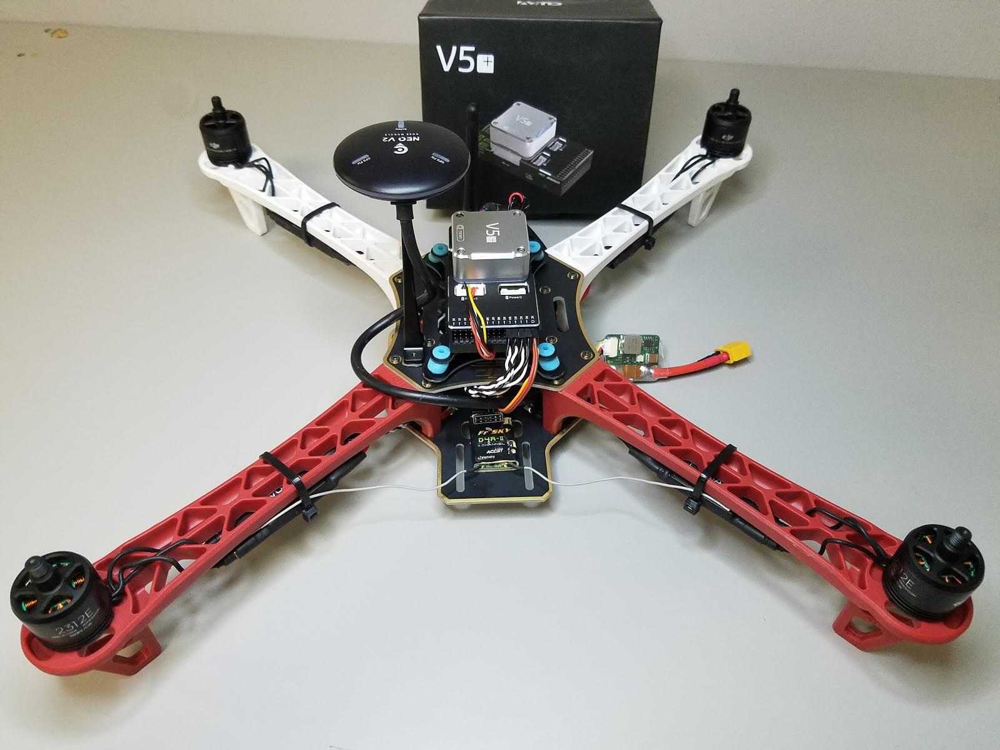

## 부품 명세서

조립에 필요한 부품들입니다.

- Flight controller: CUAV V5+:
  - GPS: [CUAV NEO V2 GPS](https://store.cuav.net/index.php?id_product=97&id_product_attribute=0&rewrite=cuav-new-ublox-neo-m8n-gps-module-with-shell-stand-holder-for-flight-controller-gps-compass-for-pixhack-v5-plus-rc-parts-px4&controller=product&id_lang=1)
  - 전원 모듈
- Frame: [DJI F450](https://www.amazon.com/Flame-Wheel-Basic-Quadcopter-Drone/dp/B00HNMVQHY)
- Propellers: [DJI Phantom Built-in Nut Upgrade Propellers 9.4x5](https://www.masterairscrew.com/products/dji-phantom-built-in-nut-upgrade-propellers-in-black-mr-9-4x5-prop-set-x4-phantom)
- Battery: [Turnigy High Capacity 5200mAh 3S 12C Lipo Pack w/XT60](https://hobbyking.com/en_us/turnigy-high-capacity-5200mah-3s-12c-multi-rotor-lipo-pack-w-xt60.html?___store=en_us)
- Telemetry: [Holybro Transceiver Telemetry Radio V3](../telemetry/holybro_sik_radio.md)
- RC Receiver: [FrSky D4R-II 2.4G 4CH ACCST Telemetry Receiver](https://www.banggood.com/FrSky-D4R-II-2_4G-4CH-ACCST-Telemetry-Receiver-for-RC-Drone-FPV-Racing-p-929069.html?cur_warehouse=GWTR)
- Motors: [DJI E305 2312E Motor (960kv,CW)](https://www.amazon.com/DJI-E305-2312E-Motor-960kv/dp/B072MBMCZN)
- ESC: Hobbywing XRotor 20A APAC Brushless ESC 3-4S For RC Multicopters

FrSky Taranis 조종기를 사용할 수 있습니다.
부수적으로 케이블 타이와, 양면 테이프, 납땜도 필요합니다.

아래의 이미지는 프레임과 전자 부품들을 나타냅니다.

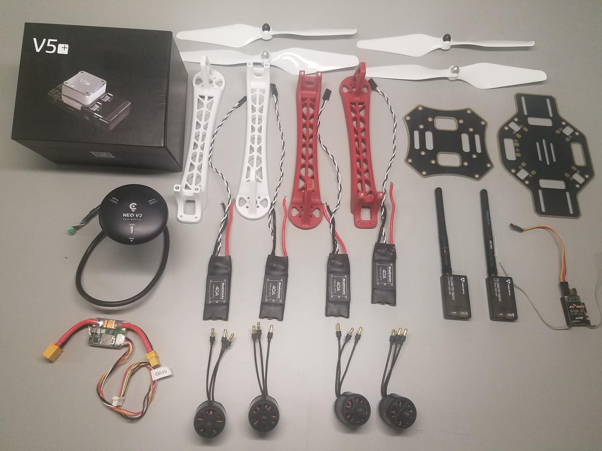

## 하드웨어

### 프레임

이 절에서는 에어 프레임의 모든 하드웨어를 나열합니다.

| 설명                                                 | 수량 |
| -------------------------------------------------- | -- |
| DJI F450 밑판                                        | 1  |
| DJI F450 윗판                                        | 1  |
| DJI F450 랜딩기어 역할을 하는 다리                            | 4  |
| M3\*8 나사                                           | 18 |
| M2 5\*6 나사                                         | 24 |
| 벨크로 배터리 스트랩                                        | 1  |
| DJI Phantom 나사 내장 업그레이드 프로펠러 9.4x5 | 1  |

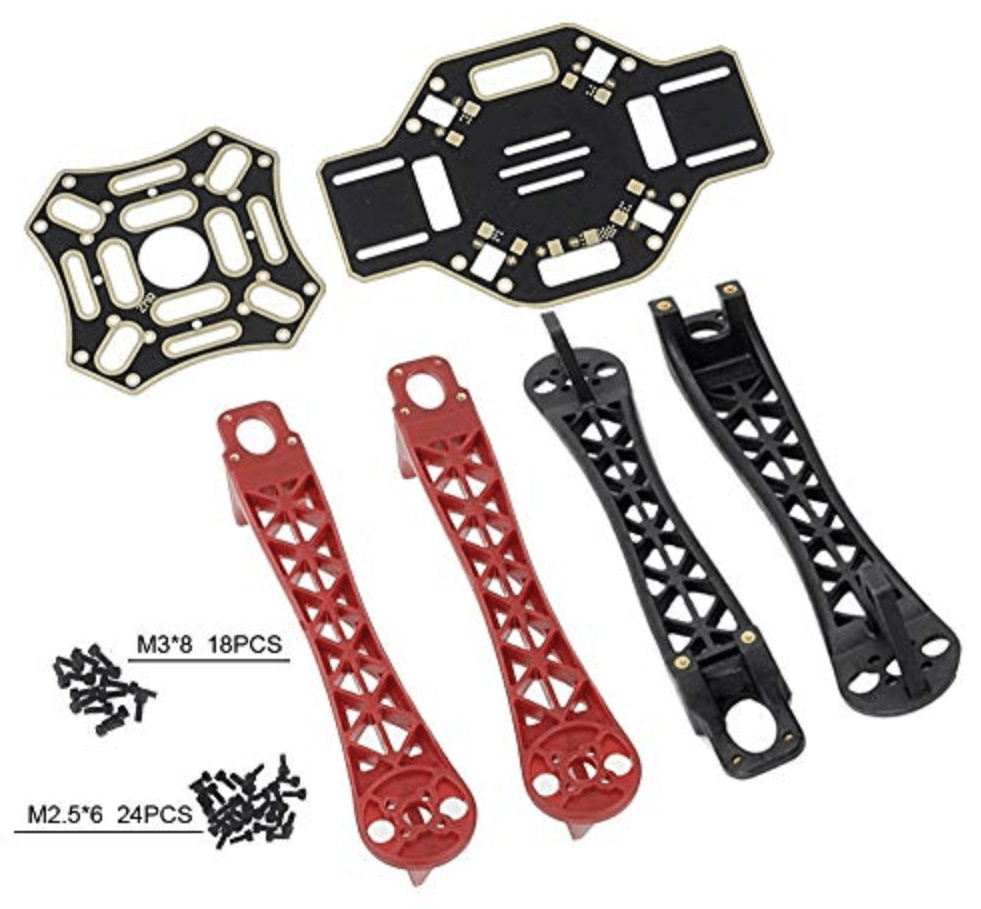

### CUAV v5+ 패키지

이 절에서는 CUAV v5+ 패키지의 부품들을 설명합니다.

| 설명                                          | 수량 (기본 패키지) | 수량 (+GPS 패키지) |
| ------------------------------------------- | ------------------------------ | -------------------------------- |
| V5+ AutoPilot                               | 1                              | 1                                |
| 듀퐁 케이블                                      | 2                              | 2                                |
| I2C/CAN 케이블                                 | 2                              | 2                                |
| ADC 6.6 케이블                 | 2                              | 2                                |
| SBUS 시그널 케이블                                | 1                              | 1                                |
| IRSSI 케이블                                   | 1                              | 1                                |
| DSM 시그널 케이블                                 | 1                              | 1                                |
| ADC 3.3 케이블                 | 1                              | 1                                |
| Debug 케이블                                   | 1                              | 1                                |
| 안전 스위치 케이블                                  | 1                              | 1                                |
| Voltage & Current Cable | 1                              | 1                                |
| PW-Link 모듈 케이블                              | 1                              | 1                                |
| 전원 모듈                                       | 1                              | 1                                |
| SanDisk 16GB 메모리 카드                         | 1                              | 1                                |
| I2C 확장 보드                                   | 1                              | 1                                |
| TTL Plate                                   | 1                              | 1                                |
| NEO GPS                                     | -                              | 1                                |
| GPS 브라켓                                     | -                              | 1                                |

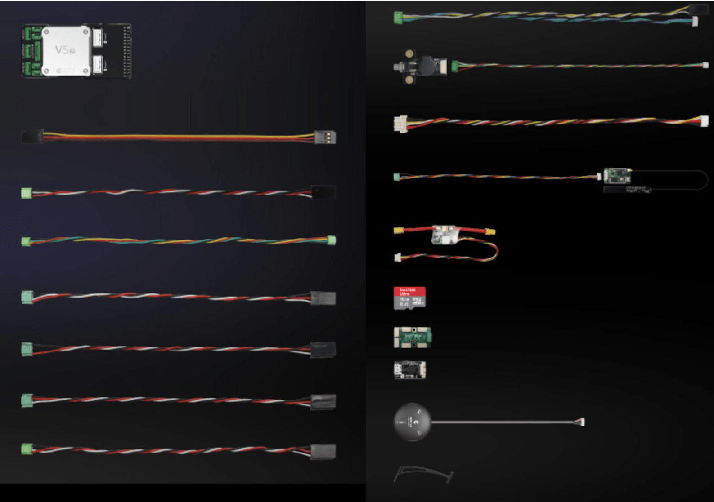

### 전자부품

| 설명                                                             | 수량 |
| -------------------------------------------------------------- | -- |
| CUAV V5+                                                       | 1  |
| CUAV NEO V2 GPS                                                | 1  |
| Holibro 텔레메트리                                                  | 1  |
| FrSky D4R-II 2.4G 4CH ACCST Telemetry Receiver | 1  |
| DJI E305 2312E Motor (800kv,CW)             | 4  |
| Hobbywing XRotor 20A APAC Brushless ESC                        | 4  |
| 전원모듈(CUAV V5+ 패키지에 포함)                      | 1  |
| Turnigy 고용량 5200mAh 3S 12C Lipo Pack w/XT60                    | 1  |

### 필요한 공구들

조립시에 필요한 공구들입니다.

- 2.0mm 육각 스크류드라이버
- 3mm Phillips 스크류드라이버
- 전선 커터
- 정밀 트위저
- 납땜기

## 조립

예상 조립 시간은 약 90분입니다 (프레임 조립에 약 45분, 자율비행프로그램 설치와 설정에 약 45분).

1. 제공된 나사를 이용하여 하판에 팔 4개를 결합합니다.

  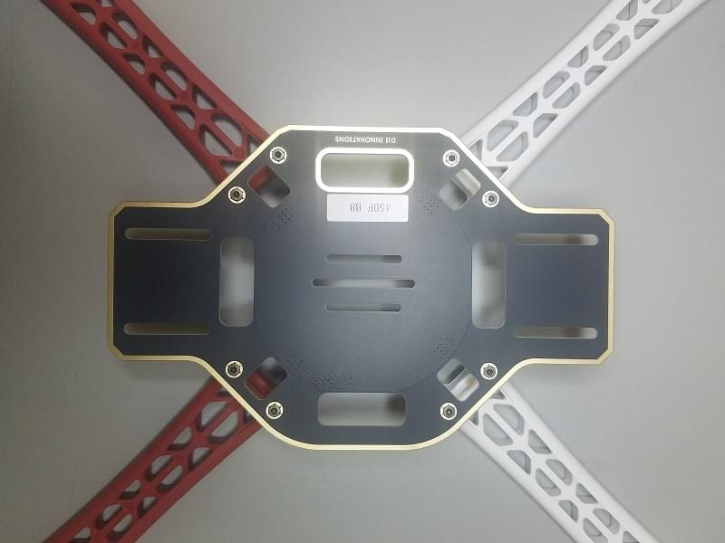

2. ESC (변속기) 의 양극 (빨강)과 음극 (검정)을 보드에 납땜합니다.

  

3. 전원 모듈의 양극 (빨강)과 음극 (검정)을 납땜합니다.

  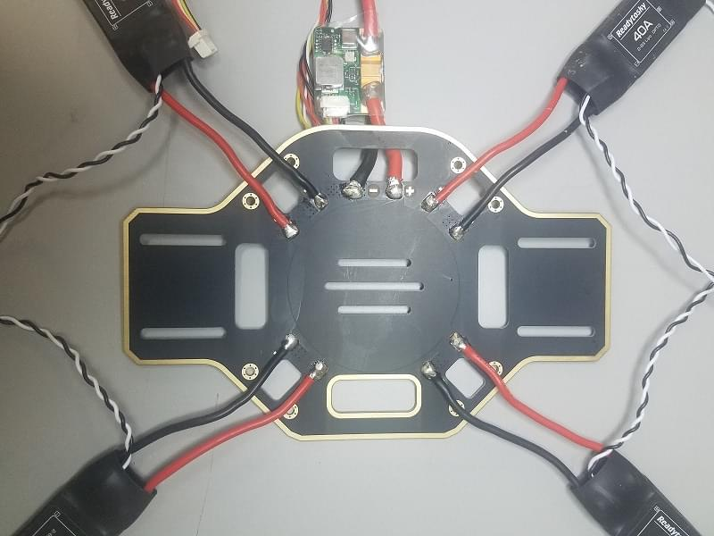

4. 위치에 따라 모터를 ESC에 연결합니다.

  

5. 각각의 모터를 해당하는 팔에 고정합니다.

  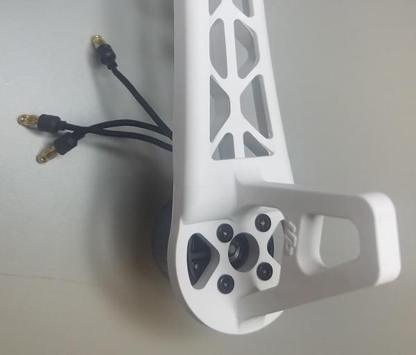
  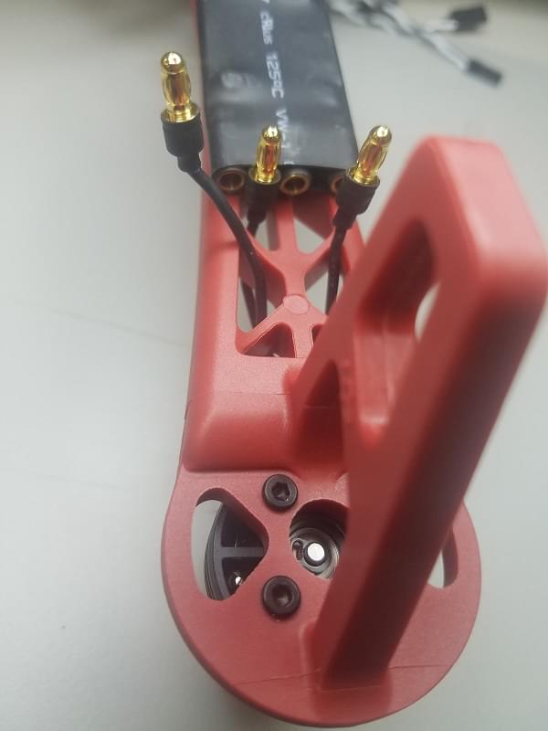

6. (다리의 윗부분과 나사로 결합하여) 상판을 장착합니다.

  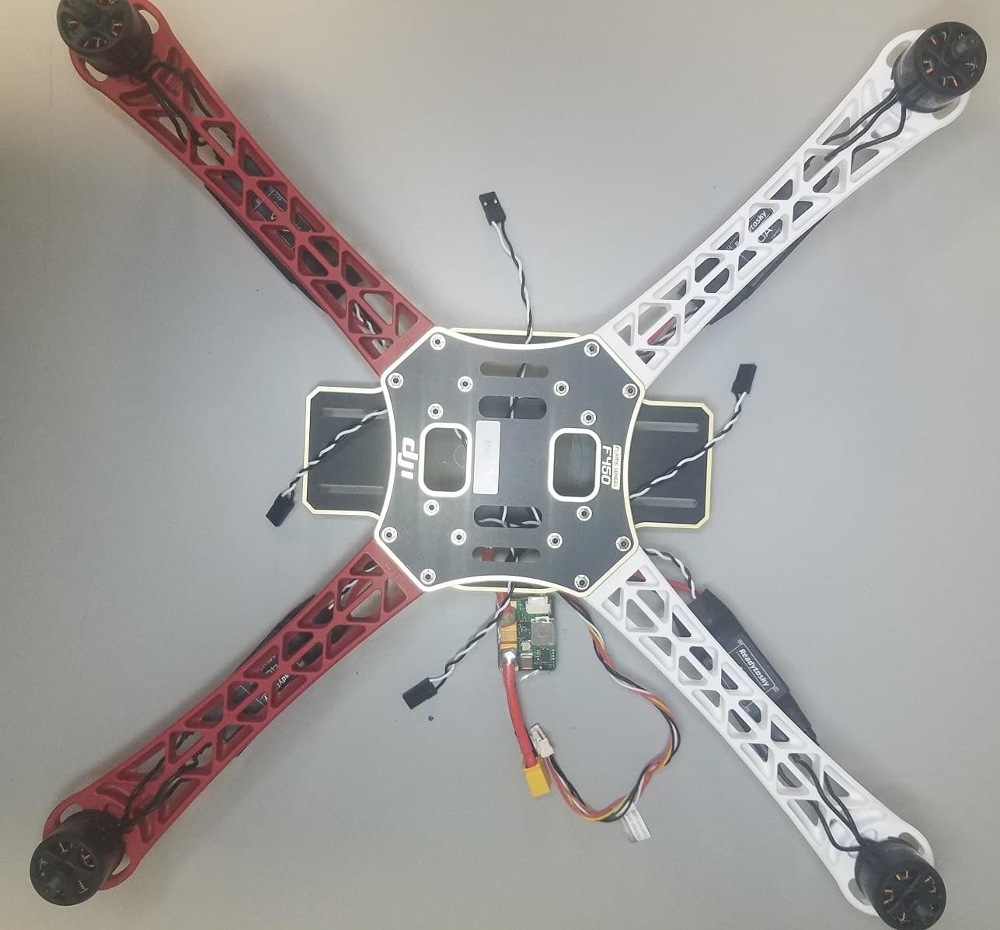

7. CUAV V5 + 비행 컨트롤러에 양면 테이프(3M)를 추가합니다 (내부 진동 감쇠 기능이있어 폼을 사용할 필요가 없음).

  

8. FrSky 수신기를 양면 테이프를 이용하여 하판에 부착합니다.

  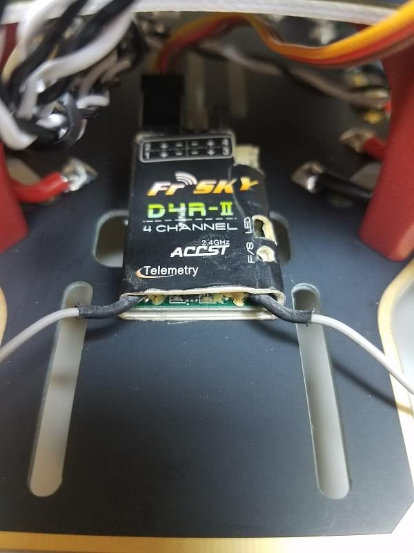

9. 텔레메트리 모듈을 기체의 아랫판에 양면테이프를 이용하여 부착합니다.

  
  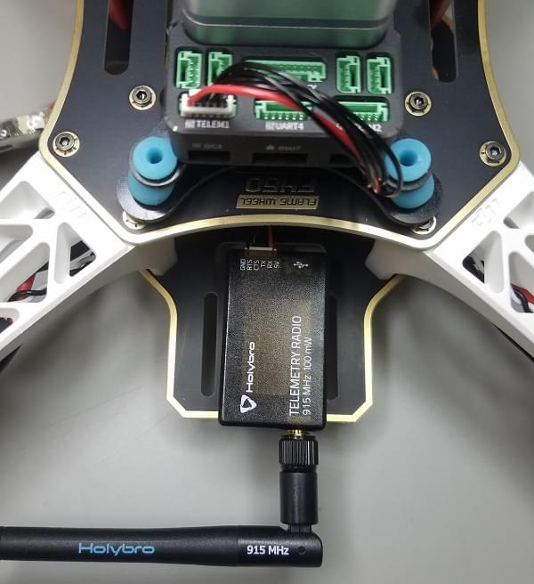

10. 알루미늄 GPS 지지대를 밑판에 추가한후 GPS를 부착합니다.

11. Plug in Telemetry (`TELEM1`) and GPS module (`GPS/SAFETY`) to the flight controller.
  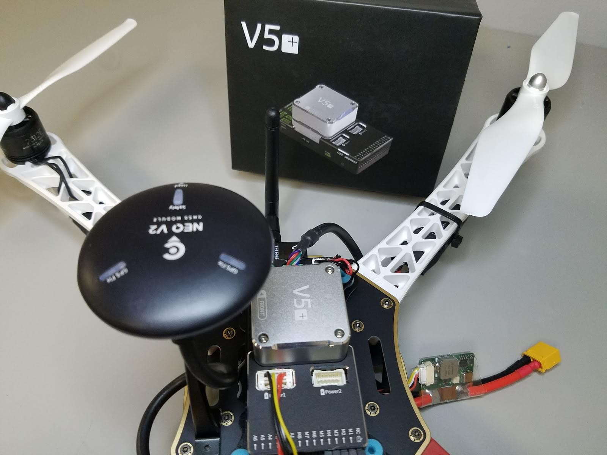
  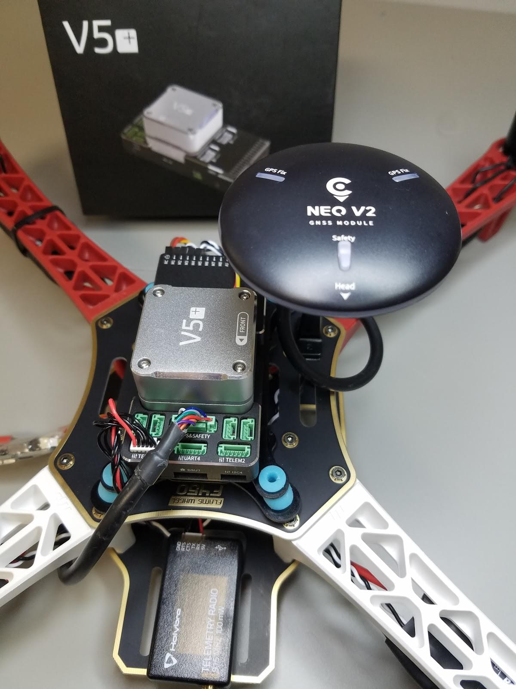

12. Plug in the RC receiver (`RC`), all 4 ESC’s (`M1-M4`), and the power module (`Power1`) into the flight controller.
  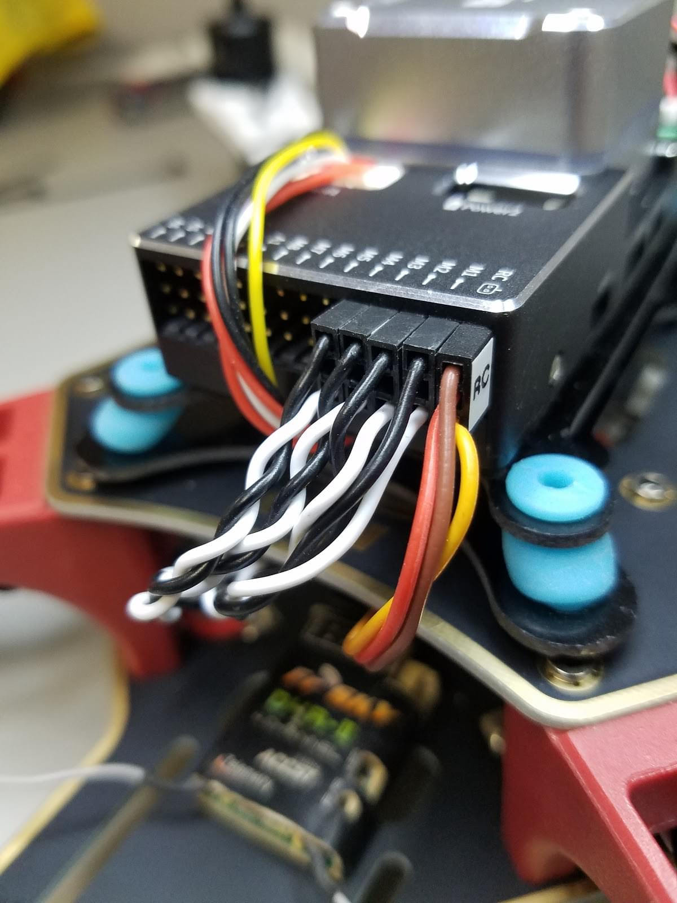

  ::: info
  The motor order is defined in the [Airframe Reference > Quadrotor x](../airframes/airframe_reference.md#quadrotor-x)

:::

끝났습니다!
마지막 조립순서가 다음에 이어집니다:

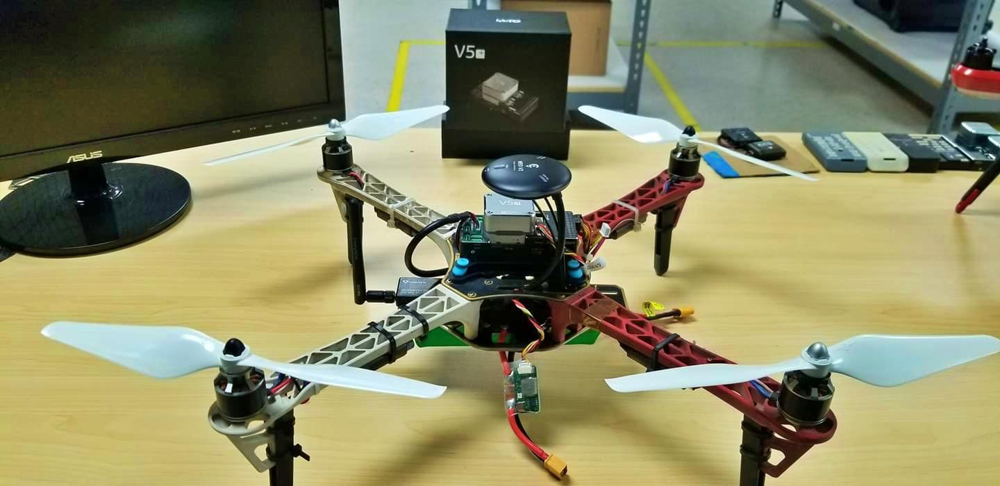

## PX4 설정

_QGroundControl_ is used to install the PX4 autopilot and configure/tune it for the frame.
[Download and install](http://qgroundcontrol.com/downloads/)
_QGroundControl_ for your platform.

:::tip
Full instructions for installing and configuring PX4 can be found in [Basic Configuration](../config/index.md).
:::

First update the firmware, airframe, geometry, and outputs:

- [Firmware](../config/firmware.md)

- [Airframe](../config/airframe.md)
  ::: info
  You will need to select the _Generic Quadcopter_ airframe (**Quadrotor x > Generic Quadcopter**).

  

:::

- [Actuators](../config/actuators.md)
  - Update the vehicle geometry to match the frame.
  - Assign actuator functions to outputs to match your wiring.
  - Test the configuration using the sliders.

그리고, 설치후에 필수적인 설정 작업과 보정 작업을 진행하여야 합니다.

- [Sensor Orientation](../config/flight_controller_orientation.md)
- [Compass](../config/compass.md)
- [Accelerometer](../config/accelerometer.md)
- [Level Horizon Calibration](../config/level_horizon_calibration.md)
- [Radio Setup](../config/radio.md)
- [Flight Modes](../config/flight_mode.md)

  ::: info
  For this build we set up modes _Stabilized_, _Altitude_ and _Position_ on a three-way switch on the receiver (mapped to a single channel - 5).
  이 방법이 초심자에게 추천하는 최소 설정입니다.

:::

이후 다음 작업 역시 수행되어야 합니다:

- [ESC Calibration](../advanced_config/esc_calibration.md)
- [Battery Estimation Tuning](../config/battery.md)
- [Safety](../config/safety.md)

## 튜닝

Airframe selection sets _default_ autopilot parameters for the frame.
These may be good enough to fly with, but you should tune each frame build.

For instructions on how, start from [Autotune](../config/autotune_mc.md).

## 비디오

<lite-youtube videoid="r-IkaVpN1Ko" title="CUAV V5+"/>

## 감사의 글

이 빌드 로그는 Dronecode Test Flight Team에서 제공했습니다.
