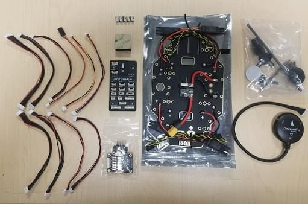
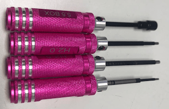
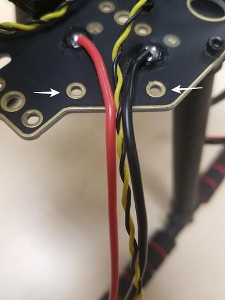
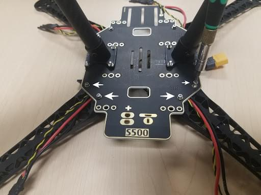
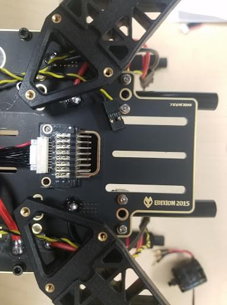
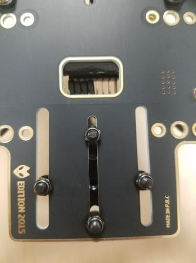

# Holybro S500 V2 + Pixhawk 4 조립

This topic provides full instructions for building the kit and configuring PX4 using _QGroundControl_.

:::info
Holybro initially supplied this kit with a [Holybro Pixhawk 4](../flight_controller/pixhawk4.md), but at time of writing this has been upgraded to a more recent Pixhawk (6C).
This build log is still relevant as the kit assembly is virtually the same, and likely to remain so as the flight controller is upgraded.
:::

## 주요 정보

- **Frame:** Holybro S500
- **Flight controller:** [Pixhawk 4](../flight_controller/pixhawk4.md)
- **Assembly time (approx.):** 90 minutes (45 minutes for frame, 45 minutes for autopilot installation/configuration)

## 부품 명세서

The Holybro [S500 V2 Kit](https://holybro.com/collections/s500/products/s500-v2-development-kit) includes almost all the required components:

- A recent Pixhawk autopilot
  - For this log it was Pixhawk 4 but far more recent versions are now included.
- 전원 관리 PM02 (조립)
- 고강도 플라스틱의 ARM
- 모터 - 2216 KV880 (V2 업데이트)
- 프로펠러 1045 (V2 업데이트)
- Pixhawk 4 GPS
- 조립된 ESC 전원 관리 보드
- 433 MHz / 915 MHz [Holybro Telemetry Radio](../telemetry/holybro_sik_radio.md)
- 전원 및 무선 조종기 케이블
- 배터리 혁지
- Dimensions:383_385_240mm
- 축거 : 480mm

:::info
No LiPo battery is included.
FrSky Taranis 무선 조종기를 사용하여 조립하는 경우를 예시로 설명합니다.
:::

## 하드웨어

| 품목 설명                                  | 수량 |
| -------------------------------------- | -- |
| 축거 : 480mm             | 1  |
| 암                                      | 4  |
| 착륙 기어 세트                               | 2  |
| M3\*8 나사                               | 18 |
| M2 5\*6 나사                             | 24 |
| 배터리 혁지                                 | 1  |
| 프로펠러 1045 (V2 업데이트) | 1  |

## 패키지

| 항목                                                     | 패키지 |
| ------------------------------------------------------ | --- |
| Pixhawk 4                                              | 1   |
| Pixhawk4 GPS 모듈                                        | 1   |
| I2C 분리 보드                                              | 2   |
| 6 ~ 6 핀 케이블 (전원)    | 3   |
| 4 ~ 4 핀 케이블 (CAN)   | 2   |
| 6 ~ 4 핀 케이블 (데이터)   | 1   |
| 10 ~ 10 핀 케이블 (PWN) | 2   |
| 8 ~ 8 핀 케이블 (AUX)   | 1   |
| 7 ~ 7 핀 케이블 (SPI)   | 1   |
| 6 ~ 6 핀 케이블 (디버깅)   | 1   |
| PPM/SBUS 출력 케이블                                        | 1   |
| XSR 수신기 케이블                                            | 1   |
| DSMX 수신기 케이블                                           | 1   |
| SBUS 수신기 케이블                                           | 1   |
| USB 케이블                                                | 1   |
| 'X'타입 접이식 받침대 마운트                                      | 1   |
| 70mm & 140mm carbon rod standoff   | 2   |
| 6\*3 2.54mm 피치 수평 핀                    | 1   |
| 8\*3 2.54mm 피치 수평 핀                    | 2   |
| 폼 세트                                                   | 1   |
| Pixhawk 4 빠른 시작 가이드                                    | 1   |
| Pixhawk4 핀아웃                                           | 1   |
| GPS 빠른 시작 가이드                                          | 1   |

### 전자부품

| 품목 설명                                         | 수량 |
| --------------------------------------------- | -- |
| Pixhawk 4 오토파일럿 (PM06 미포함) | 1  |
| 전원 관리 PM02 (조립)            | 1  |
| 모토 - 2216 KV880 (V2 업데이트)  | 4  |
| Pixhawk 4 GPS                                 | 1  |
| 조립된 ESC 전원 관리 보드                              | 1  |
| 433MHz 텔레메트리/ 915MHz 텔레메트리                    | 1  |

### 필요한 공구들

조립시에 필요한 공구들입니다.

- 1.5 mm 육각 스크류 드라이버
- 2.0 mm 육각 스크류 드라이버
- 2.5 mm 육각 스크류 드라이버
- 3mm Phillips 스크류드라이버
- 전선 커터
- 정밀 트위저

## 조립

조립 예상 시간은 90분 정도이며 프레임 조립에 약 45분과 QGroundControl의 자동조종장치 설정에 45분정도 걸립니다.

1. 랜딩 기어 조립.
  먼저 착륙 기어를 수직 기둥에 조립합니다. 랜딩 기어 나사를 풀고, 수직 기둥을 삽입합니다.

  

  

2. 전원 관리 보드를 랜딩 기어에 조립합니다. 조립된 전원 관리 보드에 수직 기둥이 있는 랜딩 기어를 나사로 고정합니다.

보드에는 4개의 구멍이 있습니다 (아래의 화살표 참조).

M3X8 나사 (총 8개, 각 측면에 4개)로 연결합니다.

1. 전원 관리 보드에 팔을 조립합니다.
  전원 관리 보드에 팔을 조립합니다.

  

  

  각 팔에 총 2개의 M2 5X6 나사를 사용합니다.
  플레이트 바닥에서 나사를 삽입합니다.

  

  ESC 케이블이 팔 중앙을 통과하는지 확인하십시오.

  

2. Assemble the 8_3 2.54mm pitch Horizontal Pin to the 10 to 10 pin cable (PWM) to the Power Management Board.
  Connect the 10 to 10 pin cable (PWM) to the 8_3 2.54mm pitch Horizontal Pin.

  

  3M 테이프 조각을 잘라 수평 핀 하단에 부착합니다.

  

  수평 핀을 전원 관리 보드에 고정 :

  

  

3. 모터를 팔에 조립합니다. M3X7 나사 16개, 모터 4개, 팔 4개가 필요합니다.

  각 팔에 모터를 장착하고, 팔의 바닥을 통해 나사를 삽입합니다.

  

  

  4개의 모터를 팔에 장착 한 후, 케이블 (빨간색, 파란색, 검은 색)을 잡고 팔 나사산에 끼웁니다.
  색상으로 구분된 3개의 케이블을 ESC에 연결합니다.

  

  

4. 프레임에 GPS를 장착합니다.
  Pixhawk 4 GPS와 마운팅된 플레이트가 필요합니다.

  

  보드 뒷면에 GPS 마스트를 장착하고 4개의 나사를 사용합니다.

  

  

  테이프를 사용하고, GPS를 GPS 마스트 상단에 붙입니다.

  

5. FrSky를 보드에 붙여 넣습니다. 양면 테이프 (3M)로 FrSky를 하단 보드에 붙여 넣습니다.
  FrSky를 프레임에 부착합니다.

  

  

6. 텔레메트리를 프레임에 부착합니다.
  다음 단계는 Holybro 텔레메트리를 프레임에 부착하고 3M 테이프를 사용합니다.

  

  

  차량 전방을 향하는 프레임 내부에 부착하였습니다.
  아래의 사진에는 프레임 하단에있는 라디오가 표시됩니다.

  

7. Pixhawk 4를 플레이트에 장착합니다.
  양면 테이프를 사용하여 Pixhawk 4를 중앙 플레이트에 부착합니다.

  

  

  

  다음 단계는 플레이트와 함께 Pixhawk 4를 프레임에 장착하는 것입니다.
  M2 5X6 나사가 필요합니다.
  플레이트를 프레임에 맞추고 나사를 삽입합니다.
  플레이트를 장착하기 전에 전원 모듈에 테이프를 붙이는 것이 좋습니다(단단하게 고정됨).

  

  

8. 프레임에 배터리 마운트 조립.
  M2 5X6 나사와 배터리 마운트가 필요합니다.

  

  긴 막대를 작은 링에 삽입합니다.

  

  

  프레임에 부착하고, 나사를 삽입하기 위해 사면이 모두 정렬되어 있는 지 확인하십시오.

  

  작은 판을 다리에 조립하고, 사면 모두에서 나사로 조입니다.

  

  마지막 단계는 플레이트를 부착하는 것입니다.

  

9. Pixhawk 4 배선. Pixhawk 4의 배선 방법은 몇 가지 방법이 있습니다.
  아래에는 Pixhawk에 필요한 전선들과 연결된 모양이 설명되어 있습니다.

10. 플러그인 원격 측정 및 GPS 모듈을 비행 컨트롤러에 연결합니다 (그림 37 참조). RC 수신기, 4 개의 ESC 모두를 비행 컨트롤러와 전원 모듈에 연결합니다.

  

완전히 조립된 키트의 예는 아래와 같습니다.

## PX4 설정

_QGroundControl_ is used to install the PX4 autopilot and configure/tune it for the QAV250 frame.
[Download and install](http://qgroundcontrol.com/downloads/) _QGroundControl_ for your platform.

:::tip
Full instructions for installing and configuring PX4 can be found in [Basic Configuration](../config/index.md).
:::

먼저, 펌웨어와 기체 프레임을 업데이트 합니다.

- [Firmware](../config/firmware.md)
- [Airframe](../config/airframe.md)

  You will need to select the _Holybro S500_ airframe (**Quadrotor x > Holybro S500**).

  

Then set the actuator outputs:

- [Actuators](../config/actuators.md)
  - You should not need to update the vehicle geometry (as this is a preconfigured airframe).
  - Assign actuator functions to outputs to match your wiring.
  - Test the configuration using the sliders.

그리고, 설치후에 필수적인 설정 작업과 보정 작업을 진행하여야 합니다.

- [Sensor Orientation](../config/flight_controller_orientation.md)
- [Compass](../config/compass.md)
- [Accelerometer](../config/accelerometer.md)
- [Level Horizon Calibration](../config/level_horizon_calibration.md)
- [Radio Setup](../config/radio.md)
- [Flight Modes](../config/flight_mode.md)

이후 다음 작업 역시 수행되어야 합니다:

- [ESC Calibration](../advanced_config/esc_calibration.md)
- [Battery Estimation Tuning](../config/battery.md)
- [Safety](../config/safety.md)

## 튜닝

Airframe selection sets _default_ autopilot parameters for the frame.
이 상태로도 비행이 가능하지만, 특정 기체에 관련된 변수들을 조정하는 것이 바람직합니다.

For instructions on how, start from [Autotune](../config/autotune_mc.md).

## 감사의 글

이 빌드 로그는 Dronecode Test Flight Team에서 제공했습니다.
