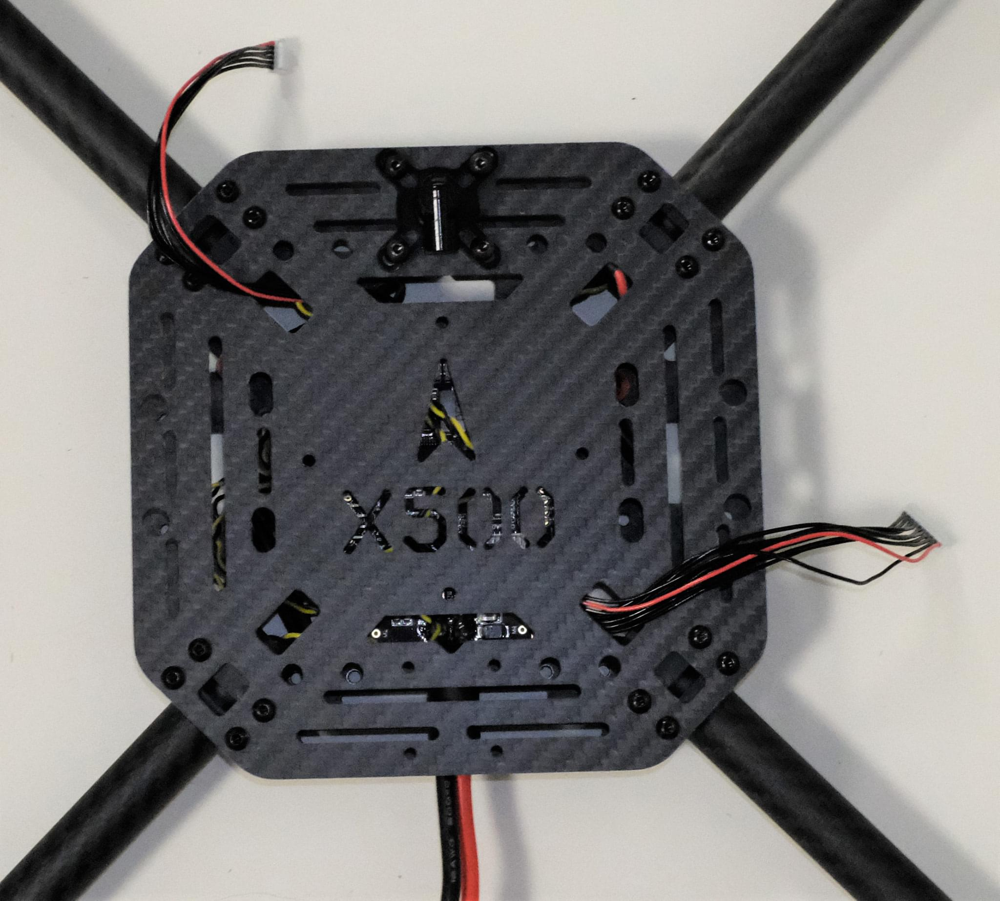
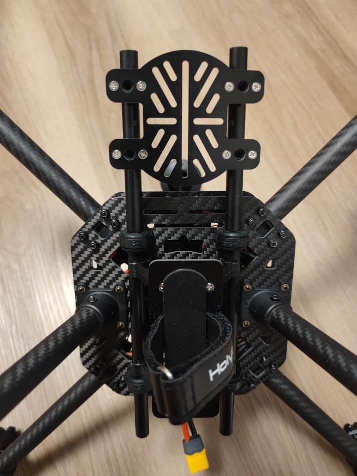
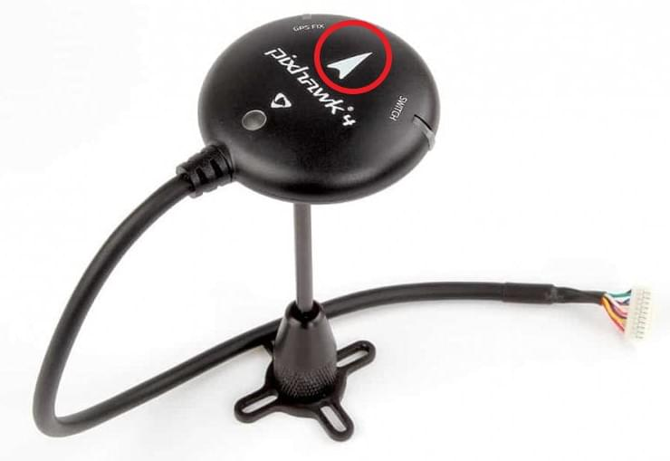

# Holybro X500 + Pixhawk4 조립

:::info
Holybro initially supplied this kit with a [Holybro Pixhawk 4](../flight_controller/pixhawk4.md)), but at time of writing this has been upgraded to a [Holybro Pixhawk 6C](../flight_controller/pixhawk6c.md).
This build log is still relevant as the kit assembly is virtually the same, and likely to remain so as the flight controller is upgraded.
:::

This topic provides full instructions for building the kit and configuring PX4 using _QGroundControl_.

## 주요 정보

- **Full Kit:** [Holybro X500 Kit](https://holybro.com/products/px4-development-kit-x500-v2)
- **Flight controller:** [Pixhawk 4](../flight_controller/pixhawk4.md)
- **Assembly time (approx.):** 3.75 hours (180 minutes for frame, 45 minutes for autopilot installation/configuration)

## 부품 명세서

The Holybro [X500 Kit](https://holybro.com/products/px4-development-kit-x500-v2) includes almost all the required components:

- [Pixhawk 4 autopilot](../flight_controller/pixhawk4.md)
- [Holybro M8N GPS](https://holybro.com/collections/gps/products/m8n-gps)
- [Power Management - PM07](../power_module/holybro_pm07_pixhawk4_power_module.md)
- Holybro Motors - 2216 KV880 x4 (superseded - check [spare parts list](https://holybro.com/products/spare-parts-x500-v2-kit) for current version).
- Holybro BLHeli S ESC 20A x4 (superseded - check [spare parts list](https://holybro.com/products/spare-parts-x500-v2-kit) for current version).
- Propellers - 1045 x4 (superseded - check [spare parts list](https://holybro.com/products/spare-parts-x500-v2-kit) for current version).
- 배터리 스트랩 - PM07
- 전원 및 무선 조종기 케이블
- 휠베이스 - 500 mm
- 433 MHz 텔레메트리 /915 MHz 텔레메트리
- 433 MHz / 915 MHz [Holybro Telemetry Radio](../telemetry/holybro_sik_radio.md)

Additionally you will need a battery and receiver ([compatible radio system](../getting_started/rc_transmitter_receiver.md)) if you want to control the drone manually.

## 주요 하드웨어

프레임 및 자동 조종 장치 설치를 위한 하드웨어들 입니다.

| 항목                                              | 설명                                                    | 수량 |
| ----------------------------------------------- | ----------------------------------------------------- | -- |
| 하판                                              | 탄소 섬유(두께 2mm)                      | 1  |
| 상판                                              | 탄소 섬유(두께 1.5mm)    | 1  |
| Arm                                             | 6 개의 부품과 4 개의 나사로 구성 4 개의 너트                          | 4  |
| 착륙 기어 - 수직 막대                                   | 탄소 섬유 튜브 + 엔지니어링 플라스틱                                 | 2  |
| 착륙 기어 - 크로스바                                    | 탄소 섬유 튜브 + 엔지니어링 플라스틱 + 폼                             | 2  |
| 배터리 패드                                          | 3mm 실리콘 시트 검정                                         | 4  |
| 철탑                                              | 직경 : 10mm, 길이 : 250mm | 2  |
| 배터리 장착 보드                                       | 두께: 2mm                               | 1  |
| 배터리 패드                                          | 3mm 실리콘 시트 검정                                         | 1  |
| 플팻폼 보드                                          | 두께: 2mm                               | 1  |
| Hanger & rubber ring gasket | 내부 구멍 직경 : 10mm 검정                    | 8  |

### 전자부품

| 품목 설명                                                                          | 수량 |
| ------------------------------------------------------------------------------ | -- |
| Pixhawk4 & Assorted Cables                                 | 1  |
| Pixhawk4 GPS 모듈                                                                | 1  |
| I2C 스플리터 보드                                                                    | 1  |
| 모터스 2216 KV880(V2 업데이트)                                     | 4  |
| Holybro BLHeli S ESC 20A x4                                                    | 1  |
| 433 MHz / 915 MHz [Holybro Telemetry Radio](../telemetry/holybro_sik_radio.md) | 1  |

### 필요한 공구들

조립시에 필요한 공구들입니다.

- 1.5 mm 육각 스크류 드라이버
- 2.0 mm 육각 스크류 드라이버
- 2.5 mm 육각 스크류 드라이버
- 3mm Phillips 스크류드라이버
- 5.5mm 소켓 렌치 또는 작은 파일러
- 전선 커터
- 정밀 트위저

## 조립

예상 조립 시간은 3.75시간(프레임은 180분, 오토파일럿 설치와 설정은 45분)입니다.

1. 랜딩기어 조립부터 시작합니다.
  랜딩 기어 나사를 풀고 수직 기둥을 삽입합니다(그림 1 및 2).

  

  _Figure 2_: Landing gear components

  

  _Figure 2_: Landing gear assembled

2. 그런 다음, 그림 3에 표시된 4개의 모터 베이스를 통해 4개의 암을 넣습니다.
  로드가 베이스를 약간 돌출시키고 4개의 암 전체에서 일관성이 있는 지 확인하고, 모터 와이어가 바깥쪽을 향하도록 합니다.

  

  _Figure 3_: Attach arms to motor bases

3. 4개의 나일론 나사와 나일론 스탠드오프를 삽입하고, 그림 4와 같이 4개의 나일론 너트를 사용하여 전원 모듈 PM07을 하단 플레이트에 부착합니다.

  

  _Figure 4_: Attach power module

4. 각 암을 통해 4개의 모터 ESC를 공급하고, 그림 5에 표시된 모터에 3선 끝을 연결합니다.

  

  _Figure 5_: Connect motors

5. Connect the ESCs power wires onto the power module PM07, black->black and red->red, ESC PWM signal wires goes to "FMU-PWM-Out".
  모터 ESC PWM 와이어를 올바른 순서로 연결하였는 지 확인하십시오.
  Refer to Figure 7 for airframe motor number and connect to the corresponding number on the PM07 board.

  
  _Figure 7_: ESC power module and signal wiring

  모터 상단의 색상은 회전 방향(그림 7-1)을 나타내며, 검은색 끝은 시계 방향, 흰색 끝은 반시계 방향입니다.
  모터 방향은 px4 quadrotor x 기체 정의서를 따라야 합니다(그림 7-2).

  

  _Figure 7_: Motor order/direction diagram

  

  _Figure 7-1_: Motor direction

6. 10핀 케이블을 FMU-PWM-in에 연결하고, 6핀 케이블을 PM07 전원 모듈의 PWR1에 연결합니다.

  

  _Figure 8_: Power module PWM and power wiring

7. GPS를 상판에 장착하는 경우에는 4개의 나사와 너트를 사용하여 GPS 장착을 상판에 고정합니다.

  

  _Figure 9_: Secure GPS mount onto top plate

8. 상판을 통하여 PM07 케이블을 공급합니다.
  양쪽에 4개의 U자형 나일론 스트랩, 나사 및 너트를 사용하여 상단 및 하단 플레이트를 연결하고, 모터 ESC 케이블이 그림 10과 같이 U자형 나일론 스트랩 내부에 있는 지 확인하고 너트를 느슨하게 유지합니다.

  

  _Figure 10-1_: Feed power module cables through top plate

  

  _Figure 10-2_: Connecting top and bottom plate

9. 암 튜브를 프레임에 약간 밀어 넣고, 돌출 정도(그림 11의 빨간색 사각형)가 4개의 암 모두에서 일정한 지 확인합니다.
  모든 모터가 위를 향하고 있는 지 확인후, 모든 너트와 나사를 조입니다.

  

10. 행거 개스킷을 행거 4개에 넣고 육각 나사 8개를 사용하여 하단 플레이트에 장착합니다(그림 11).
  나사 구멍은 그림 12에서 흰색 화살표로 표시되어 있습니다.
  설치가 더 쉽도록 드론을 옆으로 기울이는 것이 좋습니다.

  

  _Figure 11_: Hanger gaskets

  

  _Figure 12_: Screw holes

11. 행거 링에 슬라이드 바를 삽입합니다(그림 13).
  배터리 마운트와 플랫폼 보드를 조립하고, 그림 14와 같이 슬라이드 바에 장착합니다.

  

  _Figure 13_: Slide bars

  

  _Figure 14_: Battery mount on slide bars

12. 랜딩 기어를 하판에 장착합니다.
  이 설치 과정을 더 쉽게 하려면 드론을 옆으로 기울이는 것이 좋습니다.

  

  _Figure 15_: Landing Gear

13. 테이프를 사용하여 GPS를 GPS 마스트 상단에 붙이고 GPS 마스트를 장착합니다.
  GPS의 화살표가 전방을 가리키는 지 확인하십시오(그림 16).

  

  _Figure 16_: GPS and mast

14. 상판에 텔레메트리를 장착합니다.
  Plug the telemetry cable into `TELEM1` port and GPS module to `GPS MODULE` port on the flight controller.
  Plug the cable from PM07 `FMU-PWM-in` to `I/O-PWM-out`on the FC and PM07 `PWR1` to `POWER1` on the FC, as shown in Figure 17.

  

  _Figure 17_: Mount telemetry radio/plug in PWM and Power cables to Flight controller.

Please refer to [Pixhawk 4 Quick Start](../assembly/quick_start_pixhawk4.md) for more information.

조립이 완료되었습니다.
조립 완료된 키트는 다음과 같습니다.

## PX4 설정

:::tip
Full instructions for installing and configuring PX4 can be found in [Basic Configuration](../config/index.md).
:::

_QGroundControl_ is used to install the PX4 autopilot and configure/tune it for the X500 frame.
[Download and install](http://qgroundcontrol.com/downloads/) _QGroundControl_ for your platform.

First update the firmware, airframe, and actuator mappings:

- [Firmware](../config/firmware.md)

- [Airframe](../config/airframe.md)

  You will need to select the _Holybro S500_ airframe (**Quadrotor x > Holybro S500**).

  

- [Actuators](../config/actuators.md)
  - You should not need to update the vehicle geometry (as this is a preconfigured airframe).
  - Assign actuator functions to outputs to match your wiring.
  - Test the configuration using the sliders.

그리고, 설치후에 필수적인 설정 작업과 보정 작업을 진행하여야 합니다.

- [Sensor Orientation](../config/flight_controller_orientation.md)
- [Compass](../config/compass.md)
- [Accelerometer](../config/accelerometer.md)
- [Level Horizon Calibration](../config/level_horizon_calibration.md)
- [Radio Setup](../config/radio.md)
- [Flight Modes](../config/flight_mode.md)

이후 다음 작업 역시 수행되어야 합니다:

- [ESC Calibration](../advanced_config/esc_calibration.md)
- [Battery Estimation Tuning](../config/battery.md)
- [Safety](../config/safety.md)

## 튜닝

Airframe selection sets _default_ autopilot parameters for the frame.
이 상태로도 비행이 가능하지만, 특정 기체에 관련된 변수들을 조정하는 것이 바람직합니다.

For instructions on how, start from [Autotune](../config/autotune_mc.md).

## 감사의 글

이 빌드 로그는 Dronecode Test Flight Team에서 제공했습니다.
