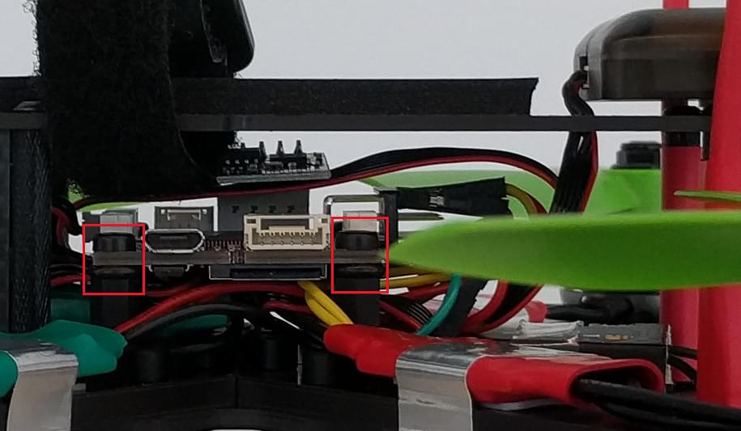
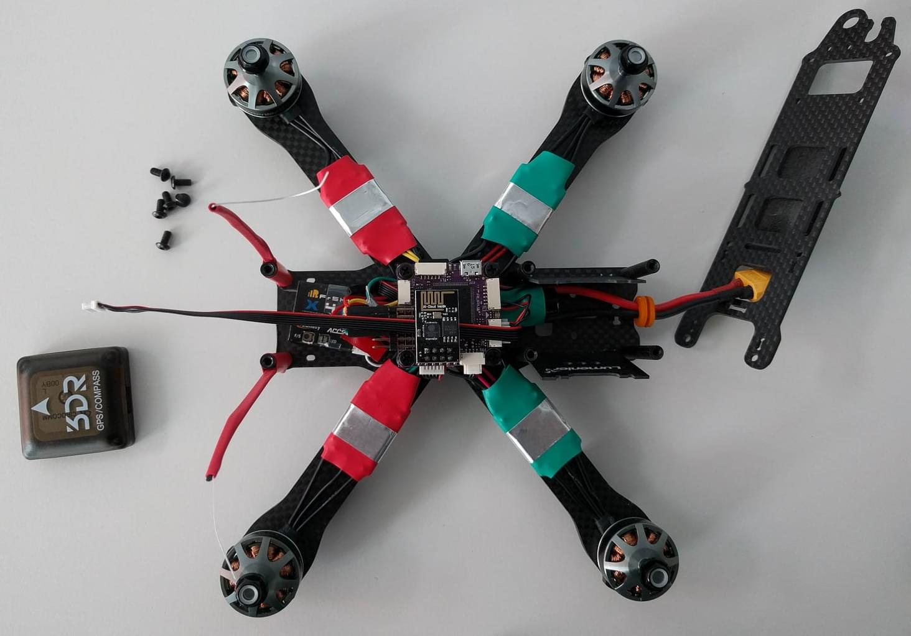
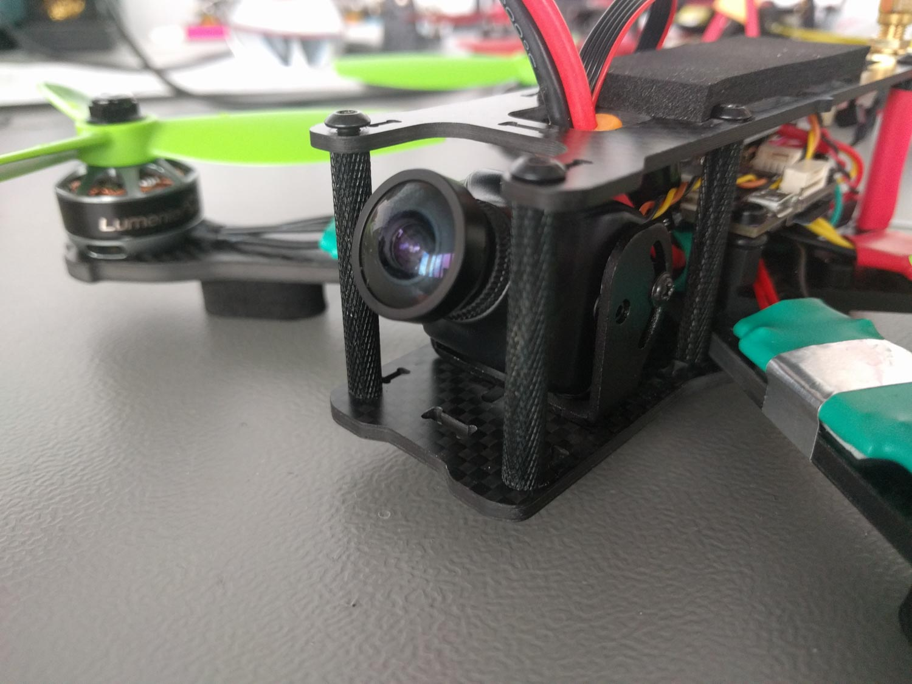

# Lumenier QAV-R 5" Racer (Pixracer)

Lumenier QAV-R 5 "FPV Racing Quadcopter는 탈착식 암이 있는 견고하고 가벼우면서도 빠른 FPV 레이서입니다.
This topic provides full build and configuration instructions for using the frame with the _Pixracer_ flight controller and _KISS 24A Race Edition_ ESCs.
또한 선택항목인 FPV 설정에 대한 정보를 제공합니다.

주요 정보:

- **Frame:** [Lumenier QAV-R 5"](http://www.getfpv.com/qav-r-fpv-racing-quadcopter-5.html)
- **Flight controller:** [Pixracer](../flight_controller/pixracer.md)

<lite-youtube videoid="wMYgqvsNEwQ" title="QAV-R 5 PX4 FPV Racequad"/>

## 부품 목록

### 기체(비행에 필요)

- Autopilot: [Pixracer](../flight_controller/pixracer.md) from [AUAV](https://store.mrobotics.io/mRo-PixRacer-R14-Official-p/auav-pxrcr-r14-mr.htm) including ESP8266  WiFi- and [ACSP5](https://store.mrobotics.io/product-p/auav-acsp5-mr.htm)  power-module
- Frame:  [Lumenier QAV-R 5"](http://www.getfpv.com/qav-r-fpv-racing-quadcopter-5.html)
- Motors:  [Lumenier RX2206-11 2350KV](http://www.getfpv.com/lumenier-rx2206-11-2350kv-motor.html)
- ESCs:  [KISS 24A Race Edition](http://www.getfpv.com/kiss-24a-esc-race-edition-32bit-brushless-motor-ctrl.html)
- Props: HQProp 5x4.5x3 [CW](http://www.getfpv.com/hqprop-5x4-5x3rg-cw-propeller-3-blade-2-pack-green-nylon-glass-fiber.html) [CCW](http://www.getfpv.com/hqprop-5x4-5x3g-ccw-propeller-3-blade-2-pack-green-nylon-glass-fiber.html)
- GPS / (외장) Mag.: M8N taken from a [Pixhawk Mini (Discontinued)](../flight_controller/pixhawk_mini.md) set and rewired
- Battery: [TATTU 1800mAh 4s 75c Lipo](http://www.getfpv.com/tattu-1800mah-4s-75c-lipo-battery.html)
- RC Receiver: [FrSky X4R-SB](http://www.getfpv.com/frsky-x4r-sb-3-16-channel-receiver-w-sbus.html)
- RC Transmitter: [FrSky Taranis](http://www.getfpv.com/frsky-taranis-x9d-plus-2-4ghz-accst-radio-w-soft-case-mode-2.html)
- FC dampening: [O-Rings](http://www.getfpv.com/multipurpose-o-ring-set-of-8.html)
- GPS Mount: [GPS mast](http://www.getfpv.com/folding-aluminum-gps-mast-for-dji.html)

### FPV(선택 사항)

- Camera: [RunCam Swift RR Edition](https://www.getfpv.com/runcam-swift-rotor-riot-special-edition-ir-block-black.html) **includes must-have high quality wide angle lens from GoPro!**
- Video Tx: [ImmersionRC Tramp HV 5.8GHz 600mW](https://www.getfpv.com/immersionrc-tramp-hv-5-8ghz-video-tx-us-version.html) (Discontinued).
- Video Antennas: [TBS Triumph 5.8GHz CP](http://www.getfpv.com/fpv/antennas/tbs-triumph-5-8ghz-cp-fpv-antenna-3275.html) (SMA port fits ImmercionRC Tx)
- FPV voltage source plug: [Male JST Battery Pigtail](http://www.getfpv.com/male-jst-battery-pigtail-10cm-10pcs-bag.html)

:::info
These parts cover the sending side for standard FPV 5.8GHz analog FM video. 라이브 비디오 스트림을 사용하려면 호환 수신기 및 디스플레이가 필요합니다.
:::

## 기본 프레임 조립

09:25에서 13:26 사이에이 비디오처럼 기본 센터 플레이트와 암을 조립했습니다.

<lite-youtube videoid="7SIpJccXZjM" title="How to Build a Lumenier QAV-R"/>

네 개의 모터를 프레임 중앙을 향해 나오는 케이블과 함께 프레임에 장착했습니다.
각 모터에 프레임과 함께 제공되는 두 개의 긴 모터 나사를 사용하여 멀리 떨어져있는 두 개의 구멍에 삽입하였습니다.

## 동력 전달 장치 조립

KISS ESC는 성능이 우수하지만, 두 가지의 단점도 있습니다.

- BLHeli와 달리 사용하는 소프트웨어는 오픈 소스가 아닙니다
- 미리 납땜된 전선 또는 플러그가 있는 하드웨어가 없습니다.

즉, 모든 ESC에 최소 6 개의 조인트를 납땜해야 하지만 그만한 가치는 충분합니다.

:::tip
Always tin both sides you want to connect with solder before actually soldering them together.
이렇게하면 훨씬 편리하게 납땜 할 수 있고, 콜드 솔더링 조인트가 생길 가능성이 줄어 듭니다.
:::

:::tip
Make sure that you use an appropriate cable gauge for the power connections that transport the high current all the way from the battery to the motors.
모든 신호 케이블은 타 케이블에 비하여 매우 얇을 수 있습니다.
:::

:::tip
Put heat shrink on the cables before you start soldering!
성공적인 기능 테스트 후 ESC, 전원 모듈 및 자유 부동 비 절연 와이어 솔더링 조인트를 열수축을 하면 먼지, 습기 및 물리적 손상으로부터 보호됩니다.
:::

### 모터

먼저 ESC가 중앙으로 이동 한 암에 장착 될 때 세 개의 모터 케이블을 모두 직접 절단했지만 ,부품을 쉽게 배치하고 케이블에 장력을 발생시키지 않도록 충분한 여유를 둡니다.
그런 다음 모터에서 나오는 순서대로 스위칭 MOS-FET가 위로 향한 ESC의 출력 접점에 납땜하여 비행 중에 공냉 기능이 좋아집니다.
Choosing this cable order resulted in all the motors spinning counter-clockwise in my tests and I switched where necessary the direction of rotation by bridging the dedicated [JP1 solder jumper](https://1.bp.blogspot.com/-JZoWC1LjLis/VtMP6XdU9AI/AAAAAAAAAiU/4dygNp0hpwc/s640/KISS-ESC-2-5S-24A-race-edition-32bit-brushless-motor-ctrl.jpg) to conform the [Quadrotor x configuration](../airframes/airframe_reference.md#quadrotor-x).

### 전원 모듈

First I soldered the XT60 connector which comes with the frame to the labeled battery side of the _ACSP5 power module_ that was shipped with the Pixracer and added the elco capacitor delivered with the power module with the correct polarity to the same side.

이제 까다로운 부분이 있습니다. 4 개의 ESC 전압 소스 + 및 - 포트를 전원 모듈의 표시된 ESC 출력 측에있는 해당 패드에 모두 납땜하였습니다.
쿼드콥터가 비행 중에 느슨한 연결이 있으면 안 되기 때문에 여기에 콜드 솔더 조인트가 없는 지 확인하십시오.
프레임의 추가 배전 보드를 사용하면 작업이 훨씬 쉬워 지지만 작은 프레임에서 너무 많은 공간을 차지합니다.

:::tip
If you are also including the FPV parts don't forget to also solder your JST male power plug to the output side of the power module.
You'll need it for your [FPV setup](#fpv-setup) later on.
:::

### 신호 케이블

나중에 Pixracer 핀에 쉽게 연결할 수 있기 때문에, ESC 신호에 맞게끔 절반으로 잘린 표준화된 핀 헤더 커넥터가있는 얇은 케이블을 사용했습니다.
Only the labeled `PWM` port on the [KISS ESCs](https://1.bp.blogspot.com/-0huvLXoOygM/VtMNAOGkE5I/AAAAAAAAAiA/eNNuuySFeRY/s640/KISS-ESC-2-5S-24A-race-edition-32bit-brushless-motor-ctrl.jpg) is necessary for flying.
pixracer의 모터 신호 출력에 연결됩니다.
The `TLM` port is for ESC telemetry and I soldered them on for future use as the needed protocol is not currently supported by PX4.

계속 진행하기 전에 저렴한 PWM 서보 테스터를 사용하여, 모든 ESC 모터쌍의 회전 방향을 테스트하였습니다.

## Connecting & Mounting Electronics

:::tip
Double check the pin assignment of every component you connect.
모든 하드웨어 구성 요소가 눈에 보이는 것과는 달리, 플러그 앤 플레이가 가능하지 않습니다.
:::

You'll need the [hardware documentation of the Pixracer](../flight_controller/pixracer.md) for this step to find all needed connectors.
나는 Pixracer 보드 아래의 모든 케이블을 깔끔하게 정리하여, 향후 FPV 카메라와 송신기를위한 공간을 확보하고자 하였습니다.

I mounted the Pixracer using the nylon spacers and screws that get shipped with the QAV-R frame but **put some small O-rings** between the board and the spacers to add a bit of vibration dampening.
Make sure to **not tighten the screws too much or little**, do it such that the board clearly touches both sides but is not clamped with any tension.
보드는 어떤 식으로든 매달리지 있지 않아야 하며, 손가락으로 힘을 가하면 약간 움직일 수 있어야합니다.

:::warning
This can heavily influence the vibration noise level your gyroscope and accelerometer sensors measure during flight.
:::

### 무선 수신기

Pixracer와 함께 제공된 케이블을 사용하여 FrSky S-BUS 수신기를 연결하고, 불필요한 케이블들을제거하였습니다.

스마트 원격 측정 포트에는 수신기와 함께 제공되는 케이블을 사용하였습니다.
핀셋을 사용하여 커넥터에서 불필요한 핀을 모두 제거하고, "스마트"신호가 연결되도록 흰색의 느슨한 끝 케이블을 커넥터의 올바른 핀으로 전환하였습니다.
그런 다음 이 회로도에 따라 FrSky 포트에 맞는 케이블에 느슨한 끝을 납땜하였습니다.

전압 공급 포지티브 핀처럼 이미 RCin S-BUS 케이블을 통해 연결되어 있기 때문에, 접지 (GND) 핀도 생략하였습니다.

### 무선 조종기 안테나 장착

프로펠러에 안테나가 닿지 않도록, 열 수축 및 지퍼 타이를 사용하는 견고한 마운트 방법을 사용하여 RC 링크를 조립하였습니다.

이 방법에서는 지퍼 타이의 구멍으로 큰 끝을 자르고, 나머지는 긴 열 수축을 통해 안테나 케이블과 함께 놓고 더 크고 더 짧은 열 수축을 사용하여 프레임스페이서에 장착합니다.

### ESC 신호

For the ESC signals I followed the [hardware documentation of the Pixracer](../flight_controller/pixracer.md) and the [Quadrotor x configuration](../airframes/airframe_reference.md#quadrotor-x) motor numbering scheme.
As we have no ground or positive BEC voltage connections we connect our `PWM` ESC signal cables each to its topmost pins of the corresponding output connector.

### GPS / 외부 자력계

사용한 GPS의 커넥터에 맞는 GPS 케이블을 가져와 Pixracer 세트와 함께 조립하였습니다.
Sadly the pin assignment was completely wrong and I rewired the connector again using tweezers according to the [3DR Pixhawk Mini user manual](../flight_controller/pixhawk_mini.md#connector-pin-assignments-pin-outs) GPS port.

#### Pixracer GPS/I2C 포트

| 핀 | 할당  |
| - | --- |
| 1 | GND |
| 2 | SDA |
| 3 | SCL |
| 4 | RX  |
| 5 | TX  |
| 6 | +5V |

#### M8N 3DR Pixhawk mini GPS 커넥터

| 핀                         | 할당     | Pixracer 연결 핀 |
| ------------------------- | ------ | ------------- |
| 1(red) | SCL    | 3             |
| 2                         | SDA    | 2             |
| 3                         | VCC 5V | 6             |
| 4                         | RX     | 5             |
| 5                         | TX     | 4             |
| 6                         | GND    | 1             |

본체에 더 가까이 장착하면 자력계 판독 값을 완전히 사용할 수 없기 때문에, 나열된 일반 멀티 콥터 GPS 마스트를 사용하여 GPS 모듈을 장착했습니다.
모듈을 프레임 상단의 맨 뒤쪽에 직접 장착한 실험에서는 ESC 전류의 자기장으로 인해 발생할 가능성이 가장 높은 6 배의 자력계 크기 노이즈가 나타났습니다.
케이블 길이와 프레임 치수에 더 잘 맞도록 마스트를 ~ 2cm 줄였습니다. GPS 모듈은 마스트의 상단 플레이트에 양면 테이프로 접착됩니다.

## FPV 설정

선택사항인 5.8GHz FPV 라이브 비디오 전송 방법에 관한 지침입니다.
처음에 언급한 추가 FPV 부품이 필요합니다.
여기에 설명 된 FPV 전송은 비행 컨트롤러와 전자적으로 독립적으로 작동하며, 전원 모듈과 같이 배터리 전압만을 사용합니다.

먼저 모든 것이 올바르게 작동하는지 확인하기 위해 벤치 테스트를 수행하였습니다.
송신기와 함께 제공되는 비디오 신호 케이블을 FPV 카메라 뒷면과 송신기의 일치하는 플러그에 연결하십시오. 나사를 조인 다음 JST 전원 플러그를 초안 차량이나 다른 전압 소스에 연결하십시오.
송신기 LED가 켜져야 합니다.
같은 채널에 맞춰진 5.8GHz 수신 장치를 사용하여 비디오를 확인하십시오.
To configure the transmitter to an other channel and adjust the transmission power please refer to the [Tramp HV User Manual](https://www.immersionrc.com/?download=5016).

지퍼를 사용하여 내부에서 프레임의 "지붕"까지 송신기를 장착하였습니다.
이와 같은 전자 장치를 장착 할 때 비행 중 물리적 손상을 방지하기 위하여, 접착 폼 조각을 사이에 끼워두는 것이 좋습니다.
안테나 커넥터가 프레임의 전용 구멍에 맞도록 송신기를 배치하십시오.

부품 목록에있는 웅장한 FPV 카메라 세트는 지금까지 본 최고의 FPV 렌즈와 함께 제공 될뿐만 아니라, 여러 카메라 마운트가 포함되어 있으며 그중 하나는 카메라 각도를 조정하는 데 매우 유연하고 QAV-R 프레임에 잘 맞습니다.
다음의 그림과 같이 장착하였습니다. 카메라 마운트를 프레임에 고정하기 위하여 두 개의 나사와 너트는 프레임 세트에 남아있는 예비 나사에서 가져왔습니다.

## PX4 설정

_QGroundControl_ is used to install the PX4 autopilot and configure/tune it for the frame.
[Download and install](http://qgroundcontrol.com/downloads/) _QGroundControl_ for your platform.

:::tip
Full instructions for installing and configuring PX4 can be found in [Basic Configuration](../config/index.md).
:::

:::warning
Always make sure to have either battery or propellers physically removed from your vehicle during any initial configuration.
사고의 위험성이 있는 것은 초기에 확실하게 제거하는 것이 좋습니다.
:::

First update the firmware, airframe, and actuator mappings:

- [Firmware](../config/firmware.md)

- [Airframe](../config/airframe.md)

  You will need to select the _Generic 250 Racer_ airframe (**Quadrotor x > Generic 250 Racer**).

  

- [Actuators](../config/actuators.md)
  - You should not need to update the vehicle geometry.
  - Assign actuator functions to outputs to match your wiring.
  - Test the configuration using the sliders.

그리고, 설치후에 필수적인 설정 작업과 보정 작업을 진행하여야 합니다.

- [Sensor Orientation](../config/flight_controller_orientation.md)
- [Compass](../config/compass.md)
- [Accelerometer](../config/accelerometer.md)
- [Level Horizon Calibration](../config/level_horizon_calibration.md)
- [Radio Setup](../config/radio.md)
- [Flight Modes](../config/flight_mode.md)

이후 다음 작업 역시 수행되어야 합니다:

- [ESC Calibration](../advanced_config/esc_calibration.md)
- [Battery Estimation Tuning](../config/battery.md)
  - 4S (4 cell LiPo) with charged cell voltage 4.15V and empty cell voltage 3.5V (or appropriate values for your battery).
- [Safety](../config/safety.md)

### 튜닝

Airframe selection sets _default_ autopilot parameters for the frame.
이 상태로도 비행이 가능하지만, 특정 기체에 관련된 변수들을 조정하는 것이 바람직합니다.

For instructions on how, start from [Autotune](../config/autotune_mc.md).
