# Turbo Timber Evolution (TTE) Build

The Turbo Timber Evolution is a model sold by Horizon Hobby originally intended for classic line-of-sight RC model flying.
This model is designed to excel at [STOL](https://en.wikipedia.org/wiki/STOL) flying and has a number of notable traits that also make it an ideal candidate to be converted into a FPV PX4 platform.

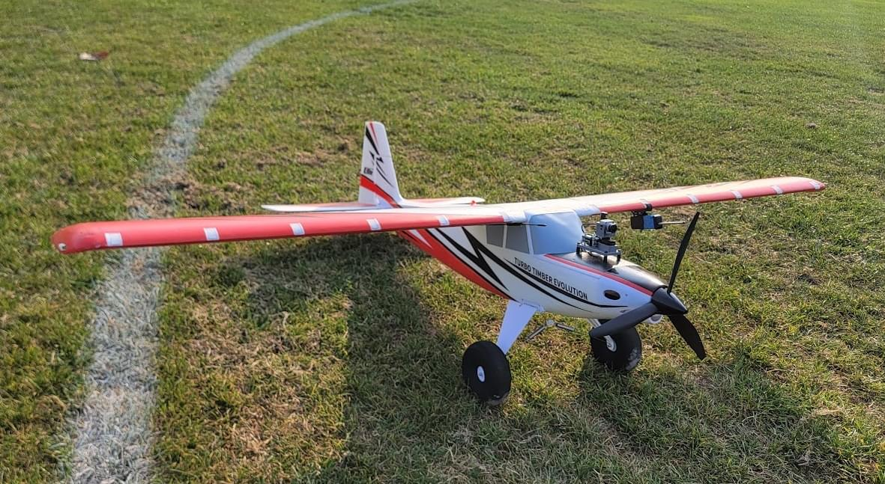

## 개요

The goal of this build was to create a platform which could be used for general PX4 testing/development.
That design goal meant that naturally balanced controls representative of a "vanilla" airplane were desirable.
Because classic RC planes are usually designed to be hand flown with no computer augmented flight controls, they tend to be specifically designed to be well trimmed and balanced out of the box.
These airplanes also have more attention devoted to making sure they handle well in the air.
While it's possible to fly even the most simple foamboard airplane, a lot of nuance in airborne handling can be finessed with a bit more engineering effort.
This airplane is a premium example of that, with features like frise ailerons to minimize adverse yaw.

Key airframe features:

- Spacious interior
- Top battery hatch
- Optional leading edge slats
- Fowler flaps
- Rugged landing gear with steering tailwheel
- Exterior lighting pre installed
- Optional floats
- Gentle flying characteristics
- Low drag with internal linkages and minimal protrusions

Key Build Features:

- Easy overall build with minimal airframe setup

- Easy access to Pixhawk USB and debug connector

- [First Person View (FPV)](https://en.wikipedia.org/wiki/First-person_view_\(radio_control\)) with camera pan mount

- Air data provided by wing slung pitot static pod

- Long flight times (with Liion battery option > 24 minutes)

## 부품 목록

- [Turbo Timber Evolution PNP (includes motor, servos, esc, etc, all fully installed)](https://www.horizonhobby.com/product/turbo-timber-evolution-1.5m-pnp-includes-floats/EFL105275.html#)

- [80A Plush-32 ESC](https://hobbyking.com/en_us/turnigy-plush-32-80a-2-6s-brushless-speed-controller-w-bec-rev1-1-0.html)

- [Pixhawk 4 Mini](../flight_controller/pixhawk4_mini.md) (with GPS and Power module)

- [SIK telemetry radio](../telemetry/sik_radio.md)

- MS4525DO differential pressure module and pitot tube

- [Caddx Vista FPV air unit](https://caddxfpv.com/products/caddx-vista-kit)

- [DJI FPV Goggles](https://www.dji.com/fpv)

- [ExpressLRS Matek Diversity RX](http://www.mateksys.com/?portfolio=elrs-r24)

- [Custom designed 3D printed parts](https://github.com/PX4/PX4-user_guide/raw/main/assets/airframes/fw/turbo_timber_evolution/3d_printed_parts.zip)
  - Pixhawk 4 Mini mount and top GPS mount
  - FPV pod and camera mount
  - Pitot static pod and wing hardpoint hanger

- Misc hardware: M3 hardware (standoffs, washers, bolts), XT30 connector, hot glue, heatshrink, Molex Microfit connectors

- Silicone wiring (14awg for high current, 16awg for low current, 22awg for low power and signals)

- 3.6Ah 4S LiPo OR 4s2p 18650 LiIon

## Airframe Build

The vehicle comes out of the box near complete.
Servos and linkages have already been installed, and the only real remaining work is installing the landing gear and horizontal stabilizer.
For this portion of the assembly, simply follow the manual.

:::info
[Some reports](https://www.rcgroups.com/forums/showthread.php?3904021-NEW-E-flite-Turbo-Timber-Evolution-1-5m-%C2%96-Smartest-Most-Capable-Durable-Timber-Yet/page50) have indicated that the stock ESC bundled with the airplane has an issue with overheating.

As this build will be especially heavy, and therefore likely demand higher average power from the ESC, the stock 60A ESC was replaced with an 80A Turnigy PLUSH-32 during testing.
The stock motor was also replaced with a [higher power motor](https://hobbyking.com/en_us/turnigy-aerodrive-sk3-3548-840kv-brushless-outrunner-motor.html).
The stock propeller was replaced with an [APC 13x4](https://www.apcprop.com/product/13x4/) for better efficiency than the stock tri-blade prop.
This new ESC, motor, and propeller combination performs well in testing.
:::

## FPV Pod

The FPV pod was mounted on top of the battery hatch using M3 nylon hardware.
Mounting holes for the pod were located by placing the FPV pod on top (being careful to center it with a ruler) and then punching through the fpv pod mounting holes into the foam with a screwdriver.
A long M3 nylon screw and a washer on the underside, followed by a washer and standoff on the top of the battery hatch, were then be used to mount the FPV pod.

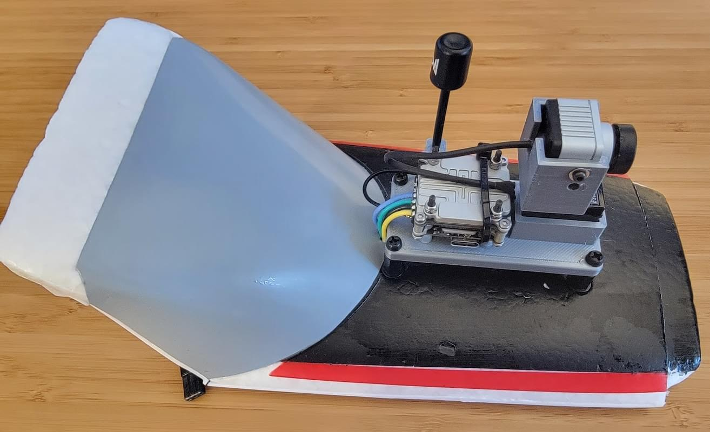

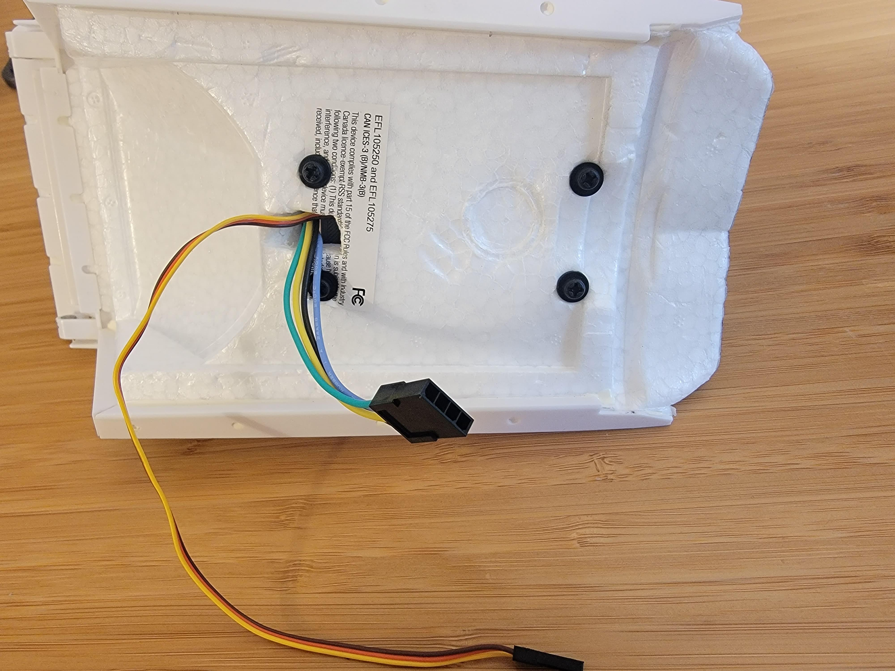

## Pitot Pod

An [airspeed sensor](../sensor/airspeed.md) is highly recommended for use on fixed-wing vehicles.
This build uses a MS4525DO differential pressure module and pitot tube housed in a 3D printed pod that has a hardpoint hanger for connecting it to the wing.

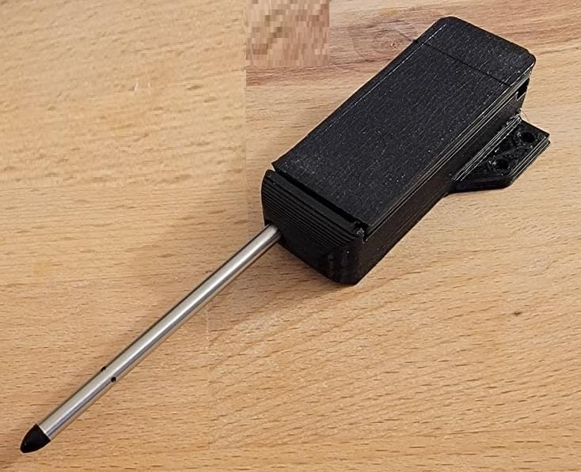

Inside the pitot pod, the MS4525DO differential pressure sensor is connected to the pitot/static tube with a short length of tubing.
Zipties are used as hoseclamps to prevent the tubing from backing off the sensor and pitot ports.
The i2c and power leads were soldered directly to the MS4525 module, and then hotglue was used to mechanically reinforce the connections.

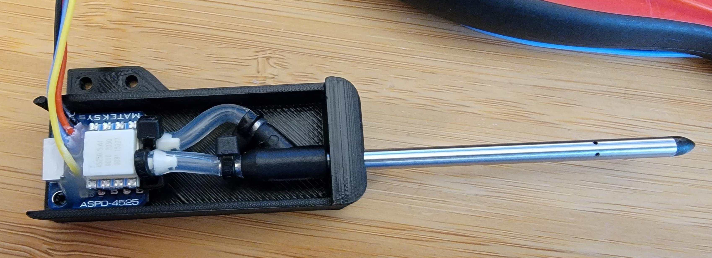

The pitot/static differential pressure sensor was mounted on the wing (outside the radius of the prop) using a 3D printed "hanger" glued to the leading edge of the wing.
An M2 screw and nylock hold the pod to the hanger.

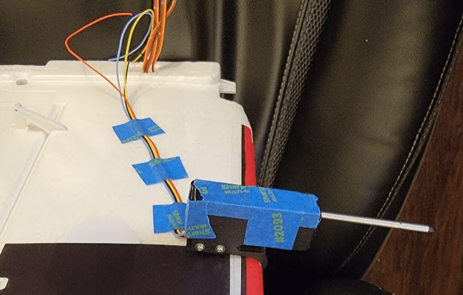

These four leads were then taped to the underside of the wing running back to the Pixhawk 4 Mini.

The lid of the pitot pod was initially taped in place to allow the setup to be tested and modified if needed after first flight.
After the first flight, the lid was hot glued in place.

## Flight Computer Installation

A custom mount for the PX4 Mini was designed and 3d printed (see [3D printed parts](https://github.com/PX4/PX4-user_guide/raw/main/assets/airframes/fw/turbo_timber_evolution/3d_printed_parts.zip) for all parts).
This mount was carefully designed to use internal foam mold features of the stock TTE airframe to be securely attached and well aligned.
The mount consists of two parts in a double-decker configuration, bolted together with M3 threaded standoffs.
The bottom mount carries the Pixhawk and attaches to the airframe while the top mount carries the GPS and ExpressLRS RX.

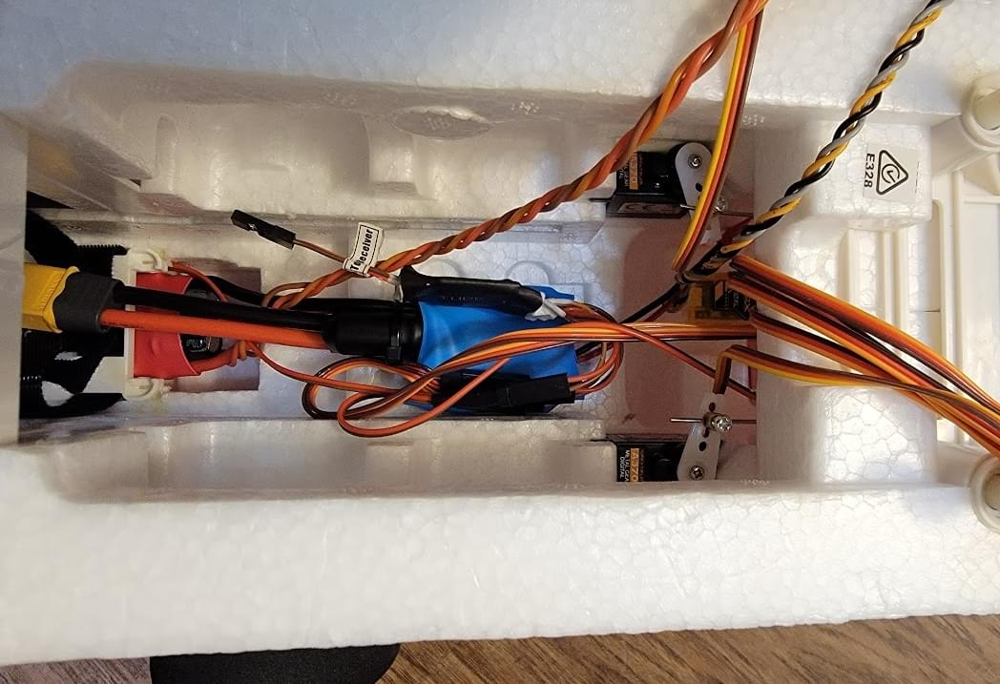

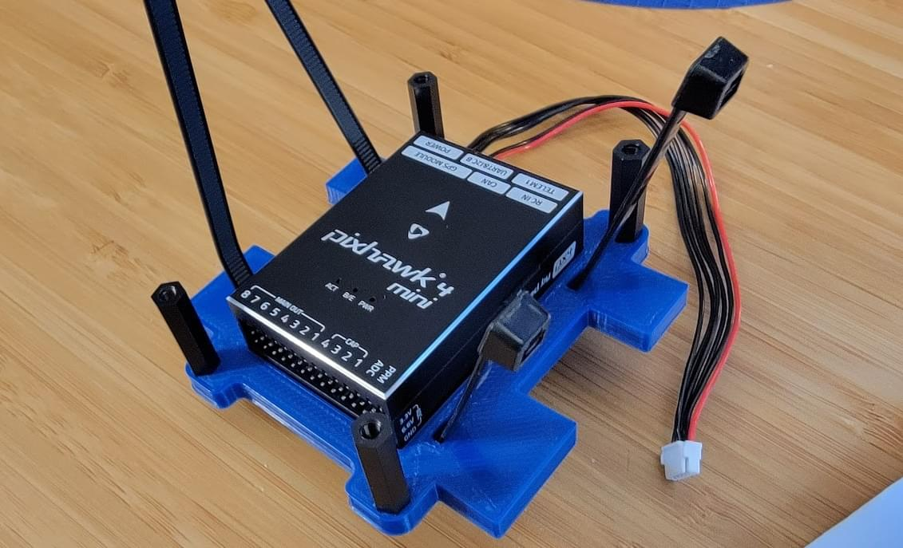

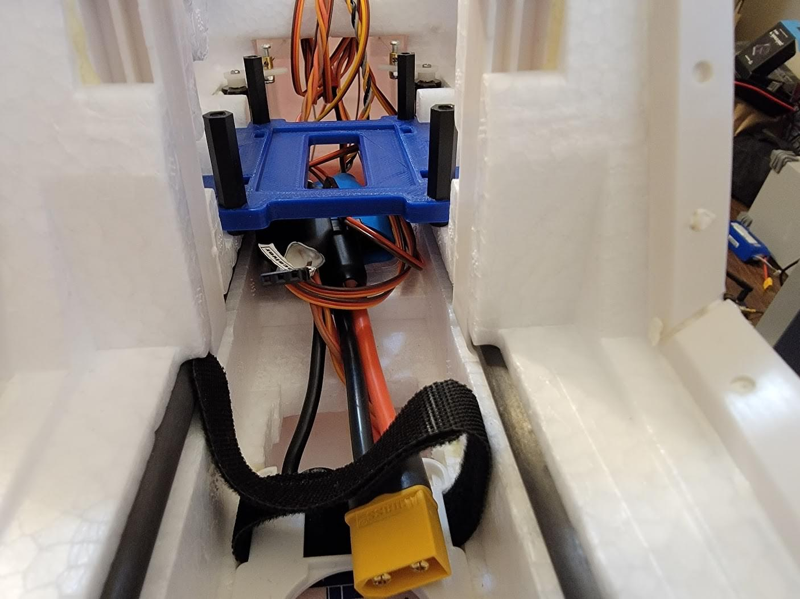

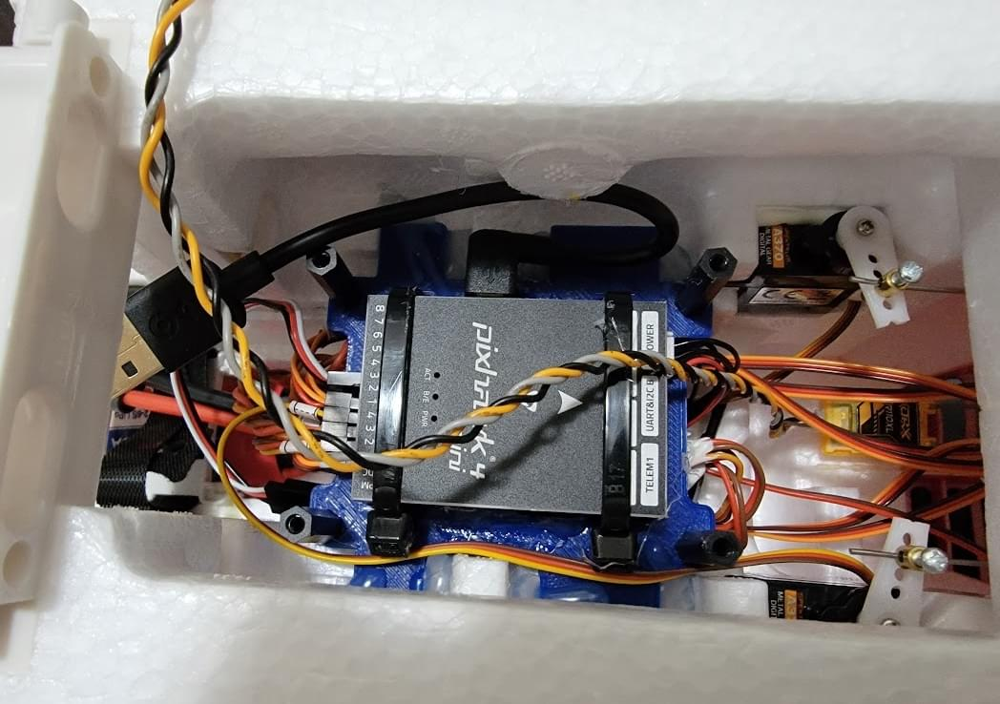

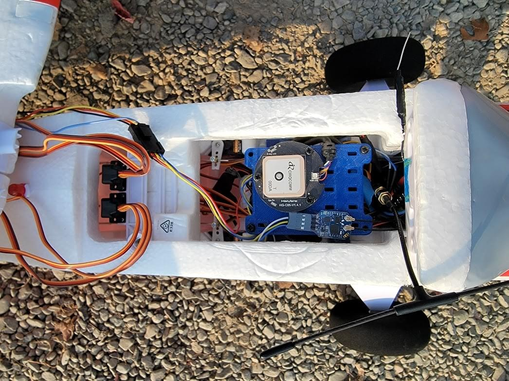

First, the Pixhawk 4 Mini was placed in the lower mount.
Hot glue was added to rigidly connect the fcu to the mount with two zipties providing additional security.
The standoff mounts for the upper mount were installed, and the bolts securely tightened.
Once the lower mount is installed, these screws are inaccessible, so attention was paid to making sure they were tightt enough so they cannot back out.

## Electrical

### 전원

The Holybro power module was wired inline with the ESC.
A spare 16awg power lead was also broken out, terminated to an XT30.
This spare lead will be used to provide power to the Caddx Vista FPV unit, but could also be connected to a splitter to power more peripherals.
Power for the servo and lighting will be provided by the "BEC" power supply in the ESC.

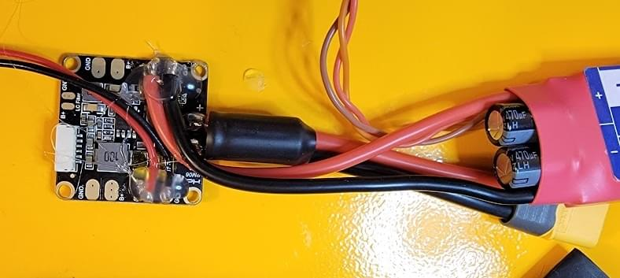

The TTE is very flexible when it comes to battery options.
I use both a 3.6Ah 4S Turnigy pack as well as a Upgrade Energy 4s2p liion pack.
While the 3.6Ah LiPo is inexpensive, nearly twice the flight time (24 minutes vs 12 minutes) can be acheived with the Upgrade Energy Liion pack.

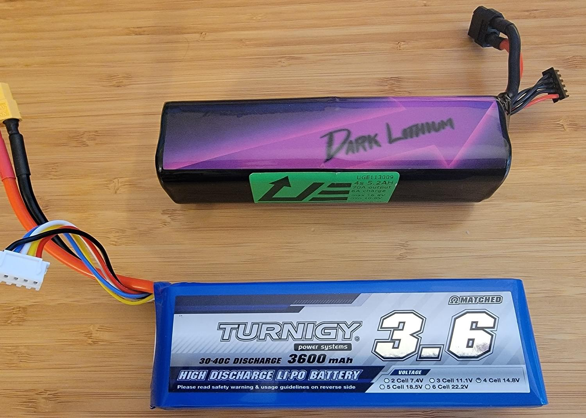

### Servos

Servos were wired to the flight computer in order of aileron, elevator, rudder, throttle, flaps, and FPV pan.
An additional power plug for the lighting system needs to also be installed, but it does not carry a servo signal so it can be put on any spare channel.

The [Acutator Configuration](../config/actuators.md) screen is shown below.

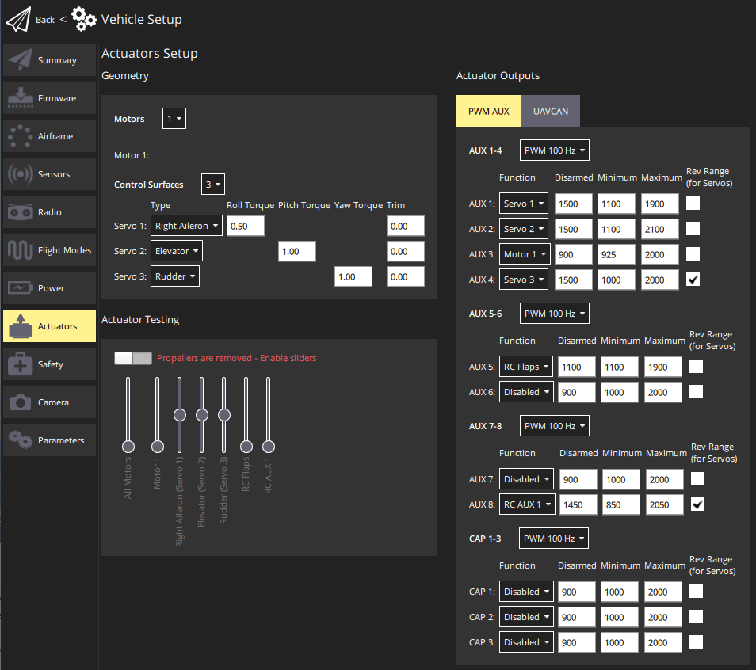

Servo endpoints were obtained by using a servo tester to determine the servo PWM pulse width to reach the max travel of each surface in each direction.

### Config & Debug

Access to the Pixhawk 4 Mini requires removal of the upper mount.
While this isn't too difficult, it was a consideration for wanting to streamline debugging in the field.
A short right angle USB micro extension was used to allow easy access to the Pixhawk 4 Mini's USB interface.
The USB-A end of this cable was left dangling in the battery bay.
Similarly, a JST PH to std spaced headers adapter was made, and it was also left easily accessible in the battery bay.

### 주변 장치

#### 무선 수신기

A custom cable was made to connect the ExpressLRS RX ([RC Reciever](../getting_started/rc_transmitter_receiver.md)) to the Pixhawk 4 Mini.

Because the Pixhawk 4 Mini has limited uarts, the RX was connected to RC input which does not have a TX pin.
This means that the RX will only send control data to the FCU but telemtry cannot be sent to the RX from the FCU.
Heatshrink was used to secure the dupont connector of the cable such that it cannot back out off the headers of the ExpressLRS RX.

#### FPV Pod & Airspeed Cable

Another custom cable was made to connect the Caddx Vista FPV transmitter to the FCU UART (from the `UART/I2C B` port) and battery power from the Holybro power module.
A Molex microfit was added close to the Vista so that it could be easily disconnected without needing to gain access to the Pixhawk.
As the name implies, the `UART/I2C B` port provides both a UART and I2C interface.
This port is split with the custom cable and one side provides power and data to the I2C airspeed sensor, while the other side provides power and UART TX/RX to the Caddx Vista.
From the UART/I2C B port, 5V, GND, and I2C SCL/SDA, are connected to the I2C airspeed sensor, while just serial RX and TX are connected to the Caddx Vista (Ground is provided the seperate battery power/gnd leads for the Vista)

The [msp_osd](../modules/modules_driver.md#msp-osd) module is used to stream telemetry to the Caddx Vista which can be seen on the DJI Goggles with the "custom OSD" feature enabled.

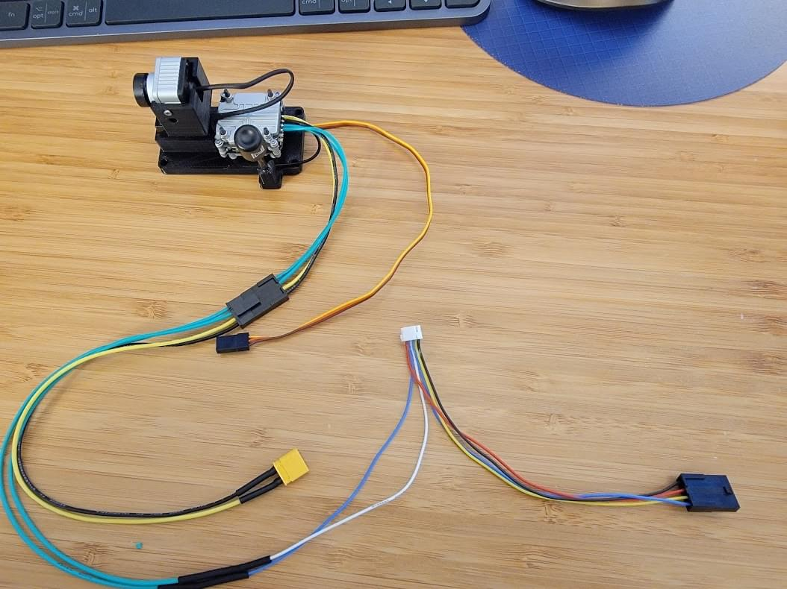

#### SIK Telemetry Radio

The plastic case of the SIK telemetry radio was removed to reduce weight and decrease volume of the module.
Heatshrink was used to electrically insulate the bare board and the radio was installed between the upper and lower flight computer mounts.

## Build Results & Performance

Overall, this build was a success.

Even with the added weight of the Pixhawk 4 Mini installation, the airplane balances well and has plenty of power to retain its original STOL characterisitics.
PX4 is easily capable of stabilizing the airplane and fine tuning of the rate loops were accomplished using [fixed-wing autotuning](../config/autotune_fw.md).
The results of tuning can be found in the [parameter file linked below](#parameter-file).

In testing I found takeoffs can be as short as only 10ft (3m) using no flaps.
I use full flaps on landing to slow the otherwise slippery airframe.

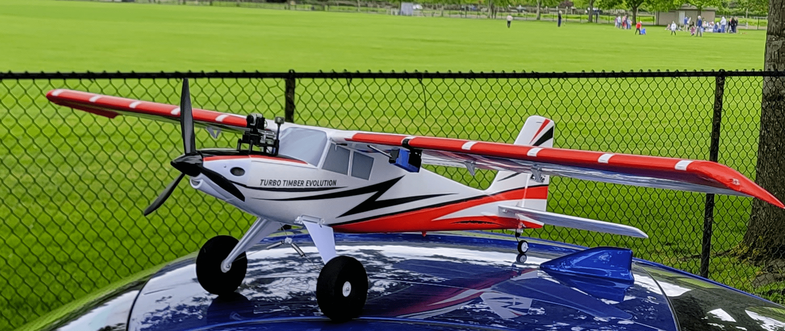

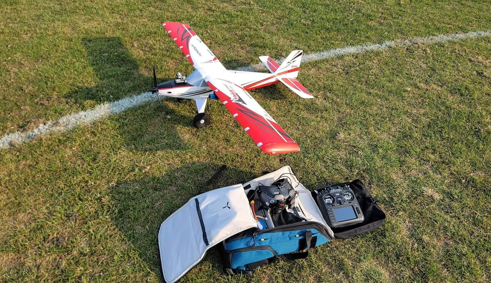

### Performance

- Stall speed (no flaps): 14MPH indicated
- Cruise speed: 35-65MPH
- Takeoff roll (with full flaps): < 10ft
- Endurance: ~24 minutes on 5.2Ah 4s2p LiIon, ~12 minutes on 3.6Ah 4S LiPo

### 비디오

<lite-youtube videoid="vMFCi3G5s6E" title="PX4 Turbo Timber Spot Landing"/>

---

<lite-youtube videoid="1DUV7QjcXrA" title="PX4 Turbo timber Evolution Short Flight"/>

### Flight Logs

[Evening Flight (video of flight shown below)](https://review.px4.io/plot_app?log=d3f2c1f9-f802-48c1-ab5d-3983fc8b8719)

<lite-youtube videoid="6CqigySqyAQ" params="ab_channel=ChrisSeto" title="Turbo Timber Evolution Px4 Build Log Example Flight"/>

### Parameter File

[Snapshot of PX4 airframe params](https://github.com/PX4/PX4-user_guide/raw/main/assets/airframes/fw/turbo_timber_evolution/tteparams.params)

This param file contains the custom PX4 parameter config for this build, including radio setup, tuning and sensor config.
The param file can be loaded via QGC using the instructions at [Parameters> Tools ](https://docs.qgroundcontrol.com/master/en/qgc-user-guide/setup_view/parameters.html#tools) (QGC User Guide).
