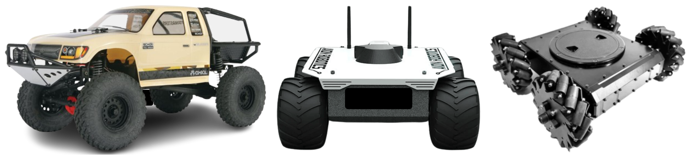
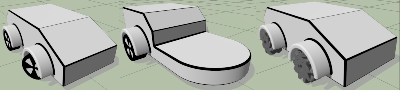

# Rovers

<LinkedBadge type="warning" text="Experimental" url="../airframes/#experimental-vehicles"/>

:::warning
Support for rover is [experimental](../airframes/index.md#experimental-vehicles).
Maintainer volunteers, [contribution](../contribute/index.md) of new features, new frame configurations, or other improvements would all be very welcome!
:::



PX4 supports the following rover types:

| Rover Type                                          | Steering                                                                                                                                                                                      |
| --------------------------------------------------- | --------------------------------------------------------------------------------------------------------------------------------------------------------------------------------------------- |
| [**Ackermann**](../frames_rover/ackermann.md)       | Direction is controlled by pointing wheels in the direction of travel. This kind of steering is used on most commercial vehicles, including cars, trucks etc. |
| [**Differential**](../frames_rover/differential.md) | Direction is controlled by moving the left- and right-side wheels at different speeds (also know as skid or tank steering).                                |
| [**Mecanum**](../frames_rover/mecanum.md)           | Direction is controlled by moving each mecanum wheel individually at different speeds and in different directions.                                                            |

The supported frames can be seen in [Airframes Reference > Rover](../airframes/airframe_reference.md#rover).

## Flashing the Rover Build

Rovers use a custom build that must be flashed onto your flight controller instead of the default PX4 build:

1. First build the rover firmware for your flight controller from the `main` branch (there is no release build, so you can't just select this build from QGroundControl).

   To build for rover with the `make` command, replace the `_default` suffix with `_rover`.
   For example, to build rover for px4_fmu-v6x boards, you would use the command:

   ```sh
   make px4_fmu-v6x_rover
   ```

   ::: info
   You can also enable the modules in default builds by adding these lines to your [board configuration](../hardware/porting_guide_config.md) (e.g. for fmu-v6x you might add them to [`main/boards/px4/fmu-v6x/default.px4board`](https://github.com/PX4/PX4-Autopilot/blob/main/boards/px4/fmu-v6x/default.px4board)):

   ```sh
   CONFIG_MODULES_ROVER_ACKERMANN=y
   CONFIG_MODULES_ROVER_DIFFERENTIAL=y
   CONFIG_MODULES_ROVER_MECANUM=y
   ```

   Note that adding the rover modules may lead to flash overflow, in which case you will need to disable modules that you do not plan to use (such as those related to multicopter or fixed wing).

:::

2. Load the **custom firmware** that you just built onto your flight controller (see [Loading Firmware > Installing PX4 Main, Beta or Custom Firmware](../config/firmware.md#installing-px4-main-beta-or-custom-firmware)).

## 시뮬레이션

[Gazebo](../sim_gazebo_gz/index.md) provides simulations for ackermann and differential rovers:

- [Ackermann rover](../sim_gazebo_gz/vehicles.md#ackermann-rover)
- [Differential rover](../sim_gazebo_gz/vehicles.md#differential-rover)


