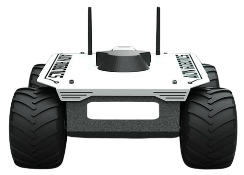

# Rovers

<LinkedBadge type="warning" text="Experimental" url="../airframes/#experimental-vehicles"/>

:::warning
Support for rover is [experimental](../airframes/index.md#experimental-vehicles).
Maintainer volunteers, [contribution](../contribute/index.md) of new features, new frame configurations, or other improvements would all be very welcome!
:::

PX4 provides support for the three most common types of rovers:

| Rover Type                        | Steering                                                                                                                                                                                      |
| --------------------------------- | --------------------------------------------------------------------------------------------------------------------------------------------------------------------------------------------- |
| [**Ackermann**](#ackermann)       | Direction is controlled by pointing wheels in the direction of travel. This kind of steering is used on most commercial vehicles, including cars, trucks etc. |
| [**Differential**](#differential) | Direction is controlled by moving the left- and right-side wheels at different speeds.                                                                                        |
| [**Mecanum**](#mecanum)           | Direction is controlled by moving each mecanum wheel individually at different speeds and in different directions.                                                            |

The supported frames can be seen in [Airframes Reference > Rover](../airframes/airframe_reference.md#rover).

## Ackermann

<Badge type="tip" text="PX4 v1.16" /> <Badge type="warning" text="Experimental" />

An Ackermann rover controls its direction by pointing the front wheels in the direction of travel — the [Ackermann steering geometry](https://en.wikipedia.org/wiki/Ackermann_steering_geometry) compensates for the fact that wheels on the inside and outside of the turn move at different rates.
This kind of steering is used on most commercial vehicles, including cars, trucks etc.

:::info
PX4 does not require that the vehicle uses the Ackermann geometry and will work with any front-steering rover.
:::

## Differential

<Badge type="tip" text="PX4 v1.16" /> <Badge type="warning" text="Experimental" />

A differential rover's motion is controlled using a differential drive mechanism, where the left and right wheel speeds are adjusted independently to achieve the desired forward speed and yaw rate.
Forward motion is achieved by driving both wheels at the same speed in the same direction.
Rotation is achieved by driving the wheels at different speeds in opposite directions, allowing the rover to turn on the spot.

:::info
The differential setup also work for rovers with skid or tank steering.
:::

## Mecanum

<Badge type="tip" text="PX4 v1.16" /> <Badge type="warning" text="Experimental" />

A Mecanum rover is a type of mobile robot that uses Mecanum wheels to achieve omnidirectional movement. These wheels are unique because they have rollers mounted at a 45-degree angle around their circumference, allowing the rover to move not only forward and backward but also side-to-side and diagonally without needing to rotate first.
Each wheel is driven by its own motor, and by controlling the speed and direction of each motor, the rover can move in any direction or spin in place.

## See Also

- [Drive Modes](../flight_modes_rover/index.md)
- [Configuration/Tuning](../config_rover/index.md)
- [Apps & API](../flight_modes_rover/api.md)
- [Complete Vehicles](../complete_vehicles_rover/index.md)

## 시뮬레이션

PX4 provides synthetic simulation models for [Gazebo](../sim_gazebo_gz/index.md) of all three rover types to test the software and validate changes and new features:

- [Ackermann rover](../sim_gazebo_gz/vehicles.md#ackermann-rover)
- [Differential rover](../sim_gazebo_gz/vehicles.md#differential-rover)
- [Mecanum rover](../sim_gazebo_gz/vehicles.md#mecanum-rover)

