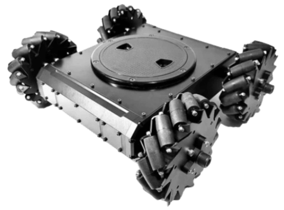

# Mecanum Rovers

<Badge type="tip" text="main (planned for: PX4 v1.16+)" /> <Badge type="warning" text="Experimental" />

A Mecanum rover is a type of mobile robot that uses Mecanum wheels to achieve omnidirectional movement. These wheels are unique because they have rollers mounted at a 45-degree angle around their circumference, allowing the rover to move not only forward and backward but also side-to-side and diagonally without needing to rotate first.
Each wheel is driven by its own motor, and by controlling the speed and direction of each motor, the rover can move in any direction or spin in place.

See [Configuration/Tuning](../config_rover/mecanum.md) to set up your rover and [Drive Modes](../flight_modes_rover/mecanum.md) for the supported flight (aka drive) modes.