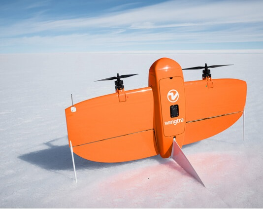
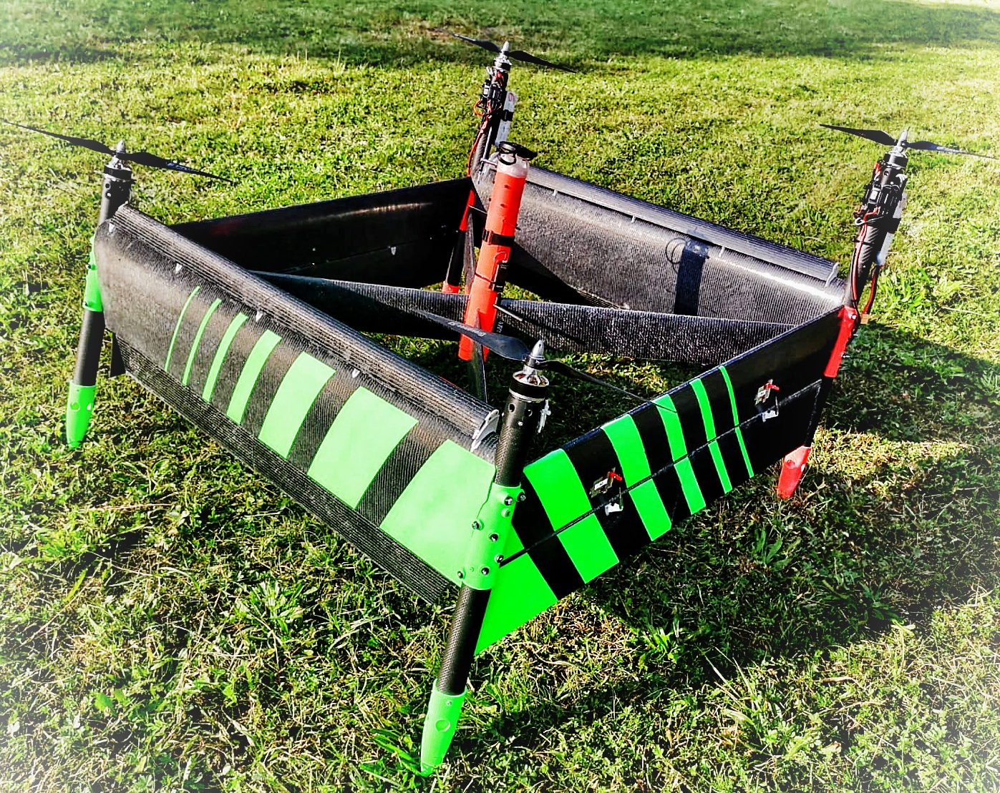
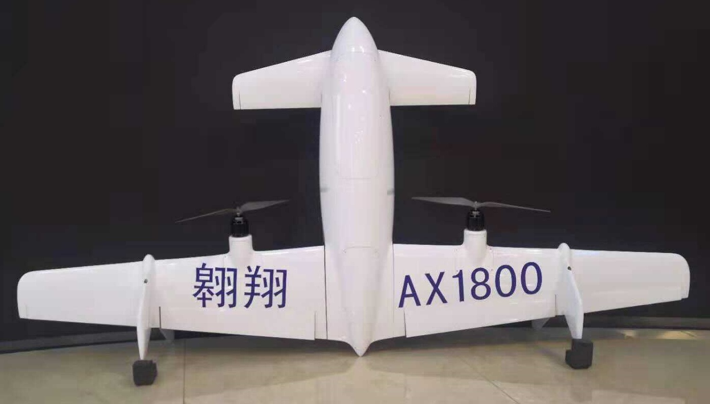
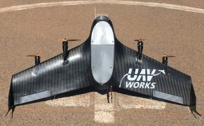

# 테일시터 VTOL

A **Tailsitter VTOL** takes off and lands on its tail, but flips into the fixed-wing orientation for normal flight.
테일 시터 로터는 전진 비행을 위해 영구적으로 고정됩니다.

Tailsitters are typically mechanically less complex than [other types of VTOL](../frames_vtol/index.md), and hence may be less expensive to build and maintain.
그러나 공기 역학적으로 더 복잡하고 특히 바람이 부는 조건에서 호버링 및 전환을 위해 조정하고 비행하기가 더 어려울 수 있습니다.

## 테일시터 기체

:::: tabs

:::tab Duo Tailsitter
Two rotor VTOL that uses elevons to flip from hover into fixed-wing flight.

- 보다 효율적인 전방 비행
- 특히 바람이 부는 날에는 호버링이 더 어렵습니다.
- 호버링과 이동 튜닝이 어려움
- 더 컴팩트한 폼 팩터

:::

:::tab VTOL Tailsitter
VTOL with optional elevons. 로터를 사용하여 모드 간 전환(있는 경우 엘레본과 함께).

- 호버 모드가 더 쉽고 안정적입니다.
- 덜 컴팩트한 폼 팩터(운반하기 어려움)
- "X" 및 "+" 로터 구성이 지원됩니다(기체 참조 참조).

:::

::::

Duo Tailsitters는 일반적으로 순항 비행에서 더 효율적이며(4개의 작은 프로펠러가 2개의 큰 프로펠러보다 덜 효율적임) 물리적으로 더 작습니다.
그러나, 호버 모드에서 공기 역학적으로 훨씬 더 복잡하기 때문에 호버와 전환 모두를 조정하기가 훨씬 더 어렵습니다.
쿼드 테일시터는 호버 모드에서 비행하기 쉽고 바람이 많이 부는 조건에서 더 안정적입니다.
Both are supported using the same aiframe type in PX4.

## 설정/비행

VTOL setup and flying are covered in the [VTOL](../frames_vtol/index.md) parent topic.

:::info
The instructions are essentially the same for all VTOL.
The main frame-specific differences are the motor wiring, and some aspects of tuning the configuration.
:::

## 조립 방법

테일시터 프레임에 PX4를 설정하는 방법에 대한 단계별 가이드는 다음과 같습니다.

- [TBS Caipiroshka Tailsitter Build (Pixracer)](../frames_vtol/vtol_tailsitter_caipiroshka_pixracer.md)

:::tip
We recommend that you also review build logs for other PX4 VTOL, and Copter vehicles (most of the setup is the same).
:::

## 비디오

This section contains videos that are specific to Tailsitter VTOL (videos that apply to all VTOL types can be found in [VTOL](../frames_vtol/index.md)).

### 쿼드

---

[TBS Caipiroshka](../frames_vtol/vtol_tailsitter_caipiroshka_pixracer.md) - Tailsitter takeoff (close up), hover, level flight, transitions.

<lite-youtube videoid="acG0aTuf3f8" title="PX4 VTOL - Call for Testpilots"/>

---

[Woshark](http://www.laarlab.cn/#/) _PX4 Tailsitter prototype_ - Tailsitter takeoff, transition, landing.

<!-- provided by slack user xdwgood: https://github.com/PX4/PX4-user_guide/issues/2328#issuecomment-1467234118 -->

<!-- Update issue https://github.com/PX4/PX4-user_guide/issues/3007 -->

<lite-youtube videoid="gjHj6YsxcZk" title="PX4 Autopilot Tailsitter"/>

### Quad

[UAV Works VALAQ Patrol Tailsitter](https://www.valaqpatrol.com/valaq_patrol_technical_data/) - Tailsitter takeoff, transition, landing.

<lite-youtube videoid="pWt6uoqpPIw" title="UAV Works VALAQ"/>

## ### Duo

  

    
<big><a href="https://wingtra.com/mapping-drone-wingtraone/">WingtraOne</a></big>

    

    
    

  

  

    
<big><a href="https://www.skypull.technology/">Skypull</a></big>

    

      
    

  

  

    
<big><a href="../frames_vtol/vtol_tailsitter_caipiroshka_pixracer.html">TBS Caipiroshka</a></big>

    

      
    

  

  

    
<big><a href="http://uav-cas.ac.cn/WOSHARK/">Woshark</a></big>

    

      
    

  

  

    
<big><a href="https://www.valaqpatrol.com/valaq_patrol_technical_data/">UAV Works VALAQ Patrol Tailsitter</a></big>

    

      
    

  

